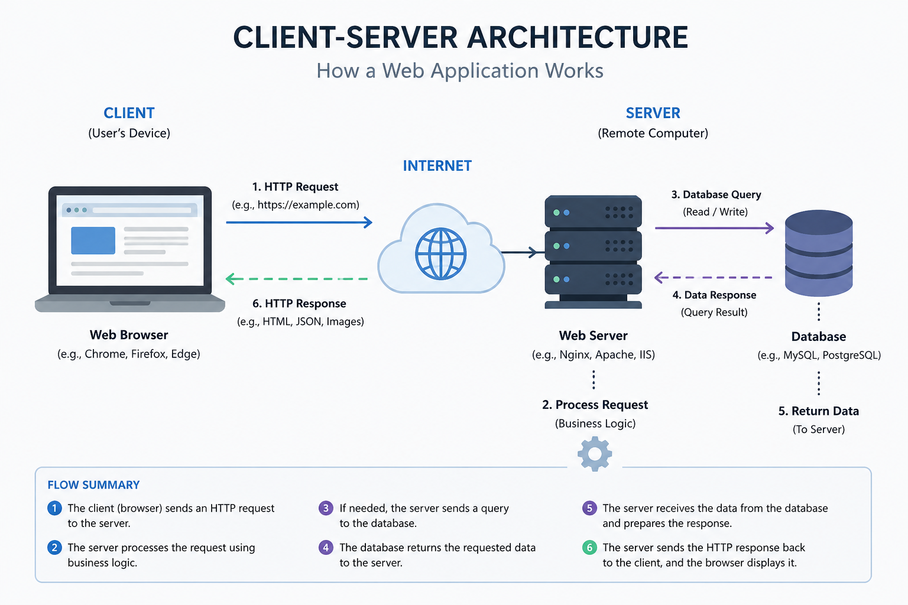
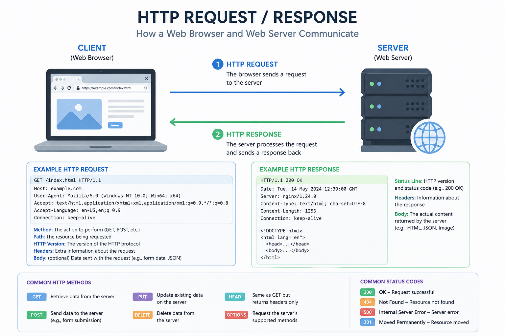
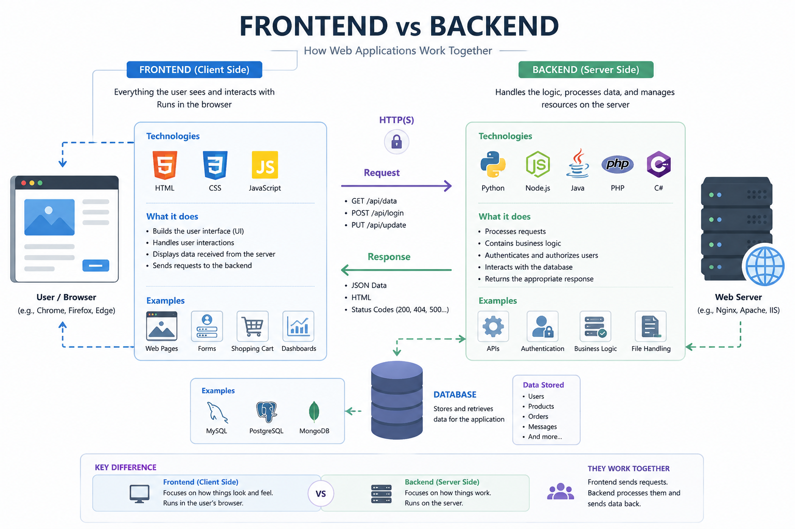
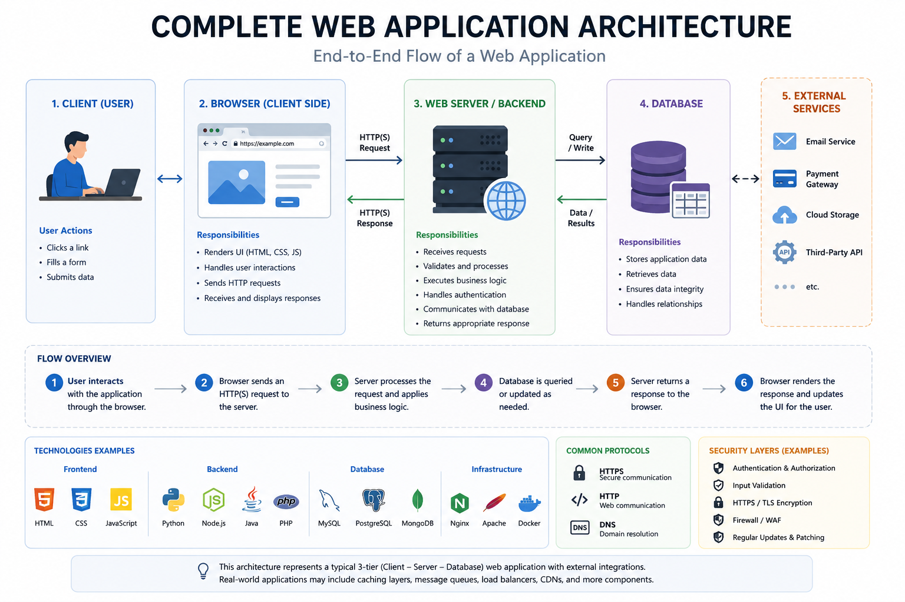

# Introduction to Web Applications

## What Is a Web Application?

A web application is software that runs on a web server and is accessed through a web browser over a network.

Unlike traditional desktop applications, web applications do not require installation on every user's device. Instead, users interact with the application through a browser such as Google Chrome, Firefox, or Microsoft Edge.

Common examples include:

- Gmail
- GitHub
- Facebook
- Amazon
- ChatGPT
- Online Banking Systems

---

## Website vs Web Application

Although the two terms are often used interchangeably, they are not the same.

### Website

A website primarily provides information to visitors.

Examples include:

- News websites
- Blogs
- Company websites
- Portfolio websites

Users mainly consume content with little interaction.

### Web Application

A web application allows users to perform actions and interact with data.

Examples include:

- Sending emails
- Purchasing products
- Uploading files
- Managing projects
- Editing documents online

Most modern platforms combine both website and web application functionality.

---

## Client-Server Architecture

Most modern web applications follow the Client-Server architecture.

The diagram above illustrates the complete communication process between a client and a server. The client sends an HTTP request over the Internet, the server processes that request, communicates with the database if necessary, and finally returns an HTTP response to the client.

### Client

The client is the user's device or browser that initiates communication with the server.

Examples include:

- Google Chrome
- Mozilla Firefox
- Microsoft Edge
- Safari

The client's responsibilities include:

- Displaying the user interface
- Collecting user input
- Sending HTTP requests
- Displaying server responses

### Server

The server receives client requests, executes business logic, and returns the appropriate response.

Typical server responsibilities include:

- Processing requests
- Authenticating users
- Communicating with databases
- Executing application logic
- Returning web pages or API responses

---

## How a Web Request Works

Every interaction with a web application follows a request-response cycle.

The diagram illustrates how an HTTP request travels from the browser to the server and how the server generates an HTTP response.

The typical workflow is:

1. The user enters a URL or performs an action.
2. The browser sends an HTTP request.
3. The server processes the request.
4. The server accesses the database if needed.
5. The server prepares the response.
6. The browser receives and renders the response.

---

## Frontend and Backend

Modern web applications are divided into two major components: the frontend and the backend.

The frontend is responsible for everything users interact with, while the backend handles business logic, data processing, authentication, and communication with databases.

### Frontend

The frontend is everything users see and interact with directly.

Common frontend technologies include:

- HTML
- CSS
- JavaScript

Typical responsibilities include:

- Rendering the user interface
- User interactions
- Navigation
- Forms
- Client-side validation
- Displaying data received from the server

### Backend

The backend runs on the server and contains the application's core functionality.

Common backend technologies include:

- Python
- PHP
- Java
- C#
- Node.js
- Go

Typical responsibilities include:

- Authentication
- Authorization
- Business logic
- API development
- Database communication
- Processing HTTP requests

Users never interact directly with the backend.

---

## Databases

Most web applications rely on databases to permanently store application data.

Common examples include:

- User accounts
- Password hashes
- Orders
- Messages
- Product information

Popular database systems include:

- MySQL
- PostgreSQL
- Microsoft SQL Server
- MongoDB

The backend communicates with the database whenever information needs to be retrieved, created, updated, or deleted.

---

## HTTP Request and Response

Communication between browsers and web servers primarily occurs using HTTP or HTTPS.

An HTTP request typically contains:

- HTTP Method
- URL
- Headers
- Optional Body

An HTTP response usually contains:

- Status Code
- Headers
- Response Body

Common HTTP methods include:

- GET
- POST
- PUT
- DELETE

Understanding the HTTP request-response cycle is fundamental to web security because nearly every web vulnerability involves manipulating requests or responses.

---

## Why Web Applications Are Common Attack Targets

Web applications are accessible from anywhere on the Internet.

Because they expose services directly to users, they are among the most common targets for cyberattacks.

Examples include:

- SQL Injection
- Cross-Site Scripting (XSS)
- Cross-Site Request Forgery (CSRF)
- Authentication attacks
- Session hijacking
- File upload vulnerabilities

Understanding how web applications operate is the first step toward understanding how attackers exploit them and how defenders protect them.

---

## Complete Web Application Architecture

The following diagram combines all concepts introduced in this lesson into a single architecture.

It illustrates how users, browsers, web servers, databases, and external services work together to deliver modern web applications.

This architecture serves as a foundation for future topics such as authentication, APIs, cloud services, web security, and application security testing.

---

## Real-World Example

Consider logging into GitHub.

1. You enter your username and password.
2. Your browser sends an HTTPS POST request.
3. The server validates your credentials.
4. The backend queries the database.
5. If authentication succeeds, a session is created.
6. The server returns your dashboard.
7. The browser renders the page for the user.

This simple workflow combines nearly every concept covered in this lesson, including client-server communication, HTTP, backend processing, databases, authentication, and sessions.

---

## Security+ Exam Focus

For the Security+ exam, you should understand:

- The difference between a website and a web application.
- The Client-Server architecture.
- The responsibilities of the frontend and backend.
- The role of databases.
- The purpose of HTTP and HTTPS.
- The HTTP request-response cycle.
- Why web applications are common attack targets.

---

## Summary

Web applications allow users to interact with services over the Internet through a web browser.

They rely on client-server communication, frontend and backend components, databases, and HTTP-based communication to process user requests and deliver dynamic content.

A solid understanding of web application architecture provides the foundation for studying web security, authentication, APIs, and common web vulnerabilities throughout the CompTIA Security+ certification journey.