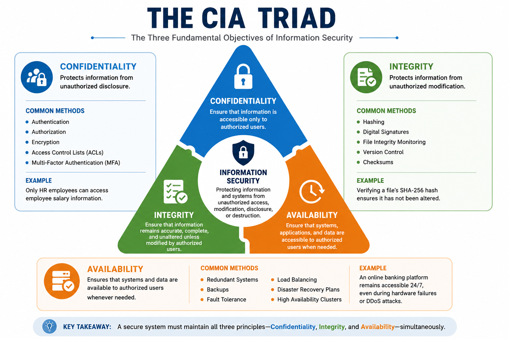
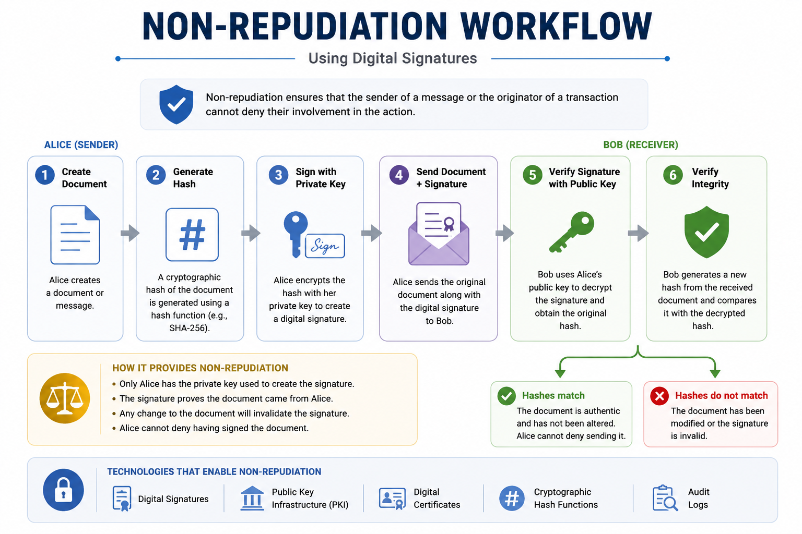
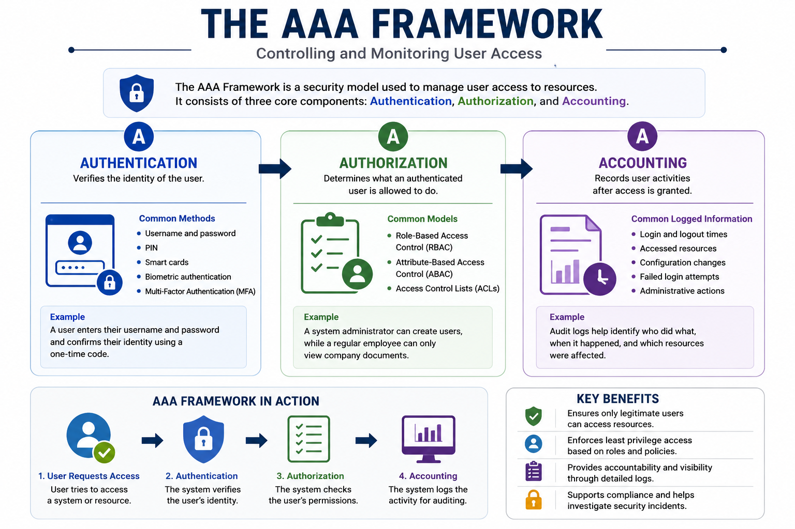
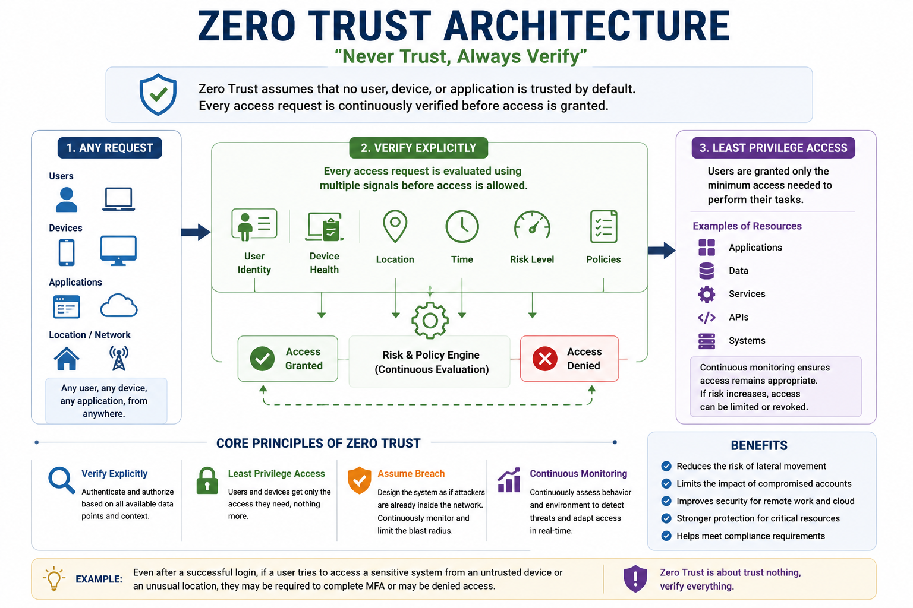
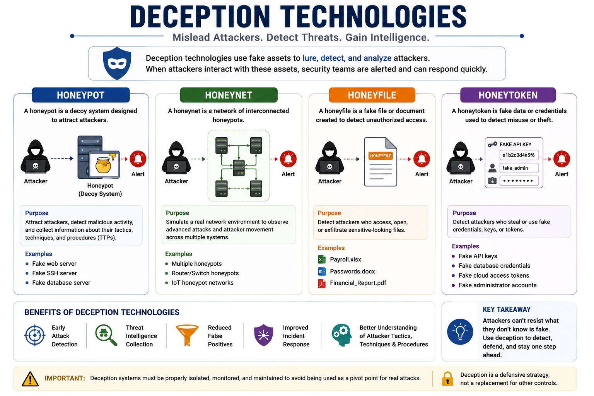
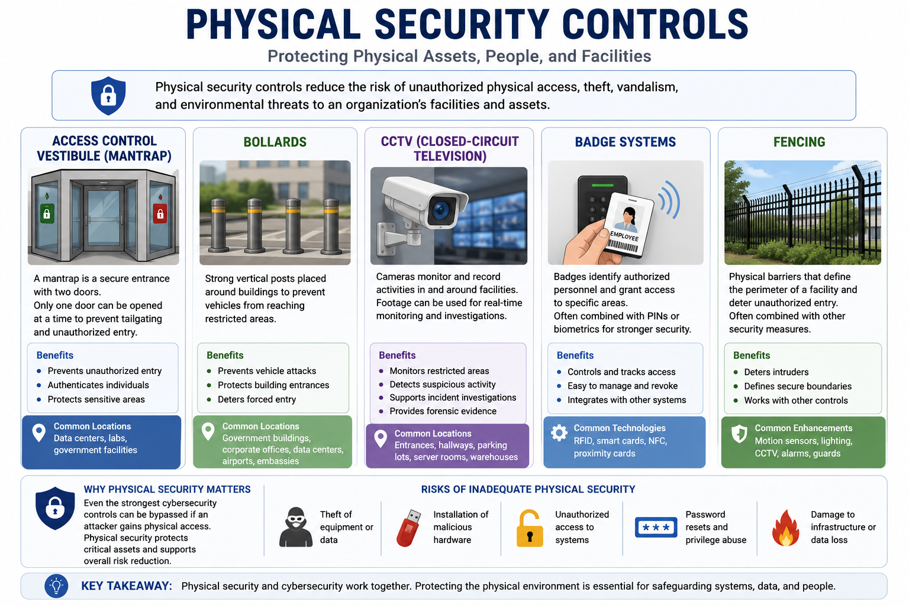

# Summarize Fundamental Security Concepts

## What Is Information Security?

Information security (InfoSec) is the practice of protecting information and the systems that store, process, and transmit it from unauthorized access, disclosure, modification, or destruction.

The goal of information security is to ensure that information remains:

- Confidential
- Accurate and trustworthy
- Available when needed

Protecting information is not limited to computers and networks. It also includes physical assets, digital systems, business processes, and the people who interact with them.

Modern cybersecurity relies on several fundamental security concepts that help organizations reduce risks and protect valuable resources.

This lesson introduces the following core concepts:

- CIA Triad
- Non-Repudiation
- AAA Framework
- Zero Trust
- Deception Technologies
- Physical Security Concepts

Understanding these principles is essential before learning about security controls, attacks, cryptography, and risk management.

---

# The CIA Triad

The **CIA Triad** is one of the most important security models in cybersecurity. It defines the three primary objectives of information security and serves as the foundation for designing secure systems.

The three principles are:

- Confidentiality
- Integrity
- Availability

A secure system should maintain all three properties simultaneously.

---

## Confidentiality

Confidentiality ensures that sensitive information is accessible only to authorized users.

Unauthorized individuals should never be able to view confidential data.

### Common Methods

- Authentication
- Authorization
- Encryption
- Access Control Lists (ACLs)
- Multi-Factor Authentication (MFA)

### Example

Only employees in the Human Resources department should be able to access employee salary records.

If another employee gains access to this information, confidentiality has been compromised.

---

## Integrity

Integrity ensures that information remains accurate, complete, and unaltered unless modified by an authorized user.

Users must be confident that the information they receive has not been changed intentionally or accidentally.

### Common Methods

- Hashing
- Digital Signatures
- File Integrity Monitoring
- Version Control
- Checksums

### Example

When downloading software from the internet, developers often publish a SHA-256 hash.

After downloading the file, you can calculate its hash and compare it with the published value. If both hashes match, the file has not been modified.

---

## Availability

Availability ensures that systems, applications, and data remain accessible whenever authorized users need them.

Even perfectly protected information is useless if legitimate users cannot access it.

### Common Methods

- Redundant Systems
- Backups
- Fault Tolerance
- Load Balancing
- Disaster Recovery Plans
- High Availability Clusters

### Example

An online banking platform should remain available 24/7.

If a Distributed Denial-of-Service (DDoS) attack prevents customers from accessing their accounts, availability has been compromised.

---

## CIA Triad Summary

| Principle | Objective | Examples |
|-----------|-----------|----------|
| Confidentiality | Prevent unauthorized disclosure | Encryption, MFA, ACLs |
| Integrity | Prevent unauthorized modification | Hashing, Digital Signatures |
| Availability | Ensure continuous access | Backups, Redundancy, Load Balancing |

The CIA Triad forms the foundation of nearly every security policy, technology, and best practice covered in CompTIA Security+.

---

# Non-Repudiation

Non-repudiation is the security principle that ensures an individual cannot deny performing a particular action.

It provides proof of origin, authenticity, and accountability.

This concept is especially important for financial transactions, legal documents, digital communications, and identity verification.

### Technologies That Provide Non-Repudiation

- Digital Signatures
- Public Key Infrastructure (PKI)
- Digital Certificates
- Cryptographic Hash Functions
- Audit Logs

### Example

Alice digitally signs an important contract before sending it to Bob.

Later, Alice cannot claim that she never signed the document because the digital signature uniquely identifies her private key.

Similarly, Bob can verify that the document has not been altered since it was signed.

---

## Why Non-Repudiation Matters

Without non-repudiation:

- Users could deny sending emails.
- Attackers could deny performing malicious actions.
- Digital contracts would lose legal value.
- Organizations would have difficulty proving accountability.

Non-repudiation increases trust by ensuring that every important action can be verified and traced back to its origin.

---

## Key Takeaways

- Information security protects the confidentiality, integrity, and availability of information.
- The CIA Triad is the foundation of modern cybersecurity.
- Confidentiality protects data from unauthorized access.
- Integrity ensures information remains accurate and unmodified.
- Availability guarantees that authorized users can access systems when needed.
- Non-repudiation prevents users from denying their actions through cryptographic proof and accountability mechanisms.

# The AAA Framework

The **AAA Framework** is a security model used to control and monitor user access to systems and network resources.

It consists of three fundamental processes:

- Authentication
- Authorization
- Accounting

Together, these processes ensure that only legitimate users can access resources, perform permitted actions, and have their activities recorded.

---

## Authentication

Authentication is the process of verifying a user's identity.

Before accessing a system, the user must prove who they are using one or more authentication factors.

### Common Authentication Methods

- Username and password
- PIN
- Smart cards
- Biometric authentication (fingerprint, facial recognition)
- Multi-Factor Authentication (MFA)

### Example

An employee enters their username and password and confirms their identity using a one-time code generated by an authentication app.

---

## Authorization

Authorization determines what an authenticated user is allowed to do.

After verifying a user's identity, the system checks the permissions assigned to that user.

### Common Authorization Models

- Role-Based Access Control (RBAC)
- Attribute-Based Access Control (ABAC)
- Access Control Lists (ACLs)

### Example

A system administrator can create user accounts, while a regular employee can only view company documents.

Both users are authenticated, but their permissions are different.

---

## Accounting

Accounting (also called **Auditing**) records user activities after access has been granted.

These records help organizations monitor system usage, investigate incidents, and meet compliance requirements.

### Information Commonly Logged

- Login and logout times
- Accessed resources
- Configuration changes
- Failed login attempts
- Administrative actions

### Example

If a security incident occurs, audit logs can identify:

- Who accessed the system
- When the action occurred
- Which resources were modified

---

## AAA Summary

| Component | Purpose |
|----------|---------|
| Authentication | Verifies identity |
| Authorization | Determines permissions |
| Accounting | Records user activities |

The AAA Framework is widely used in enterprise authentication systems, VPNs, wireless networks, and identity management solutions.

---

# Zero Trust

**Zero Trust** is a modern security model based on the principle:

> **"Never Trust, Always Verify."**

Unlike traditional security models that assume users inside the corporate network are trustworthy, Zero Trust assumes that no user, device, or application should be trusted by default.

Every access request must be continuously verified.

---

## Core Principles of Zero Trust

### Verify Explicitly

Every request should be authenticated and authorized using all available information.

Examples include:

- User identity
- Device health
- Location
- Time of access
- Risk level

---

### Least Privilege Access

Users should receive only the minimum permissions required to perform their tasks.

Reducing unnecessary privileges limits the damage caused by compromised accounts.

---

### Assume Breach

Organizations should design their security architecture assuming that attackers may already be inside the network.

Security controls should focus on detecting, containing, and limiting attacks rather than relying solely on perimeter defenses.

---

## Benefits of Zero Trust

- Reduces lateral movement
- Limits insider threats
- Improves identity security
- Supports remote work
- Strengthens cloud security

---

## Example

Even after an employee successfully logs in, they may still be required to complete Multi-Factor Authentication before accessing sensitive financial systems.

If the employee suddenly connects from an unknown country or an unmanaged device, access may be denied automatically.

---

# Deception Technologies

Deception technologies are defensive security techniques designed to mislead attackers by presenting fake systems, files, or credentials.

These technologies help security teams detect malicious activity early while gathering intelligence about attacker behavior.

---

## Honeypot

A **Honeypot** is a decoy system intentionally designed to attract attackers.

It appears to be a legitimate server or service but contains no valuable production data.

Any interaction with a honeypot is considered suspicious and may indicate malicious activity.

---

## Honeynet

A **Honeynet** is a network composed of multiple interconnected honeypots.

It allows security researchers to observe more advanced attack techniques across realistic environments.

---

## Honeyfile

A **Honeyfile** is a fake document placed in a system to detect unauthorized access.

Examples include:

- Payroll.xlsx
- Passwords.docx
- Financial_Report.pdf

If someone opens the file, the security team is alerted immediately.

---

## Honeytoken

A **Honeytoken** is fake sensitive information created to detect data theft.

Examples include:

- Fake API keys
- Fake database credentials
- Fake administrator accounts
- Fake cloud access tokens

Using a honeytoken immediately reveals unauthorized activity.

---

## Benefits of Deception Technologies

- Early attack detection
- Threat intelligence collection
- Reduced false positives
- Improved incident response
- Better understanding of attacker techniques

---

## Key Takeaways

- The AAA Framework controls access through Authentication, Authorization, and Accounting.
- Zero Trust assumes that no user or device is trusted by default.
- Continuous verification is a core principle of Zero Trust.
- Deception technologies use fake assets to detect attackers before they reach valuable systems.
- Honeypots, Honeynets, Honeyfiles, and Honeytokens are commonly used defensive techniques in modern cybersecurity.

# Physical Security Concepts

Cybersecurity is not limited to protecting digital systems. Organizations must also protect their physical infrastructure against unauthorized access, theft, vandalism, and environmental threats.

Physical security controls help prevent attackers from gaining direct access to critical assets such as servers, networking equipment, and sensitive documents.

---

## Access Control Vestibule (Mantrap)

An **Access Control Vestibule**, commonly known as a **Mantrap**, is a secure entrance consisting of two electronically controlled doors.

Only one door can be opened at a time, ensuring that a person must be authenticated before entering the protected area.

### Benefits

- Prevents tailgating
- Restricts unauthorized access
- Increases security for sensitive locations such as data centers and research facilities

---

## Bollards

Bollards are strong vertical barriers installed outside buildings to prevent vehicles from approaching restricted areas.

They help protect facilities against vehicle collisions and intentional vehicle-based attacks.

### Common Locations

- Government buildings
- Data centers
- Airports
- Corporate headquarters

---

## CCTV (Closed-Circuit Television)

CCTV systems continuously monitor physical locations using surveillance cameras.

Recorded footage assists security teams by:

- Monitoring restricted areas
- Detecting suspicious behavior
- Supporting incident investigations
- Providing forensic evidence

---

## Badge Systems

Badge systems identify authorized personnel before granting access to secure areas.

Common badge technologies include:

- RFID cards
- Smart cards
- NFC badges
- Proximity cards

Many organizations combine badge systems with PINs or biometric authentication to improve security.

---

## Fencing

Security fences establish physical boundaries around protected facilities.

They discourage unauthorized entry and provide an additional layer of defense around sensitive locations.

High-security environments may combine fencing with:

- Motion sensors
- Security lighting
- CCTV
- Security guards

---

## Why Physical Security Matters

Even the strongest cybersecurity controls can be bypassed if an attacker gains physical access to systems.

For example, an attacker with physical access may:

- Steal storage devices
- Install malicious hardware
- Connect unauthorized devices
- Reset passwords
- Damage critical infrastructure

Physical security works together with cybersecurity to provide comprehensive protection.

---

# Security+ Exam Focus

For the Security+ exam, you should be able to:

- Explain the purpose of the CIA Triad.
- Differentiate between Confidentiality, Integrity, and Availability.
- Understand how non-repudiation is achieved through digital signatures and cryptographic technologies.
- Explain the three components of the AAA Framework.
- Describe the Zero Trust security model and its core principles.
- Identify common deception technologies and their purposes.
- Recognize common physical security controls and understand where they are used.
- Apply these concepts to real-world security scenarios rather than relying solely on memorization.

---

# Summary

This lesson introduced the fundamental concepts that form the basis of modern cybersecurity.

The CIA Triad defines the three primary security objectives:

- Confidentiality
- Integrity
- Availability

Non-repudiation ensures accountability by providing proof that an action or communication cannot later be denied.

The AAA Framework controls access through:

- Authentication
- Authorization
- Accounting

Zero Trust replaces traditional trust models by continuously verifying every user, device, and access request.

Deception technologies help detect attackers using fake systems, files, credentials, and network resources.

Finally, physical security controls protect facilities and hardware against unauthorized physical access, complementing technical cybersecurity measures.

Together, these concepts provide the foundation for understanding the security controls, architectures, threats, and defensive techniques covered throughout the CompTIA Security+ certification.

## Key Terms

- Information Security
- CIA Triad
- Confidentiality
- Integrity
- Availability
- Non-Repudiation
- Authentication
- Authorization
- Accounting
- Zero Trust
- Honeypot
- Honeynet
- Honeyfile
- Honeytoken
- Mantrap