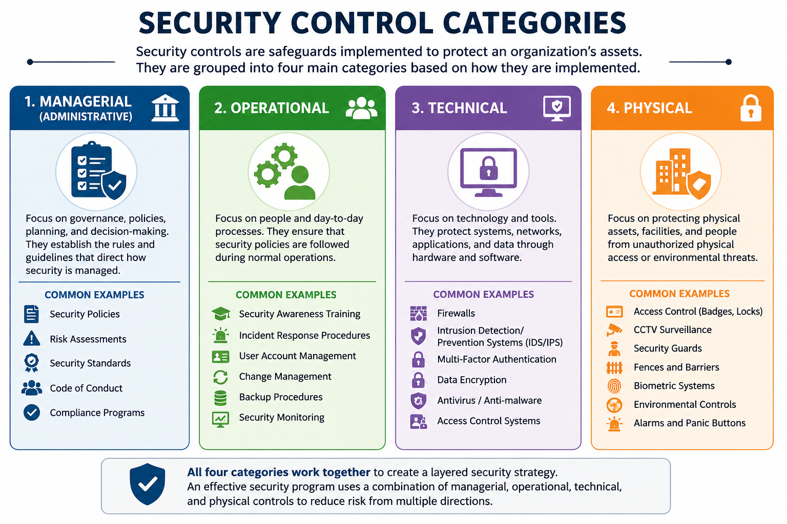
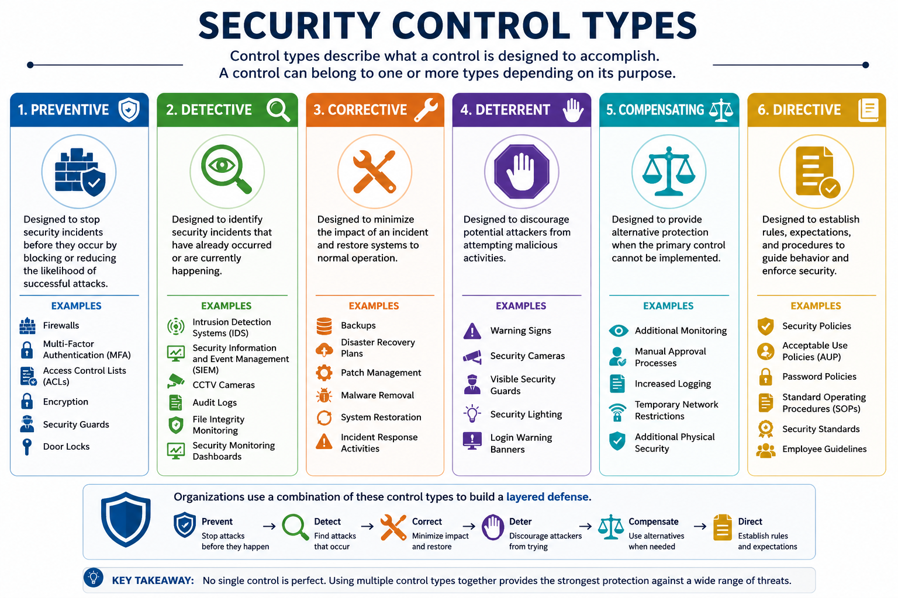
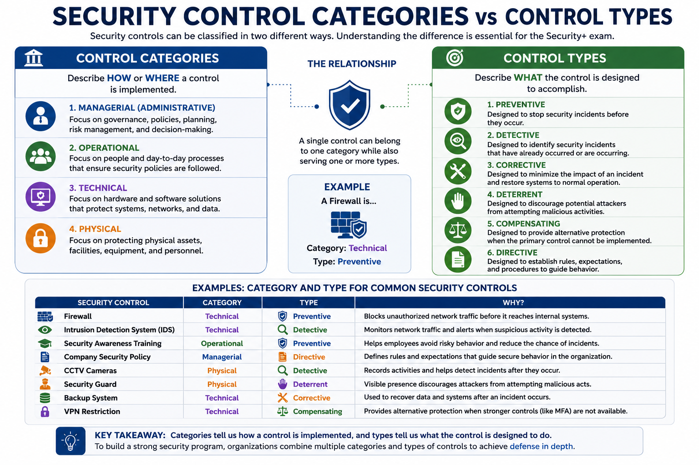

# What Are Security Controls?

Security controls are safeguards, countermeasures, and practices implemented to protect an organization's assets from security threats. Their primary purpose is to reduce risk by preventing attacks, detecting malicious activity, limiting the impact of security incidents, and supporting recovery when incidents occur.

Security controls are not limited to technology. They also include organizational policies, operational procedures, employee responsibilities, and physical protection mechanisms. A strong security program combines multiple controls to create a layered defense that protects people, processes, and technology.

---

# Why Security Controls Matter

Modern organizations face a constantly evolving threat landscape that includes cyberattacks, insider threats, physical intrusions, and human error. Relying on a single security mechanism is not sufficient.

Security controls help organizations to:

- Reduce security risks
- Protect sensitive information
- Enforce security policies
- Meet regulatory and compliance requirements
- Detect and respond to security incidents
- Maintain business continuity

Because every control has limitations, organizations implement multiple complementary controls to achieve defense in depth.

---

# Security Control Categories

Security controls are commonly grouped into four major categories based on how they protect an organization.

The four categories are:

- Managerial Controls
- Operational Controls
- Technical Controls
- Physical Controls

Each category addresses a different aspect of organizational security while working together to provide comprehensive protection.

---

# Managerial Controls

Managerial (or Administrative) controls focus on governance, planning, and decision-making. They establish the policies, standards, and procedures that guide how security is managed throughout an organization.

Rather than directly protecting systems, managerial controls define expectations, assign responsibilities, and ensure that security objectives align with business goals.

## Common Examples

- Security Policies
- Risk Assessments
- Performance Reviews
- Security Standards
- Code of Conduct
- Compliance Programs

## Example

Before deploying a new application, management performs a risk assessment to identify potential threats and determine the appropriate security controls that should be implemented.

---

# Operational Controls

Operational controls are implemented through people and day-to-day business processes. They ensure that security policies are consistently followed during normal organizational operations.

These controls depend heavily on employee actions, documented procedures, and continuous monitoring.

## Common Examples

- Incident Response Procedures
- Security Awareness Training
- User Account Management
- Change Management Procedures
- Backup Procedures
- Security Monitoring

## Example

Employees receive regular phishing awareness training to help them recognize suspicious emails and report potential attacks before they cause damage.

---

# Technical Controls

Technical controls are security mechanisms implemented through hardware and software technologies. Their purpose is to automatically enforce security by protecting systems, networks, applications, and data.

These controls reduce technical vulnerabilities and help prevent unauthorized access.

## Common Examples

- Firewalls
- Intrusion Detection Systems (IDS)
- Intrusion Prevention Systems (IPS)
- Multi-Factor Authentication (MFA)
- Data Encryption
- Antivirus Software
- Access Control Systems

## Example

A firewall filters incoming and outgoing network traffic based on predefined security rules, preventing unauthorized connections from reaching internal systems.

> **Reminder:** Technical controls are implemented and maintained through technology and are typically managed by IT and security teams.

---

# Physical Controls

Physical controls protect an organization's facilities, equipment, and personnel against unauthorized physical access, theft, vandalism, and environmental threats.

Unlike technical controls, physical controls are visible and interact directly with the physical environment.

## Common Examples

- Access Control Vestibules (Mantraps)
- Biometric Locks
- CCTV Surveillance Systems
- Security Guards
- Security Fences
- Vehicle Barriers (Bollards)
- Tamper-Evident Seals
- Panic Buttons and Alarm Systems

## Example

A data center uses badge readers, biometric authentication, CCTV cameras, and security guards to ensure that only authorized personnel can enter the facility.

---

# Security Control Categories Summary

| Category | Primary Focus | Common Examples |
|-----------|---------------|-----------------|
| Managerial | Governance, policies, and risk management | Risk assessments, policies, code of conduct |
| Operational | People and business processes | Incident response, training, account management |
| Technical | Hardware and software protections | Firewalls, MFA, encryption, IDS/IPS |
| Physical | Protection of facilities and assets | CCTV, mantraps, fences, biometric locks |

Each category contributes to a layered security strategy. An effective cybersecurity program combines managerial, operational, technical, and physical controls to reduce organizational risk from multiple directions.

# Security Control Types

While security control categories describe **who or what implements a control**, security control types describe **what the control is designed to accomplish**.

A single security control can belong to one category while also serving one or more control types.

For example:

- A firewall is a **Technical Control** and primarily a **Preventive Control**.
- Security awareness training is an **Operational Control** that acts as a **Preventive Control**.
- CCTV is a **Physical Control** that mainly serves as a **Detective Control**.

The primary control types covered in Security+ are:

- Preventive Controls
- Detective Controls
- Corrective Controls
- Deterrent Controls
- Compensating Controls
- Directive Controls

---

# Preventive Controls

Preventive controls are designed to stop security incidents before they occur. Their goal is to reduce the likelihood of successful attacks by blocking unauthorized actions and enforcing security policies.

These controls represent the organization's first line of defense.

## Common Examples

- Firewalls
- Multi-Factor Authentication (MFA)
- Access Control Lists (ACLs)
- Encryption
- Security Guards
- Door Locks

## Example

An organization requires employees to use Multi-Factor Authentication before accessing sensitive financial systems. Even if an attacker steals a password, they cannot log in without the additional authentication factor.

---

# Detective Controls

Detective controls identify security incidents that have already occurred or are currently taking place.

Rather than preventing attacks, they help security teams discover suspicious activity quickly so that appropriate actions can be taken.

## Common Examples

- Intrusion Detection Systems (IDS)
- Security Information and Event Management (SIEM)
- CCTV Cameras
- Audit Logs
- File Integrity Monitoring
- Security Monitoring Dashboards

## Example

A SIEM platform detects multiple failed login attempts from an unusual location and immediately alerts the security team for investigation.

---

# Corrective Controls

Corrective controls help minimize damage after a security incident has occurred. Their purpose is to restore systems, eliminate vulnerabilities, and return business operations to normal.

Corrective controls often work together with detective controls.

## Common Examples

- Backups
- Disaster Recovery Plans
- Patch Management
- Malware Removal
- System Restoration
- Incident Response Activities

## Example

After ransomware encrypts several servers, the organization restores clean backups and patches the exploited vulnerability before returning systems to production.

---

# Deterrent Controls

Deterrent controls discourage attackers from attempting malicious actions.

Although these controls may not physically stop an attack, they increase the perceived risk of being detected or facing consequences.

## Common Examples

- Warning Signs
- Security Cameras
- Visible Security Guards
- Security Lighting
- Login Warning Banners

## Example

A warning banner displayed before login informs users that all activities are monitored and unauthorized access is prohibited. This may discourage potential attackers from proceeding.

---

# Compensating Controls

Compensating controls provide alternative protection when the preferred security control cannot be implemented.

These controls reduce risk without completely replacing the original security requirement.

## Common Examples

- Additional Monitoring
- Manual Approval Processes
- Increased Logging
- Temporary Network Restrictions
- Additional Physical Security

## Example

An older application does not support Multi-Factor Authentication. Until the application is upgraded, the organization limits access through a VPN, restricts user permissions, and continuously monitors login activity.

---

# Directive Controls

Directive controls establish rules, expectations, and procedures that guide user behavior.

Their purpose is to define how security should be implemented throughout the organization.

## Common Examples

- Security Policies
- Acceptable Use Policies (AUP)
- Password Policies
- Standard Operating Procedures (SOPs)
- Security Standards
- Employee Guidelines

## Example

A password policy requires employees to use strong passwords, enable Multi-Factor Authentication, and change compromised credentials immediately.

---

# Security Control Types Summary

| Control Type | Primary Purpose | Common Examples |
|---------------|-----------------|-----------------|
| Preventive | Stop attacks before they occur | Firewalls, MFA, Encryption |
| Detective | Identify ongoing or completed attacks | IDS, SIEM, CCTV, Audit Logs |
| Corrective | Restore systems after incidents | Backups, Patching, Disaster Recovery |
| Deterrent | Discourage malicious behavior | Warning Signs, Security Guards |
| Compensating | Reduce risk using alternative controls | VPN Restrictions, Additional Monitoring |
| Directive | Define security rules and expectations | Policies, Standards, Procedures |

Although each control type has a different purpose, organizations rarely rely on a single type of control. Instead, multiple control types work together to provide layered protection against a wide range of security threats.

# Comparing Security Control Categories and Types

Security control categories and security control types are related concepts, but they describe different aspects of a security control.

- **Categories** describe **how or where** a control is implemented.
- **Types** describe **what the control is intended to accomplish**.

A single security control can belong to one category while also serving one or more control types.

## Example Comparison

| Security Control | Category | Type |
|------------------|----------|------|
| Firewall | Technical | Preventive |
| Intrusion Detection System (IDS) | Technical | Detective |
| Security Awareness Training | Operational | Preventive |
| Company Security Policy | Managerial | Directive |
| CCTV Cameras | Physical | Detective |
| Security Guard | Physical | Deterrent |
| Backup System | Technical | Corrective |
| VPN Restriction | Technical | Compensating |

Understanding this distinction is important because Security+ exam questions often ask you to identify both the **category** and the **type** of a given security control.

---

# Real-World Example

Consider an organization that wants to protect its data center from both physical and cyber threats.

The organization implements the following controls:

- Security policies that define access requirements.
- Security awareness training for employees.
- Firewalls to filter network traffic.
- Multi-Factor Authentication (MFA) for administrative accounts.
- CCTV cameras to monitor entrances.
- Security guards to control physical access.
- Daily backups for disaster recovery.
- Intrusion Detection Systems (IDS) to detect suspicious activity.

Each control contributes differently to the organization's security strategy.

For example:

- The firewall is a **Technical** and **Preventive** control.
- CCTV is a **Physical** and **Detective** control.
- Daily backups are **Technical** and **Corrective** controls.
- Security policies are **Managerial** and **Directive** controls.

By combining multiple categories and control types, the organization creates a layered defense that significantly reduces overall security risk.

---

# Defense in Depth

No individual security control can eliminate every threat.

Instead, organizations implement multiple complementary controls so that if one control fails, another continues protecting the organization.

For example:

1. A password policy requires strong passwords.
2. Multi-Factor Authentication protects stolen credentials.
3. A firewall blocks unauthorized network traffic.
4. An IDS detects suspicious activity.
5. Backups allow recovery after ransomware attacks.

This layered approach is known as **Defense in Depth**, one of the fundamental principles of modern cybersecurity.

---

# Security+ Exam Focus

For the Security+ exam, you should be able to:

- Explain the purpose of security controls.
- Differentiate between security control categories.
- Differentiate between security control types.
- Identify the category and type of a given security control.
- Recognize that one security control may belong to both a category and a control type.
- Apply security controls to real-world scenarios using a defense-in-depth approach.

Exam questions frequently present practical scenarios rather than asking for simple definitions. Focus on understanding **why** a control is used, not just memorizing its name.

---

# Summary

Security controls reduce organizational risk by protecting people, processes, technology, and physical assets.

Security controls can be classified in two different ways:

- **Categories**, which describe how a control is implemented.
- **Types**, which describe the security objective the control fulfills.

The four primary control categories are:

- Managerial
- Operational
- Technical
- Physical

The six primary control types are:

- Preventive
- Detective
- Corrective
- Deterrent
- Compensating
- Directive

Organizations combine multiple categories and types of security controls to build a layered security architecture capable of preventing, detecting, responding to, and recovering from security incidents.

---

# Key Terms

- Security Control
- Layered Security
- Defense in Depth
- Managerial Control
- Operational Control
- Technical Control
- Physical Control
- Preventive Control
- Detective Control
- Corrective Control
- Deterrent Control
- Compensating Control
- Directive Control
- Risk Reduction
- Security Policy
- Multi-Factor Authentication (MFA)
- Intrusion Detection System (IDS)
- Firewall
- Backup
- CCTV