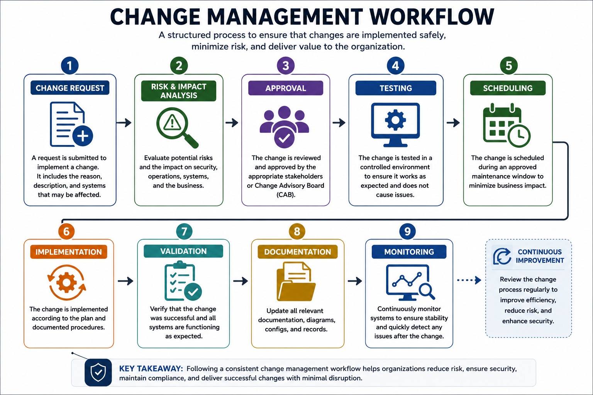
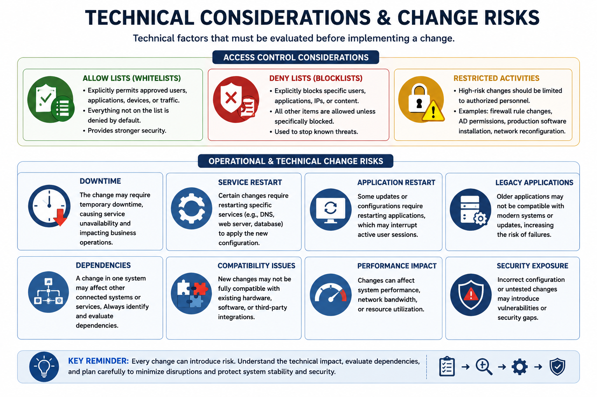
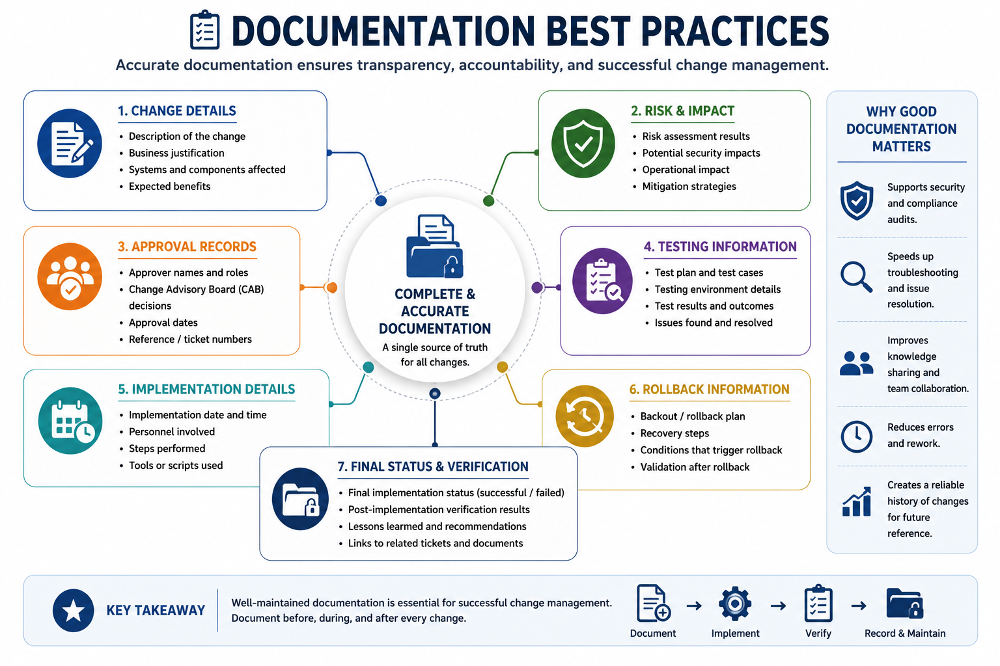
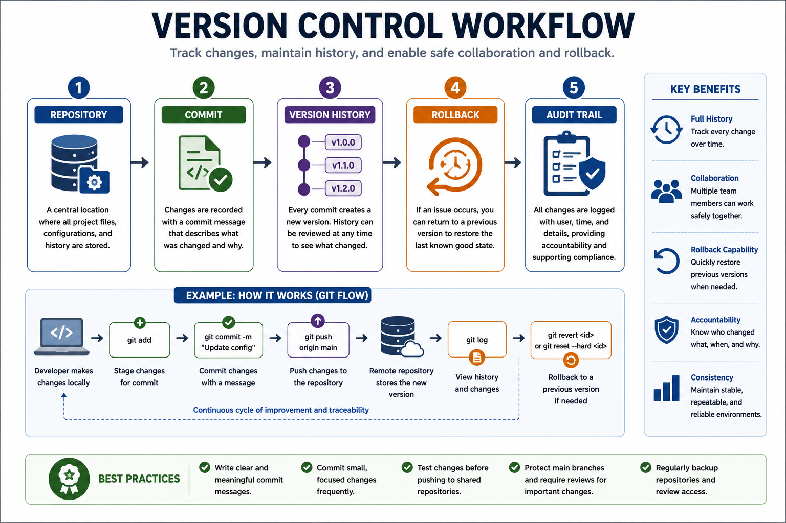

# What Is Change Management?

Change management is the structured process of planning, evaluating, approving, implementing, and documenting changes made to an organization's information systems and technology infrastructure.

Changes may include software updates, hardware replacements, network configuration modifications, security patches, cloud deployments, or changes to organizational procedures.

Without a formal change management process, even small modifications can introduce security vulnerabilities, system outages, or unexpected business disruptions.

The primary objective of change management is to ensure that changes are implemented in a controlled, secure, and predictable manner while minimizing operational and security risks.

---

# Why Change Management Matters

Every change introduces some level of risk.

Even a well-intended update can accidentally create security vulnerabilities, interrupt business operations, or reduce system availability if it is not properly planned and tested.

An effective change management process helps organizations to:

- Reduce operational risk
- Minimize service disruptions
- Improve system stability
- Protect confidentiality, integrity, and availability
- Ensure accountability
- Maintain compliance with security policies and regulations
- Support business continuity

Because security environments constantly evolve, organizations must balance innovation with stability by carefully managing every change before it is deployed.

---

# The Change Management Process

Although organizations may follow different frameworks, most change management processes follow a similar lifecycle.

A typical workflow includes:

1. Change Request
2. Risk and Impact Analysis
3. Approval
4. Testing
5. Scheduling
6. Implementation
7. Validation
8. Documentation
9. Continuous Monitoring

Each stage helps reduce the likelihood of introducing security or operational problems.

---

# Change Request

Every change begins with a formal change request.

A change request documents what is being changed, why the change is necessary, the expected benefits, potential risks, and the systems that may be affected.

Well-documented requests help decision-makers evaluate whether the proposed change should proceed.

## Typical Information Included

- Description of the change
- Business justification
- Systems affected
- Expected benefits
- Potential risks
- Estimated implementation time
- Rollback strategy

---

# Risk and Impact Analysis

Before approving a change, organizations perform a risk and impact analysis.

This evaluation determines how the proposed change may affect:

- Security
- Business operations
- System availability
- Network performance
- Compliance requirements
- Other dependent systems

Risk analysis helps organizations decide whether additional testing, approvals, or mitigation measures are necessary before implementation.

## Example

Before upgrading a firewall, administrators evaluate whether the new firmware could interrupt VPN connectivity, affect existing firewall rules, or introduce compatibility issues with other security devices.

---

# Change Approval

Not every requested change should be implemented immediately.

Organizations establish approval processes to ensure that qualified personnel evaluate the risks, benefits, and business impact before authorizing implementation.

Depending on the organization's size, approvals may involve:

- System Owners
- Security Teams
- IT Managers
- Change Advisory Board (CAB)

The approval process ensures that changes are properly reviewed before affecting production environments.

---

# Change Ownership

Every approved change must have a clearly identified owner.

The change owner is responsible for coordinating the implementation, communicating with stakeholders, monitoring progress, and ensuring that the change is completed successfully.

Typical responsibilities include:

- Coordinating implementation
- Tracking progress
- Managing risks
- Ensuring documentation is updated
- Confirming successful deployment
- Reporting issues if problems occur

Assigning ownership improves accountability throughout the entire change lifecycle.

---

# Stakeholders

Stakeholders are the individuals or groups affected by a proposed change.

Keeping stakeholders informed before, during, and after implementation helps reduce confusion and minimizes business disruption.

Common stakeholders include:

- Executive Management
- IT Operations
- Security Teams
- Help Desk
- Application Owners
- End Users
- Third-Party Vendors

Effective communication ensures that everyone understands the purpose, timing, and potential impact of the change.

---

# Key Takeaways

- Change management reduces both operational and security risks.
- Every change should follow a structured approval process.
- Risk and impact analysis help organizations make informed decisions.
- Clear ownership improves accountability.
- Stakeholder communication is essential for successful change implementation.
- Proper planning reduces unexpected downtime and security incidents.

---

# Testing

Testing is one of the most important stages of the change management process. Before deploying any change to a production environment, organizations should verify that it works as expected and does not introduce new security or operational issues.

Testing reduces the likelihood of unexpected failures and provides confidence that the change can be implemented safely.

Whenever possible, testing should be performed in an environment that closely resembles the production environment.

## Common Types of Testing

- Functional Testing
- Security Testing
- Performance Testing
- Compatibility Testing
- Regression Testing
- User Acceptance Testing (UAT)

## Example

Before deploying a software update to company servers, administrators first install the update in a testing environment to verify that existing applications continue to function correctly.

---

# Backout Plan (Rollback Plan)

Even thoroughly tested changes can fail after deployment.

A backout plan, also known as a rollback plan, defines the steps required to restore systems to their previous state if the implementation causes unexpected problems.

Preparing a rollback plan before implementation significantly reduces downtime and helps organizations recover quickly from failed changes.

## A Backout Plan Should Include

- Conditions that trigger the rollback
- Recovery procedures
- Required personnel
- Estimated recovery time
- Validation steps after restoration

## Example

If a firewall firmware upgrade interrupts internet connectivity, administrators immediately restore the previous firmware version and verify that all network services are functioning normally.

---

# Maintenance Window

Many organizations schedule changes during a maintenance window.

A maintenance window is a predefined period during which system modifications can be performed with minimal impact on business operations.

Maintenance windows are commonly scheduled during evenings, weekends, or other periods of low system usage.

Scheduling changes during these periods reduces the number of users affected if temporary service interruptions occur.

## Benefits

- Reduced business disruption
- Lower operational risk
- Easier troubleshooting
- Greater flexibility for rollback if necessary

---

# Standard Operating Procedures (SOPs)

Standard Operating Procedures (SOPs) are documented instructions that describe how specific operational tasks should be performed.

Following standardized procedures ensures that changes are implemented consistently regardless of who performs the work.

SOPs improve operational efficiency, reduce human error, and simplify training for new employees.

## Common SOP Examples

- Software deployment procedures
- Server maintenance procedures
- Backup procedures
- User account provisioning
- Patch management procedures
- Incident response procedures

---

# Technical Considerations

Before implementing a change, organizations must evaluate its technical impact on the existing environment.

Even small configuration changes may affect multiple interconnected systems.

Proper planning helps identify dependencies and reduce the likelihood of service interruptions.

Technical considerations often include:

- Allow Lists
- Deny Lists
- Restricted Activities
- Downtime
- Service Restarts
- Application Restarts
- Legacy Systems
- Dependencies

---

# Allow Lists (Whitelists)

An allow list specifies the users, devices, applications, or network traffic that are explicitly permitted.

Anything not included in the allow list is denied by default.

Allow lists provide stronger security because they only permit known and trusted resources.

## Examples

- Approved applications
- Trusted IP addresses
- Authorized USB devices
- Permitted network services

---

# Deny Lists (Blocklists)

A deny list identifies resources that are explicitly prohibited.

Unlike allow lists, all other resources remain permitted unless specifically blocked.

Deny lists are commonly used to block known malicious software, websites, IP addresses, or email domains.

## Examples

- Malicious IP addresses
- Phishing domains
- Unauthorized applications
- Known malware hashes

---

# Restricted Activities

Certain administrative activities should only be performed by authorized personnel and during approved maintenance periods.

Examples include:

- Changing firewall rules
- Updating Active Directory permissions
- Installing production software
- Modifying database schemas
- Reconfiguring network infrastructure

Restricting high-risk activities reduces the likelihood of accidental outages or unauthorized modifications.

---

# Downtime

Some system changes require temporary downtime.

Organizations should estimate the expected outage duration before implementation and communicate it to affected stakeholders.

Unexpected downtime may interrupt business operations and reduce system availability.

---

# Service Restart

Certain configuration changes only require restarting an individual service rather than the entire system.

Restarting a service minimizes disruption while allowing configuration changes to take effect.

Examples include restarting:

- Web servers
- Database services
- DNS services
- Authentication services

---

# Application Restart

Some software updates require restarting an application after installation.

Organizations should evaluate the operational impact before performing the restart, especially for applications that provide critical business services.

---

# Legacy Applications

Legacy applications may not support modern operating systems, security controls, or software dependencies.

Changes that work correctly on newer systems may cause compatibility issues for older applications.

Organizations should carefully evaluate legacy systems before deploying infrastructure changes.

---

# Dependencies

Modern IT environments contain many interconnected systems.

A change made to one component may unintentionally affect several others.

Examples of dependencies include:

- Databases supporting web applications
- Identity services used by multiple applications
- Shared storage systems
- Cloud services
- Authentication servers

Understanding dependencies helps prevent cascading failures across the environment.

---

# Key Takeaways

- Every change should be tested before deployment.
- A rollback plan enables rapid recovery if implementation fails.
- Maintenance windows reduce business disruption.
- SOPs improve consistency and reduce operational errors.
- Technical dependencies should always be evaluated before implementing changes.
- Understanding allow lists, deny lists, and system dependencies helps reduce security and operational risks.

---

# Documentation

Every approved change should be thoroughly documented before, during, and after implementation.

Accurate documentation provides an audit trail, simplifies troubleshooting, supports future maintenance, and helps organizations meet regulatory and compliance requirements.

Poor documentation can make future changes more difficult and increase the risk of configuration errors.

## Documentation Should Include

- Description of the change
- Business justification
- Systems affected
- Risk assessment
- Approval records
- Testing results
- Implementation date and time
- Personnel involved
- Rollback procedures
- Final implementation status

## Why Documentation Matters

Proper documentation helps organizations to:

- Maintain accurate system records
- Improve troubleshooting
- Support compliance audits
- Track historical changes
- Reduce operational mistakes
- Transfer knowledge between teams

---

# Version Control

Version control is the practice of tracking changes made to files, configurations, scripts, and source code over time.

It enables organizations to maintain a complete history of modifications, compare previous versions, restore earlier configurations, and collaborate safely across multiple teams.

Version control is widely used in software development, infrastructure management, and security operations.

## Benefits of Version Control

- Maintains a complete change history
- Simplifies collaboration
- Supports rollback to previous versions
- Improves accountability
- Reduces configuration errors
- Enables auditing and compliance

## Example

An administrator accidentally introduces an incorrect firewall configuration.

Because the configuration is stored in a version control system, the previous working version can be restored quickly without rebuilding the entire configuration.

---

# Change Management Best Practices

Successful organizations follow established best practices to minimize the risks associated with system changes.

Common best practices include:

- Document every change request.
- Perform risk and impact assessments.
- Obtain appropriate approvals.
- Test changes before deployment.
- Schedule changes during maintenance windows.
- Prepare a rollback plan.
- Notify affected stakeholders.
- Monitor systems after implementation.
- Update documentation after completion.
- Record every modification using version control.

Following these practices improves system reliability while reducing both operational and security risks.

---

# Real-World Example

A company plans to upgrade its authentication servers.

Before implementation, administrators:

- Create a formal change request.
- Assess potential risks.
- Obtain approval from management.
- Test the upgrade in a staging environment.
- Schedule deployment during the weekend maintenance window.
- Prepare a rollback plan.
- Notify employees about the expected maintenance.
- Deploy the upgrade.
- Monitor authentication services after deployment.
- Update documentation and record the change in the version control system.

Because each step follows the organization's change management process, the upgrade is completed successfully with minimal disruption.

---

# Security+ Exam Focus

For the Security+ exam, you should be able to:

- Explain the purpose of change management.
- Understand why changes require planning and approval.
- Differentiate between testing, implementation, validation, and rollback.
- Explain the importance of maintenance windows.
- Recognize the purpose of allow lists and deny lists.
- Identify technical risks such as downtime, legacy systems, and dependencies.
- Explain why documentation and version control are essential.
- Apply change management concepts to real-world security scenarios.

Exam questions frequently describe practical situations rather than asking for definitions. Focus on understanding the purpose of each stage in the change management process and how it contributes to maintaining secure and stable systems.

---

# Summary

Change management is a structured process that enables organizations to implement technology changes safely while minimizing operational and security risks.

Every change should be carefully planned, evaluated, approved, tested, documented, and monitored before becoming part of a production environment.

Successful change management also requires:

- Risk and impact analysis
- Stakeholder communication
- Maintenance windows
- Rollback planning
- Documentation
- Version control
- Continuous monitoring

By following a consistent change management process, organizations improve system reliability, reduce security incidents, maintain compliance, and support business continuity.

---

# Key Terms

- Allow List
- Backout Plan
- Change Advisory Board (CAB)
- Change Management
- Change Owner
- Change Request
- Dependency
- Documentation
- Downtime
- Impact Analysis
- Legacy System
- Maintenance Window
- Risk Assessment
- Rollback Plan
- Standard Operating Procedure (SOP)
- Stakeholder
- Testing
- Validation
- Version Control

