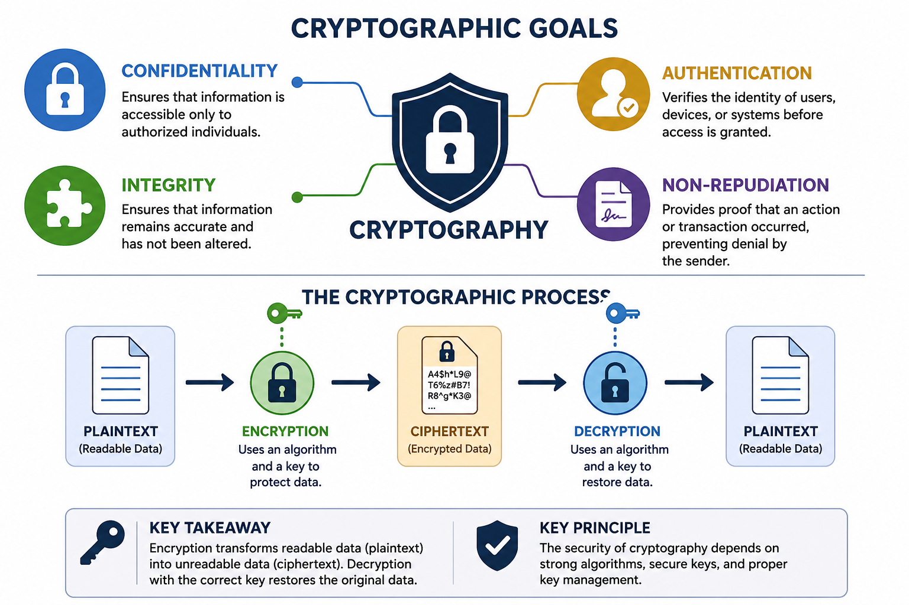
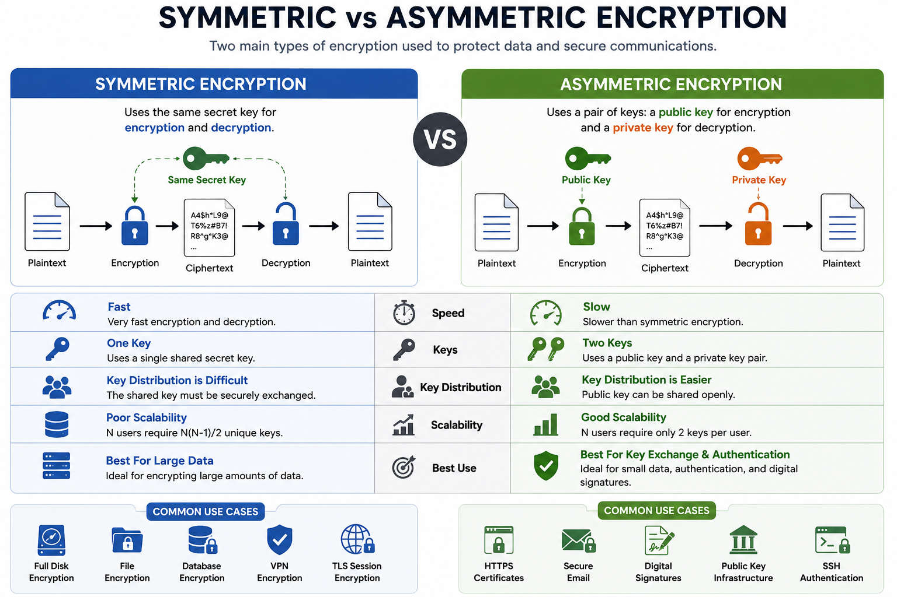
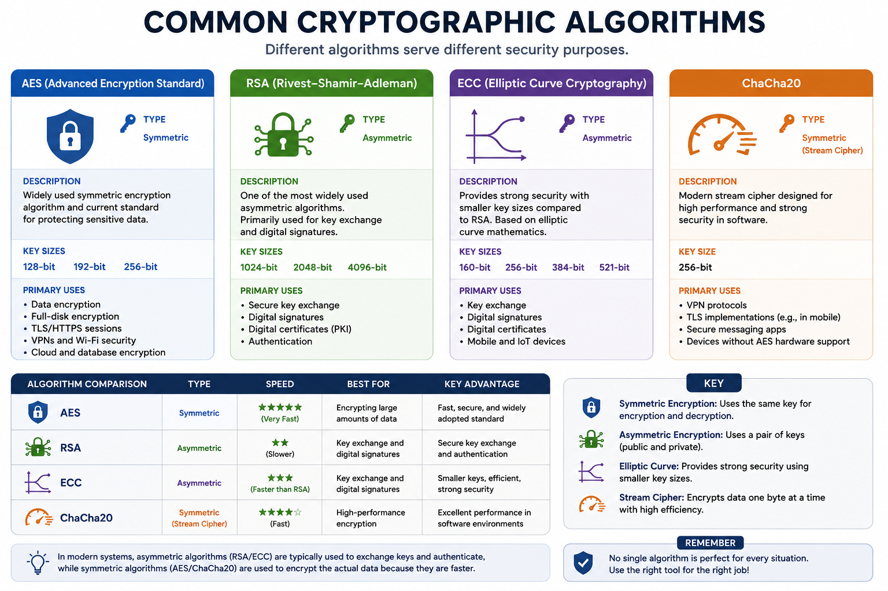
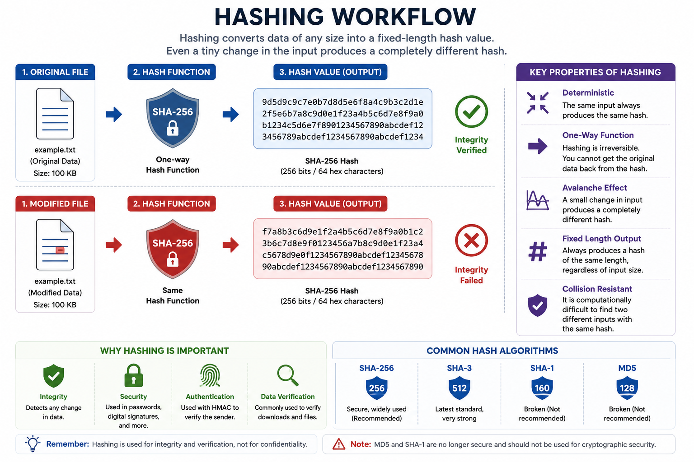
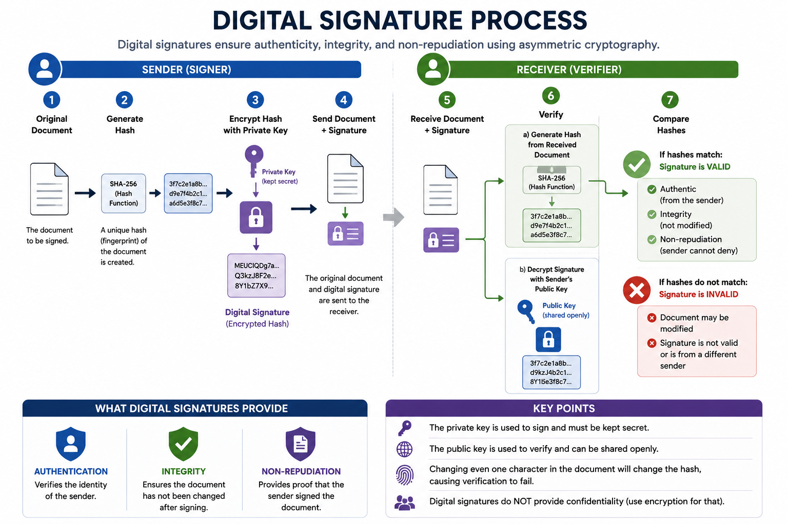
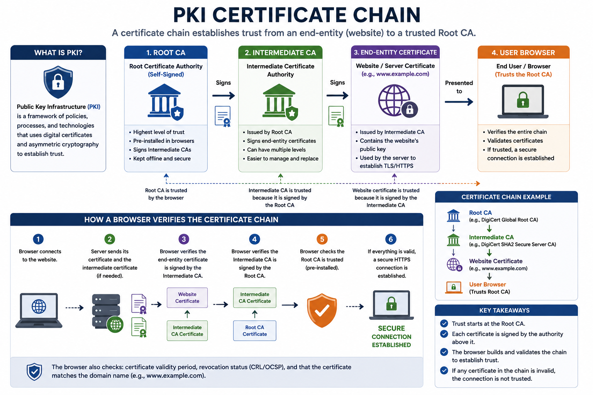
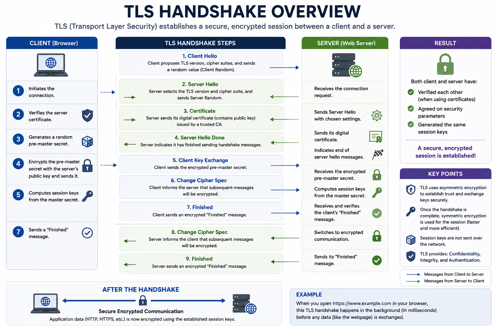
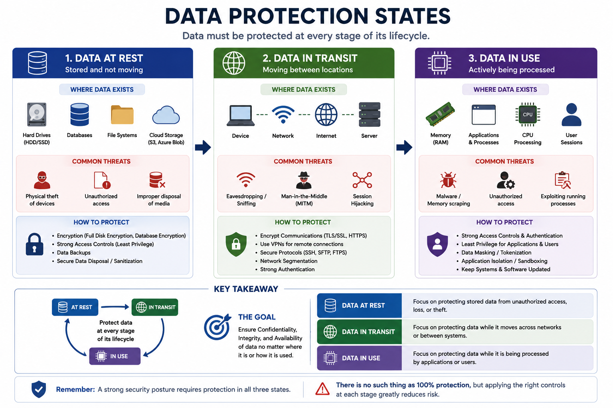

# What Is Cryptography?

Cryptography is the science of protecting information by transforming it into a secure format that prevents unauthorized access.

It uses mathematical algorithms and cryptographic keys to ensure that only authorized individuals or systems can access, modify, or verify sensitive information.

Modern cryptography is used in nearly every digital system, including websites, online banking, cloud services, wireless networks, mobile devices, and secure messaging applications.

Without cryptography, sensitive information such as passwords, financial records, and personal data could be intercepted or modified by attackers.

---

# Why Cryptography Matters

Organizations rely on cryptography to protect information throughout its lifecycle.

Whether data is stored on a hard drive, transmitted across the Internet, or processed by an application, cryptographic techniques help ensure that it remains protected against unauthorized access and tampering.

Cryptography is essential for:

- Protecting sensitive information
- Securing online communications
- Verifying identities
- Protecting stored data
- Preventing unauthorized modifications
- Supporting regulatory compliance
- Building trust between communicating parties

Without cryptographic protections, attackers could read confidential information, alter messages, impersonate legitimate users, or deny having performed certain actions.

---

# Cryptographic Goals

Cryptography supports several core security objectives.

These objectives form the foundation of secure communication and are frequently tested in the Security+ exam.



The primary goals include:

- Confidentiality
- Integrity
- Authentication
- Non-Repudiation

---

# Confidentiality

Confidentiality ensures that information can only be accessed by authorized users.

Encryption is the primary mechanism used to achieve confidentiality by converting readable information into an unreadable format.

## Example

A customer enters credit card information on an online shopping website.

TLS encrypts the communication so that anyone intercepting the network traffic cannot read the sensitive data.

---

# Integrity

Integrity ensures that information has not been modified during storage or transmission.

Hashing algorithms and message authentication techniques allow recipients to verify that data remains unchanged.

## Example

A downloaded software installer includes a published SHA-256 hash.

After downloading the file, the user calculates its hash and compares it with the published value to verify that the file has not been altered.

---

# Authentication

Authentication verifies the identity of users, devices, or systems before granting access or establishing trust.

Cryptography enables authentication through passwords, certificates, digital signatures, authentication protocols, and cryptographic keys.

## Example

When visiting a secure website, the browser verifies the server's digital certificate before establishing an encrypted connection.

---

# Non-Repudiation

Non-repudiation prevents an individual from denying that they performed a specific action.

Digital signatures provide non-repudiation by creating cryptographic proof that a message or document originated from a specific sender.

## Example

A digitally signed contract allows the recipient to verify both the sender's identity and that the document has not been modified after signing.

---

# Plaintext vs. Ciphertext

Plaintext is data in its original, readable form.

Ciphertext is data that has been encrypted and can no longer be understood without the appropriate decryption key.

Encryption converts plaintext into ciphertext, while decryption restores ciphertext back into readable plaintext.

Examples of plaintext include:

- Emails
- Passwords before encryption
- Documents
- Database records

Ciphertext appears as random or meaningless data to anyone who does not possess the correct cryptographic key.

---

# Encryption and Decryption

Encryption is the process of converting plaintext into ciphertext using a cryptographic algorithm and a key.

Decryption is the reverse process that converts ciphertext back into readable plaintext.

Successful decryption typically requires the correct cryptographic key.

The security of encrypted data depends not only on the encryption algorithm but also on protecting the associated cryptographic keys.

---

# Key Takeaways

- Cryptography protects sensitive information using mathematical algorithms and cryptographic keys.
- The primary security objectives are confidentiality, integrity, authentication, and non-repudiation.
- Plaintext is readable data, while ciphertext is encrypted data.
- Encryption protects information from unauthorized access.
- Decryption restores encrypted information to its original form.
- Strong cryptography depends on both secure algorithms and proper key management.
---

# Symmetric Encryption

Symmetric encryption uses a single cryptographic key for both encryption and decryption.

The sender and the recipient must possess the same secret key before secure communication can occur.

Because only one key is used, symmetric encryption is generally much faster and more efficient than asymmetric encryption, making it ideal for encrypting large amounts of data.

However, securely distributing the shared key remains one of its biggest challenges.



## Advantages

- Fast encryption and decryption
- Efficient for large datasets
- Lower computational overhead
- Widely used for bulk data encryption

## Disadvantages

- Secure key distribution is difficult.
- The same key must remain secret.
- Poor scalability in large environments because every communicating pair requires a unique shared key.

## Common Use Cases

- Full-disk encryption
- File encryption
- Database encryption
- VPN data encryption
- TLS session encryption

---

# Asymmetric Encryption

Asymmetric encryption uses two mathematically related keys:

- Public Key
- Private Key

The public key can be shared openly, while the private key must remain confidential.

Data encrypted with one key can only be decrypted with the other corresponding key.

Although asymmetric encryption is significantly slower than symmetric encryption, it solves the key distribution problem and enables secure authentication and digital signatures.

## Advantages

- Secure key distribution
- Supports digital signatures
- Enables authentication
- Scales well for large networks

## Disadvantages

- Slower than symmetric encryption
- Higher computational cost
- Less efficient for encrypting large amounts of data

## Common Use Cases

- HTTPS certificates
- Secure email
- Digital signatures
- Public Key Infrastructure (PKI)
- SSH authentication

---

# Symmetric vs Asymmetric Encryption

Both encryption methods solve different security problems and are often used together.

In modern secure communication protocols such as TLS, asymmetric encryption is typically used to exchange cryptographic keys securely, while symmetric encryption protects the actual communication because of its superior performance.

| Symmetric Encryption | Asymmetric Encryption |
|----------------------|-----------------------|
| One shared key | Public and private key pair |
| Faster | Slower |
| Efficient for large data | Efficient for key exchange |
| Difficult key distribution | Easier key distribution |
| Used for data encryption | Used for authentication and key exchange |

---

# Common Cryptographic Algorithms

Different cryptographic algorithms are designed for different purposes.

Some provide encryption, while others provide hashing, digital signatures, or key exchange.



---

# AES (Advanced Encryption Standard)

AES is the most widely used symmetric encryption algorithm.

It is considered highly secure and is the current encryption standard adopted by governments, financial institutions, and enterprises worldwide.

Common key sizes include:

- AES-128
- AES-192
- AES-256

## Common Uses

- Full-disk encryption
- Wi-Fi security (WPA2/WPA3)
- VPN encryption
- TLS sessions
- Cloud storage encryption

---

# RSA (Rivest–Shamir–Adleman)

RSA is one of the most common asymmetric encryption algorithms.

It is primarily used for secure key exchange, digital signatures, and certificate-based authentication rather than encrypting large amounts of data.

Because RSA is computationally expensive, it is rarely used for bulk data encryption.

## Common Uses

- Digital certificates
- Secure key exchange
- Digital signatures
- Public Key Infrastructure (PKI)

---

# ECC (Elliptic Curve Cryptography)

ECC provides security comparable to RSA while using significantly smaller key sizes.

Smaller keys improve performance, reduce bandwidth usage, and lower computational requirements.

ECC is commonly used in mobile devices, IoT systems, and modern secure communication protocols.

## Advantages

- Smaller keys
- Faster computations
- Lower power consumption
- Strong security

---

# ChaCha20

ChaCha20 is a modern symmetric stream cipher designed for high performance and strong security.

It performs particularly well on devices that lack dedicated hardware acceleration for AES.

ChaCha20 is often paired with Poly1305 to provide authenticated encryption.

## Common Uses

- Mobile devices
- VPN protocols
- Secure messaging applications
- TLS implementations

---

# Choosing the Right Encryption Method

Selecting the appropriate cryptographic solution depends on the security requirements and operational environment.

General recommendations include:

- Use symmetric encryption for protecting large amounts of data.
- Use asymmetric encryption for authentication, digital signatures, and secure key exchange.
- Use AES for most symmetric encryption needs.
- Use ECC when performance and smaller key sizes are important.
- Use RSA primarily for certificates and key exchange.
- Use ChaCha20 on systems where AES hardware acceleration is unavailable.

---

# Key Takeaways

- Symmetric encryption uses one shared secret key.
- Asymmetric encryption uses a public/private key pair.
- Symmetric encryption is faster, while asymmetric encryption simplifies secure key exchange.
- AES is the industry standard for symmetric encryption.
- RSA and ECC are widely used for public-key cryptography.
- ChaCha20 provides efficient modern symmetric encryption for many software-based environments.
---

# Hashing

Hashing is the process of converting data of any size into a fixed-length value called a hash or message digest.

Unlike encryption, hashing is a one-way operation. Once data has been hashed, it cannot be reversed to recover the original input.

Hashing is primarily used to verify data integrity rather than to protect confidentiality.



---

# How Hashing Works

A hash function processes an input and generates a unique output of fixed length.

Even a tiny change to the original data produces a completely different hash value.

For example:

```
Input:
Hello

SHA-256:
185f8db32271fe25f561a6fc938b2e264306ec304eda518007d1764826381969
```

Changing the input to:

```
hello
```

Produces a completely different hash.

This property makes hashing useful for detecting unauthorized modifications.

---

# Common Uses of Hashing

Hashing is widely used in cybersecurity for:

- Verifying file integrity
- Password storage
- Digital signatures
- Message authentication
- Blockchain technologies
- Data deduplication

---

# Common Hashing Algorithms

Several hashing algorithms are commonly encountered in cybersecurity.

## SHA-256

SHA-256 belongs to the Secure Hash Algorithm 2 (SHA-2) family.

It generates a 256-bit hash and is considered highly secure.

Common uses include:

- File integrity verification
- Digital certificates
- Blockchain
- Digital signatures

---

## SHA-3

SHA-3 is the latest Secure Hash Algorithm standard.

Although less widely deployed than SHA-2, it provides strong security and uses a completely different internal design.

---

## MD5

MD5 produces a 128-bit hash.

Although historically popular, MD5 is no longer considered secure because attackers can generate collisions.

MD5 should not be used for cryptographic security.

It may still appear in legacy systems or for non-security purposes such as checksum verification.

---

## SHA-1

SHA-1 generates a 160-bit hash.

Like MD5, SHA-1 is considered cryptographically broken due to practical collision attacks.

Modern systems should use SHA-256 or stronger algorithms instead.

---

# Hash Collisions

A hash collision occurs when two different inputs produce the same hash value.

Strong cryptographic hash functions make collisions extremely difficult to generate.

Algorithms such as MD5 and SHA-1 are vulnerable to collision attacks, which is one reason they are no longer recommended for secure applications.

---

# HMAC (Hash-based Message Authentication Code)

HMAC combines a cryptographic hash function with a secret key.

Unlike ordinary hashing, HMAC provides both:

- Integrity
- Authentication

Only parties possessing the secret key can generate or verify a valid HMAC.

Common algorithms include:

- HMAC-SHA256
- HMAC-SHA512

HMAC is widely used in APIs, authentication protocols, and secure communications.

---

# Digital Signatures

A digital signature provides proof that a message or document originated from a specific sender and has not been modified.

Unlike handwritten signatures, digital signatures rely on asymmetric cryptography.

The sender signs the data using their private key.

The recipient verifies the signature using the sender's public key.



---

# Digital Signature Workflow

The process generally follows these steps:

1. The sender creates a hash of the document.
2. The hash is encrypted using the sender's private key.
3. The encrypted hash becomes the digital signature.
4. The document and signature are sent together.
5. The recipient calculates a new hash of the received document.
6. The recipient decrypts the signature using the sender's public key.
7. If both hash values match, the document is authentic and has not been modified.

---

# Benefits of Digital Signatures

Digital signatures provide:

- Authentication
- Integrity
- Non-repudiation

However, they do **not** provide confidentiality because the document itself is not encrypted.

---

# Hashing vs Encryption

Although both protect information, they serve different purposes.

| Hashing | Encryption |
|----------|------------|
| One-way operation | Reversible process |
| Protects integrity | Protects confidentiality |
| No decryption | Requires decryption |
| Fixed-length output | Output size varies |
| Cannot recover original data | Original data can be restored |

---

# Key Takeaways

- Hashing is a one-way function used to verify data integrity.
- SHA-256 and SHA-3 are secure hashing algorithms.
- MD5 and SHA-1 should not be used for modern cryptographic security.
- HMAC combines hashing with a secret key to provide integrity and authentication.
- Digital signatures use asymmetric cryptography to provide authentication, integrity, and non-repudiation.
- Hashing and encryption serve different security purposes.
---
# Public Key Infrastructure (PKI)

Public Key Infrastructure (PKI) is a framework of technologies, policies, procedures, and trusted entities that manage public-key cryptography and digital certificates.

PKI enables users, devices, and applications to establish trusted and secure communications over untrusted networks such as the Internet.

Rather than relying solely on passwords, PKI uses cryptographic key pairs and digital certificates to verify identities and protect communications.



---

# Why PKI Matters

Public-key cryptography alone does not solve the problem of trust.

Anyone can generate a public and private key pair, but without a trusted authority, there is no reliable way to verify the identity of the key owner.

PKI solves this problem by allowing trusted organizations to issue and validate digital certificates.

PKI is widely used in:

- HTTPS websites
- VPN connections
- Secure email
- Code signing
- User authentication
- Enterprise identity management

---

# Digital Certificates

A digital certificate is an electronic document that binds a public key to the identity of an individual, organization, or device.

Certificates allow others to verify that a public key genuinely belongs to the claimed owner.

A typical certificate contains:

- Subject name
- Public key
- Issuing Certificate Authority (CA)
- Serial number
- Validity period
- Digital signature of the issuing CA

Digital certificates are commonly based on the X.509 standard.

---

# Certificate Authority (CA)

A Certificate Authority (CA) is a trusted organization responsible for issuing, validating, renewing, and revoking digital certificates.

Before issuing a certificate, the CA verifies the identity of the certificate requester.

Examples of public Certificate Authorities include organizations trusted by major web browsers and operating systems.

Without trusted Certificate Authorities, secure web browsing would not be possible.

---

# Root CA and Intermediate CA

PKI typically uses a hierarchical trust model.

At the top of the hierarchy is the Root Certificate Authority.

Root CAs rarely issue certificates directly.

Instead, they issue certificates to one or more Intermediate Certificate Authorities.

Intermediate CAs then issue certificates to servers, users, and devices.

This layered approach improves security because the highly trusted root certificate remains protected.

---

# Certificate Chain

A certificate chain is the sequence of certificates that establishes trust between an end-entity certificate and a trusted Root CA.

A typical chain consists of:

- End-Entity Certificate
- Intermediate CA Certificate
- Root CA Certificate

When a browser visits a secure website, it validates the entire certificate chain before establishing a trusted connection.

---

# Certificate Signing Request (CSR)

A Certificate Signing Request (CSR) is a file generated before requesting a digital certificate.

The CSR contains:

- Public key
- Organization information
- Domain name
- Contact information

The private key is **never** included in the CSR.

After verifying the request, the CA signs and issues the certificate.

---

# Certificate Revocation

Sometimes certificates should no longer be trusted before they expire.

Common reasons include:

- Private key compromise
- Organization changes
- Incorrect certificate information
- Certificate replacement

PKI provides mechanisms to identify revoked certificates.

---

# Certificate Revocation List (CRL)

A Certificate Revocation List (CRL) is a list published by a Certificate Authority containing certificates that should no longer be trusted.

Systems periodically download the CRL to determine whether a certificate has been revoked.

One limitation is that CRLs may become outdated between updates.

---

# Online Certificate Status Protocol (OCSP)

The Online Certificate Status Protocol (OCSP) provides real-time certificate status verification.

Instead of downloading an entire revocation list, a client queries an OCSP responder to determine whether a certificate is:

- Valid
- Revoked
- Unknown

Because OCSP provides current information, it is generally faster and more efficient than relying solely on CRLs.

---

# Self-Signed Certificates

A self-signed certificate is signed by its own creator rather than by a trusted Certificate Authority.

Self-signed certificates may be appropriate for:

- Testing environments
- Internal laboratory systems
- Development servers

However, they are generally not suitable for public-facing production services because browsers cannot automatically verify their authenticity.

---

# Certificate Lifecycle

The lifecycle of a digital certificate typically includes:

1. Key pair generation
2. Certificate Signing Request (CSR)
3. Identity verification
4. Certificate issuance
5. Installation
6. Regular use
7. Renewal or expiration
8. Revocation (if necessary)

Proper certificate lifecycle management helps maintain secure communications and organizational trust.

---

# Key Takeaways

- PKI establishes trust for public-key cryptography.
- Digital certificates bind public keys to verified identities.
- Certificate Authorities issue and manage trusted certificates.
- Root and Intermediate CAs create a hierarchical trust model.
- Certificate chains allow clients to verify trust.
- A CSR contains the information required to request a certificate.
- CRLs and OCSP help determine whether certificates remain valid.
- Self-signed certificates are suitable for testing but not for public production environments.
---

# Secure Communication Protocols

Modern networks rely on secure communication protocols to protect sensitive information exchanged between users, devices, and services.

These protocols use cryptographic techniques such as encryption, hashing, digital signatures, and certificate-based authentication to ensure secure communications over untrusted networks.

Common secure communication protocols include:

- TLS
- HTTPS
- SSH
- IPsec
- VPN

---

# Transport Layer Security (TLS)

Transport Layer Security (TLS) is the modern standard protocol for securing network communications.

TLS provides:

- Confidentiality
- Integrity
- Authentication

TLS achieves these goals by combining asymmetric encryption, symmetric encryption, digital certificates, and cryptographic hashing.

During the initial connection, asymmetric cryptography establishes a secure session, after which symmetric encryption protects the ongoing communication.



---

# Hypertext Transfer Protocol Secure (HTTPS)

HTTPS is the secure version of HTTP.

It uses TLS to encrypt communication between a web browser and a web server.

HTTPS protects users against:

- Eavesdropping
- Data tampering
- Man-in-the-Middle (MitM) attacks

Modern web browsers display a padlock icon when a website presents a valid TLS certificate.

---

# Secure Shell (SSH)

Secure Shell (SSH) is a protocol used for securely accessing and managing remote systems.

SSH encrypts all communication between the client and the remote server.

Common uses include:

- Remote administration
- Secure file transfers (SCP/SFTP)
- Secure command execution
- Network device management

SSH replaces insecure protocols such as Telnet.

---

# Internet Protocol Security (IPsec)

IPsec is a suite of protocols that secures IP communications.

It protects network traffic by providing:

- Confidentiality
- Integrity
- Authentication

IPsec is commonly used for site-to-site VPNs and remote access VPNs.

It operates at the Network Layer of the OSI model.

---

# Virtual Private Network (VPN)

A Virtual Private Network (VPN) creates an encrypted tunnel between two endpoints across an untrusted network such as the Internet.

VPNs protect transmitted data from interception while allowing users to securely access private networks remotely.

Common VPN technologies include:

- IPsec VPN
- SSL/TLS VPN
- WireGuard

---

# Data Protection States

Sensitive information requires protection throughout its lifecycle.

Security professionals typically classify data into three protection states:

- Data at Rest
- Data in Transit
- Data in Use



---

# Data at Rest

Data at Rest refers to information stored on physical or digital storage devices.

Examples include:

- Hard drives
- SSDs
- USB drives
- Databases
- Cloud storage

Common protection methods include:

- Full-disk encryption
- Database encryption
- File encryption
- Access controls

---

# Data in Transit

Data in Transit is information moving between devices or across networks.

Examples include:

- Web browsing
- Email
- File transfers
- Cloud synchronization
- Video conferencing

Common protection methods include:

- TLS
- HTTPS
- SSH
- VPN
- IPsec

---

# Data in Use

Data in Use refers to information currently being processed by a computer or application.

Unlike stored or transmitted data, data in use must often exist temporarily in memory.

Protecting this state is more challenging because applications require access to plaintext data while processing it.

Common protection methods include:

- Access control
- Secure enclaves
- Memory protection
- Least privilege
- Process isolation

---

# Choosing the Appropriate Cryptographic Solution

Different cryptographic technologies solve different security problems.

Security professionals should select solutions based on the sensitivity of the data, operational requirements, and system architecture.

General recommendations include:

- Use TLS or HTTPS for secure web communications.
- Use SSH instead of Telnet for remote administration.
- Use VPNs to protect communications across untrusted networks.
- Encrypt sensitive data stored on devices.
- Protect data throughout its entire lifecycle.

---

# Key Takeaways

- TLS secures modern network communications.
- HTTPS protects web traffic using TLS.
- SSH provides secure remote administration.
- IPsec secures network-layer communications.
- VPNs create encrypted communication tunnels.
- Data should be protected while stored, transmitted, and processed.
- Different cryptographic solutions address different security requirements.
---

# Security+ Exam Focus

For the Security+ exam, you should be able to:

- Explain the purpose of cryptography in protecting information.
- Differentiate between symmetric and asymmetric encryption.
- Identify the advantages and limitations of common cryptographic algorithms.
- Understand how hashing differs from encryption.
- Explain the purpose of HMAC and digital signatures.
- Describe the role of Public Key Infrastructure (PKI).
- Understand how Certificate Authorities (CAs) establish trust.
- Explain certificate chains, Certificate Signing Requests (CSRs), CRLs, and OCSP.
- Identify secure communication protocols such as TLS, HTTPS, SSH, IPsec, and VPNs.
- Distinguish between data at rest, data in transit, and data in use.
- Select appropriate cryptographic solutions for different security scenarios.

Exam questions often present real-world situations rather than asking for simple definitions. Focus on understanding why a particular cryptographic technology is used and when it is the most appropriate solution.

---

# Summary

Cryptography is one of the core technologies that enables secure communication, protects sensitive information, and establishes trust in modern computing environments.

Throughout this lesson, you learned how cryptographic techniques support confidentiality, integrity, authentication, and non-repudiation.

You explored:

- Cryptographic fundamentals
- Symmetric and asymmetric encryption
- Common encryption algorithms
- Hashing and HMAC
- Digital signatures
- Public Key Infrastructure (PKI)
- Digital certificates
- Secure communication protocols
- Data protection throughout its lifecycle

No single cryptographic solution solves every security problem.

Instead, organizations combine multiple technologies to build layered security controls that protect data, verify identities, and secure communications across diverse environments.

Understanding how these technologies work together is essential for both the CompTIA Security+ exam and real-world cybersecurity operations.

---

# Key Terms

- AES
- Asymmetric Encryption
- Authentication
- Certificate Authority (CA)
- Certificate Chain
- Certificate Revocation List (CRL)
- Certificate Signing Request (CSR)
- ChaCha20
- Ciphertext
- Confidentiality
- Cryptography
- Data at Rest
- Data in Transit
- Data in Use
- Decryption
- Digital Certificate
- Digital Signature
- ECC
- Encryption
- HMAC
- Hash
- Hash Collision
- HTTPS
- Integrity
- IPsec
- Non-Repudiation
- OCSP
- PKI
- Plaintext
- Private Key
- Public Key
- RSA
- SHA-256
- SHA-3
- SSH
- Symmetric Encryption
- TLS
- VPN