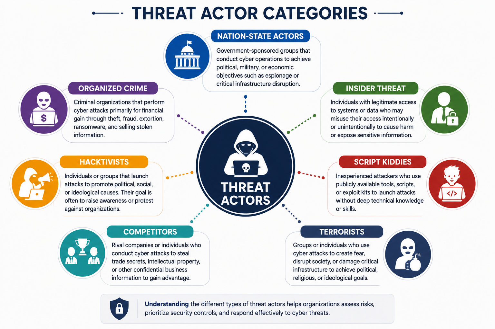
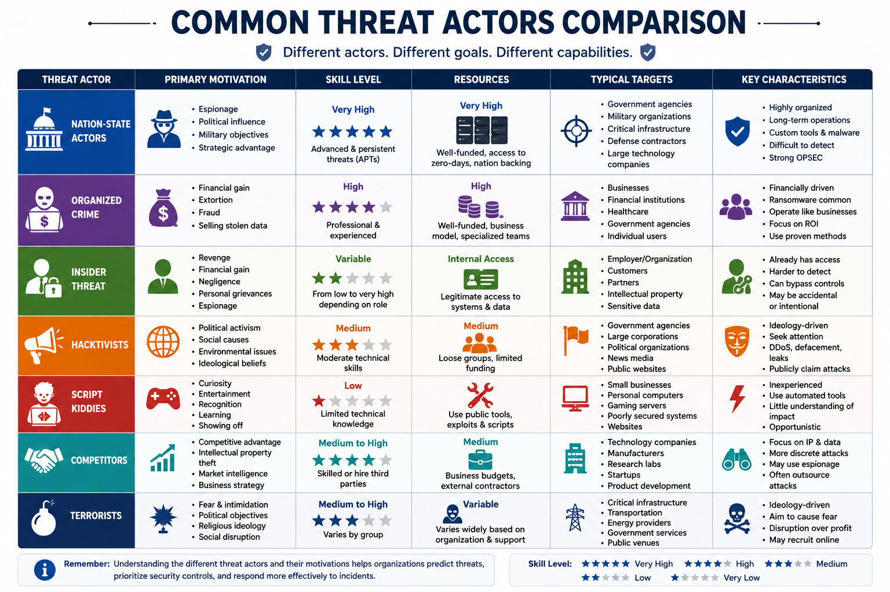
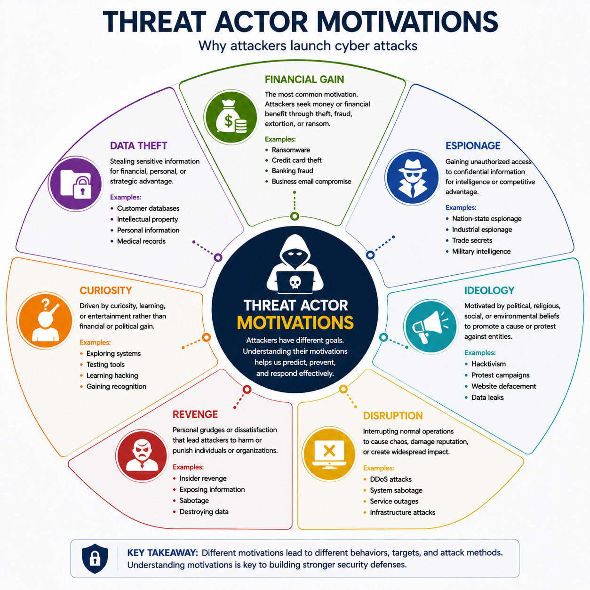

# What Are Threat Actors?

A threat actor is any individual, group, or organization that intentionally attempts to compromise the confidentiality, integrity, or availability of information systems.

Threat actors differ in their resources, technical skills, objectives, and methods. Some are highly organized and well-funded, while others have limited experience and rely on publicly available tools.

Understanding who the attacker is can help security professionals predict likely attack techniques, prioritize defensive measures, and respond more effectively to security incidents.

---

# Why Understanding Threat Actors Matters

Different threat actors have different goals.

For example, a cybercriminal seeking financial gain behaves differently from a nation-state conducting espionage or an insider attempting to steal confidential information.

Identifying the type of threat actor allows organizations to:

- Better assess security risks
- Improve threat detection
- Prioritize security controls
- Develop effective incident response plans
- Protect valuable assets

Understanding attacker motivations also helps security teams anticipate future threats and strengthen organizational defenses.

---

# Threat Actor Categories

Threat actors can be grouped into several common categories based on their objectives, capabilities, and available resources.

The primary categories include:

- Nation-State
- Organized Crime
- Insider Threat
- Hacktivists
- Script Kiddies
- Competitors
- Terrorists

Each category presents different levels of risk and typically targets different types of organizations.

---

# Nation-State Actors

Nation-state actors are government-sponsored individuals or groups that conduct cyber operations on behalf of a country.

These actors typically possess significant financial resources, advanced technical capabilities, and access to sophisticated attack tools.

Their operations are often carefully planned and may continue for months or even years before being discovered.

## Common Motivations

- Cyber espionage
- Intelligence gathering
- Military objectives
- Political influence
- Critical infrastructure disruption

## Typical Targets

- Government agencies
- Military organizations
- Defense contractors
- Critical infrastructure
- Large technology companies

---

# Organized Crime

Organized crime groups conduct cyber attacks primarily for financial gain.

These groups often operate like legitimate businesses, with specialized teams responsible for malware development, phishing campaigns, money laundering, and technical support.

Many modern ransomware operations are carried out by organized cybercriminal groups.

## Common Motivations

- Financial profit
- Extortion
- Fraud
- Identity theft
- Selling stolen information

## Typical Targets

- Businesses
- Financial institutions
- Healthcare organizations
- Government agencies
- Individual users

---

# Insider Threat

An insider threat originates from someone who has authorized access to an organization's systems, facilities, or information.

Insiders may intentionally cause harm or unintentionally expose sensitive information through negligence or human error.

Because insiders already possess legitimate access, they can often bypass traditional security controls.

## Types of Insider Threats

- Malicious insiders
- Negligent employees
- Compromised accounts

## Common Motivations

- Financial gain
- Revenge
- Personal grievances
- Carelessness
- Corporate espionage

## Examples

- Stealing confidential customer data
- Copying intellectual property before leaving a company
- Accidentally exposing sensitive information
- Misusing administrative privileges

---

# Comparing the First Three Threat Actors

| Threat Actor | Primary Motivation | Resources | Typical Targets |
|--------------|--------------------|-----------|-----------------|
| Nation-State | Espionage, political objectives | Very High | Governments, military, critical infrastructure |
| Organized Crime | Financial gain | High | Businesses, banks, healthcare |
| Insider Threat | Revenge, profit, negligence | Existing internal access | Employer or organization |

---

# Key Takeaways

- Threat actors are individuals or groups that intentionally threaten information systems.
- Different threat actors have different motivations, capabilities, and objectives.
- Nation-state actors conduct advanced cyber operations for governments.
- Organized crime groups focus primarily on financial gain.
- Insider threats originate from individuals with legitimate organizational access.
- Understanding threat actors helps organizations improve risk management and incident response.
---

# Hacktivists

Hacktivists are individuals or groups that conduct cyber attacks to promote political, social, environmental, or ideological causes.

Unlike organized crime groups, hacktivists are generally motivated by beliefs rather than financial gain.

Their attacks are often intended to attract public attention, embarrass organizations, or protest against governments, corporations, or institutions.

## Common Motivations

- Political activism
- Social causes
- Environmental issues
- Human rights advocacy
- Public awareness

## Common Attack Methods

- Website defacement
- Distributed Denial-of-Service (DDoS) attacks
- Data leaks
- Social media campaigns

## Typical Targets

- Government agencies
- Large corporations
- Political organizations
- News organizations

---

# Script Kiddies

Script kiddies are inexperienced attackers who rely on publicly available hacking tools, scripts, or exploit kits rather than developing their own techniques.

Although they generally possess limited technical skills, they can still cause significant damage by targeting poorly secured systems.

## Common Motivations

- Curiosity
- Entertainment
- Recognition
- Learning
- Showing off technical abilities

## Common Attack Methods

- Automated vulnerability scanners
- Public exploit tools
- Password guessing
- Basic malware

## Typical Targets

- Small businesses
- Personal computers
- Gaming servers
- Poorly secured websites

---

# Competitors

Competitors may conduct cyber attacks to gain a business advantage over rival organizations.

These attacks often focus on stealing confidential business information, trade secrets, research data, or intellectual property.

In many cases, competitors may hire third parties to perform cyber espionage on their behalf.

## Common Motivations

- Competitive advantage
- Intellectual property theft
- Market intelligence
- Business strategy information

## Typical Targets

- Technology companies
- Manufacturing organizations
- Research laboratories
- Product development teams

---

# Terrorists

Cyber terrorists seek to create fear, disrupt society, or damage critical infrastructure to achieve ideological, political, or religious objectives.

Unlike nation-state actors, terrorist groups often prioritize psychological impact over financial gain.

## Common Motivations

- Fear and intimidation
- Political influence
- Religious ideology
- Social disruption

## Typical Targets

- Critical infrastructure
- Transportation systems
- Energy providers
- Government services
- Emergency response systems

---

# Shadow IT

Shadow IT refers to hardware, software, cloud services, or applications used within an organization without approval from the IT department.

Although Shadow IT is not always malicious, it introduces significant security risks because unmanaged systems often bypass organizational security controls.

Employees may use Shadow IT to improve productivity or simplify their work without realizing the associated security implications.

## Common Risks

- Data leakage
- Unauthorized cloud storage
- Weak access controls
- Compliance violations
- Lack of security monitoring

## Examples

- Personal cloud storage accounts
- Unauthorized messaging applications
- Personal email for work documents
- Unapproved SaaS platforms

---

# Comparing Common Threat Actors

Threat actors differ in their motivations, technical capabilities, and available resources.

| Threat Actor | Primary Motivation | Skill Level | Resources |
|--------------|--------------------|------------|-----------|
| Nation-State | Espionage | Very High | Very High |
| Organized Crime | Financial Gain | High | High |
| Insider Threat | Revenge or Negligence | Varies | Internal Access |
| Hacktivists | Ideology | Medium | Medium |
| Script Kiddies | Curiosity or Recognition | Low | Low |
| Competitors | Business Advantage | Medium to High | Medium |
| Terrorists | Fear and Disruption | Medium to High | Varies |

---

# Recognizing Threat Actors

Identifying the likely threat actor helps security teams anticipate attack methods and prioritize defensive measures.

For example:

- A ransomware attack demanding payment is commonly associated with organized crime.
- Long-term cyber espionage campaigns often indicate nation-state involvement.
- Unauthorized data copying by an employee may suggest an insider threat.
- Website defacement supporting a political message is commonly associated with hacktivists.
- Random attacks using publicly available tools are often linked to script kiddies.

While these associations are common, organizations should avoid making assumptions without sufficient evidence.

---

# Key Takeaways

- Hacktivists are motivated by ideology rather than financial gain.
- Script kiddies rely on publicly available tools and have limited technical expertise.
- Competitors may target organizations to obtain business intelligence or intellectual property.
- Terrorists seek to create fear and disrupt critical infrastructure.
- Shadow IT introduces security risks through unauthorized technologies.
- Different threat actors exhibit distinct motivations, capabilities, and attack patterns.
---

# Threat Actor Motivations

Threat actors launch cyber attacks for many different reasons.

Understanding an attacker's motivation helps security professionals assess risks, predict potential targets, and implement appropriate defensive strategies.

Although multiple motivations may exist, most cyber attacks are driven by one primary objective.

The most common motivations include:

- Financial Gain
- Espionage
- Ideology
- Revenge
- Disruption
- Curiosity
- Data Theft

---

# Financial Gain

Financial gain is one of the most common motivations behind cyber attacks.

Cybercriminals seek to generate profit by stealing money, demanding ransom payments, selling stolen information, or committing fraud.

## Common Attack Types

- Ransomware
- Banking malware
- Credit card theft
- Business Email Compromise (BEC)
- Phishing
- Cryptocurrency theft

## Typical Targets

- Financial institutions
- Businesses
- Healthcare organizations
- Individual users

---

# Espionage

Espionage involves secretly gathering confidential information without authorization.

Nation-state actors are the primary groups associated with cyber espionage, although competitors may also conduct industrial espionage.

## Common Objectives

- Government intelligence
- Military information
- Research and development
- Trade secrets
- Intellectual property

## Typical Targets

- Government agencies
- Defense contractors
- Research organizations
- Technology companies

---

# Ideology

Some attackers are motivated by political, religious, environmental, or social beliefs.

Their objective is often to influence public opinion, protest against organizations, or promote a specific cause.

Hacktivists are the threat actors most commonly associated with ideological motivations.

## Common Attack Types

- Website defacement
- Data leaks
- Distributed Denial-of-Service (DDoS)
- Social media campaigns

---

# Revenge

Revenge is a common motivation for insider threats.

Disgruntled employees, former contractors, or dissatisfied business partners may intentionally damage systems or expose sensitive information.

## Examples

- Deleting important files
- Leaking confidential documents
- Sabotaging business operations
- Misusing privileged accounts

Organizations reduce these risks through access controls, monitoring, and proper employee offboarding procedures.

---

# Disruption

Some attackers focus on interrupting normal business operations rather than stealing information.

Their objective may be to damage an organization's reputation, reduce service availability, or create widespread disruption.

## Common Attack Types

- Distributed Denial-of-Service (DDoS)
- System sabotage
- Critical infrastructure attacks
- Malware outbreaks

---

# Curiosity

Not every cyber attack is financially or politically motivated.

Some inexperienced attackers simply want to learn how systems work or test their technical abilities.

Script kiddies often fall into this category because they experiment using publicly available attack tools.

Although curiosity may seem harmless, these activities can still cause significant damage.

---

# Data Theft

Many attacks are specifically designed to steal valuable information.

Stolen data may later be sold, used for identity theft, corporate espionage, blackmail, or future attacks.

## Common Targets

- Customer databases
- Login credentials
- Financial records
- Medical information
- Intellectual property

Protecting sensitive information requires strong access controls, encryption, monitoring, and data loss prevention strategies.

---

# Multiple Motivations

Not all attacks have a single motivation.

For example, a ransomware attack may begin as financial extortion but also disrupt business operations.

Similarly, a nation-state operation may combine espionage with political influence.

Understanding the broader context of an attack helps organizations perform more accurate threat analysis.

---

# Key Takeaways

- Threat actors are motivated by different objectives.
- Financial gain is the most common motivation for cybercrime.
- Espionage focuses on collecting confidential information.
- Ideology commonly motivates hacktivists.
- Revenge is frequently associated with insider threats.
- Disruption aims to interrupt business operations.
- Curiosity often motivates inexperienced attackers.
- Data theft supports financial crime, espionage, and identity theft.
---

# Attribution

Attribution is the process of identifying the individual, group, or organization responsible for a cyber attack.

Accurate attribution helps organizations understand the nature of a threat, support law enforcement investigations, improve defensive strategies, and make informed security decisions.

However, identifying the true attacker is often difficult because cybercriminals intentionally hide their identities.

---

# Why Attribution Is Difficult

Threat actors use various techniques to conceal their identities and make investigations more challenging.

Common obstacles include:

- Anonymous internet access
- VPN services
- Proxy servers
- The Tor network
- Compromised systems used as intermediaries
- Stolen credentials
- False flags designed to mislead investigators

Because of these techniques, investigators rarely rely on a single piece of evidence.

Instead, attribution is based on multiple sources of intelligence collected over time.

---

# Attribution Methods

Cybersecurity professionals use a combination of technical, operational, and intelligence-based evidence to identify threat actors.

Common attribution methods include:

- Digital forensic analysis
- Malware analysis
- Network traffic analysis
- Threat intelligence
- Infrastructure analysis
- Behavioral analysis
- Indicators of Compromise (IOCs)

The stronger and more consistent the evidence, the greater the confidence in the attribution.

---

# Challenges of Attribution

Even with extensive investigation, attribution may remain uncertain.

Common challenges include:

- Shared attack tools
- Reused malware
- Compromised third-party infrastructure
- International legal limitations
- Lack of sufficient evidence
- Deliberate deception by attackers

For this reason, organizations often describe attribution using confidence levels such as **Low**, **Medium**, or **High Confidence** instead of claiming absolute certainty.

---

# Real-World Example

A government agency discovers that sensitive documents have been stolen over several months.

The investigation reveals:

- Long-term unauthorized access
- Highly sophisticated malware
- Custom-built attack tools
- Communication with multiple foreign servers

Based on technical evidence and threat intelligence, investigators assess with **high confidence** that the operation was conducted by a nation-state threat actor engaged in cyber espionage.

Although absolute proof may never be available, the available evidence strongly supports this conclusion.

---

# Security+ Exam Focus

For the Security+ exam, you should be able to:

- Identify common threat actors.
- Understand the motivations behind cyber attacks.
- Recognize the characteristics of different attacker groups.
- Explain why attribution is difficult.
- Identify common attribution techniques.
- Distinguish between financial, political, ideological, and espionage motivations.
- Relate attack scenarios to the most likely threat actor.

Remember that attribution is rarely certain. Security professionals typically rely on multiple independent sources of evidence before reaching a conclusion.

---

# Summary

Threat actors vary significantly in their capabilities, objectives, and available resources.

Understanding who the attackers are and why they conduct cyber attacks enables organizations to improve risk assessments, strengthen security controls, and respond more effectively to incidents.

Different threat actors—including nation-state actors, organized crime groups, insider threats, hacktivists, competitors, terrorists, and script kiddies—each present unique risks.

Recognizing their motivations, techniques, and behaviors is an essential skill for cybersecurity professionals and a key topic in the CompTIA Security+ certification.

---

# Key Terms

- Threat Actor
- Nation-State
- Organized Crime
- Insider Threat
- Hacktivist
- Script Kiddie
- Competitor
- Terrorist
- Shadow IT
- Financial Gain
- Espionage
- Ideology
- Revenge
- Disruption
- Curiosity
- Data Theft
- Attribution
- Threat Intelligence
- Indicators of Compromise (IOCs)
- Digital Forensics
- False Flag
- Malware Analysis
