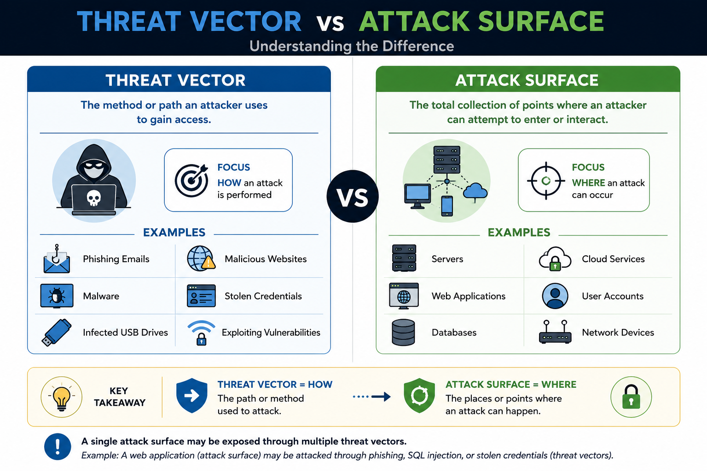
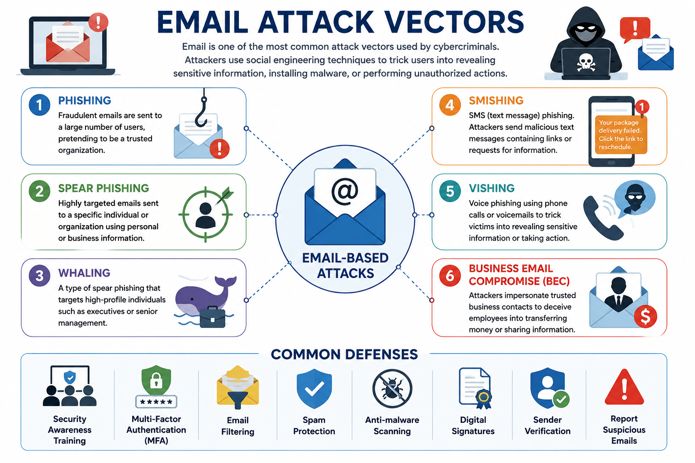
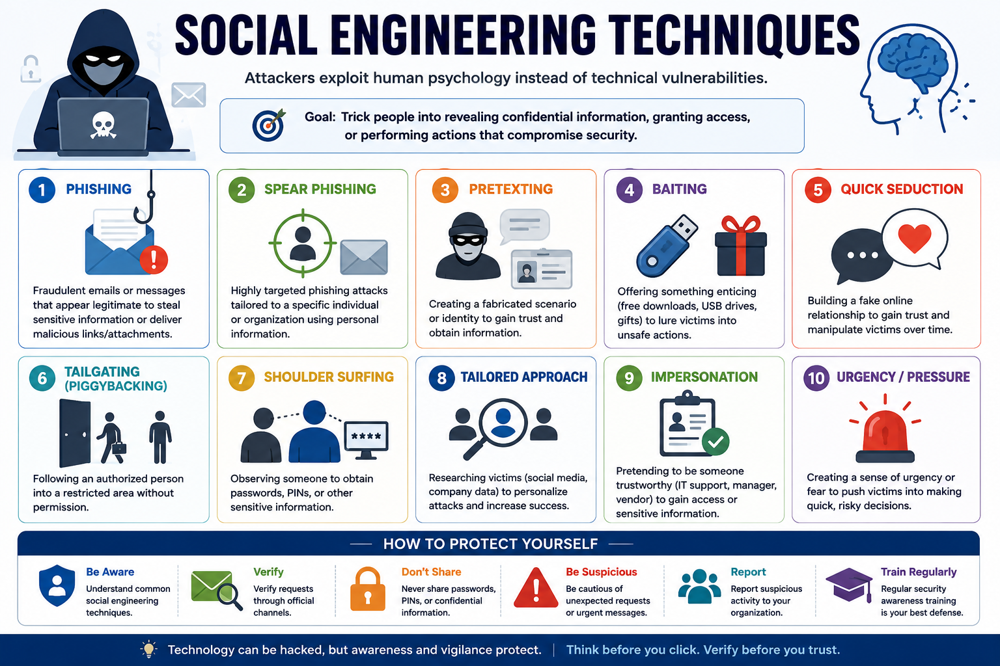
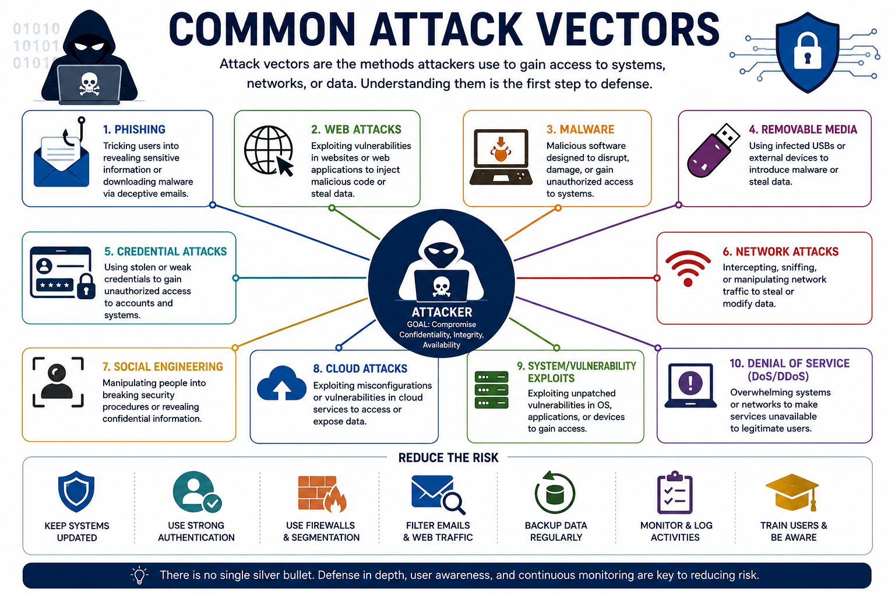
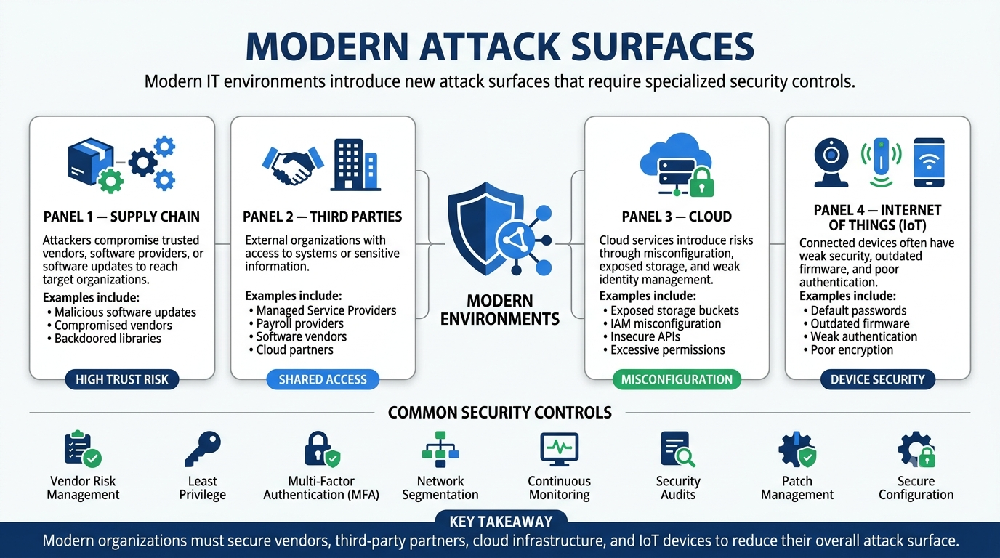
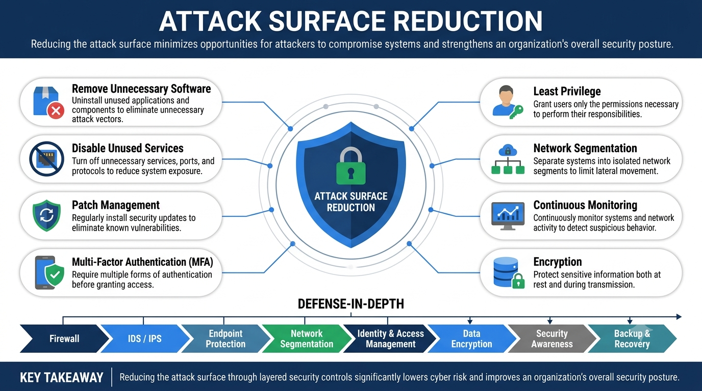

# What Is a Threat Vector?

A threat vector is the method or path that an attacker uses to gain unauthorized access to a system, network, application, or data.

Threat vectors represent **how** an attack is delivered. They may exploit technical vulnerabilities, human behavior, physical access, or weaknesses in organizational processes.

Examples of common threat vectors include phishing emails, malicious websites, infected USB drives, stolen credentials, and vulnerable software.

Understanding threat vectors helps security professionals identify potential attack methods and implement appropriate security controls.

---

# What Is an Attack Surface?

An attack surface is the total collection of points where an attacker can attempt to enter or interact with a system.

Every exposed service, application, device, user account, or physical entry point increases the overall attack surface.

In general, a larger attack surface provides more opportunities for attackers to identify and exploit weaknesses.

Organizations continuously work to reduce their attack surface by eliminating unnecessary services, restricting access, and keeping systems properly configured.

---

# Threat Vector vs Attack Surface

Although these terms are closely related, they describe different aspects of an attack.

| Threat Vector | Attack Surface |
|--------------|----------------|
| The method used to perform an attack | The collection of possible entry points |
| Focuses on **how** an attack occurs | Focuses on **where** an attack can occur |
| Examples: Phishing, malware, USB devices | Examples: Servers, web applications, cloud services, user accounts |

A simple way to remember the difference is:

- **Threat Vector = How the attacker gets in**
- **Attack Surface = Where the attacker can get in**

---

# Types of Attack Surfaces

Modern organizations have several different attack surfaces that require protection.

The three primary categories are:

## Digital Attack Surface

The digital attack surface includes all internet-facing and internal digital assets that attackers may target.

Examples include:

- Web applications
- Email servers
- Databases
- APIs
- Cloud services
- Remote access services
- User accounts
- Mobile applications

---

## Physical Attack Surface

The physical attack surface includes locations and hardware that attackers can physically access.

Examples include:

- Office buildings
- Server rooms
- Workstations
- Network equipment
- USB ports
- Laptops
- Mobile devices
- Security badges

Physical security controls such as locks, surveillance cameras, and access badges help reduce this attack surface.

---

## Human Attack Surface

People are often considered the weakest link in cybersecurity.

The human attack surface consists of employees, contractors, vendors, and anyone who has access to organizational resources.

Attackers frequently exploit human behavior through social engineering rather than technical vulnerabilities.

Examples include:

- Phishing emails
- Phone scams
- Tailgating
- Impersonation
- Password reuse
- Poor security awareness

Security awareness training is one of the most effective ways to reduce risks associated with the human attack surface.

---

# Why Understanding Attack Surfaces Matters

Organizations cannot protect assets they do not know exist.

Maintaining an accurate inventory of systems, applications, devices, and user accounts allows security teams to:

- Identify exposed assets
- Prioritize security improvements
- Reduce unnecessary services
- Detect unauthorized systems
- Improve vulnerability management
- Strengthen overall security posture

Reducing the attack surface decreases the number of opportunities available to attackers.

---

# Key Takeaways

- A threat vector is the method used to compromise a system.
- An attack surface is the collection of potential entry points available to attackers.
- Threat vectors describe **how** attacks occur, while attack surfaces describe **where** attacks occur.
- Digital, physical, and human attack surfaces all require protection.
- Reducing the attack surface is a fundamental cybersecurity strategy.
---

# Email-Based Attacks

Email remains one of the most common attack vectors used by cybercriminals.

Attackers exploit email because it is widely used, trusted by users, and capable of delivering malicious content directly to potential victims.

Email-based attacks often rely on social engineering to trick users into revealing sensitive information, downloading malware, or performing unauthorized actions.

Common email-based attacks include:

- Phishing
- Spear Phishing
- Whaling
- Smishing
- Vishing
- Business Email Compromise (BEC)

---

# Phishing

Phishing is a social engineering attack in which an attacker sends fraudulent emails pretending to be a trusted organization or individual.

The goal is to trick victims into:

- Revealing usernames and passwords
- Providing financial information
- Clicking malicious links
- Downloading malware

## Common Characteristics

- Generic greetings
- Urgent or threatening language
- Suspicious links
- Fake login pages
- Unexpected attachments

## Example

A user receives an email claiming to be from their bank asking them to verify their account by clicking a link. The link leads to a fake website designed to steal login credentials.

---

# Spear Phishing

Spear phishing is a targeted phishing attack directed at a specific individual or organization.

Unlike traditional phishing, these attacks are carefully crafted using personal or organizational information, making them much more convincing.

## Common Characteristics

- Personalized messages
- Knowledge of the victim
- Higher success rate
- Carefully researched targets

## Example

An employee receives an email that appears to come from their manager requesting immediate access to confidential files.

---

# Whaling

Whaling is a specialized form of spear phishing that targets high-profile individuals such as executives or senior managers.

Because executives often have access to sensitive information and financial resources, they are attractive targets.

## Typical Targets

- CEOs
- CFOs
- Directors
- Executives
- Business owners

## Common Objectives

- Financial fraud
- Wire transfer requests
- Credential theft
- Confidential information

---

# Smishing

Smishing (SMS Phishing) uses text messages instead of email to deceive victims.

Attackers often impersonate banks, delivery companies, or government agencies.

The message usually encourages the victim to click a malicious link or call a fraudulent phone number.

## Example

A text message claims that a package delivery failed and asks the recipient to click a link to reschedule delivery.

---

# Vishing

Vishing (Voice Phishing) uses phone calls or voice messages to manipulate victims.

Attackers may pretend to be technical support, banks, government officials, or law enforcement personnel.

Their objective is to obtain sensitive information or convince the victim to perform specific actions.

## Example

A caller claims to be from the IT department and asks an employee to provide their password to resolve an urgent technical issue.

---

# Business Email Compromise (BEC)

Business Email Compromise (BEC) is a highly targeted attack in which attackers impersonate trusted business contacts to deceive employees into transferring money or disclosing sensitive information.

BEC attacks often involve little or no malware and instead rely on trust, urgency, and social engineering.

## Common Targets

- Finance departments
- Human resources
- Executive assistants
- Payroll teams
- Senior management

## Common Objectives

- Unauthorized wire transfers
- Payroll fraud
- Invoice fraud
- Theft of confidential information

## Example

An attacker compromises a CEO's email account and sends an urgent request to the finance department instructing them to transfer funds to a fraudulent bank account.

---

# Preventing Email-Based Attacks

Organizations can reduce the risk of email attacks by implementing multiple layers of defense.

Common security measures include:

- Security awareness training
- Multi-Factor Authentication (MFA)
- Email filtering
- Spam protection
- Anti-malware scanning
- Digital signatures
- Sender verification
- Reporting suspicious emails

No single security control is sufficient. A layered security approach provides the strongest protection.

---

# Key Takeaways

- Email is one of the most frequently exploited attack vectors.
- Phishing targets large numbers of users using fraudulent emails.
- Spear phishing is highly targeted and personalized.
- Whaling focuses on senior executives.
- Smishing uses SMS messages, while vishing uses phone calls.
- Business Email Compromise (BEC) exploits trust to commit financial fraud.
- User awareness and layered security controls significantly reduce the success of email-based attacks.
---

# Social Engineering

Social engineering is the practice of manipulating people into revealing sensitive information or performing actions that compromise security.

Rather than exploiting technical vulnerabilities, social engineering attacks exploit human psychology, including trust, curiosity, fear, urgency, and the desire to help others.

Because people are often the weakest link in cybersecurity, social engineering remains one of the most successful attack techniques.

Common social engineering techniques include:

- Pretexting
- Baiting
- Tailgating
- Shoulder Surfing
- Dumpster Diving
- Impersonation

---

# Pretexting

Pretexting is a social engineering technique in which an attacker creates a believable fictional scenario (a pretext) to convince a victim to disclose sensitive information or perform a specific action.

The attacker often pretends to be someone the victim trusts, such as a bank employee, IT technician, or government official.

## Example

An attacker calls an employee claiming to be from the company's IT department and requests the employee's username and password to "resolve a system issue."

---

# Baiting

Baiting involves offering something attractive to persuade victims to compromise their security.

The "bait" may be physical or digital.

Common examples include:

- Free software downloads
- Free music or movies
- Fake giveaways
- Infected USB flash drives left in public places

Once the victim interacts with the bait, malware may be installed or sensitive information may be stolen.

---

# Tailgating

Tailgating occurs when an unauthorized individual gains physical access to a secure area by following an authorized person through a controlled entrance.

Attackers often rely on courtesy, pretending they forgot their access badge or carrying heavy boxes to encourage someone to hold the door open.

## Prevention

- Require badge verification
- Educate employees
- Challenge unknown individuals
- Use security guards or access control systems

---

# Shoulder Surfing

Shoulder surfing involves observing someone as they enter sensitive information.

Attackers may watch victims enter:

- Passwords
- PINs
- Credit card numbers
- Confidential documents

This attack can occur in offices, airports, coffee shops, or any public location.

## Prevention

- Use privacy screen filters
- Be aware of your surroundings
- Avoid entering sensitive information in public
- Lock devices when unattended

---

# Dumpster Diving

Dumpster diving is the practice of searching through discarded materials to obtain sensitive information.

Although many organizations focus on digital security, improperly disposed documents or hardware may expose valuable information.

Examples include:

- Printed reports
- Customer records
- Password notes
- Employee directories
- Storage devices

## Prevention

- Shred confidential documents
- Securely erase storage media
- Follow proper disposal procedures
- Train employees on data handling

---

# Impersonation

Impersonation occurs when an attacker pretends to be another person to gain trust or unauthorized access.

Attackers may impersonate:

- IT support staff
- Executives
- Delivery personnel
- Vendors
- Government officials
- Law enforcement officers

The goal is to convince victims to reveal information, grant access, or bypass security procedures.

---

# Preventing Social Engineering Attacks

Organizations can significantly reduce social engineering risks through a combination of technology, policies, and user awareness.

Effective defenses include:

- Security awareness training
- Identity verification procedures
- Multi-Factor Authentication (MFA)
- Visitor management policies
- Physical security controls
- Reporting suspicious activity
- Regular phishing simulations

A well-trained workforce is one of the strongest defenses against social engineering.

---

# Key Takeaways

- Social engineering targets people rather than technology.
- Pretexting relies on fabricated scenarios to gain trust.
- Baiting uses attractive offers to lure victims.
- Tailgating provides unauthorized physical access.
- Shoulder surfing involves observing sensitive information.
- Dumpster diving exploits improperly discarded materials.
- Impersonation uses false identities to deceive victims.
- User awareness is one of the most effective defenses against social engineering.
---

# Web-Based Attacks

Web applications are among the most frequently targeted systems because they are accessible over the internet and often process sensitive user data.

Attackers exploit vulnerabilities in web applications to steal information, gain unauthorized access, or disrupt services.

Common web-based attack vectors include:

- Malicious websites
- Drive-by downloads
- Cross-Site Scripting (XSS)
- SQL Injection (SQLi)
- File upload vulnerabilities
- Cross-Site Request Forgery (CSRF)

## Common Targets

- E-commerce websites
- Online banking platforms
- Customer portals
- Web APIs
- Cloud-based applications

## Prevention

- Secure coding practices
- Regular security testing
- Web Application Firewalls (WAF)
- Input validation
- Security updates and patch management

---

# Wireless Attacks

Wireless networks provide convenience but also introduce additional security risks if not properly configured.

Attackers may exploit weak encryption, poor authentication, or insecure wireless devices to gain unauthorized network access.

## Common Wireless Attack Vectors

- Rogue Access Points
- Evil Twin Access Points
- Packet Sniffing
- Wireless Eavesdropping
- Bluetooth attacks
- Wi-Fi password attacks

## Prevention

- WPA3 encryption
- Strong wireless passwords
- Disable unused wireless services
- Network segmentation
- Wireless intrusion detection systems
- Regular firmware updates

---

# Physical Attack Vectors

Not all attacks originate from the internet.

Physical access to systems can allow attackers to bypass many technical security controls.

Examples include:

- Stolen laptops
- Infected USB drives
- Unauthorized access to server rooms
- Hardware tampering
- Device theft

Physical attacks may result in:

- Data theft
- Malware installation
- Credential compromise
- Hardware destruction
- Service disruption

## Prevention

- Physical access controls
- Security cameras
- Locked server rooms
- Device encryption
- Asset tracking
- Secure disposal of hardware

---

# Comparing Common Attack Vectors

Different attack vectors target different parts of an organization's environment.

| Attack Vector | Primary Target | Typical Objective |
|--------------|----------------|-------------------|
| Web-Based | Web applications | Data theft, unauthorized access |
| Wireless | Wi-Fi networks | Network access, interception |
| Physical | Devices and facilities | Theft, sabotage, malware installation |

Each attack vector requires different security controls and defensive strategies.

---

# Layered Defense

No single security control can stop every attack vector.

Organizations typically implement multiple defensive layers, including:

- Firewalls
- Endpoint protection
- Network monitoring
- Multi-Factor Authentication (MFA)
- Physical security controls
- Security awareness training
- Regular vulnerability assessments

Combining multiple security controls significantly reduces the likelihood of a successful attack.

---

# Key Takeaways

- Web applications are frequent targets due to their internet exposure.
- Wireless networks require strong encryption and authentication.
- Physical access can bypass many technical security controls.
- Different attack vectors require different defensive measures.
- A layered security approach provides the strongest protection against diverse attack methods.
---

# Supply Chain Attacks

A supply chain attack occurs when attackers compromise a trusted third party to gain access to the intended target.

Instead of attacking an organization directly, attackers exploit weaknesses in software vendors, service providers, hardware manufacturers, or business partners.

Because organizations trust their suppliers, supply chain attacks can be difficult to detect and may affect thousands of customers simultaneously.

## Common Targets

- Software vendors
- Hardware manufacturers
- Cloud service providers
- Managed Service Providers (MSPs)
- Third-party libraries
- Open-source software projects

## Common Attack Methods

- Malicious software updates
- Compromised development environments
- Backdoored software packages
- Hardware tampering
- Compromised vendor accounts

## Prevention

- Vendor risk assessments
- Software integrity verification
- Code signing
- Continuous monitoring
- Software Bill of Materials (SBOM)
- Supply chain security policies

---

# Third-Party Risks

Organizations often rely on external vendors to provide products and services.

Although these partnerships improve efficiency, they also introduce additional security risks because third parties may have access to sensitive systems or data.

If a vendor experiences a security breach, connected organizations may also be affected.

## Examples

- Cloud providers
- Payroll companies
- Payment processors
- IT support providers
- Software vendors

## Risk Reduction Strategies

- Perform vendor security assessments
- Apply the principle of least privilege
- Monitor third-party access
- Review security certifications
- Establish security requirements in contracts

---

# Cloud Attack Surfaces

Cloud computing introduces new attack surfaces beyond traditional on-premises environments.

Misconfigurations, excessive permissions, exposed storage, and insecure APIs are among the most common cloud security issues.

## Common Cloud Attack Surfaces

- Cloud storage buckets
- Virtual machines
- Containers
- Serverless functions
- Cloud APIs
- Identity and Access Management (IAM)
- Administrative consoles

## Common Risks

- Publicly exposed data
- Weak identity management
- Credential theft
- Misconfigured security groups
- Excessive permissions

## Prevention

- Strong IAM policies
- Multi-Factor Authentication (MFA)
- Encryption
- Continuous monitoring
- Security configuration reviews
- Least privilege access

---

# Internet of Things (IoT)

The Internet of Things (IoT) refers to physical devices connected to the internet that collect, process, or exchange data.

Examples include smart cameras, sensors, medical devices, industrial controllers, and smart home appliances.

Many IoT devices have limited security features, making them attractive targets for attackers.

## Common IoT Risks

- Default passwords
- Outdated firmware
- Weak encryption
- Insecure communication
- Poor authentication
- Unsupported devices

## Prevention

- Change default credentials
- Keep firmware updated
- Disable unnecessary services
- Network segmentation
- Device monitoring
- Secure device configuration

---

# Comparing Modern Attack Surfaces

Modern organizations operate across multiple environments, each introducing unique security challenges.

| Environment | Common Risks | Examples |
|-------------|--------------|----------|
| Supply Chain | Compromised vendors | Malicious software updates |
| Third Parties | Shared access | External service providers |
| Cloud | Misconfiguration | Exposed cloud storage |
| IoT | Weak device security | Smart cameras, sensors |

Understanding these attack surfaces helps organizations prioritize security controls and reduce overall risk.

---

# Securing Modern Environments

Modern cybersecurity requires protecting not only internal systems but also external partners, cloud services, and connected devices.

Effective security strategies include:

- Vendor risk management
- Continuous monitoring
- Identity and access management
- Regular security assessments
- Network segmentation
- Security awareness
- Timely patch management

A proactive security strategy significantly reduces the likelihood of successful attacks across modern environments.

---

# Key Takeaways

- Supply chain attacks exploit trusted vendors and software providers.
- Third-party relationships introduce additional security risks.
- Cloud environments require careful configuration and strong identity management.
- IoT devices often present unique security challenges.
- Modern organizations must secure internal systems, external partners, cloud services, and connected devices.
---

# Attack Surface Reduction

Attack surface reduction is the process of minimizing the number of opportunities available for attackers to compromise an organization's systems.

The goal is to reduce unnecessary exposure by removing unused services, limiting access, securing configurations, and continuously monitoring the environment.

Reducing the attack surface lowers the likelihood of successful cyber attacks and strengthens an organization's overall security posture.

---

# Common Attack Surface Reduction Strategies

Organizations use multiple security practices to reduce their attack surface.

Common strategies include:

- Remove unnecessary software
- Disable unused services and ports
- Apply security patches promptly
- Enforce Multi-Factor Authentication (MFA)
- Implement the principle of least privilege
- Segment networks
- Secure cloud configurations
- Restrict administrative access
- Monitor systems continuously
- Encrypt sensitive data

A layered security approach provides stronger protection than relying on a single control.

---

# Defense-in-Depth

Defense-in-depth is a security strategy that uses multiple layers of protection to defend against cyber attacks.

If one security control fails, additional layers continue protecting the organization.

Examples include:

- Firewalls
- Endpoint protection
- Intrusion Detection and Prevention Systems (IDS/IPS)
- Network segmentation
- Security awareness training
- Data encryption
- Backup and recovery solutions

Defense-in-depth significantly improves an organization's resilience against attacks.

---

# Real-World Example

A company discovers that several unused remote access services are still enabled on its servers.

After performing an attack surface review, the security team:

- Disables unused services
- Removes obsolete user accounts
- Applies missing security patches
- Restricts administrative privileges
- Enables Multi-Factor Authentication (MFA)
- Updates firewall rules
- Implements continuous monitoring

As a result, the organization significantly reduces its exposure to cyber threats and improves its overall security posture.

---

# Security+ Exam Focus

For the Security+ exam, you should be able to:

- Define threat vectors and attack surfaces.
- Differentiate between attack vectors and attack surfaces.
- Identify common email-based attacks.
- Recognize social engineering techniques.
- Explain web, wireless, and physical attack vectors.
- Understand supply chain and third-party risks.
- Identify cloud and IoT attack surfaces.
- Explain attack surface reduction strategies.
- Apply appropriate security controls to different attack scenarios.

Remember:

- **Threat Vector = How an attack happens**
- **Attack Surface = Where an attack happens**

Reducing the attack surface is one of the most effective ways to decrease organizational risk.

---

# Summary

Cyber attacks can originate from many different threat vectors, including email, social engineering, web applications, wireless networks, physical access, supply chains, cloud environments, and connected devices.

Every exposed asset contributes to an organization's attack surface. By understanding where attacks originate and how attackers exploit exposed systems, organizations can implement appropriate security controls and significantly reduce risk.

A proactive approach that combines technical controls, physical security, continuous monitoring, user awareness, and attack surface reduction provides the strongest defense against modern cyber threats.

---

# Key Terms

- Threat Vector
- Attack Surface
- Digital Attack Surface
- Physical Attack Surface
- Human Attack Surface
- Phishing
- Spear Phishing
- Whaling
- Smishing
- Vishing
- Business Email Compromise (BEC)
- Social Engineering
- Pretexting
- Baiting
- Tailgating
- Shoulder Surfing
- Dumpster Diving
- Impersonation
- Web-Based Attack
- Wireless Attack
- Physical Attack
- Supply Chain Attack
- Third-Party Risk
- Cloud Attack Surface
- Internet of Things (IoT)
- Attack Surface Reduction
- Defense-in-Depth
- Least Privilege
- Network Segmentation
- Multi-Factor Authentication (MFA)