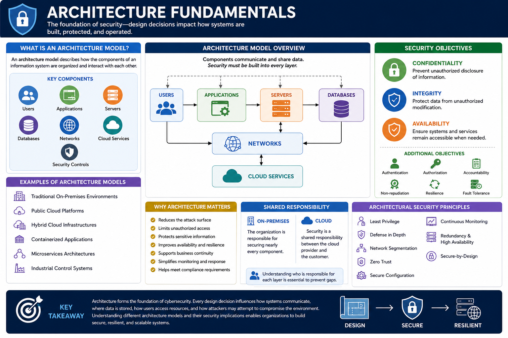
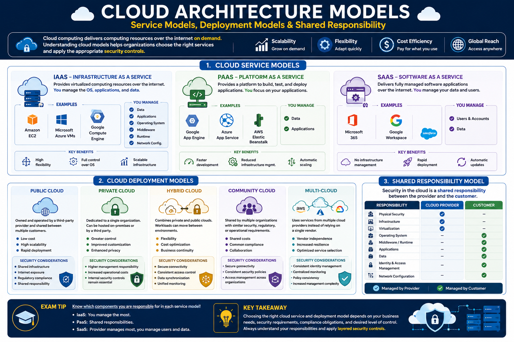
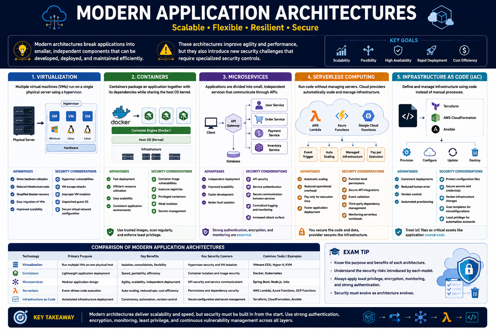
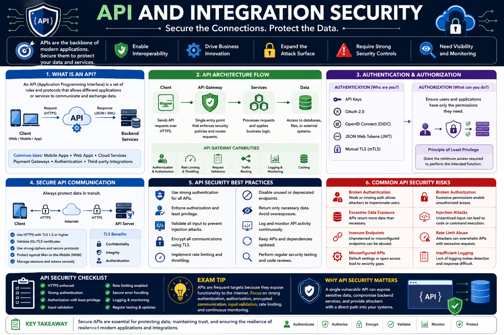
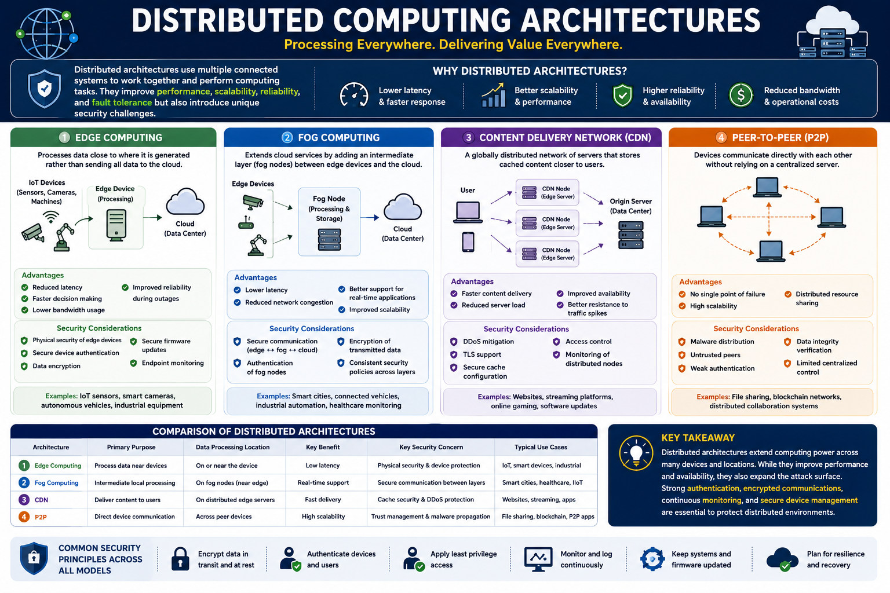
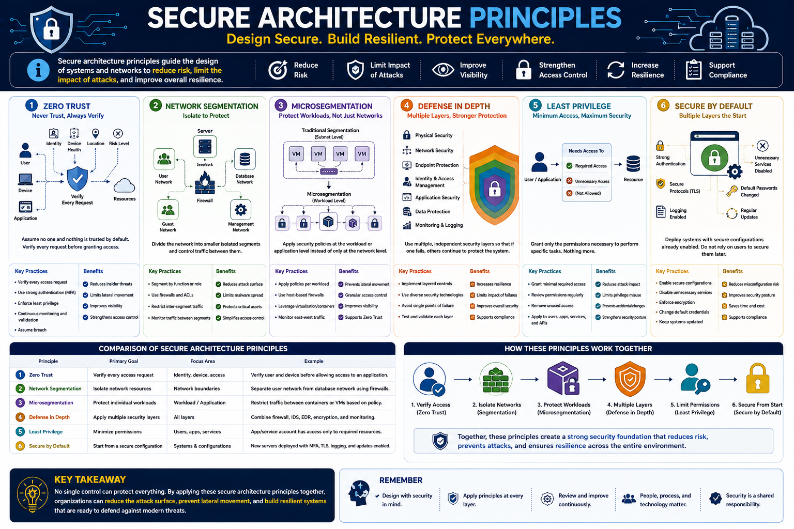

# Lesson 08: Explain the Security Implications of Different Architecture Models

## 1. Architecture Fundamentals

Modern organizations depend on a variety of computing architectures to deliver applications, store data, connect users, and support business operations. The way these systems are designed has a direct impact on their security, scalability, availability, and resilience against cyberattacks.

A well-designed architecture minimizes risk by reducing the attack surface, isolating critical assets, enforcing access controls, and providing multiple layers of defense. Conversely, poor architectural decisions can expose sensitive data, increase complexity, and create opportunities for attackers.

---

### What Is an Architecture Model?

An **architecture model** describes how the components of an information system are organized and interact with one another.

These components may include:

- Users
- Applications
- Servers
- Databases
- Networks
- Cloud services
- Security controls

An architecture model defines where these components are located, how they communicate, and how security responsibilities are distributed throughout the environment.

Examples include:

- Traditional on-premises environments
- Public cloud platforms
- Hybrid cloud infrastructures
- Containerized applications
- Microservices
- Industrial control systems

Each architecture introduces different security risks and requires different security controls.

---

### Why Architecture Matters

Security is not achieved only by installing security products such as firewalls or antivirus software. It begins with the overall design of the environment.

A secure architecture helps organizations:

- Reduce the attack surface
- Limit unauthorized access
- Protect sensitive information
- Improve system availability
- Support business continuity
- Simplify monitoring and incident response
- Meet regulatory and compliance requirements

Poor architectural decisions may lead to:

- Single points of failure
- Excessive privileges
- Weak network isolation
- Data exposure
- Increased attack paths
- Difficult security management

---

### Security Objectives in Architecture

Every architecture should support the fundamental objectives of cybersecurity.

These objectives include:

- **Confidentiality** – Prevent unauthorized disclosure of information.
- **Integrity** – Protect data from unauthorized modification.
- **Availability** – Ensure systems and services remain accessible when needed.

Additional security objectives often include:

- Authentication
- Authorization
- Accountability
- Non-repudiation
- Resilience
- Fault tolerance

Security architects must balance these objectives with business requirements, performance, and cost.

---

### Shared Responsibility

Modern architectures often involve multiple parties that share responsibility for security.

For example:

- In an **on-premises** environment, the organization is responsible for securing nearly every component.
- In a **cloud** environment, some responsibilities belong to the cloud provider, while others remain the customer's responsibility.

Understanding who is responsible for securing each layer is essential for preventing security gaps.

The exact division of responsibilities depends on the architecture model and the services being used.

---

### Architectural Security Principles

Although architecture models differ, several security principles apply to all environments.

These principles include:

- Least Privilege
- Defense in Depth
- Network Segmentation
- Zero Trust
- Secure Configuration
- Continuous Monitoring
- Redundancy and High Availability
- Secure-by-Design

These principles reduce organizational risk regardless of the underlying technology.

---

### Key Takeaway

Architecture forms the foundation of cybersecurity. Every design decision influences how systems communicate, where data is stored, how users access resources, and how attackers may attempt to compromise the environment. Understanding different architecture models and their security implications enables organizations to build secure, resilient, and scalable systems.

---
## 2. Cloud Architecture Models

Cloud computing has transformed the way organizations build, deploy, and manage IT infrastructure. Instead of owning and maintaining all hardware and software internally, organizations can consume computing resources as services delivered over the Internet.

Cloud architectures improve scalability, flexibility, availability, and cost efficiency. However, they also introduce new security challenges, including shared responsibility, data protection, identity management, and cloud misconfigurations.

Understanding the different cloud deployment models is essential for selecting appropriate security controls.

---

### On-Premises

An **on-premises** architecture stores and manages all infrastructure within the organization's own facilities.

The organization owns and operates:

- Servers
- Storage
- Networking equipment
- Security appliances
- Applications
- Data centers

#### Advantages

- Full control over infrastructure
- Greater customization
- Complete control of sensitive data
- Easier compliance with certain regulations

#### Security Challenges

- High maintenance costs
- Responsibility for all security controls
- Hardware lifecycle management
- Patch management
- Physical security
- Disaster recovery planning

---

### Private Cloud

A **private cloud** is dedicated to a single organization.

It may be hosted:

- On-premises
- By a third-party provider

Unlike a public cloud, its resources are not shared with other organizations.

#### Advantages

- Greater privacy
- Increased administrative control
- Better compliance support
- Custom security policies

#### Security Considerations

- Higher operational costs
- Internal security management remains essential
- Proper access control and monitoring are still required

---

### Public Cloud

A **public cloud** is owned and operated by a cloud service provider that delivers services to multiple customers over the Internet.

Examples include:

- Amazon Web Services (AWS)
- Microsoft Azure
- Google Cloud Platform (GCP)

Customers share the provider's physical infrastructure while maintaining logical separation of their resources.

#### Advantages

- Rapid scalability
- Lower upfront costs
- High availability
- Global accessibility
- Managed infrastructure

#### Security Challenges

- Misconfigured cloud resources
- Excessive IAM permissions
- Exposed storage buckets
- Data residency concerns
- Multi-tenant environments

---

### Community Cloud

A **community cloud** is shared by several organizations that have similar operational or regulatory requirements.

Examples include:

- Government agencies
- Healthcare organizations
- Educational institutions

Organizations share infrastructure while maintaining policies that address their common security and compliance needs.

#### Advantages

- Shared costs
- Common compliance standards
- Improved collaboration

#### Security Challenges

- Shared governance
- Trust between participating organizations
- Consistent security policy enforcement

---

### Hybrid Cloud

A **hybrid cloud** combines on-premises infrastructure with one or more cloud environments.

Organizations may keep sensitive workloads on-premises while moving less sensitive services to the cloud.

#### Advantages

- Greater flexibility
- Improved disaster recovery
- Cost optimization
- Easier migration to cloud services

#### Security Challenges

- Securing data moving between environments
- Consistent identity management
- Secure network connectivity
- Centralized monitoring
- Policy consistency

---

### Multi-Cloud

A **multi-cloud** architecture uses services from multiple cloud providers.

For example, an organization may use AWS for storage, Azure for identity services, and Google Cloud for machine learning workloads.

#### Advantages

- Reduced vendor lock-in
- Improved resilience
- Best-of-breed services
- Geographic flexibility

#### Security Challenges

- Different security models
- Multiple IAM systems
- Increased management complexity
- Consistent policy enforcement across providers

---

### Shared Responsibility Model

One of the most important concepts in cloud security is the **Shared Responsibility Model**.

Security responsibilities are divided between the cloud provider and the customer.

Generally:

**Cloud Provider Responsibilities**

- Physical data center security
- Hardware
- Networking infrastructure
- Hypervisor security
- Core cloud services

**Customer Responsibilities**

- Identity and Access Management (IAM)
- User accounts
- Data protection
- Encryption
- Operating systems (depending on the service)
- Applications
- Security configuration
- Access permissions

The exact division of responsibilities depends on the cloud service model (IaaS, PaaS, or SaaS), but customers are always responsible for protecting their own data and properly configuring the services they use.

---

### Key Takeaway

Cloud architecture provides scalability, flexibility, and operational efficiency, but it also changes how security responsibilities are managed. Organizations must understand the differences between deployment models and apply appropriate security controls to protect identities, data, workloads, and cloud resources while fulfilling their responsibilities under the Shared Responsibility Model.

---
## 3. Modern Application Architectures

Modern applications are no longer built as large, monolithic systems running on a single physical server. Organizations increasingly adopt flexible architectures that improve scalability, availability, deployment speed, and resource utilization.

While these architectures provide significant operational benefits, they also introduce new security challenges that require specialized protections.

---

### Virtualization

Virtualization allows multiple **Virtual Machines (VMs)** to run on a single physical server through a software layer called a **hypervisor**.

Each virtual machine operates as an independent system with its own operating system, applications, and resources.

#### Advantages

- Better hardware utilization
- Reduced infrastructure costs
- Easier disaster recovery
- Simplified testing and development
- Improved scalability

#### Security Considerations

- Hypervisor vulnerabilities
- VM Escape attacks
- Improper VM isolation
- Snapshot exposure
- Resource exhaustion
- Unpatched virtual machines

#### Best Practices

- Keep hypervisors updated
- Apply security patches regularly
- Restrict administrative access
- Encrypt VM images and snapshots
- Continuously monitor virtual environments

---

### Containers

Containers package an application together with its required libraries and dependencies while sharing the host operating system kernel.

Unlike virtual machines, containers do not require a complete guest operating system, making them lightweight and fast to deploy.

Popular container platforms include Docker and Kubernetes.

#### Advantages

- Fast deployment
- Efficient resource utilization
- High portability
- Simplified application scaling
- Consistent execution across environments

#### Security Considerations

- Vulnerable container images
- Container breakout attacks
- Misconfigured orchestration platforms
- Excessive container privileges
- Insecure container registries

#### Best Practices

- Use trusted container images
- Scan images for vulnerabilities
- Run containers with least privilege
- Keep container runtimes updated
- Restrict access to container registries

---

### Microservices

A **microservices architecture** divides an application into many small, independent services.

Each service performs a specific business function and communicates with other services through APIs.

Because services are independent, they can be updated, scaled, and deployed separately.

#### Advantages

- Independent deployment
- Improved scalability
- Better fault isolation
- Faster software development
- Easier maintenance

#### Security Considerations

- Increased API exposure
- Service-to-service authentication
- Distributed identity management
- Secure communication between services
- Consistent security policies

#### Best Practices

- Secure every API
- Encrypt service communications
- Implement strong authentication
- Apply Zero Trust principles
- Continuously monitor service interactions

---

### Serverless Computing

Serverless computing allows developers to run code without managing servers.

The cloud provider automatically provisions, scales, and manages the underlying infrastructure.

Developers focus only on writing application code.

Examples include:

- AWS Lambda
- Azure Functions
- Google Cloud Functions

#### Advantages

- Automatic scaling
- Reduced operational overhead
- Pay-for-use pricing
- Faster application deployment

#### Security Considerations

- Excessive function permissions
- Insecure event triggers
- Dependency vulnerabilities
- Sensitive environment variables
- Third-party integrations

#### Best Practices

- Apply Least Privilege
- Secure function permissions
- Protect secrets using dedicated secret-management services
- Monitor function activity
- Keep dependencies updated

---

### Infrastructure as Code (IaC)

Infrastructure as Code (IaC) manages infrastructure through configuration files rather than manual administration.

Resources such as servers, networks, storage, and cloud services are automatically created using code.

Common IaC tools include:

- Terraform
- AWS CloudFormation
- Ansible

#### Advantages

- Consistent deployments
- Reduced human error
- Faster provisioning
- Easier infrastructure management
- Version-controlled configurations

#### Security Considerations

- Hardcoded credentials
- Misconfigured infrastructure
- Exposed configuration files
- Insecure automation pipelines
- Unauthorized code modifications

#### Best Practices

- Store secrets securely
- Review IaC templates before deployment
- Scan configuration files for security issues
- Apply version control
- Restrict modification privileges

---

### Key Takeaway

Modern application architectures improve flexibility, scalability, and deployment speed but also expand the attack surface. Securing virtual machines, containers, microservices, serverless workloads, and Infrastructure as Code requires strong identity management, secure configurations, continuous monitoring, and automated security practices throughout the application lifecycle.

---
## 4. API and Integration Security

Modern applications rarely operate in isolation. Instead, they exchange data and services through **Application Programming Interfaces (APIs)**. APIs enable communication between web applications, mobile apps, cloud services, databases, and third-party systems.

While APIs improve interoperability and automation, they also expose new attack surfaces. Poorly secured APIs can allow attackers to access sensitive data, bypass authentication, or compromise backend systems.

---

### Application Programming Interfaces (APIs)

An **Application Programming Interface (API)** is a set of rules that allows different software applications to communicate with each other.

Instead of directly accessing a database or internal application logic, clients send requests to an API, which processes the request and returns an appropriate response.

Common API types include:

- REST APIs
- SOAP APIs
- GraphQL APIs
- gRPC APIs

APIs are widely used in:

- Mobile applications
- Web applications
- Cloud services
- IoT devices
- Microservices
- Third-party integrations

---

### API Gateway

An **API Gateway** acts as a centralized entry point for API requests.

Rather than exposing multiple backend services directly to clients, requests pass through the gateway, which applies security controls before forwarding traffic.

Common responsibilities include:

- Authentication
- Authorization
- Request routing
- Traffic management
- Rate limiting
- Logging and monitoring

Using an API Gateway reduces the attack surface and simplifies API management.

---

### Authentication

Authentication verifies the identity of users, applications, or services before allowing access to an API.

Common authentication methods include:

- API Keys
- OAuth 2.0
- OpenID Connect (OIDC)
- JSON Web Tokens (JWT)
- Multi-Factor Authentication (MFA)
- Mutual TLS (mTLS)

Weak authentication mechanisms may allow unauthorized access to protected resources.

#### Best Practices

- Require strong authentication
- Rotate credentials regularly
- Protect API keys
- Use short-lived access tokens
- Enable MFA where appropriate

---

### Authorization

Authentication answers the question **"Who are you?"**, while authorization answers **"What are you allowed to do?"**

Proper authorization ensures that authenticated users can access only the resources they are permitted to use.

Common authorization models include:

- Role-Based Access Control (RBAC)
- Attribute-Based Access Control (ABAC)
- Least Privilege

Improper authorization can lead to excessive permissions and unauthorized data access.

---

### Rate Limiting

Rate limiting restricts the number of requests a client can send within a specific time period.

Without rate limiting, attackers may attempt:

- Brute-force attacks
- Credential stuffing
- API abuse
- Denial-of-Service (DoS) attacks
- Resource exhaustion

Rate limiting improves both security and service availability.

---

### Input Validation

APIs should never trust client-provided input.

Improper input validation may allow attackers to exploit vulnerabilities such as:

- SQL Injection
- Command Injection
- Cross-Site Scripting (XSS)
- Buffer Overflow
- Path Traversal

#### Best Practices

- Validate all user input
- Sanitize untrusted data
- Use parameterized queries
- Reject malformed requests
- Validate data types, lengths, and formats

---

### API Security Best Practices

Organizations should implement multiple security controls to protect APIs.

Recommended practices include:

- Encrypt communications using HTTPS/TLS
- Implement strong authentication and authorization
- Validate all input
- Apply rate limiting
- Log and monitor API activity
- Disable unused API endpoints
- Keep API software updated
- Regularly perform API security testing

---

### Key Takeaway

APIs are essential components of modern architectures, enabling communication between applications, cloud services, and distributed systems. Because they expose critical functionality over the network, they must be protected through strong authentication, proper authorization, input validation, encrypted communications, continuous monitoring, and secure API management.

---
## 5. Distributed Computing Architectures

Distributed computing architectures place computing resources across multiple locations rather than relying on a single centralized system. By distributing processing, storage, and network services closer to users or devices, organizations can improve performance, scalability, and resilience.

However, distributing resources also increases the number of systems that must be secured, monitored, and maintained.

---

### Edge Computing

Edge computing processes data close to where it is generated instead of sending everything to a centralized cloud or data center.

Examples include:

- Smart factories
- Autonomous vehicles
- Surveillance cameras
- Industrial sensors
- Smart cities

#### Advantages

- Lower latency
- Reduced bandwidth usage
- Faster decision making
- Improved reliability when network connectivity is limited

#### Security Considerations

- Physical access to edge devices
- Limited security capabilities
- Inconsistent patch management
- Increased attack surface
- Data protection at remote locations

#### Best Practices

- Encrypt data at rest and in transit
- Secure device authentication
- Regularly update edge devices
- Monitor edge infrastructure continuously
- Restrict physical access

---

### Fog Computing

Fog computing extends cloud computing by placing intermediate processing nodes between edge devices and centralized cloud services.

Instead of sending all data directly to the cloud, nearby fog nodes perform preprocessing, filtering, or analysis before forwarding information.

#### Advantages

- Reduced latency
- Lower bandwidth consumption
- Improved scalability
- Faster local processing

#### Security Considerations

- Additional infrastructure to secure
- Secure communication between fog nodes
- Identity management
- Data integrity during transmission

#### Best Practices

- Encrypt communications
- Authenticate connected devices
- Apply secure configuration baselines
- Monitor fog infrastructure

---

### Content Delivery Network (CDN)

A **Content Delivery Network (CDN)** is a geographically distributed network of servers that stores cached copies of web content closer to users.

CDNs improve website performance by reducing latency and distributing traffic across multiple servers.

#### Advantages

- Faster content delivery
- Reduced server load
- Improved availability
- Better resistance against traffic spikes

#### Security Considerations

- Cache poisoning attacks
- Distributed Denial-of-Service (DDoS) attacks
- Misconfigured CDN settings
- Exposure of sensitive cached content

#### Best Practices

- Encrypt communications using HTTPS
- Configure cache policies carefully
- Enable DDoS protection
- Restrict access to sensitive content

---

### Peer-to-Peer (P2P)

A **Peer-to-Peer (P2P)** architecture allows systems to communicate directly with one another without relying on a centralized server.

Each device can function as both a client and a server.

Common examples include:

- File-sharing applications
- Blockchain networks
- Distributed collaboration systems

#### Advantages

- High scalability
- No single point of failure
- Distributed resource sharing
- Improved resilience

#### Security Considerations

- Malware distribution
- Untrusted peers
- Data integrity risks
- Difficulty enforcing centralized security policies

#### Best Practices

- Verify peer identities
- Encrypt communications
- Validate shared data
- Continuously monitor network activity

---

### Key Takeaway

Distributed computing architectures improve performance, scalability, and availability by distributing computing resources across multiple locations. However, they also expand the attack surface and require strong authentication, encrypted communications, continuous monitoring, and effective device management to maintain a secure environment.

---
## 6. Operational and Industrial Architectures

Modern organizations increasingly rely on connected devices and industrial systems to automate processes, monitor equipment, and improve operational efficiency. While these technologies enhance productivity, they also introduce unique security challenges because many were originally designed with functionality and reliability in mind rather than cybersecurity.

Unlike traditional IT systems, operational technologies often control physical processes, meaning successful cyberattacks can have real-world consequences such as equipment damage, production downtime, or safety hazards.

---

### Internet of Things (IoT)

The **Internet of Things (IoT)** refers to physical devices connected to a network that collect, process, and exchange data.

Examples include:

- Smart home devices
- IP cameras
- Smart thermostats
- Wearable devices
- Industrial sensors
- Connected medical devices

#### Advantages

- Automation
- Real-time monitoring
- Improved efficiency
- Remote management
- Data-driven decision making

#### Security Considerations

- Weak or default passwords
- Outdated firmware
- Insecure communication
- Limited computing resources
- Large attack surface
- Poor patch management

#### Best Practices

- Change default credentials
- Keep firmware updated
- Encrypt communications
- Disable unnecessary services
- Continuously monitor connected devices

---

### Operational Technology (OT)

**Operational Technology (OT)** consists of hardware and software used to monitor and control industrial processes.

Unlike traditional Information Technology (IT), which focuses on processing and storing information, OT directly interacts with physical equipment.

Examples include:

- Manufacturing systems
- Power plants
- Water treatment facilities
- Transportation systems
- Oil and gas facilities

#### Security Considerations

- Legacy systems
- Limited patching opportunities
- High availability requirements
- Physical safety concerns
- Long equipment lifecycles

#### Best Practices

- Network segmentation
- Strict access control
- Continuous monitoring
- Regular risk assessments
- Secure remote access

---

### Industrial Control Systems (ICS)

An **Industrial Control System (ICS)** is a collection of control systems used to automate industrial operations.

ICS environments commonly include:

- Programmable Logic Controllers (PLCs)
- Human-Machine Interfaces (HMIs)
- Sensors
- Actuators
- Supervisory systems

ICS environments prioritize:

- Safety
- Reliability
- Continuous operation

#### Security Considerations

- Legacy operating systems
- Weak authentication
- Insecure industrial protocols
- Insider threats
- Malware targeting industrial environments

#### Best Practices

- Isolate ICS networks
- Restrict administrative access
- Monitor industrial traffic
- Maintain secure backups
- Apply vendor-approved updates

---

### SCADA Systems

**Supervisory Control and Data Acquisition (SCADA)** systems are specialized Industrial Control Systems that monitor and control geographically distributed industrial assets.

Examples include:

- Electrical grids
- Water distribution systems
- Pipelines
- Railway infrastructure

SCADA systems collect operational data from remote locations and allow operators to monitor and control industrial processes from centralized control centers.

#### Security Considerations

- Remote communication links
- Legacy protocols
- Unauthorized remote access
- Critical infrastructure targeting
- Availability attacks

#### Best Practices

- Encrypt remote communications
- Implement strong authentication
- Segment SCADA networks
- Continuously monitor system activity
- Restrict remote administration

---

### Embedded Systems

An **embedded system** is a specialized computer designed to perform a dedicated function within a larger device.

Unlike general-purpose computers, embedded systems are optimized for specific tasks.

Examples include:

- Medical devices
- Automotive control systems
- Smart appliances
- Industrial controllers
- Network equipment

#### Security Considerations

- Limited security features
- Hardcoded credentials
- Outdated firmware
- Physical tampering
- Long product lifecycles

#### Best Practices

- Secure firmware updates
- Verify software integrity
- Disable unnecessary interfaces
- Protect against physical access
- Replace unsupported devices

---

### Key Takeaway

Operational and industrial architectures extend cybersecurity beyond traditional IT environments into physical systems that support critical infrastructure and industrial operations. Because attacks against IoT, OT, ICS, SCADA, and embedded systems can disrupt essential services and impact human safety, these environments require strong access controls, secure network segmentation, continuous monitoring, regular maintenance, and carefully managed updates.

---
## 7. Secure Architecture Principles

Regardless of the technologies an organization uses, secure architectures follow a set of fundamental design principles that reduce risk and improve resilience against cyberattacks.

These principles help organizations limit the attack surface, protect critical assets, and ensure that security is integrated into the architecture rather than added afterward.

---

### Zero Trust Architecture (ZTA)

Zero Trust is a security model based on the principle of **"Never Trust, Always Verify."**

Unlike traditional security models that automatically trust users or devices inside the network perimeter, Zero Trust assumes that every request may be malicious and requires continuous verification.

Core principles include:

- Verify every user and device
- Assume breach
- Enforce least privilege
- Continuously monitor activity
- Authenticate and authorize every request

#### Benefits

- Reduces lateral movement
- Limits insider threats
- Improves visibility
- Protects remote users
- Supports cloud and hybrid environments

#### Best Practices

- Multi-Factor Authentication (MFA)
- Identity verification
- Device health validation
- Continuous monitoring
- Least Privilege access

---

### Network Segmentation

Network segmentation divides a network into smaller, isolated security zones.

Instead of allowing unrestricted communication across the entire network, traffic is controlled between segments.

Examples include separating:

- User workstations
- Servers
- Guest networks
- IoT devices
- Industrial systems

#### Benefits

- Reduces attack surface
- Limits malware propagation
- Prevents lateral movement
- Improves monitoring
- Simplifies policy enforcement

#### Best Practices

- VLANs
- Firewalls
- Access Control Lists (ACLs)
- Internal firewalls
- Secure routing policies

---

### Microsegmentation

Microsegmentation extends traditional network segmentation by applying security controls at the workload or application level instead of only at the network level.

Each workload receives its own security policy regardless of its physical location.

Microsegmentation is commonly used in:

- Cloud environments
- Virtualized data centers
- Container platforms
- Zero Trust architectures

#### Benefits

- Fine-grained access control
- Reduced lateral movement
- Better visibility
- Improved workload isolation

#### Best Practices

- Identity-based policies
- Application-aware firewalls
- Continuous monitoring
- Least Privilege communication

---

### Defense in Depth

Defense in Depth is a layered security strategy that deploys multiple security controls throughout an environment.

Instead of relying on a single defense mechanism, organizations use overlapping protections so that if one control fails, others continue protecting the system.

Examples of security layers include:

- Physical security
- Network security
- Endpoint protection
- Identity and Access Management (IAM)
- Application security
- Data encryption
- Security monitoring

#### Benefits

- Multiple barriers against attackers
- Increased resilience
- Reduced single points of failure
- Improved incident detection

---

### High Availability

High Availability (HA) ensures that systems remain operational even when hardware, software, or network failures occur.

Critical services should continue operating with minimal interruption.

Common technologies include:

- Load balancing
- Failover clustering
- Redundant network links
- Backup power supplies
- Geographic redundancy

#### Security Considerations

- Protect backup systems
- Secure failover mechanisms
- Monitor redundant infrastructure
- Test disaster recovery procedures

---

### Redundancy

Redundancy involves deploying duplicate components so that a backup resource can immediately replace a failed component.

Examples include:

- Multiple servers
- Redundant storage
- Backup network connections
- Duplicate power supplies
- Multiple Internet Service Providers (ISPs)

Redundancy increases system resilience and reduces downtime caused by failures or cyberattacks.

---

### Key Takeaway

Secure architecture principles provide the foundation for protecting modern IT environments. Zero Trust, segmentation, layered security, high availability, and redundancy work together to reduce the attack surface, limit attacker movement, improve resilience, and ensure that critical services remain secure and available even during security incidents.

---
## 8. Architectural Best Practices

Building a secure architecture requires more than selecting the right technologies. Security must be integrated throughout the entire system lifecycle—from design and deployment to operation and maintenance.

Organizations should adopt security best practices that reduce risk, improve resilience, and ensure that systems remain protected as threats evolve.

---

### Principle of Least Privilege (PoLP)

The Principle of Least Privilege states that users, applications, and services should be granted only the minimum permissions required to perform their assigned tasks.

Excessive privileges increase the impact of compromised accounts and make lateral movement easier for attackers.

#### Best Practices

- Grant only necessary permissions
- Regularly review access rights
- Remove unused accounts
- Implement Role-Based Access Control (RBAC)
- Apply Just-In-Time (JIT) access when appropriate

---

### Secure by Design

Security should be incorporated during the design phase rather than added after deployment.

Architects should identify potential threats early and design systems that minimize security risks from the beginning.

Examples include:

- Threat modeling
- Secure architecture reviews
- Strong authentication
- Secure communication protocols
- Defense in Depth

Designing security into the architecture is generally more effective and less expensive than fixing vulnerabilities later.

---

### Secure by Default

Systems should be deployed with secure default configurations.

Users should not be required to enable essential security features manually.

Examples include:

- Strong default security settings
- Disabled unnecessary services
- Secure communication enabled by default
- Default-deny firewall rules
- Mandatory encryption where appropriate

Secure defaults reduce the likelihood of configuration errors.

---

### Continuous Monitoring

Architectures must be monitored continuously to detect security events, configuration changes, and suspicious activity.

Continuous monitoring provides visibility into the environment and enables rapid detection of attacks.

Common monitoring activities include:

- Security Information and Event Management (SIEM)
- Log collection
- Intrusion Detection Systems (IDS)
- Endpoint monitoring
- Network traffic analysis
- Cloud security monitoring

---

### Patch Management

Security vulnerabilities are discovered continuously.

Organizations should establish a structured patch management process to ensure operating systems, applications, firmware, and network devices receive security updates promptly.

An effective patch management process includes:

- Asset inventory
- Patch testing
- Risk-based prioritization
- Scheduled deployment
- Verification after installation

Timely patching significantly reduces exposure to known vulnerabilities.

---

### Asset Management

Organizations cannot secure assets they do not know exist.

Asset management involves maintaining an accurate inventory of hardware, software, cloud resources, virtual machines, IoT devices, and other technology assets.

An up-to-date inventory helps organizations:

- Identify unsupported systems
- Track software versions
- Prioritize vulnerability remediation
- Improve incident response
- Support compliance requirements

---

### Key Takeaway

Secure architectures are built on proven security practices rather than individual technologies. Applying Least Privilege, Secure by Design, Secure by Default, Continuous Monitoring, Patch Management, and effective Asset Management helps organizations reduce vulnerabilities, strengthen resilience, and maintain a strong security posture throughout the system lifecycle.