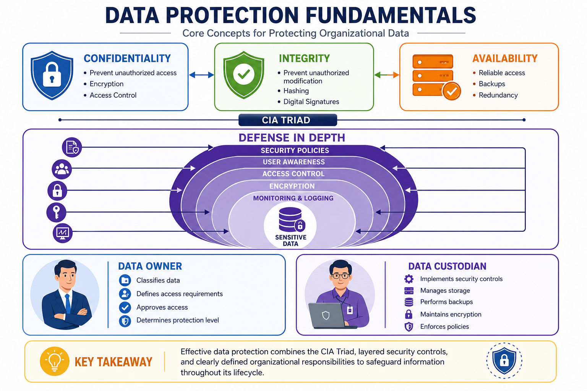
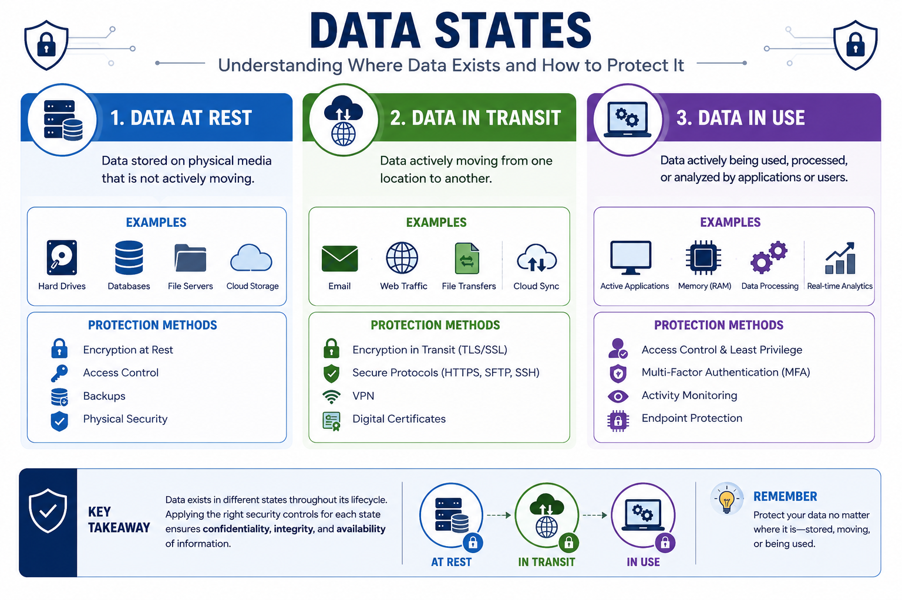
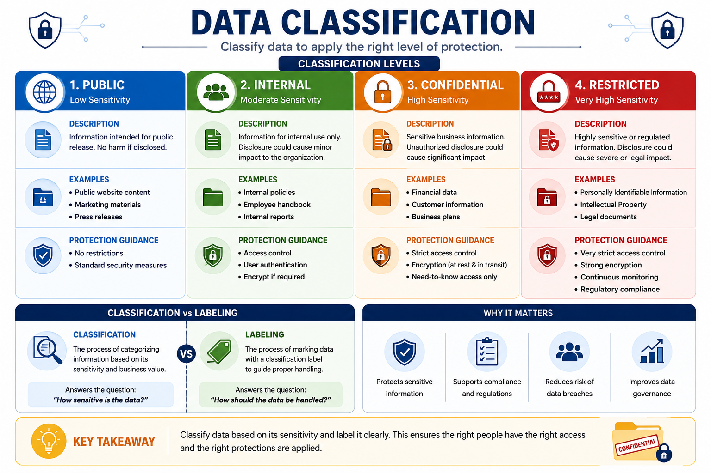
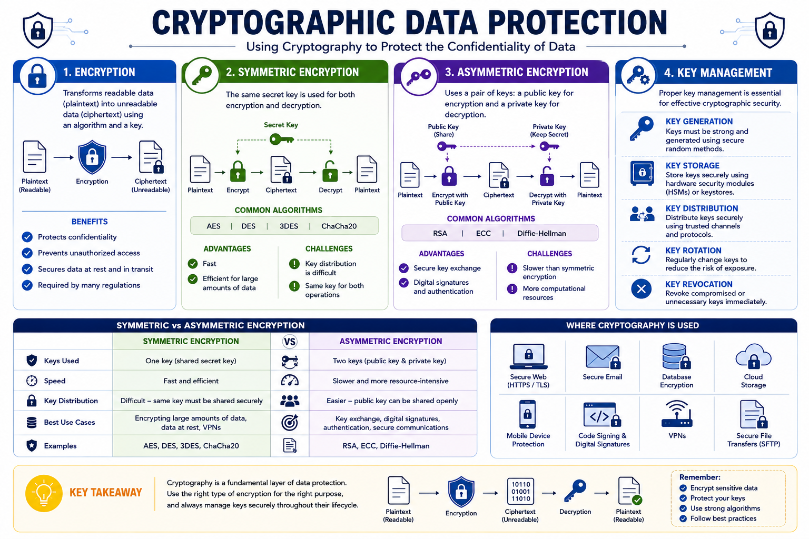
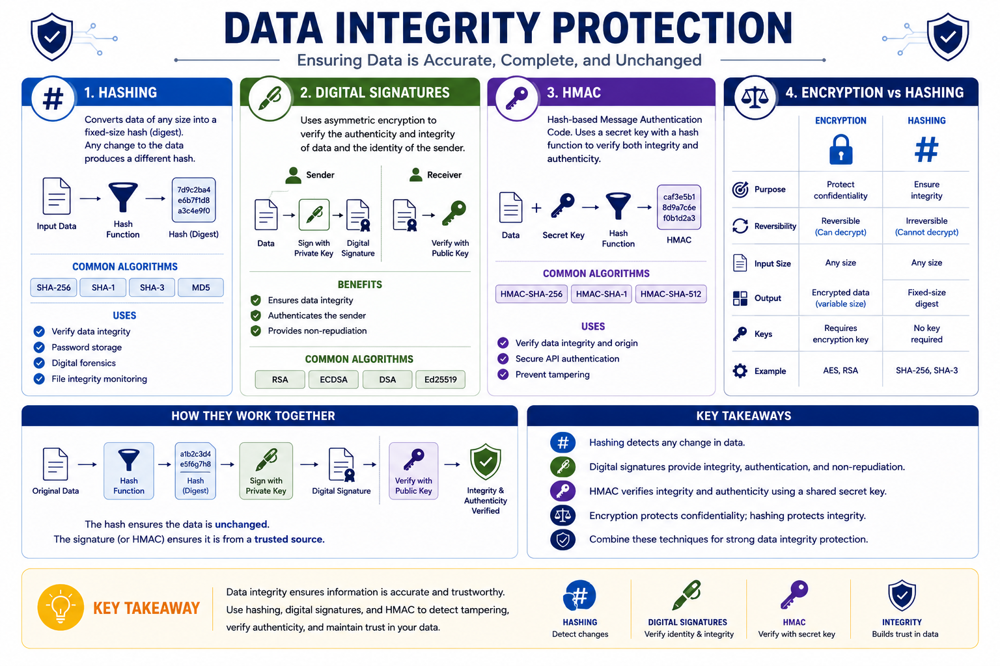
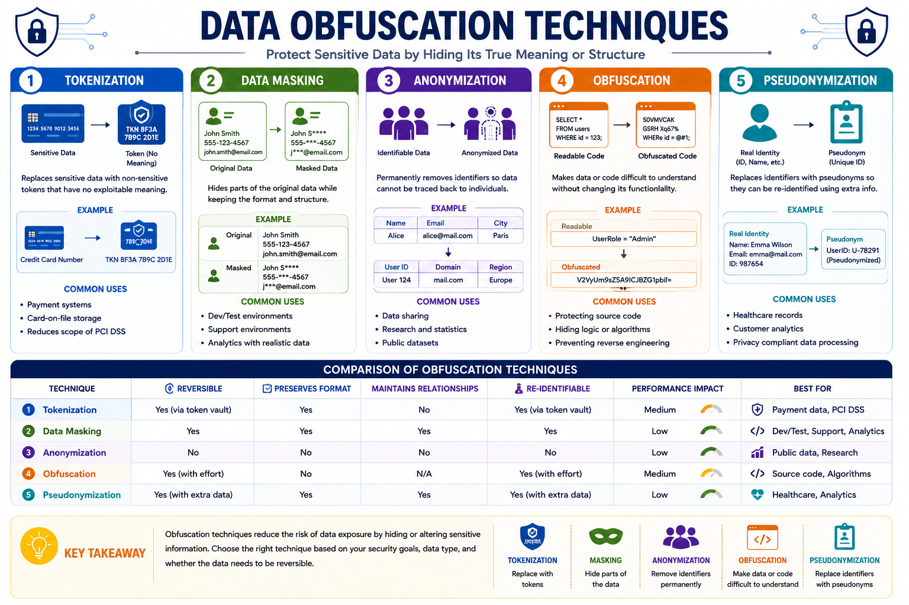
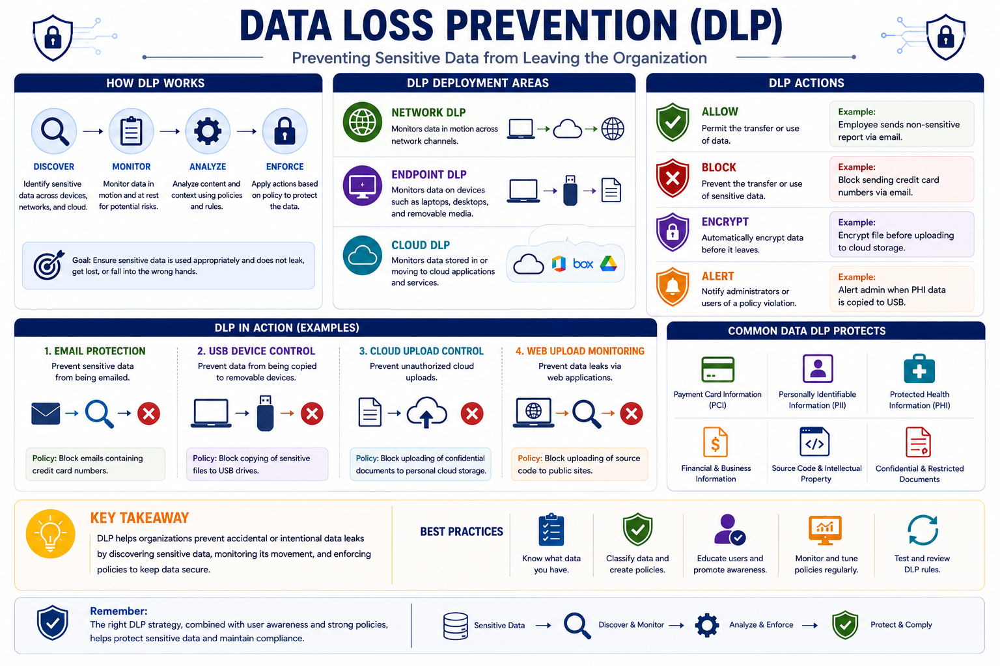
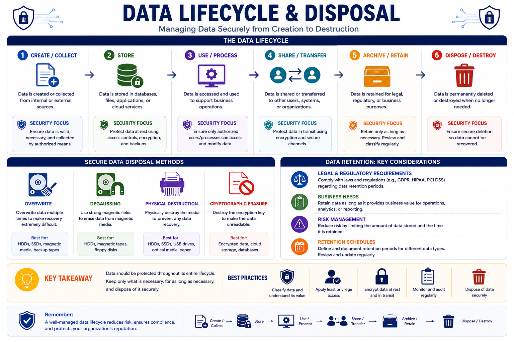

# Compare and Contrast Concepts and Strategies to Protect Data

## 1. Data Protection Fundamentals

### What is Data Protection?

Data protection is the practice of safeguarding information from unauthorized access, alteration, disclosure, destruction, or loss. It combines security technologies, organizational policies, and operational procedures to ensure that data remains protected throughout its entire lifecycle.

Effective data protection is essential because data is one of the most valuable assets of any organization. Whether the data belongs to customers, employees, or the business itself, compromising it can lead to financial losses, legal consequences, operational disruption, and reputational damage.

---

### The Objectives of Data Protection

The primary objective of data protection is to preserve the three pillars of the **CIA Triad**:

- **Confidentiality** ensures that only authorized individuals can access sensitive information.
- **Integrity** guarantees that data remains accurate, complete, and unaltered unless modified by an authorized entity.
- **Availability** ensures that authorized users can access data whenever it is needed.

Every security control used to protect data ultimately supports one or more of these three objectives.

---

### Layers of Data Protection

No single security control can fully protect data. Instead, organizations implement multiple layers of protection, commonly known as **Defense in Depth**.

Common protection mechanisms include:

- Access control
- Authentication and authorization
- Encryption
- Secure backups
- Data Loss Prevention (DLP)
- Security monitoring and logging
- Security policies and user awareness training

By combining multiple controls, organizations reduce the likelihood that a single failure will expose sensitive information.

---

### Data Owner vs. Data Custodian

Protecting data involves different responsibilities.

#### Data Owner

The Data Owner is responsible for the business value of the information.

Responsibilities include:

- Determining data classification
- Defining access requirements
- Approving who may access the data
- Establishing protection requirements

The Data Owner is typically a business manager or department head rather than an IT administrator.

#### Data Custodian (Data Steward)

The Data Custodian is responsible for implementing and maintaining the technical controls required to protect the data.

Responsibilities include:

- Managing storage systems
- Performing backups
- Implementing access permissions
- Maintaining encryption and security controls
- Ensuring compliance with organizational policies

The custodian follows the policies established by the Data Owner.

---

### Why Data Protection Matters

Strong data protection enables organizations to:

- Protect confidential and sensitive information.
- Reduce the risk of data breaches.
- Maintain customer trust.
- Meet legal and regulatory requirements.
- Support business continuity during incidents.
- Minimize financial and reputational damage.

As organizations increasingly rely on digital information, effective data protection becomes a fundamental component of cybersecurity rather than an optional security measure.

---

> **Key Takeaway**
>
> Data protection is a continuous process that combines people, policies, and technology to ensure the confidentiality, integrity, and availability of information throughout its entire lifecycle.

---
## 2. Data States

Data exists in different states throughout its lifecycle. Each state presents unique security challenges and requires specific protection mechanisms. Understanding these states helps security professionals apply the appropriate controls to protect sensitive information.

The three primary data states are:

- Data at Rest
- Data in Transit
- Data in Use

---

### Data at Rest

**Data at Rest** refers to data that is stored on a device or storage medium and is not actively being accessed or transmitted.

Examples include:

- Files stored on a hard drive or SSD
- Database records
- Backup files
- USB flash drives
- Cloud storage
- Archived documents

Since stored data can be stolen if storage devices are compromised, protecting data at rest is essential.

Common protection methods include:

- Full Disk Encryption (FDE)
- File and folder encryption
- Database encryption
- Strong access control permissions
- Secure backup storage
- Physical security of storage devices

**Example:**

A company's customer database stored on a server is considered **Data at Rest**. Encrypting the database ensures that even if the storage device is stolen, the information remains unreadable without the encryption key.

---

### Data in Transit

**Data in Transit** (also called **Data in Motion**) refers to data moving between devices, systems, applications, or networks.

Examples include:

- Sending an email
- Browsing a secure website (HTTPS)
- File transfers
- API communication
- Cloud synchronization
- Video conferencing

Data in transit is vulnerable to interception, eavesdropping, and Man-in-the-Middle (MitM) attacks.

Common protection methods include:

- TLS/SSL
- VPNs
- SSH
- Secure file transfer protocols (SFTP, SCP)
- End-to-end encryption

**Example:**

When a user logs into an online banking website using HTTPS, the transmitted credentials are protected using TLS encryption.

---

### Data in Use

**Data in Use** refers to data that is actively being processed, viewed, modified, or accessed by an application or user.

Examples include:

- A document being edited
- Information displayed on a screen
- Data loaded into RAM
- Records being processed by a database server

Unlike stored or transmitted data, data in use is typically decrypted so that applications can process it, making it a common target for malware and memory-based attacks.

Common protection methods include:

- Least Privilege
- Application security
- Endpoint Detection and Response (EDR)
- Memory protection technologies
- Trusted Execution Environments (TEE)
- Secure authentication and session management

**Example:**

When an employee opens an encrypted spreadsheet and begins editing it, the spreadsheet becomes **Data in Use** because the operating system decrypts it temporarily for processing.

---

### Comparison of Data States

| Data State | Description | Typical Protection |
|------------|-------------|--------------------|
| **Data at Rest** | Stored data | Disk encryption, access control, secure storage |
| **Data in Transit** | Data moving across networks | TLS, VPN, SSH, encrypted protocols |
| **Data in Use** | Data actively processed in memory | Least privilege, EDR, memory protection, secure applications |

---

> **Exam Tip**
>
> A common Security+ exam question asks you to identify the state of data in a scenario. Remember:
>
> - Stored → **Data at Rest**
> - Being transmitted → **Data in Transit**
> - Currently opened or processed → **Data in Use**

---
## 3. Data Classification

Not all data has the same level of sensitivity or business value. Data classification is the process of organizing information into categories based on its importance and the level of protection it requires.

A well-defined classification system helps organizations apply appropriate security controls, comply with regulations, and reduce the risk of unauthorized disclosure.

---

### Why Classify Data?

Data classification enables organizations to:

- Protect sensitive information appropriately.
- Apply consistent security policies.
- Control access based on sensitivity.
- Meet legal and regulatory requirements.
- Reduce the impact of data breaches.
- Improve data management throughout its lifecycle.

Without classification, organizations may overprotect low-value data or fail to adequately secure critical information.

---

### Common Classification Levels

Although classification schemes vary between organizations, the following levels are commonly used:

#### Public

Information intended for public release.

Examples include:

- Company websites
- Marketing materials
- Press releases
- Product catalogs

Public data requires little or no confidentiality protection but should still maintain integrity.

---

#### Internal

Information intended only for employees or authorized members of the organization.

Examples include:

- Internal policies
- Employee directories
- Standard operating procedures
- Organizational announcements

Disclosure may cause minor business impact but is generally not considered highly sensitive.

---

#### Confidential

Sensitive information that could negatively affect the organization if disclosed.

Examples include:

- Customer information
- Financial reports
- Employee records
- Business contracts
- Internal project documentation

Access should be restricted to authorized personnel with a legitimate business need.

---

#### Restricted (Highly Confidential)

The most sensitive category of information.

Examples include:

- Encryption keys
- Trade secrets
- National security information
- Critical intellectual property
- Authentication databases

Unauthorized disclosure could result in severe financial, operational, or legal consequences. This information requires the strongest security controls.

---

### Data Labeling

Once information is classified, it should be clearly labeled to indicate its sensitivity.

Labels help users understand how information should be handled and protected.

Examples include:

- Public
- Internal
- Confidential
- Restricted

Labels may appear on documents, emails, databases, file metadata, or digital records.

---

### Handling Classified Data

Different classifications require different security controls.

Examples include:

- Encrypting confidential data.
- Restricting access using the principle of least privilege.
- Logging access to sensitive information.
- Applying Data Loss Prevention (DLP) policies.
- Securely destroying classified information when it is no longer needed.

Higher classification levels generally require stronger protection mechanisms.

---

### Classification vs. Labeling

Although closely related, these terms have different meanings.

- **Data Classification** determines the sensitivity level of information.
- **Data Labeling** applies a visible or digital marker that identifies the classification.

Classification is the decision-making process, while labeling communicates that decision to users and security systems.

---

> **Exam Tip**
>
> Remember the distinction:
>
> - **Classification** determines how sensitive data is.
> - **Labeling** identifies that classification so users and security controls know how the data should be handled.

---
## 4. Cryptographic Data Protection

Cryptography is one of the most effective methods for protecting sensitive data. It uses mathematical algorithms to secure information against unauthorized access while ensuring confidentiality, integrity, authentication, and non-repudiation.

Modern organizations rely on cryptographic techniques to protect data stored on devices, transmitted across networks, and processed by applications.

---

### Encryption

Encryption is the process of converting readable data (**plaintext**) into an unreadable format (**ciphertext**) using a cryptographic algorithm and an encryption key.

Only someone with the correct decryption key can restore the ciphertext back to its original plaintext.

Encryption primarily protects **confidentiality**.

**Common uses include:**

- Full disk encryption
- Secure web communication (HTTPS)
- VPN connections
- Encrypted email
- Cloud storage encryption

---

### Symmetric Encryption

Symmetric encryption uses the **same key** for both encryption and decryption.

Because only one key is used, symmetric encryption is generally much faster than asymmetric encryption, making it ideal for encrypting large amounts of data.

**Advantages**

- Fast performance
- Efficient for large files
- Lower computational overhead

**Disadvantages**

- Secure key distribution is difficult.
- Anyone who obtains the shared key can decrypt the data.

**Common algorithms**

- AES (Advanced Encryption Standard)
- ChaCha20

---

### Asymmetric Encryption

Asymmetric encryption uses **two mathematically related keys**:

- **Public Key** – Shared with anyone.
- **Private Key** – Kept secret by the owner.

Data encrypted with one key can only be decrypted with the other.

Asymmetric encryption is slower than symmetric encryption but solves the problem of securely exchanging encryption keys.

**Common uses**

- Secure key exchange
- Digital certificates
- Digital signatures
- Public Key Infrastructure (PKI)

**Common algorithms**

- RSA
- ECC (Elliptic Curve Cryptography)

---

### Symmetric vs. Asymmetric Encryption

| Feature | Symmetric | Asymmetric |
|----------|-----------|------------|
| Keys Used | One shared key | Public and private keys |
| Speed | Fast | Slower |
| Best For | Encrypting data | Key exchange and authentication |
| Examples | AES, ChaCha20 | RSA, ECC |

---

### Key Management

Encryption is only as secure as the protection of its keys.

Key management refers to the processes used to generate, distribute, store, rotate, revoke, and destroy cryptographic keys.

Good key management practices include:

- Using strong, randomly generated keys.
- Protecting private keys from unauthorized access.
- Rotating keys regularly.
- Revoking compromised keys immediately.
- Storing keys in secure hardware such as Hardware Security Modules (HSMs).

Poor key management can completely undermine otherwise strong encryption.

---

> **Exam Tip**
>
> A common Security+ question asks which encryption type should be used in a scenario:
>
> - **Symmetric encryption** is best for protecting large amounts of data because it is fast.
> - **Asymmetric encryption** is best for secure key exchange, authentication, and digital signatures because it uses a public/private key pair.

---
## 5. Data Integrity Protection

While encryption protects the confidentiality of data, organizations also need to ensure that information has not been altered, whether intentionally or accidentally. Data integrity protection provides mechanisms to verify that data remains accurate, complete, and authentic throughout its lifecycle.

The most common techniques used to protect data integrity are hashing, digital signatures, and Hash-based Message Authentication Codes (HMACs).

---

### Hashing

Hashing is the process of converting data of any size into a fixed-length value called a **hash** or **message digest**.

Unlike encryption, hashing is a **one-way function**, meaning the original data cannot be recovered from the hash.

Hashing is primarily used to verify data integrity rather than protect confidentiality.

**Common uses include:**

- Password storage
- File integrity verification
- Digital signatures
- Software download verification

If even a single bit of the original data changes, the resulting hash value changes completely.

---

### Characteristics of Cryptographic Hash Functions

A secure cryptographic hash function should have the following properties:

- Deterministic (the same input always produces the same output).
- One-way (the original data cannot be reconstructed).
- Fast to compute.
- Collision-resistant (it is extremely difficult for two different inputs to produce the same hash).
- Highly sensitive to input changes.

---

### Common Hashing Algorithms

Some hashing algorithms are considered secure, while others are no longer recommended.

**Recommended algorithms:**

- SHA-256
- SHA-384
- SHA-512

**Deprecated algorithms:**

- MD5
- SHA-1

Although MD5 and SHA-1 may still be encountered in legacy systems, they should not be used for modern security applications because they are vulnerable to collision attacks.

---

### Digital Signatures

A digital signature is a cryptographic mechanism that verifies both the authenticity and integrity of data.

The sender creates a hash of the message and encrypts that hash using their **private key**. The recipient then uses the sender's **public key** to verify the signature.

Digital signatures provide:

- Authentication (verifies the sender's identity)
- Integrity (detects modifications)
- Non-repudiation (prevents the sender from denying they signed the message)

Digital signatures do **not** encrypt the actual data unless encryption is applied separately.

---

### Hash-based Message Authentication Code (HMAC)

An HMAC combines a cryptographic hash function with a shared secret key.

Unlike a standard hash, an HMAC verifies both:

- Data integrity
- Message authenticity

Because the secret key is required to generate the HMAC, attackers cannot create a valid HMAC without knowing the shared key.

HMACs are commonly used in:

- Secure APIs
- Authentication protocols
- Network communications
- Message verification

---

### Hashing vs. Encryption

Although both use cryptographic algorithms, they serve different purposes.

| Feature | Hashing | Encryption |
|---------|----------|------------|
| Purpose | Verify integrity | Protect confidentiality |
| Reversible | No | Yes (with the correct key) |
| Output | Fixed-length hash | Ciphertext |
| Keys Required | No | Yes |
| Common Uses | Passwords, integrity checks | Secure communication, data protection |

---

> **Exam Tip**
>
> Remember the difference:
>
> - **Encryption** protects data from unauthorized access.
> - **Hashing** verifies that data has not been modified.
> - **Digital Signatures** provide integrity, authentication, and non-repudiation.
> - **HMAC** combines hashing with a shared secret key to verify both integrity and authenticity.

---
## 6. Data Obfuscation Techniques

Data obfuscation techniques protect sensitive information by hiding or replacing its original values without necessarily encrypting it. These methods are commonly used in software development, testing environments, analytics, and regulatory compliance to reduce the risk of exposing confidential data.

Unlike encryption, some obfuscation techniques do not allow the original data to be recovered.

---

### Tokenization

Tokenization replaces sensitive data with a unique, non-sensitive value called a **token**.

The token has no meaningful value by itself and cannot reveal the original information. The relationship between the token and the original data is stored securely in a separate token vault.

Even if an attacker obtains the token, it cannot be used without access to the mapping database.

**Common uses include:**

- Credit card processing
- Payment systems
- Personally Identifiable Information (PII)
- Healthcare records

**Example:**

Instead of storing the credit card number:

`4532 9876 1234 5678`

The system stores:

`TKN-84F3A912`

Only the secure token vault can map the token back to the original card number.

---

### Data Masking

Data masking hides part or all of sensitive information while preserving its overall format.

The original data still exists, but only authorized users can view it in its complete form.

**Common uses include:**

- Customer support systems
- Employee databases
- Medical applications
- Testing environments

**Examples:**

- Credit Card: `**** **** **** 5678`
- Phone Number: `***-***-1234`
- Email: `j***@company.com`

Masking protects sensitive information while allowing users to identify the correct record.

---

### Anonymization

Anonymization permanently removes or modifies identifying information so that individuals can no longer be identified.

Unlike masking or tokenization, anonymization is generally **irreversible**.

This technique is widely used when organizations need to share or analyze data without exposing personal identities.

**Common uses include:**

- Research datasets
- Medical studies
- Public statistics
- Machine learning datasets

---

### Obfuscation

Obfuscation intentionally makes data or code difficult for humans to understand while preserving its functionality.

Its goal is to increase the difficulty of analysis or reverse engineering rather than provide strong cryptographic protection.

**Common uses include:**

- Protecting application source code
- Software licensing
- Malware analysis resistance
- Intellectual property protection

Obfuscation should not be considered a replacement for encryption because determined attackers can often reverse it.

---

### Comparison of Obfuscation Techniques

| Technique | Reversible | Primary Purpose | Common Use |
|-----------|------------|-----------------|------------|
| Tokenization | Yes (through the token vault) | Replace sensitive values | Payment systems, PCI DSS |
| Data Masking | Usually Yes | Hide sensitive information from users | Customer support, testing |
| Anonymization | No | Remove personal identity | Research, analytics |
| Obfuscation | Depends | Make data or code difficult to understand | Software protection |

---

> **Exam Tip**
>
> These techniques serve different purposes:
>
> - **Tokenization** replaces sensitive data with meaningless tokens while preserving the original in a secure vault.
> - **Masking** hides part of the original data for display purposes.
> - **Anonymization** permanently removes identifying information.
> - **Obfuscation** makes data or code harder to interpret but is not a substitute for encryption.

---
## 7. Data Loss Prevention (DLP)

Data Loss Prevention (DLP) is a security strategy that prevents sensitive information from being accidentally or intentionally exposed, leaked, or transferred to unauthorized individuals.

DLP solutions continuously monitor data movement and enforce security policies to ensure that confidential information remains protected regardless of where it is stored or transmitted.

Organizations use DLP to protect sensitive assets such as:

- Personally Identifiable Information (PII)
- Protected Health Information (PHI)
- Financial records
- Intellectual property
- Customer databases
- Confidential business documents

---

### How DLP Works

A DLP solution identifies sensitive information by inspecting the content of files, emails, databases, and network traffic.

Once sensitive data is detected, the system compares the activity against predefined security policies and automatically takes the appropriate action.

Possible actions include:

- Allow the transfer
- Block the transfer
- Encrypt the data
- Quarantine the file
- Alert administrators
- Log the activity for auditing

This automated approach helps reduce the risk of human error and insider threats.

---

### Types of DLP

Organizations typically deploy DLP solutions in three main areas.

#### Network DLP

Network DLP monitors data moving across the organization's network.

It can inspect:

- Email traffic
- Web uploads
- File transfers
- Network protocols
- Cloud communications

Its primary goal is to prevent sensitive information from leaving the organization's network without authorization.

---

#### Endpoint DLP

Endpoint DLP protects data on user devices such as laptops and desktop computers.

It can control activities such as:

- Copying files to USB drives
- Printing confidential documents
- Uploading files to cloud storage
- Copying sensitive data to the clipboard
- Transferring files between applications

Endpoint DLP helps prevent data theft by employees or compromised devices.

---

#### Cloud DLP

As organizations increasingly store data in cloud services, Cloud DLP protects sensitive information located in cloud applications and cloud storage platforms.

It monitors:

- SaaS applications
- Cloud storage services
- Cloud collaboration platforms
- Cloud file sharing

Cloud DLP helps organizations maintain visibility and control over sensitive information outside traditional corporate networks.

---

### DLP Policies

DLP solutions rely on predefined policies that determine how sensitive information should be handled.

Policies may define:

- Which data types are considered sensitive.
- Who is allowed to access the data.
- Where the data may be stored.
- How the data may be transmitted.
- Which actions should be blocked or allowed.

Well-designed policies help organizations balance security with business productivity.

---

### Benefits of DLP

Implementing DLP provides several advantages:

- Prevents accidental data leaks.
- Reduces insider threats.
- Protects intellectual property.
- Supports regulatory compliance.
- Increases visibility into data movement.
- Helps detect suspicious user behavior.

---

### Challenges of DLP

Although DLP is a powerful security control, it also presents several challenges:

- False positives may interrupt legitimate business activities.
- Policies require continuous tuning and maintenance.
- Deployment can be complex in large organizations.
- Encrypted traffic may limit inspection capabilities.

Organizations should regularly review and update DLP policies to maintain effectiveness.

---

> **Exam Tip**
>
> Remember the primary purpose of DLP:
>
> **Detect, monitor, and prevent unauthorized disclosure of sensitive information**, whether the data is stored on endpoints, transmitted across networks, or hosted in cloud services.

---
## 8. Data Lifecycle

Data protection is not limited to storing or encrypting information. Data must be protected throughout its entire lifecycle, from the moment it is created until it is securely destroyed.

Each stage of the data lifecycle presents unique security risks and requires appropriate controls to maintain confidentiality, integrity, and availability.

---

### 1. Data Creation

The lifecycle begins when data is created, collected, or received by an organization.

Examples include:

- Creating a document
- Registering a new customer
- Receiving an email
- Recording financial transactions
- Collecting sensor data

At this stage, organizations should:

- Classify the data.
- Assign ownership.
- Apply appropriate security labels.
- Define access permissions.

Proper handling at creation helps ensure that data receives the correct level of protection from the beginning.

---

### 2. Data Storage

Once created, data is stored for future access and processing.

Storage locations may include:

- Local devices
- File servers
- Databases
- Network Attached Storage (NAS)
- Cloud storage
- Backup systems

Security controls commonly used during storage include:

- Encryption at rest
- Access control
- Regular backups
- Integrity verification
- Physical security

---

### 3. Data Usage

During this stage, authorized users or applications access, process, or modify the data.

Common activities include:

- Editing documents
- Running database queries
- Processing transactions
- Viewing reports
- Performing data analysis

To protect data during use, organizations should implement:

- Least privilege
- Multi-Factor Authentication (MFA)
- Endpoint protection
- Session management
- Activity monitoring

---

### 4. Data Sharing

Organizations frequently share information with employees, customers, partners, or external services.

Examples include:

- Sending emails
- File sharing
- Cloud collaboration
- API communication
- Remote access

Security controls for data sharing include:

- TLS encryption
- Secure file transfer protocols
- Digital signatures
- Data Loss Prevention (DLP)
- Access control policies

Only authorized recipients should be allowed to access shared information.

---

### 5. Data Archiving

Some information is no longer actively used but must be retained for legal, regulatory, or business purposes.

Archived data should remain:

- Secure
- Accessible when required
- Protected from unauthorized modification
- Properly backed up

Although archived data is rarely accessed, it still requires strong security controls because it often contains sensitive information.

---

### 6. Data Destruction

When data is no longer needed and retention requirements have expired, it should be securely destroyed.

Simply deleting a file is usually insufficient because deleted data can often be recovered.

Organizations should use secure disposal techniques such as:

- Secure wiping
- Cryptographic erase
- Physical destruction
- Media shredding

Proper destruction prevents unauthorized recovery of sensitive information.

---

### Why the Data Lifecycle Matters

Applying security controls at every stage of the data lifecycle helps organizations:

- Reduce the risk of data breaches.
- Meet legal and regulatory requirements.
- Protect sensitive information from creation to disposal.
- Improve data governance.
- Support business continuity and compliance.

---

> **Exam Tip**
>
> Security controls should be applied throughout the entire data lifecycle—not just when data is stored. Protecting information from creation through secure destruction is a fundamental principle of effective data security.
---
## 9. Secure Data Disposal

When data is no longer needed, simply deleting it is not enough. Deleted files can often be recovered using forensic or recovery tools. Secure data disposal ensures that sensitive information cannot be reconstructed or accessed after it has reached the end of its lifecycle.

The disposal method should match the sensitivity of the data and the type of storage media being used.

---

### Clearing

Clearing removes data from storage using standard methods while allowing the media to remain reusable.

Common techniques include:

- Overwriting data with new information.
- Using secure erase utilities.
- Resetting storage devices to remove user data.

Clearing provides protection against casual recovery but may not prevent advanced forensic techniques.

---

### Purging

Purging uses stronger methods to make data recovery extremely difficult or impractical, even with specialized forensic tools.

Common techniques include:

- Cryptographic erase
- Advanced overwrite methods
- Secure firmware erase

Purging is commonly performed before reusing or disposing of storage devices containing sensitive information.

---

### Cryptographic Erase

Cryptographic erase is used on encrypted storage devices.

Instead of overwriting every block of data, the encryption keys are securely destroyed. Since the encrypted data can no longer be decrypted, the information becomes permanently inaccessible.

Advantages include:

- Extremely fast
- Effective for self-encrypting drives (SEDs)
- Suitable for large storage devices

---

### Physical Destruction

When storage media will no longer be reused, physical destruction provides the highest level of assurance that data cannot be recovered.

Common methods include:

- Shredding hard drives
- Crushing storage devices
- Drilling through disks
- Incineration
- Degaussing magnetic media

Physical destruction is commonly used for highly sensitive or classified information.

---

### Choosing the Appropriate Disposal Method

The disposal method depends on several factors, including:

- The sensitivity of the data.
- Legal and regulatory requirements.
- Whether the storage media will be reused.
- The type of storage device (HDD, SSD, magnetic tape, etc.).

Organizations should establish clear media sanitization policies to ensure consistent and secure disposal procedures.

---

### Best Practices

To securely dispose of data, organizations should:

- Follow documented disposal policies.
- Verify that data has been successfully removed.
- Destroy encryption keys when using encrypted storage.
- Maintain disposal records for sensitive media.
- Use certified destruction services when appropriate.

Proper disposal reduces the risk of data breaches caused by discarded or repurposed storage devices.

---

> **Exam Tip**
>
> Remember the differences:
>
> - **Clearing** makes data difficult to recover using standard techniques while allowing the media to be reused.
> - **Purging** makes recovery impractical even with advanced forensic methods.
> - **Cryptographic Erase** destroys the encryption keys, rendering encrypted data unreadable.
> - **Physical Destruction** permanently destroys the storage media and provides the highest level of assurance.

---
## 10. Data Protection Best Practices

Protecting data requires more than implementing individual security technologies. Organizations should adopt a layered security approach that combines technical controls, policies, and user awareness to reduce the risk of unauthorized access, data loss, and cyberattacks.

The following best practices help ensure that sensitive information remains protected throughout its lifecycle.

---

### Apply the Principle of Least Privilege

Users and applications should only have the minimum permissions necessary to perform their tasks.

Limiting privileges reduces the impact of compromised accounts and insider threats while minimizing the organization's attack surface.

---

### Enforce Strong Authentication

Access to sensitive information should require strong authentication mechanisms, especially for privileged accounts.

Common methods include:

- Multi-Factor Authentication (MFA)
- Strong password policies
- Certificate-based authentication
- Biometric authentication

Strong authentication significantly reduces the risk of unauthorized access.

---

### Encrypt Sensitive Data

Encryption should be applied whenever sensitive information is:

- Stored on devices or servers (Data at Rest)
- Transmitted across networks (Data in Transit)
- Backed up or archived

Proper encryption ensures that data remains unreadable if it is intercepted or stolen.

---

### Implement Regular Backups

Regular backups protect organizations against accidental deletion, hardware failures, ransomware attacks, and natural disasters.

Backup strategies should include:

- Automated backup schedules
- Offline or immutable backups
- Regular recovery testing
- Secure storage locations

A backup is only valuable if it can be successfully restored.

---

### Monitor and Audit Data Access

Organizations should continuously monitor access to sensitive information.

Monitoring activities include:

- Logging user activity
- Detecting suspicious behavior
- Reviewing access permissions
- Generating security alerts
- Performing regular security audits

Continuous monitoring helps detect security incidents early.

---

### Classify and Label Data

Sensitive information should be classified according to its business value and clearly labeled to ensure appropriate handling.

Proper classification allows organizations to apply security controls that match the sensitivity of the data.

---

### Secure Data Throughout Its Lifecycle

Security controls should be applied during every stage of the data lifecycle, including:

- Creation
- Storage
- Usage
- Sharing
- Archiving
- Secure destruction

Protecting data at only one stage leaves other stages vulnerable to attack.

---

### Educate Users

Human error remains one of the leading causes of data breaches.

Regular security awareness training helps users:

- Recognize phishing attacks.
- Handle sensitive information correctly.
- Follow organizational security policies.
- Report suspicious activities promptly.

Well-trained users form an essential layer of defense.

---

### Comply with Regulations

Organizations should ensure that data protection practices comply with applicable laws and industry standards.

Examples include:

- GDPR
- HIPAA
- PCI DSS
- ISO/IEC 27001

Compliance helps reduce legal risk while improving overall security governance.

---

## Summary

Effective data protection combines people, processes, and technology to safeguard information from creation to secure disposal. By implementing layered security controls, enforcing strong access management, encrypting sensitive information, monitoring data usage, and educating users, organizations can significantly reduce the risk of data breaches while maintaining the confidentiality, integrity, and availability of critical information.

---

> **Key Takeaway**
>
> Effective data protection is achieved through a defense-in-depth strategy that combines classification, access control, encryption, integrity verification, data loss prevention, secure lifecycle management, and continuous monitoring to protect information at every stage of its lifecycle.