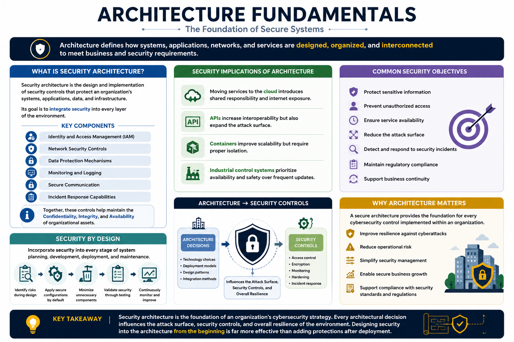
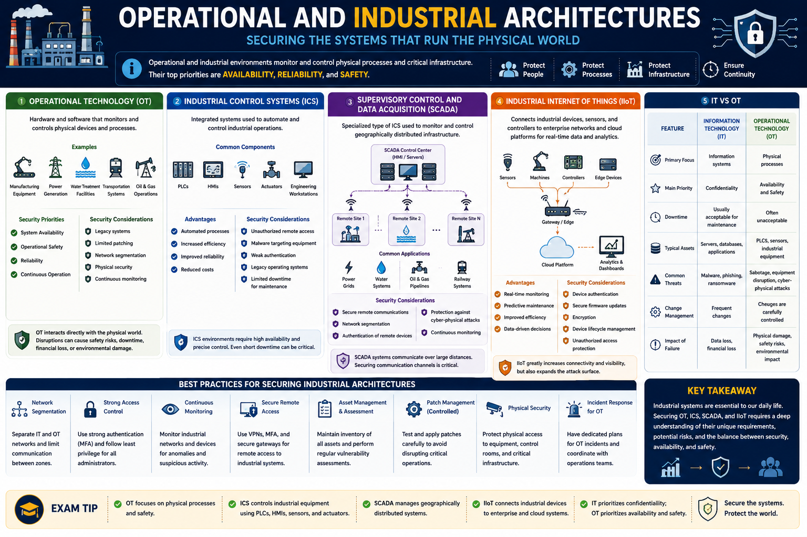
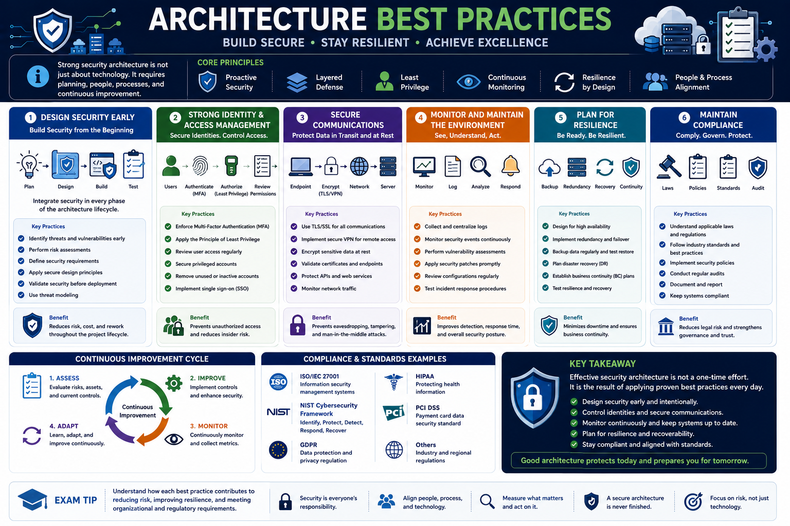

# Compare and Contrast Security Implications of Different Architecture Models

## 1. Architecture Fundamentals

Architecture defines how systems, applications, networks, and services are designed, organized, and interconnected to meet business and security requirements. A well-designed architecture improves performance, scalability, reliability, and security, while a poorly designed architecture can introduce vulnerabilities and increase an organization's attack surface.

Modern organizations rarely rely on a single technology. Instead, they combine cloud platforms, virtualized environments, distributed systems, APIs, and industrial technologies to support business operations. Each architecture model provides unique advantages but also introduces specific security risks that must be properly managed.

---

### What is a Security Architecture?

Security architecture is the design and implementation of security controls that protect an organization's systems, applications, data, and infrastructure.

Its goal is to ensure that security is integrated into every layer of the environment rather than added after deployment.

A security architecture typically includes:

- Identity and Access Management (IAM)
- Network security controls
- Data protection mechanisms
- Monitoring and logging
- Secure communication
- Incident response capabilities

Together, these controls help maintain the confidentiality, integrity, and availability of organizational assets.

---

### Security Implications of Architecture

Every architecture decision affects the organization's overall security posture.

For example:

- Moving services to the cloud introduces shared responsibility and internet exposure.
- APIs increase interoperability but also expand the attack surface.
- Containers improve scalability but require proper isolation.
- Industrial control systems prioritize availability and safety over frequent updates.

Understanding these implications allows security professionals to select appropriate security controls for each environment.

---

### Common Security Objectives

Regardless of the architecture model, organizations should strive to achieve several common security objectives.

These include:

- Protect sensitive information.
- Prevent unauthorized access.
- Ensure service availability.
- Reduce the attack surface.
- Detect and respond to security incidents.
- Maintain regulatory compliance.
- Support business continuity.

These objectives guide the design of secure infrastructures across both traditional and modern computing environments.

---

### Security by Design

Modern cybersecurity follows the principle of **Security by Design**, which means incorporating security into every stage of system planning, development, deployment, and maintenance.

Rather than adding security after a system is built, organizations should:

- Identify risks during the design phase.
- Apply secure configurations by default.
- Minimize unnecessary services and components.
- Validate security through testing.
- Continuously monitor and improve the environment.

Building security into the architecture from the beginning reduces vulnerabilities and lowers the cost of future remediation.

---

### Why Architecture Matters

A secure architecture provides the foundation for every cybersecurity control implemented within an organization.

Good architectural decisions help organizations:

- Improve resilience against cyberattacks.
- Reduce operational risk.
- Simplify security management.
- Enable secure business growth.
- Support compliance with security standards and regulations.

As organizations adopt cloud computing, distributed systems, and modern application platforms, understanding architecture models becomes an essential skill for every cybersecurity professional.

---

> **Key Takeaway**
>
> Security architecture is the foundation of an organization's cybersecurity strategy. Every architectural decision influences the attack surface, security controls, and overall resilience of the environment. Designing security into the architecture from the beginning is far more effective than adding protections after deployment.

---
## 2. Cloud Architecture Models

Cloud computing allows organizations to access computing resources such as servers, storage, databases, networking, and software over the internet instead of maintaining all infrastructure on-premises.

Cloud architectures provide scalability, flexibility, and cost efficiency. However, they also introduce new security considerations, including internet exposure, identity management, data privacy, and shared responsibility.

Understanding cloud service and deployment models helps security professionals implement the appropriate security controls for each environment.

---

### Cloud Service Models

Cloud providers offer services at different levels of responsibility. The three primary service models are Infrastructure as a Service (IaaS), Platform as a Service (PaaS), and Software as a Service (SaaS).

---

### Infrastructure as a Service (IaaS)

IaaS provides virtualized computing resources such as virtual machines, networking, and storage.

The cloud provider manages the physical infrastructure, while the customer is responsible for configuring and securing the operating systems, applications, and data.

**Examples:**

- Amazon EC2
- Microsoft Azure Virtual Machines
- Google Compute Engine

**Advantages**

- High flexibility
- Full control over operating systems
- Scalable infrastructure

**Security Considerations**

- Secure operating system configuration
- Patch management
- Identity and access management
- Network security
- Data encryption

---

### Platform as a Service (PaaS)

PaaS provides a complete development platform where developers can build, test, and deploy applications without managing the underlying infrastructure.

The cloud provider manages the hardware, operating systems, runtime environment, and middleware.

**Examples**

- Google App Engine
- Azure App Service
- AWS Elastic Beanstalk

**Advantages**

- Faster application development
- Reduced infrastructure management
- Automatic scaling

**Security Considerations**

- Secure application development
- API security
- Identity management
- Data protection
- Secure application configuration

---

### Software as a Service (SaaS)

SaaS delivers fully managed software applications through a web browser.

The cloud provider manages nearly every aspect of the service, while customers primarily manage user accounts and data.

**Examples**

- Microsoft 365
- Google Workspace
- Salesforce

**Advantages**

- No infrastructure management
- Rapid deployment
- Automatic updates
- Lower maintenance costs

**Security Considerations**

- User authentication
- Multi-Factor Authentication (MFA)
- Access control
- Data privacy
- Third-party risk management

---

### Comparison of Cloud Service Models

| Model | Customer Manages | Provider Manages |
|--------|------------------|------------------|
| **IaaS** | Operating systems, applications, data | Hardware, networking, virtualization |
| **PaaS** | Applications and data | Infrastructure, operating systems, runtime |
| **SaaS** | User accounts and data | Entire application and infrastructure |

---

### Cloud Deployment Models

Organizations can deploy cloud services using different deployment models depending on business, security, and compliance requirements.

---

### Public Cloud

Infrastructure is owned and operated by a third-party cloud provider and shared among multiple customers.

**Advantages**

- Low cost
- High scalability
- Rapid deployment

**Security Considerations**

- Shared infrastructure
- Internet exposure
- Regulatory compliance
- Shared responsibility

---

### Private Cloud

Cloud infrastructure is dedicated to a single organization.

Private clouds may be hosted on-premises or by a third-party provider.

**Advantages**

- Greater control
- Improved customization
- Enhanced privacy

**Security Considerations**

- Higher management responsibility
- Increased operational costs
- Internal security controls remain essential

---

### Hybrid Cloud

A hybrid cloud combines private and public cloud environments.

Organizations can keep sensitive workloads in the private cloud while using the public cloud for scalability.

**Advantages**

- Flexibility
- Cost optimization
- Business continuity

**Security Considerations**

- Secure connectivity
- Consistent access control
- Data synchronization
- Unified monitoring

---

### Community Cloud

A community cloud is shared by multiple organizations that have similar security, regulatory, or operational requirements.

Examples include government agencies, healthcare organizations, or educational institutions.

**Advantages**

- Shared costs
- Common compliance requirements
- Collaboration

**Security Considerations**

- Shared governance
- Consistent security policies
- Access management across organizations

---

### Multi-Cloud

A multi-cloud strategy uses services from multiple cloud providers instead of relying on a single vendor.

Organizations may choose different providers based on cost, performance, availability, or specialized services.

**Advantages**

- Vendor independence
- Increased resilience
- Optimized service selection

**Security Considerations**

- Consistent identity management
- Centralized monitoring
- Policy consistency
- Increased management complexity

---

### Shared Responsibility Model

Cloud security is based on a **Shared Responsibility Model**, where security responsibilities are divided between the cloud provider and the customer.

In general:

- The **cloud provider** secures the cloud infrastructure.
- The **customer** secures their data, identities, applications, and configurations.

The exact division of responsibilities depends on the selected service model (IaaS, PaaS, or SaaS).

---

> **Exam Tip**
>
> A common Security+ exam question asks who is responsible for securing a specific component in a cloud environment.
>
> - **IaaS:** The customer manages the most responsibilities.
> - **PaaS:** Responsibilities are shared more evenly.
> - **SaaS:** The provider manages most of the infrastructure, while the customer remains responsible for user accounts, access control, and protecting their data.

---
## 3. Modern Application Architectures

Modern applications are designed to be scalable, flexible, and highly available. Unlike traditional monolithic applications, modern architectures break applications into smaller, independent components that can be developed, deployed, and maintained more efficiently.

While these architectures improve agility and performance, they also introduce new security challenges that require specialized security controls.

---

### Virtualization

Virtualization allows multiple virtual machines (VMs) to run on a single physical server using a software layer called a **hypervisor**.

Each virtual machine has its own operating system, applications, and resources while sharing the same physical hardware.

**Advantages**

- Better hardware utilization
- Reduced infrastructure costs
- Simplified disaster recovery
- Easy migration of virtual machines
- Improved scalability

**Security Considerations**

- Hypervisor vulnerabilities
- VM escape attacks
- Improper VM isolation
- Unpatched guest operating systems
- Secure virtual network configuration

---

### Containers

Containers package an application together with its libraries and dependencies while sharing the host operating system's kernel.

Unlike virtual machines, containers do not require a separate operating system for each instance, making them lightweight and fast.

Common container platforms include:

- Docker
- Kubernetes

**Advantages**

- Fast deployment
- Efficient resource utilization
- Easy scalability
- Consistent application environments

**Security Considerations**

- Container image vulnerabilities
- Insecure container registries
- Privileged containers
- Weak isolation
- Secrets management

Organizations should use trusted images, regularly scan containers for vulnerabilities, and enforce the principle of least privilege.

---

### Microservices

Microservices divide an application into small, independent services that communicate through APIs.

Each service performs a specific business function and can be developed, updated, and deployed independently.

**Advantages**

- Independent deployment
- Improved scalability
- Faster development
- Better fault isolation

**Security Considerations**

- API security
- Service authentication
- Secure communication between services
- Centralized logging and monitoring
- Increased attack surface

Because every service communicates over the network, strong authentication and encryption are essential.

---

### Serverless Computing

Serverless computing allows developers to run application code without managing servers.

Cloud providers automatically provision infrastructure, scale resources, and manage server maintenance.

Examples include:

- AWS Lambda
- Azure Functions
- Google Cloud Functions

**Advantages**

- Automatic scaling
- Reduced operational overhead
- Pay only for execution time
- Faster application deployment

**Security Considerations**

- Function-level permissions
- Secure API integrations
- Event validation
- Third-party dependency management
- Monitoring serverless workloads

Although the cloud provider manages the infrastructure, developers remain responsible for securing their application code and data.

---

### Infrastructure as Code (IaC)

Infrastructure as Code (IaC) is the practice of defining and managing infrastructure using configuration files instead of manual processes.

Infrastructure can be automatically deployed, modified, and replicated using code.

Common IaC tools include:

- Terraform
- AWS CloudFormation
- Ansible

**Advantages**

- Consistent deployments
- Reduced human error
- Version control
- Automated infrastructure provisioning

**Security Considerations**

- Protect configuration files
- Secure secrets and credentials
- Review infrastructure changes
- Scan templates for security misconfigurations
- Apply least privilege to automation accounts

Treating infrastructure as code means that configuration files become critical assets that require the same protection as application source code.

---

### Comparison of Modern Application Architectures

| Technology | Primary Purpose | Key Security Concern |
|------------|-----------------|----------------------|
| **Virtualization** | Multiple VMs on one host | Hypervisor security and VM isolation |
| **Containers** | Lightweight application deployment | Container isolation and image security |
| **Microservices** | Modular application design | API security and service communication |
| **Serverless** | Event-driven code execution | Permissions and dependency security |
| **Infrastructure as Code** | Automated infrastructure deployment | Secure configuration and secret management |

---

> **Exam Tip**
>
> Modern application architectures reduce operational complexity and improve scalability,

---
## 4. API and Integration Security

Modern applications rarely operate in isolation. Instead, they communicate with other applications, cloud services, mobile devices, and third-party platforms through **Application Programming Interfaces (APIs)**.

While APIs improve interoperability and automation, they also expand the attack surface. Poorly secured APIs can expose sensitive data, allow unauthorized access, or become entry points for attackers.

---

### What is an API?

An **Application Programming Interface (API)** is a set of rules that allows different software applications to communicate and exchange data.

Instead of accessing a database directly, applications send requests to an API, which processes the request and returns the appropriate response.

Common API uses include:

- Mobile applications
- Web applications
- Cloud services
- Payment gateways
- Authentication services
- Third-party integrations

---

### API Security Risks

Because APIs are often publicly accessible, they are common targets for cyberattacks.

Common security risks include:

- Broken authentication
- Broken authorization
- Excessive data exposure
- Injection attacks
- Insecure API endpoints
- Rate limit abuse
- Misconfigured APIs

Compromising an API can expose sensitive information or provide attackers with unauthorized access to backend systems.

---

### API Gateway

An **API Gateway** is a centralized entry point that manages and secures API traffic between clients and backend services.

Rather than exposing every service directly, organizations route requests through the gateway.

An API Gateway commonly provides:

- Authentication
- Authorization
- Rate limiting
- Request validation
- Traffic routing
- Logging and monitoring
- Load balancing

Using an API Gateway simplifies security management while improving visibility into API activity.

---

### Authentication and Authorization

Every API should verify both the identity of the requester and the permissions associated with that identity.

Common authentication methods include:

- API Keys
- OAuth 2.0
- OpenID Connect (OIDC)
- JSON Web Tokens (JWT)
- Mutual TLS (mTLS)

Authorization should follow the **Principle of Least Privilege**, ensuring clients receive only the permissions necessary to perform their intended functions.

---

### Secure API Communication

All API communication should be encrypted to protect sensitive information during transmission.

Recommended practices include:

- HTTPS using TLS
- Certificate validation
- Strong encryption algorithms
- Secure session management

Unencrypted API traffic can be intercepted through Man-in-the-Middle (MitM) attacks.

---

### API Security Best Practices

Organizations should follow several best practices when securing APIs:

- Require strong authentication.
- Validate all user input.
- Encrypt all communications using TLS.
- Implement rate limiting to reduce abuse.
- Disable unnecessary API endpoints.
- Log and monitor API activity.
- Keep APIs updated and patched.
- Perform regular security testing.

Applying these controls significantly reduces the likelihood of API-related attacks.

---

### Why API Security Matters

As organizations increasingly adopt cloud computing, microservices, and mobile applications, APIs have become critical components of modern infrastructure.

A single vulnerable API can expose sensitive data, compromise backend services, or allow attackers to move laterally throughout the environment.

Proper API security protects both the applications themselves and the data they process.

---

> **Exam Tip**
>
> APIs are a frequent target for attackers because they expose application functionality over the network. Strong authentication, authorization, encrypted communication, input validation, rate limiting, and continuous monitoring are essential controls for securing modern APIs.

---
## 5. Distributed Computing Architectures

Distributed computing architectures consist of multiple interconnected systems that work together to perform computing tasks. Instead of relying on a single centralized system, workloads are distributed across multiple devices or locations to improve performance, scalability, reliability, and fault tolerance.

Although distributed architectures provide many operational benefits, they also introduce additional security challenges, such as securing communication between systems, maintaining consistent security policies, and protecting distributed data.

---

### Edge Computing

Edge computing processes data close to where it is generated rather than sending all information to a centralized cloud or data center.

Examples include:

- IoT sensors
- Smart cameras
- Autonomous vehicles
- Industrial equipment

**Advantages**

- Reduced latency
- Faster decision making
- Lower bandwidth usage
- Improved reliability during network outages

**Security Considerations**

- Physical security of edge devices
- Secure device authentication
- Data encryption
- Secure firmware updates
- Endpoint monitoring

Since edge devices are often deployed in remote or public locations, they are more vulnerable to physical tampering.

---

### Fog Computing

Fog computing extends cloud services closer to edge devices by introducing intermediate processing nodes between the edge and the cloud.

Instead of sending all data directly to the cloud, nearby fog nodes perform initial processing before forwarding only necessary information.

**Advantages**

- Lower latency
- Reduced network congestion
- Better support for real-time applications
- Improved scalability

**Security Considerations**

- Secure communication between edge, fog, and cloud
- Authentication of fog nodes
- Encryption of transmitted data
- Consistent security policies across all layers

---

### Content Delivery Network (CDN)

A Content Delivery Network (CDN) is a globally distributed network of servers that stores cached copies of web content closer to users.

Instead of retrieving content from a single server, users receive data from the nearest CDN node.

**Advantages**

- Faster content delivery
- Reduced server load
- Improved availability
- Better resistance to traffic spikes

**Security Considerations**

- DDoS mitigation
- TLS support
- Secure cache configuration
- Access control
- Monitoring of distributed nodes

Many CDN providers include built-in security features such as Web Application Firewalls (WAFs) and DDoS protection.

---

### Peer-to-Peer (P2P)

In a Peer-to-Peer (P2P) architecture, devices communicate directly with one another without relying on a centralized server.

Each device can act as both a client and a server.

Common examples include:

- File sharing
- Blockchain networks
- Distributed collaboration systems

**Advantages**

- No single point of failure
- High scalability
- Distributed resource sharing

**Security Considerations**

- Malware distribution
- Untrusted peers
- Weak authentication
- Data integrity verification
- Limited centralized control

Because any participant may exchange data with others, verifying trust and authenticity is critical.

---

### Comparison of Distributed Architectures

| Architecture | Primary Purpose | Key Security Concern |
|--------------|-----------------|----------------------|
| **Edge Computing** | Process data near devices | Physical security and device protection |
| **Fog Computing** | Intermediate local processing | Secure communication between layers |
| **CDN** | Deliver content closer to users | Cache security and DDoS protection |
| **Peer-to-Peer (P2P)** | Direct device communication | Trust management and malware propagation |

---

### Why Distributed Architectures Matter

Modern organizations increasingly rely on distributed architectures to support cloud services, IoT, global applications, and real-time processing.

Securing these environments requires protecting not only the individual devices but also the communication channels and trust relationships between distributed components.

---

> **Exam Tip**
>
> Distributed architectures improve scalability and performance, but they also increase the attack surface. Strong authentication, encrypted communications, continuous monitoring, and secure device management are essential for protecting distributed environments.

---
## 6. Operational and Industrial Architectures

Operational and industrial environments control physical processes rather than traditional business applications. These systems manage critical infrastructure such as manufacturing plants, power grids, transportation systems, water treatment facilities, and oil and gas operations.

Unlike traditional IT systems, operational environments prioritize **availability**, **reliability**, and **safety**. Any disruption can result in financial losses, environmental damage, equipment failure, or risks to human life.

As these systems become increasingly connected to enterprise networks and the Internet, securing them has become a major cybersecurity challenge.

---

### Operational Technology (OT)

Operational Technology (OT) refers to the hardware and software used to monitor and control physical devices, industrial processes, and critical infrastructure.

Unlike Information Technology (IT), which focuses on processing business information, OT interacts directly with the physical world.

Examples include:

- Manufacturing equipment
- Industrial robots
- Power generation systems
- Water treatment facilities
- Transportation control systems

**Security Priorities**

- System availability
- Operational safety
- Reliability
- Continuous operation

**Security Considerations**

- Legacy systems
- Limited patching opportunities
- Network segmentation
- Physical security
- Continuous monitoring

---

### Industrial Control Systems (ICS)

Industrial Control Systems (ICS) are integrated systems used to automate and control industrial operations.

An ICS typically consists of multiple components working together to monitor and control industrial equipment.

Common ICS components include:

- Programmable Logic Controllers (PLCs)
- Human-Machine Interfaces (HMIs)
- Sensors
- Actuators
- Engineering workstations

**Advantages**

- Automated industrial processes
- Increased efficiency
- Improved reliability
- Reduced operational costs

**Security Considerations**

- Unauthorized remote access
- Malware targeting industrial equipment
- Weak authentication
- Legacy operating systems
- Limited downtime for maintenance

---

### Supervisory Control and Data Acquisition (SCADA)

SCADA is a specialized type of Industrial Control System used to monitor and control geographically distributed infrastructure.

SCADA systems collect data from remote sites and allow operators to monitor and manage industrial processes from centralized control centers.

Common applications include:

- Electrical power grids
- Water distribution systems
- Oil and gas pipelines
- Railway systems

**Security Considerations**

- Secure remote communications
- Network segmentation
- Authentication of remote devices
- Protection against cyber-physical attacks
- Continuous monitoring

Because SCADA systems often communicate across large geographic areas, protecting communication channels is critical.

---

### Industrial Internet of Things (IIoT)

The Industrial Internet of Things (IIoT) extends traditional industrial systems by connecting sensors, machines, and controllers to enterprise networks and cloud platforms.

IIoT enables organizations to collect real-time operational data for analytics, predictive maintenance, and process optimization.

**Advantages**

- Real-time monitoring
- Predictive maintenance
- Improved operational efficiency
- Data-driven decision making

**Security Considerations**

- Device authentication
- Secure firmware updates
- Encryption
- Device lifecycle management
- Protection against unauthorized access

The large number of connected devices significantly increases the organization's attack surface.

---

### IT vs. OT

Although IT and OT increasingly work together, they have different priorities.

| Feature | Information Technology (IT) | Operational Technology (OT) |
|---------|------------------------------|-----------------------------|
| Primary Focus | Information systems | Physical processes |
| Main Priority | Confidentiality | Availability and Safety |
| Downtime | Usually acceptable for maintenance | Often unacceptable |
| Typical Assets | Servers, databases, applications | PLCs, sensors, industrial equipment |
| Common Threats | Malware, phishing, ransomware | Sabotage, equipment disruption, cyber-physical attacks |

---

### Best Practices for Securing Industrial Architectures

Organizations should implement multiple layers of protection for industrial environments.

Recommended practices include:

- Network segmentation between IT and OT environments.
- Strong authentication for administrators.
- Continuous monitoring of industrial networks.
- Secure remote access using VPNs and MFA.
- Regular asset inventory and vulnerability assessments.
- Controlled patch management procedures.
- Physical security for industrial equipment.
- Incident response plans specifically designed for OT environments.

---

> **Exam Tip**
>
> Remember the distinction:
>
> - **IT** focuses primarily on protecting information.
> - **OT** focuses primarily on maintaining safe and reliable operation of physical systems.
> - **ICS** controls industrial processes.
> - **SCADA** monitors and manages geographically distributed industrial infrastructure.
> - **IIoT** connects industrial devices to enterprise networks and cloud services, increasing both operational capabilities and security risks.

---
## 7. Secure Architecture Principles

Building a secure architecture requires more than deploying security tools. Organizations should design security into every layer of their infrastructure by following proven architectural principles that reduce risk, limit the impact of attacks, and improve overall resilience.

These principles serve as the foundation for protecting modern cloud environments, enterprise networks, applications, and industrial systems.

---

### Zero Trust

**Zero Trust** is a security model based on the principle:

> **"Never Trust, Always Verify."**

Instead of automatically trusting users or devices because they are inside the corporate network, Zero Trust assumes that every request could be malicious.

Every access request must be continuously verified using factors such as:

- Identity
- Device health
- Location
- Risk level
- Authentication status

**Core Principles**

- Verify every request.
- Enforce least privilege.
- Assume breach.
- Continuously monitor user activity.

**Benefits**

- Reduces insider threats.
- Limits lateral movement.
- Improves visibility.
- Strengthens access control.

---

### Network Segmentation

Network segmentation divides a network into smaller isolated sections.

Instead of allowing every device to communicate freely, traffic is restricted between network segments based on security policies.

For example:

- User Network
- Server Network
- Database Network
- Guest Network
- Management Network

**Benefits**

- Reduces the attack surface.
- Limits malware propagation.
- Protects sensitive systems.
- Simplifies access control.

---

### Microsegmentation

Microsegmentation extends traditional network segmentation by applying security policies at the workload or application level rather than only at the network level.

Instead of protecting an entire subnet, each workload can have its own security policy.

This approach is commonly used in:

- Virtualized environments
- Cloud platforms
- Containers
- Data centers

**Benefits**

- Prevents lateral movement.
- Provides granular access control.
- Improves visibility.
- Supports Zero Trust architectures.

---

### Defense in Depth

Defense in Depth is a layered security strategy that combines multiple independent security controls.

Rather than relying on a single security mechanism, organizations deploy several layers of protection.

Typical layers include:

- Physical security
- Network security
- Endpoint protection
- Identity and access management
- Application security
- Data protection
- Monitoring and logging

If one layer fails, the remaining layers continue protecting the environment.

---

### Least Privilege

The Principle of Least Privilege states that users, applications, and services should receive only the permissions necessary to perform their assigned tasks.

Limiting permissions reduces the impact of compromised accounts and minimizes opportunities for attackers.

Least privilege should be applied to:

- User accounts
- Administrator accounts
- Applications
- APIs
- Service accounts

---

### Secure by Default

Secure by Default means systems should be deployed with secure configurations already enabled.

Examples include:

- Strong authentication enabled
- Unnecessary services disabled
- Secure communication protocols enforced
- Default passwords changed
- Logging enabled

This reduces the likelihood of insecure deployments caused by configuration mistakes.

---

### Comparison of Security Architecture Principles

| Principle | Primary Goal |
|-----------|--------------|
| **Zero Trust** | Verify every access request |
| **Network Segmentation** | Isolate network resources |
| **Microsegmentation** | Protect individual workloads |
| **Defense in Depth** | Apply multiple security layers |
| **Least Privilege** | Minimize permissions |
| **Secure by Default** | Start from a secure configuration |

---

### Why Secure Architecture Principles Matter

Modern environments are highly connected and constantly evolving. No single security control can protect every system from every threat.

By combining architectural security principles, organizations can:

- Reduce the attack surface.
- Prevent lateral movement.
- Improve visibility.
- Strengthen access control.
- Increase resilience against cyberattacks.
- Support regulatory compliance.

These principles work together to create a strong security foundation across cloud, enterprise, and industrial environments.

---

> **Exam Tip**
>
> Security+ frequently tests these principles:
>
> - **Zero Trust** → Never trust, always verify.
> - **Segmentation** → Divide networks into isolated zones.
> - **Microsegmentation** → Protect individual workloads and applications.
> - **Defense in Depth** → Use multiple independent security layers.
> - **Least Privilege** → Grant only the permissions required.
> - **Secure by Default** → Deploy systems with secure configurations from the start.

---
## 8. Architecture Best Practices

A secure architecture is built through careful planning, continuous improvement, and the consistent application of security principles. As organizations adopt cloud services, distributed systems, and modern application platforms, security should be integrated into every stage of the architecture rather than added after deployment.

Following established best practices helps reduce vulnerabilities, improve resilience, and maintain compliance with organizational and regulatory requirements.

---

### Design Security from the Beginning

Security should be incorporated during the planning and design phases of every project.

Organizations should:

- Identify potential threats early.
- Perform risk assessments.
- Define security requirements.
- Apply secure design principles.
- Validate security before deployment.

Building security into the architecture is more effective and less costly than correcting security weaknesses later.

---

### Apply Defense in Depth

No single security control can protect every asset.

Organizations should deploy multiple layers of security, including:

- Physical security
- Network security
- Identity and access management
- Endpoint protection
- Application security
- Data encryption
- Continuous monitoring

Multiple defensive layers improve resilience if one control fails.

---

### Implement Strong Identity and Access Management

Identity is the foundation of modern cybersecurity.

Organizations should:

- Enforce Multi-Factor Authentication (MFA).
- Apply the Principle of Least Privilege.
- Regularly review user permissions.
- Secure privileged accounts.
- Remove unused accounts promptly.

Proper identity management significantly reduces unauthorized access.

---

### Secure Network Communications

All communications between systems should be protected against interception and tampering.

Recommended practices include:

- Use TLS for encrypted communications.
- Implement secure VPN connections.
- Segment critical networks.
- Protect remote access.
- Monitor network traffic for suspicious activity.

Secure communication is especially important in cloud, distributed, and industrial environments.

---

### Monitor and Maintain the Environment

Security is an ongoing process rather than a one-time implementation.

Organizations should continuously:

- Monitor security events.
- Collect and review logs.
- Perform vulnerability assessments.
- Apply security patches.
- Review configurations.
- Test incident response procedures.

Continuous monitoring improves the ability to detect and respond to attacks quickly.

---

### Plan for Resilience

Architectures should be designed to continue operating even when failures or attacks occur.

Key practices include:

- High availability
- Redundancy
- Regular backups
- Disaster recovery planning
- Business continuity planning

These measures minimize downtime and improve organizational resilience.

---

### Maintain Compliance

Architectures should comply with applicable laws, regulations, and industry standards.

Examples include:

- ISO/IEC 27001
- NIST Cybersecurity Framework
- GDPR
- HIPAA
- PCI DSS

Compliance strengthens security governance while reducing legal and regulatory risk.

---

## Summary

Modern architecture models provide significant benefits in scalability, flexibility, and operational efficiency, but they also introduce new security challenges. Understanding cloud models, distributed systems, industrial environments, APIs, and secure architecture principles enables cybersecurity professionals to design resilient infrastructures that protect organizational assets while supporting business objectives.

---

> **Key Takeaway**
>
> Effective security architecture combines secure design principles, layered defenses, strong identity management, protected communications, continuous monitoring, and resilient infrastructure. Security should be integrated into every architectural decision to reduce risk and support long-term organizational success.

