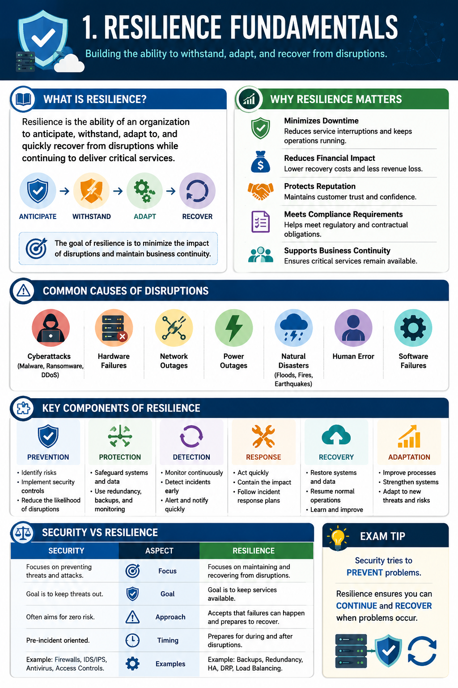
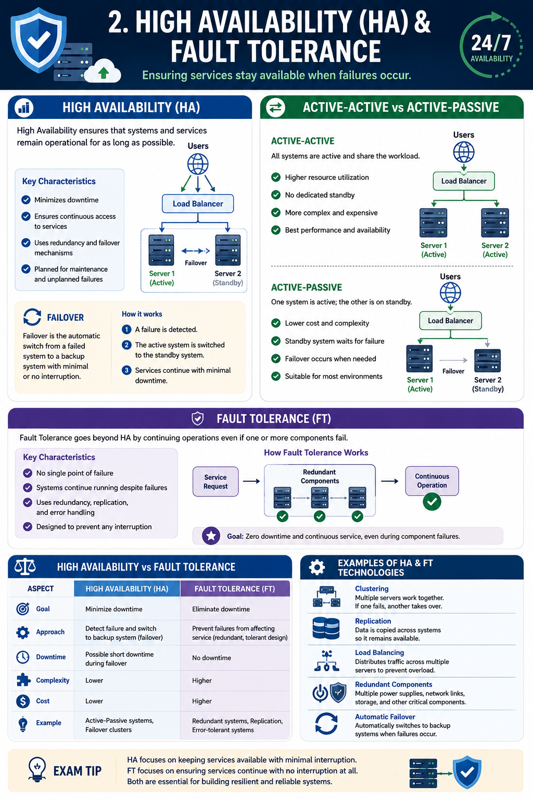
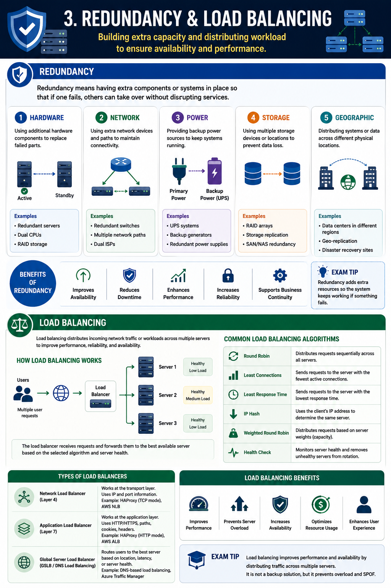
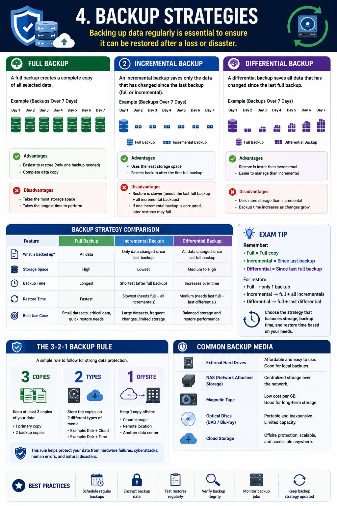
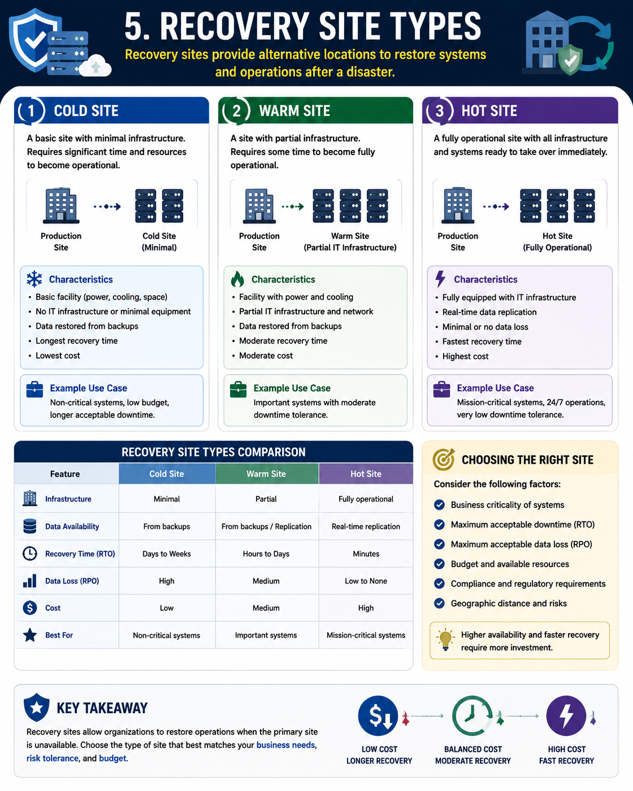
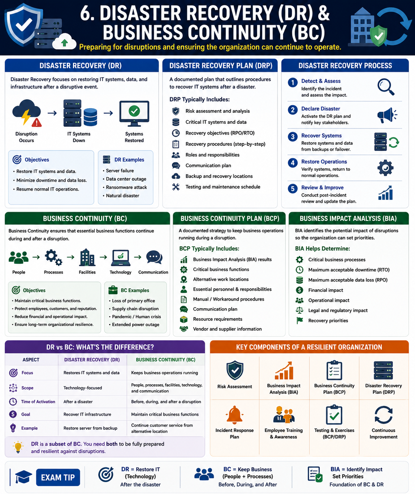
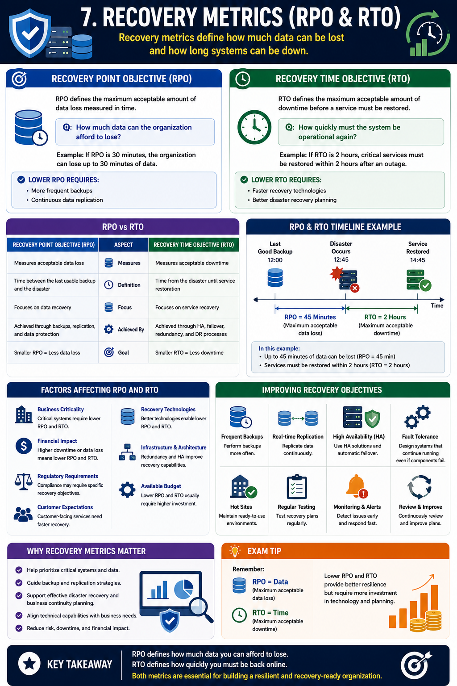
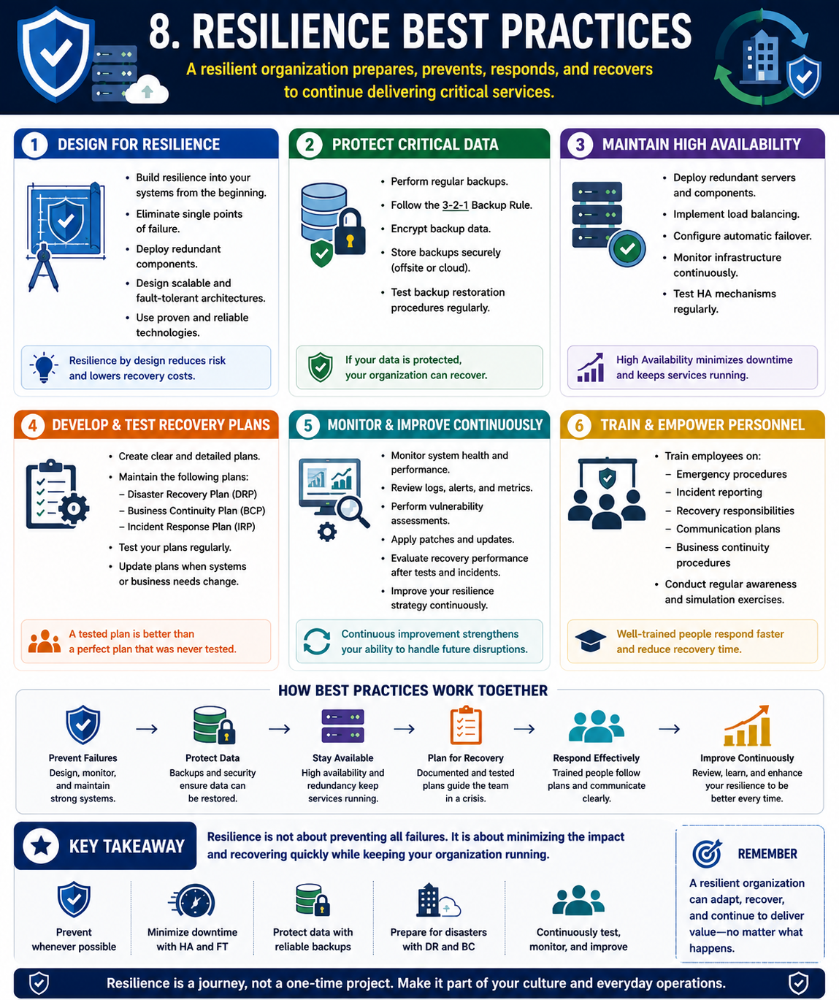

# Resilience and Recovery

## 1. Resilience Fundamentals

Resilience is the ability of an organization, system, or service to continue operating during adverse events and recover quickly after disruptions. Modern cybersecurity focuses not only on preventing attacks but also on maintaining critical operations when incidents occur.

A resilient environment minimizes downtime, limits data loss, and restores normal business functions as efficiently as possible.

---

### What is Resilience?

Resilience is the capability to:

- Continue operating during failures.
- Recover quickly after disruptions.
- Adapt to changing threats.
- Maintain essential business services.

A resilient system is designed to withstand hardware failures, software issues, cyberattacks, natural disasters, and human errors.

---

### Why Resilience Matters

No organization can completely eliminate security incidents or system failures.

Resilience helps organizations:

- Reduce downtime.
- Protect critical services.
- Minimize financial losses.
- Maintain customer trust.
- Improve operational stability.
- Support regulatory compliance.

Organizations with strong resilience strategies can continue providing essential services even during major incidents.

---

### Common Causes of Disruptions

Systems may become unavailable due to various events, including:

- Hardware failures
- Software bugs
- Power outages
- Network failures
- Ransomware attacks
- Distributed Denial-of-Service (DDoS) attacks
- Natural disasters
- Human error

Because disruptions are inevitable, recovery planning is a fundamental part of cybersecurity.

---

### Key Components of Resilience

Building resilient systems requires multiple technologies and operational strategies, including:

- High Availability (HA)
- Fault Tolerance
- Redundancy
- Load Balancing
- Backup and Recovery
- Disaster Recovery (DR)
- Business Continuity (BC)

These components work together to reduce service interruptions and improve recovery capabilities.

---

### Resilience vs. Security

Although closely related, resilience and security are different concepts.

| Security | Resilience |
|----------|------------|
| Prevents attacks | Continues operating despite attacks |
| Focuses on protection | Focuses on recovery and continuity |
| Reduces risk | Reduces operational impact |
| Prevents unauthorized access | Restores normal operations quickly |

Effective cybersecurity requires both strong preventive controls and resilient recovery capabilities.

---

### Building a Resilient Organization

Organizations improve resilience by:

- Eliminating single points of failure.
- Implementing redundant systems.
- Maintaining reliable backups.
- Monitoring infrastructure continuously.
- Testing recovery procedures regularly.
- Preparing incident response and disaster recovery plans.

Resilience is achieved through preparation rather than reaction.

---

> **Exam Tip**
>
> Security+ distinguishes **security** from **resilience**:
>
> - **Security** focuses on preventing incidents.
> - **Resilience** focuses on maintaining operations and recovering quickly when incidents occur.
>
> High Availability, Fault Tolerance, Redundancy, and Disaster Recovery are all key elements of a resilient architecture.

---
## 2. High Availability (HA)

High Availability (HA) is the ability of a system or service to remain operational with minimal interruption, even when individual components fail.

The goal of HA is to reduce downtime by ensuring that services remain accessible through redundant components and automatic failover mechanisms.

High Availability is essential for mission-critical systems such as financial services, healthcare platforms, cloud infrastructure, and enterprise applications.

---

### How High Availability Works

A High Availability architecture eliminates single points of failure by deploying multiple instances of critical components.

If one component becomes unavailable, another immediately takes over without significantly affecting users.

Common HA mechanisms include:

- Redundant servers
- Failover clusters
- Load balancers
- Redundant network connections
- Redundant storage systems
- Multiple power supplies

---

### Failover

Failover is the automatic process of transferring operations from a failed component to a standby component.

For example:

1. The primary server fails.
2. Monitoring systems detect the failure.
3. A secondary server automatically becomes active.
4. Users continue accessing the service with little or no interruption.

Automatic failover greatly improves service availability.

---

### Active-Active vs. Active-Passive

High Availability solutions commonly use one of two deployment models.

| Active-Active | Active-Passive |
|---------------|----------------|
| Multiple systems operate simultaneously | One system operates while another remains on standby |
| Traffic is shared across systems | Backup system activates only after failure |
| Higher performance | Simpler configuration |
| Better scalability | Lower resource utilization during normal operation |

Active-Active configurations provide both high availability and load distribution, while Active-Passive focuses primarily on rapid recovery.

---

### Benefits of High Availability

Implementing HA provides several advantages:

- Reduces downtime.
- Improves service reliability.
- Supports continuous business operations.
- Increases customer satisfaction.
- Minimizes financial losses caused by outages.

---

### High Availability vs. Fault Tolerance

Although closely related, High Availability and Fault Tolerance are not the same.

| High Availability | Fault Tolerance |
|-------------------|-----------------|
| Short interruption may occur during failover | No service interruption |
| Uses redundant systems with failover | Components operate simultaneously |
| Lower implementation cost | Higher implementation cost |
| Suitable for most enterprise environments | Used for mission-critical systems requiring continuous operation |

Fault Tolerance provides a higher level of resilience than High Availability but typically requires greater complexity and expense.

---

### Best Practices

Organizations should:

- Eliminate single points of failure.
- Deploy redundant infrastructure.
- Monitor system health continuously.
- Test failover procedures regularly.
- Keep standby systems updated and synchronized.

Regular testing ensures that failover mechanisms function correctly during real incidents.

---

> **Exam Tip**
>
> Remember the distinction:
>
> - **High Availability (HA)** minimizes downtime through redundancy and automatic failover.
> - **Failover** transfers services to a backup system after a failure.
> - **Fault Tolerance** keeps systems running without interruption by using fully redundant components operating simultaneously.
---
## 3. Fault Tolerance

Fault Tolerance is the ability of a system to continue operating without interruption even when one or more components fail.

Unlike High Availability, which may experience a brief interruption during failover, Fault Tolerance is designed to provide continuous service by using fully redundant components that operate simultaneously.

Fault Tolerance is commonly used in environments where even a few seconds of downtime are unacceptable.

---

### How Fault Tolerance Works

Fault-tolerant systems duplicate critical components so that if one component fails, another immediately continues performing the same function without requiring failover.

Common redundant components include:

- Servers
- Power supplies
- Network interfaces
- Storage devices
- Network paths
- Processors

Because duplicate components operate simultaneously, users typically do not notice a failure.

---

### Characteristics of Fault Tolerance

Fault-tolerant systems are designed to provide:

- Continuous operation
- No single point of failure
- Automatic failure handling
- Real-time redundancy
- High reliability

These characteristics make fault-tolerant systems suitable for mission-critical environments.

---

### Common Fault-Tolerant Technologies

Organizations implement Fault Tolerance using technologies such as:

- Dual power supplies
- RAID storage arrays
- Multiple network interfaces
- Redundant network paths
- Clustered servers
- Geographic redundancy

Combining multiple redundant technologies significantly improves system resilience.

---

### Advantages

Fault Tolerance provides several important benefits:

- Eliminates service interruptions.
- Improves system reliability.
- Supports continuous business operations.
- Protects critical services.
- Reduces the impact of hardware failures.

---

### Limitations

Although Fault Tolerance provides the highest level of availability, it also has disadvantages.

These include:

- Higher implementation costs.
- Increased hardware requirements.
- Greater administrative complexity.
- Additional maintenance.
- More complex system design.

Because of these costs, organizations usually reserve Fault Tolerance for their most critical systems.

---

### High Availability vs. Fault Tolerance

Both approaches improve resilience, but they achieve it differently.

| High Availability | Fault Tolerance |
|-------------------|-----------------|
| Brief interruption may occur | No interruption |
| Uses failover | Uses simultaneous redundancy |
| Less expensive | More expensive |
| Suitable for most business applications | Suitable for mission-critical systems |
| Recovery after failure | Continuous operation during failure |

---

### Typical Use Cases

Fault Tolerance is commonly used in:

- Financial transaction systems
- Air traffic control systems
- Hospital life-support equipment
- Industrial control systems
- Telecommunications infrastructure
- Cloud service provider core infrastructure

These environments require uninterrupted service because downtime could result in significant financial loss or safety risks.

---

> **Exam Tip**
>
> Security+ often compares **High Availability** and **Fault Tolerance**.
>
> - **High Availability** minimizes downtime through failover.
> - **Fault Tolerance** eliminates downtime by using redundant components that operate simultaneously.
>
> If the exam asks which solution provides **continuous operation with no interruption**, the correct answer is **Fault Tolerance**.

---
## 4. Redundancy

Redundancy is the practice of deploying additional components or resources so that a system can continue operating if one component fails.

By eliminating single points of failure, redundancy improves system reliability, availability, and resilience.

Redundancy is one of the fundamental building blocks of High Availability and Fault Tolerance architectures.

---

### Why Redundancy is Important

Every hardware or software component has the potential to fail.

Without redundant resources, the failure of a single critical component may interrupt an entire service.

Redundancy helps organizations:

- Improve service availability.
- Increase system reliability.
- Reduce downtime.
- Support business continuity.
- Enhance disaster recovery capabilities.

---

### Common Types of Redundancy

Organizations can implement redundancy across different parts of their infrastructure.

**Hardware Redundancy**

Duplicate physical components are installed to replace failed hardware.

Examples include:

- Multiple servers
- Dual power supplies
- Redundant storage devices
- Multiple network switches
- Backup routers

---

**Network Redundancy**

Network redundancy ensures connectivity remains available if one communication path fails.

Examples include:

- Multiple Internet Service Providers (ISPs)
- Redundant network links
- Backup firewalls
- Multiple routers
- Multiple switches

---

**Power Redundancy**

Critical systems should remain operational during electrical failures.

Examples include:

- Uninterruptible Power Supplies (UPS)
- Backup generators
- Dual power feeds
- Redundant power distribution units (PDUs)

---

**Storage Redundancy**

Storage redundancy protects against data loss caused by disk failures.

Common technologies include:

- RAID arrays
- Storage replication
- Network Attached Storage (NAS)
- Storage Area Networks (SAN)

---

**Geographic Redundancy**

Organizations may duplicate entire systems across multiple physical locations.

Examples include:

- Secondary data centers
- Multiple cloud regions
- Multi-region cloud deployments

Geographic redundancy improves resilience against natural disasters and large-scale outages.

---

### Redundancy vs. Backup

Although both improve resilience, they serve different purposes.

| Redundancy | Backup |
|------------|--------|
| Keeps services running | Restores lost data |
| Focuses on availability | Focuses on recovery |
| Immediate protection | Used after data loss |
| Prevents service interruption | Recovers deleted or corrupted information |

Organizations typically require both redundancy and backups for comprehensive resilience.

---

### Best Practices

To maximize the benefits of redundancy, organizations should:

- Eliminate single points of failure.
- Deploy redundant critical components.
- Test redundant systems regularly.
- Monitor redundant infrastructure continuously.
- Keep backup components synchronized.
- Distribute critical resources across multiple locations.

Redundancy is only effective if the secondary components are operational and regularly tested.

---

> **Exam Tip**
>
> Redundancy means **having duplicate resources available before a failure occurs**.
>
> It improves **availability**, supports **High Availability** and **Fault Tolerance**, and eliminates **single points of failure**.
>
> Remember:
> - **Redundancy** keeps systems running.
> - **Backups** recover lost data.
---
## 5. Load Balancing

Load Balancing is the process of distributing incoming network traffic or application requests across multiple servers or resources.

Instead of allowing a single server to handle all requests, a load balancer directs traffic to multiple available servers, improving performance, availability, and reliability.

Load balancing is commonly used in web applications, cloud platforms, enterprise services, and data centers.

---

### How Load Balancing Works

A load balancer sits between clients and backend servers.

When a client sends a request:

1. The request reaches the load balancer.
2. The load balancer selects an appropriate server.
3. The request is forwarded to the selected server.
4. The server processes the request and returns the response.

This process prevents any single server from becoming overloaded.

---

### Benefits of Load Balancing

Load balancing provides several advantages:

- Improves application performance.
- Prevents server overload.
- Increases service availability.
- Supports scalability.
- Enhances fault tolerance.
- Simplifies maintenance by allowing servers to be updated without disrupting the service.

---

### Load Balancing Algorithms

A load balancer can distribute traffic using different algorithms.

**Round Robin**

Requests are distributed sequentially to each server.

Example:

- Request 1 → Server A
- Request 2 → Server B
- Request 3 → Server C
- Request 4 → Server A

This method is simple and works well when servers have similar capacity.

---

**Least Connections**

Traffic is sent to the server with the fewest active connections.

This method is useful when requests require different processing times.

---

**Least Response Time**

The load balancer selects the server responding the fastest.

This improves performance during periods of varying server load.

---

**Weighted Load Balancing**

Servers receive traffic based on assigned weights.

Servers with greater processing capacity receive a larger share of incoming requests.

---

### Health Checks

A load balancer continuously monitors backend servers using health checks.

If a server becomes unavailable or fails health checks, it is automatically removed from the pool until it recovers.

This ensures that requests are sent only to healthy servers.

---

### Load Balancing vs. High Availability

Although they often work together, they have different purposes.

| Load Balancing | High Availability |
|----------------|-------------------|
| Distributes traffic across multiple servers | Minimizes downtime through redundancy |
| Improves performance | Improves service availability |
| Supports scalability | Supports continuous operation |
| Prevents server overload | Provides failover after failures |

Many enterprise environments use both technologies together to achieve scalability and resilience.

---

### Best Practices

Organizations should:

- Deploy multiple backend servers.
- Monitor server health continuously.
- Use appropriate load-balancing algorithms.
- Eliminate single points of failure by deploying redundant load balancers.
- Test failover and traffic distribution regularly.

Properly configured load balancers improve both performance and resilience.

---

> **Exam Tip**
>
> Load Balancing distributes client requests across multiple servers to improve **performance**, **scalability**, and **availability**.
>
> Remember:
>
> - **Load Balancing** distributes traffic.
> - **High Availability** minimizes downtime.
> - **Fault Tolerance** eliminates downtime.
>
> These technologies are often deployed together in resilient enterprise architectures.

---
## 6. Backup Strategies

Backups are copies of data that can be used to restore information after accidental deletion, hardware failure, ransomware attacks, or other disasters.

Unlike redundancy, which keeps systems operational during failures, backups focus on recovering lost or corrupted data.

An effective backup strategy is essential for maintaining business continuity and minimizing data loss.

---

### Why Backups Matter

Data is one of an organization's most valuable assets.

Regular backups help organizations:

- Recover from ransomware attacks.
- Restore accidentally deleted files.
- Recover from hardware failures.
- Minimize data loss.
- Support disaster recovery.
- Meet regulatory and compliance requirements.

Without reliable backups, recovering critical information may be impossible.

---

### Full Backup

A Full Backup copies all selected data every time the backup runs.

**Advantages**

- Fastest restoration.
- Simple recovery process.
- Easy to manage.

**Disadvantages**

- Requires the most storage space.
- Takes the longest time to complete.

---

### Incremental Backup

An Incremental Backup copies only the data that has changed since the most recent backup, whether that backup was full or incremental.

Example:

- Monday → Full Backup
- Tuesday → Incremental
- Wednesday → Incremental
- Thursday → Incremental

To restore data, the organization needs:

- The latest Full Backup
- Every Incremental Backup created afterward

**Advantages**

- Small backup size.
- Fast backup process.
- Efficient storage usage.

**Disadvantages**

- Slower recovery.
- Restoration depends on every incremental backup.

---

### Differential Backup

A Differential Backup copies all changes made since the last Full Backup.

Example:

- Monday → Full Backup
- Tuesday → Differential
- Wednesday → Differential
- Thursday → Differential

To restore data, only two backups are required:

- The latest Full Backup
- The latest Differential Backup

**Advantages**

- Faster recovery than Incremental.
- Simpler restoration process.

**Disadvantages**

- Larger backup size than Incremental.
- Backup size increases over time until the next Full Backup.

---

### Backup Comparison

| Backup Type | Backup Speed | Storage Required | Recovery Speed |
|-------------|--------------|------------------|----------------|
| Full | Slow | High | Fast |
| Incremental | Fast | Low | Slow |
| Differential | Medium | Medium | Medium |

---

### The 3-2-1 Backup Rule

A widely accepted best practice is the **3-2-1 Backup Rule**.

Organizations should maintain:

- **3** copies of data.
- **2** different storage media.
- **1** copy stored off-site or in the cloud.

This approach protects data against hardware failures, ransomware, and site-wide disasters.

---

### Best Practices

Organizations should:

- Schedule backups regularly.
- Encrypt backup data.
- Store backups securely.
- Test backup restoration procedures.
- Protect backup systems from unauthorized access.
- Maintain both on-site and off-site backups.
- Verify backup integrity periodically.

A backup is only valuable if it can be successfully restored.

---

> **Exam Tip**
>
> Remember the three primary backup types:
>
> - **Full Backup** → Copies everything.
> - **Incremental Backup** → Copies changes since the last backup of any type.
> - **Differential Backup** → Copies changes since the last Full Backup.
>
> Also remember the **3-2-1 Backup Rule**, which is frequently tested on the Security+ exam.

---
## 7. Recovery Site Types

A recovery site is an alternate location where an organization can resume operations after a disaster or major system failure.

Recovery sites are an essential part of Disaster Recovery (DR) planning. They provide replacement facilities, infrastructure, and services to minimize downtime and restore critical business operations.

Organizations select a recovery site based on factors such as cost, recovery speed, and business requirements.

---

### Cold Site

A Cold Site is an alternate facility with basic infrastructure but little or no IT equipment installed.

Typically, it includes:

- Building space
- Power
- Cooling
- Network connectivity

Servers, storage, and applications must be installed and configured after a disaster occurs.

**Advantages**

- Lowest cost.
- Simple to maintain.

**Disadvantages**

- Longest recovery time.
- Significant setup required before operations can resume.

---

### Warm Site

A Warm Site includes pre-installed hardware and network infrastructure, but systems are not fully operational.

Some data and applications may already be available, while additional configuration and restoration are still required.

**Advantages**

- Faster recovery than a Cold Site.
- Lower cost than a Hot Site.
- Balanced cost and recovery time.

**Disadvantages**

- Requires additional setup after a disaster.
- May not contain the most recent data.

---

### Hot Site

A Hot Site is a fully operational duplicate of the primary site.

It contains:

- Servers
- Storage
- Network infrastructure
- Current applications
- Frequently synchronized data

Operations can resume almost immediately after a disaster.

**Advantages**

- Fastest recovery.
- Minimal downtime.
- Highest availability.

**Disadvantages**

- Highest implementation and maintenance cost.

---

### Site Comparison

| Site Type | Cost | Recovery Time | Readiness |
|-----------|------|---------------|-----------|
| Cold Site | Low | Slow | Minimal infrastructure |
| Warm Site | Medium | Moderate | Partially operational |
| Hot Site | High | Fast | Fully operational |

---

### Choosing the Right Recovery Site

The appropriate recovery site depends on an organization's:

- Business requirements.
- Budget.
- Acceptable downtime.
- Recovery objectives.
- Regulatory requirements.
- Criticality of business operations.

Mission-critical organizations often invest in Hot Sites, while smaller organizations may choose Warm or Cold Sites to reduce costs.

---

### Best Practices

Organizations should:

- Document recovery site procedures.
- Test recovery sites regularly.
- Synchronize critical data.
- Secure recovery facilities.
- Update recovery plans as infrastructure changes.
- Train personnel on recovery procedures.

Regular testing ensures that recovery sites function as expected during real disasters.

---

> **Exam Tip**
>
> Remember the recovery site hierarchy:
>
> - **Cold Site** → Lowest cost, slowest recovery.
> - **Warm Site** → Moderate cost and recovery time.
> - **Hot Site** → Highest cost, fastest recovery.
>
> Security+ frequently asks you to compare these three site types based on **cost**, **readiness**, and **recovery speed**.

---
## 8. Disaster Recovery (DR)

Disaster Recovery (DR) is the process of restoring IT systems, applications, and data after a disruptive event such as a cyberattack, hardware failure, natural disaster, or power outage.

The primary goal of Disaster Recovery is to restore critical technology services as quickly as possible while minimizing downtime and data loss.

Disaster Recovery is a key component of an organization's overall resilience strategy.

---

### What is a Disaster?

A disaster is any event that significantly disrupts normal business operations or damages critical IT infrastructure.

Examples include:

- Ransomware attacks
- Data center failures
- Power outages
- Hardware failures
- Network outages
- Floods
- Fires
- Earthquakes

Organizations should prepare for both cyber incidents and physical disasters.

---

### Disaster Recovery Plan (DRP)

A Disaster Recovery Plan (DRP) is a documented set of procedures that explains how an organization will recover its IT infrastructure after a disaster.

A DRP typically includes:

- Critical systems inventory
- Recovery priorities
- Recovery procedures
- Backup locations
- Recovery site information
- Communication procedures
- Roles and responsibilities
- Testing schedule

A well-maintained DRP reduces confusion during emergencies and speeds up recovery.

---

### Disaster Recovery Process

A typical disaster recovery process includes the following phases:

1. Detect the incident.
2. Assess the impact.
3. Activate the Disaster Recovery Plan.
4. Restore systems and services.
5. Recover data from backups.
6. Verify system integrity.
7. Resume normal operations.
8. Review lessons learned and improve the plan.

Each phase should be documented and tested regularly.

---

### Disaster Recovery Technologies

Organizations use various technologies to support disaster recovery, including:

- Backups
- Replication
- Recovery sites
- Virtualization
- Cloud-based recovery services
- High Availability solutions
- Fault Tolerance mechanisms

Combining these technologies improves recovery speed and operational resilience.

---

### Disaster Recovery Testing

A Disaster Recovery Plan should never remain untested.

Common testing methods include:

- Checklist review
- Tabletop exercise
- Simulation
- Parallel testing
- Full interruption testing

Regular testing verifies that recovery procedures remain effective as systems and business requirements evolve.

---

### Disaster Recovery vs. Business Continuity

Although closely related, Disaster Recovery and Business Continuity have different objectives.

| Disaster Recovery (DR) | Business Continuity (BC) |
|-------------------------|--------------------------|
| Restores IT systems | Maintains overall business operations |
| Focuses on technology recovery | Focuses on business processes |
| Activated after a disaster | Covers activities before, during, and after disruptions |
| Part of Business Continuity | Broader organizational strategy |

Disaster Recovery focuses specifically on restoring technology, while Business Continuity ensures the organization can continue operating throughout a disruption.

---

### Best Practices

Organizations should:

- Maintain an up-to-date Disaster Recovery Plan.
- Perform regular backups.
- Test recovery procedures frequently.
- Secure backup locations.
- Define clear recovery priorities.
- Train personnel on recovery responsibilities.
- Review and update the plan after significant infrastructure changes.

An effective Disaster Recovery strategy minimizes downtime and accelerates the restoration of critical services.

---

> **Exam Tip**
>
> Remember:
>
> - **Disaster Recovery (DR)** focuses on restoring IT infrastructure after a disaster.
> - A **Disaster Recovery Plan (DRP)** documents the procedures required for recovery.
> - Regular testing is essential to ensure recovery procedures work when needed.
> - **Business Continuity** is broader than Disaster Recovery and includes maintaining business operations throughout a disruption.
---
## 9. Business Continuity (BC)

Business Continuity (BC) is the ability of an organization to continue delivering critical products and services during and after a disruptive event.

Unlike Disaster Recovery, which focuses on restoring IT systems, Business Continuity ensures that essential business operations continue with minimal interruption.

A Business Continuity strategy addresses people, processes, facilities, technology, and communication.

---

### Business Continuity Plan (BCP)

A Business Continuity Plan (BCP) is a documented strategy that describes how an organization will continue operating during a disruption.

A BCP typically includes:

- Critical business functions
- Essential personnel and responsibilities
- Communication procedures
- Alternative work locations
- Manual operating procedures
- Resource requirements
- Recovery priorities
- Vendor and supplier information

The objective is to maintain business operations until normal conditions are restored.

---

### Business Impact Analysis (BIA)

A Business Impact Analysis (BIA) identifies the potential consequences of disruptions to business operations.

It helps organizations determine:

- Critical business processes
- Maximum acceptable downtime
- Financial impact
- Operational impact
- Legal and regulatory impact
- Recovery priorities

The BIA serves as the foundation for Business Continuity and Disaster Recovery planning.

---

### Components of Business Continuity

An effective Business Continuity program includes several key components:

- Risk assessment
- Business Impact Analysis (BIA)
- Business Continuity Plan (BCP)
- Disaster Recovery Plan (DRP)
- Incident response procedures
- Employee training
- Regular testing and plan updates

Together, these components improve organizational resilience.

---

### Business Continuity Strategies

Organizations may implement various strategies to maintain operations during disruptions.

Common strategies include:

- Remote work capabilities
- Alternate office locations
- Cloud-based services
- Backup communication systems
- Redundant suppliers
- Cross-training employees
- Inventory management

These strategies reduce operational interruptions and improve recovery speed.

---

### Testing the Business Continuity Plan

A Business Continuity Plan should be tested regularly to ensure it remains effective.

Common testing methods include:

- Checklist reviews
- Tabletop exercises
- Simulations
- Functional exercises
- Full operational exercises

Testing helps identify weaknesses before an actual disruption occurs.

---

### Benefits of Business Continuity

An effective Business Continuity program helps organizations:

- Maintain critical services.
- Reduce financial losses.
- Improve organizational resilience.
- Protect employees and customers.
- Meet regulatory requirements.
- Preserve customer confidence.
- Recover more efficiently from disruptions.

Business Continuity reduces the overall impact of unexpected events on the organization.

---

### Business Continuity vs. Disaster Recovery

Although closely related, they have different scopes.

| Business Continuity (BC) | Disaster Recovery (DR) |
|---------------------------|------------------------|
| Maintains business operations | Restores IT systems |
| Covers people, processes, facilities, and technology | Focuses mainly on technology |
| Active before, during, and after disruptions | Primarily activated after a disaster |
| Broader organizational strategy | One component of Business Continuity |

Business Continuity ensures that the organization continues functioning, while Disaster Recovery restores the supporting technology.

---

> **Exam Tip**
>
> Remember the distinction:
>
> - **Business Continuity (BC)** keeps the business operating during a disruption.
> - **Business Continuity Plan (BCP)** documents how business functions will continue.
> - **Business Impact Analysis (BIA)** identifies critical business processes and determines recovery priorities.
> - **Disaster Recovery (DR)** is one part of an overall Business Continuity strategy.

---
## 10. Recovery Metrics (RPO & RTO)

Recovery metrics help organizations define recovery objectives and measure how quickly systems and data must be restored after a disruption.

The two most important recovery metrics are:

- Recovery Point Objective (RPO)
- Recovery Time Objective (RTO)

These metrics guide backup strategies, disaster recovery planning, and business continuity efforts.

---

### Recovery Point Objective (RPO)

Recovery Point Objective (RPO) defines the maximum acceptable amount of data loss measured in time.

It answers the question:

> **"How much data can the organization afford to lose?"**

For example:

- If an organization has an **RPO of 30 minutes**, backups or data replication must ensure that no more than 30 minutes of data is lost after a disaster.

A lower RPO requires more frequent backups or continuous data replication.

---

### Recovery Time Objective (RTO)

Recovery Time Objective (RTO) defines the maximum acceptable amount of downtime before a service must be restored.

It answers the question:

> **"How quickly must the system be operational again?"**

For example:

- If an organization has an **RTO of 2 hours**, critical services must be restored within two hours after an outage.

Lower RTO values require faster recovery technologies and better disaster recovery planning.

---

### RPO vs. RTO

Although they are closely related, they measure different aspects of recovery.

| Recovery Point Objective (RPO) | Recovery Time Objective (RTO) |
|--------------------------------|-------------------------------|
| Measures acceptable data loss | Measures acceptable downtime |
| Time between the last usable backup and the disaster | Time from the disaster until service restoration |
| Focuses on data recovery | Focuses on service recovery |

Organizations should define both metrics based on business requirements and risk tolerance.

---

### Factors Affecting RPO and RTO

Several factors influence recovery objectives, including:

- Business criticality
- Financial impact of downtime
- Regulatory requirements
- Customer expectations
- Recovery technologies
- Available budget

Mission-critical systems generally require much lower RPO and RTO values than non-critical systems.

---

### Improving Recovery Objectives

Organizations can improve recovery performance by:

- Performing frequent backups.
- Using real-time data replication.
- Deploying High Availability solutions.
- Implementing Fault Tolerance.
- Maintaining Hot Sites.
- Regularly testing recovery procedures.

These practices reduce both downtime and potential data loss.

---

### Why Recovery Metrics Matter

Clearly defined recovery objectives help organizations:

- Prioritize critical systems.
- Select appropriate backup strategies.
- Design effective disaster recovery plans.
- Reduce operational risk.
- Improve business resilience.

Recovery metrics ensure that technical recovery capabilities align with business needs.

---

> **Exam Tip**
>
> Remember:
>
> - **RPO (Recovery Point Objective)** → Maximum acceptable **data loss**.
> - **RTO (Recovery Time Objective)** → Maximum acceptable **downtime**.
>
> An easy way to remember:
>
> - **RPO = Data**
> - **RTO = Time**
>
> Lower RPO and RTO values provide better resilience but usually require greater investment in backup and recovery technologies.

---
## 11. Resilience Best Practices

Building a resilient organization requires more than implementing individual technologies. Organizations should adopt a comprehensive strategy that combines preventive controls, redundancy, recovery planning, continuous monitoring, and regular testing.

A well-designed resilience program minimizes downtime, protects critical services, and enables rapid recovery from both cyber incidents and physical disasters.

---

### Design for Resilience

Resilience should be incorporated into system architecture from the beginning rather than added after deployment.

Organizations should:

- Eliminate single points of failure.
- Deploy redundant critical components.
- Design scalable infrastructures.
- Use fault-tolerant technologies where appropriate.

Building resilience during the design phase reduces operational risk and improves long-term reliability.

---

### Protect Critical Data

Reliable data protection is essential for successful recovery.

Organizations should:

- Perform regular backups.
- Follow the 3-2-1 Backup Rule.
- Encrypt backup data.
- Store backups securely.
- Test backup restoration procedures.

Data protection ensures that information remains recoverable after security incidents or system failures.

---

### Maintain High Availability

Critical services should remain accessible even when failures occur.

Best practices include:

- Deploy redundant servers.
- Implement load balancing.
- Configure automatic failover.
- Monitor infrastructure continuously.
- Test High Availability mechanisms regularly.

These measures reduce downtime and improve service reliability.

---

### Develop and Test Recovery Plans

Recovery plans should be documented, tested, and updated regularly.

Organizations should maintain:

- Disaster Recovery Plans (DRP)
- Business Continuity Plans (BCP)
- Incident Response Plans

Regular exercises help verify that recovery procedures remain effective and familiar to personnel.

---

### Monitor and Improve Continuously

Resilience is an ongoing process.

Organizations should:

- Monitor system health.
- Review security logs.
- Perform vulnerability assessments.
- Apply security updates.
- Evaluate recovery performance.
- Update resilience strategies as business requirements change.

Continuous improvement strengthens the organization's ability to respond to future disruptions.

---

### Train Personnel

Technology alone cannot ensure resilience.

Employees should understand:

- Emergency procedures.
- Incident reporting processes.
- Recovery responsibilities.
- Communication plans.
- Business Continuity procedures.

Well-trained personnel improve coordination and reduce recovery time during real incidents.

---

### Summary

A resilient organization combines preventive security measures with effective recovery capabilities. Technologies such as High Availability, Fault Tolerance, Redundancy, Load Balancing, Backups, Disaster Recovery, and Business Continuity work together to minimize downtime, protect critical data, and ensure the organization can continue operating despite unexpected disruptions.

Resilience is achieved through careful planning, continuous testing, and ongoing improvement.

---

> **Key Takeaway**
>
> Effective resilience requires multiple complementary strategies working together.
>
> - Prevent failures whenever possible.
> - Minimize downtime through High Availability and Fault Tolerance.
> - Protect data with reliable backups.
> - Prepare for disasters with Disaster Recovery and Business Continuity planning.
> - Continuously test, monitor, and improve recovery capabilities.
>
> A resilient organization is not one that never experiences failures—it is one that can recover quickly while maintaining its critical operations.

