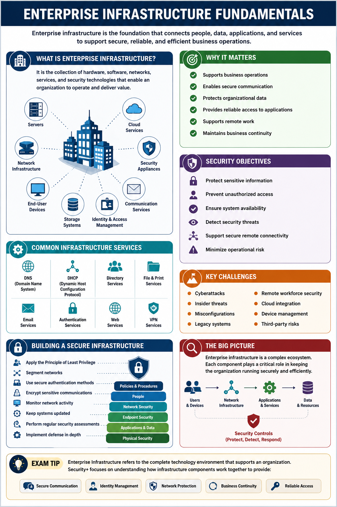
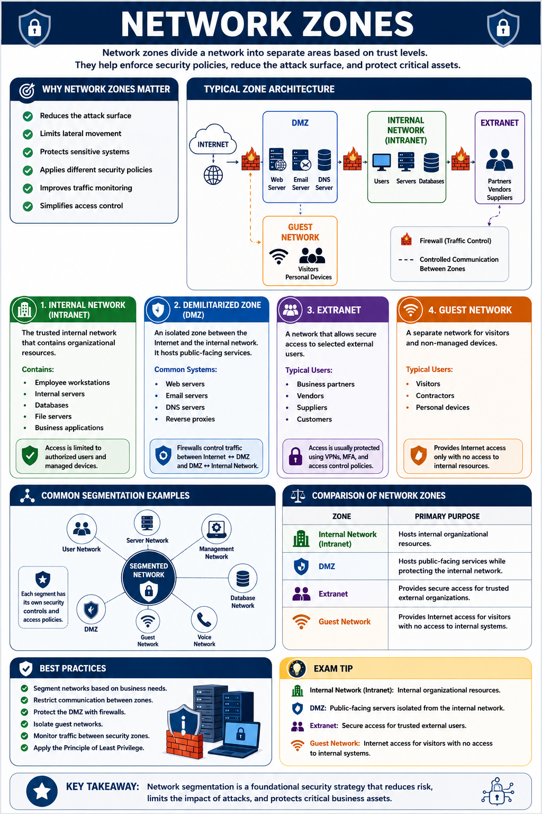
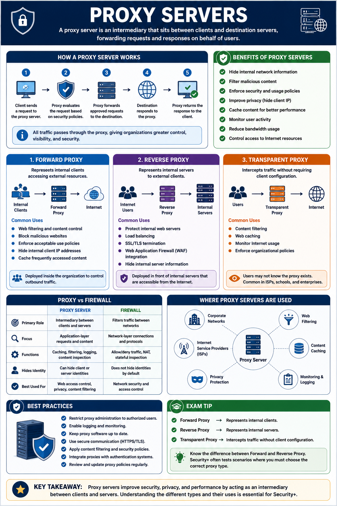
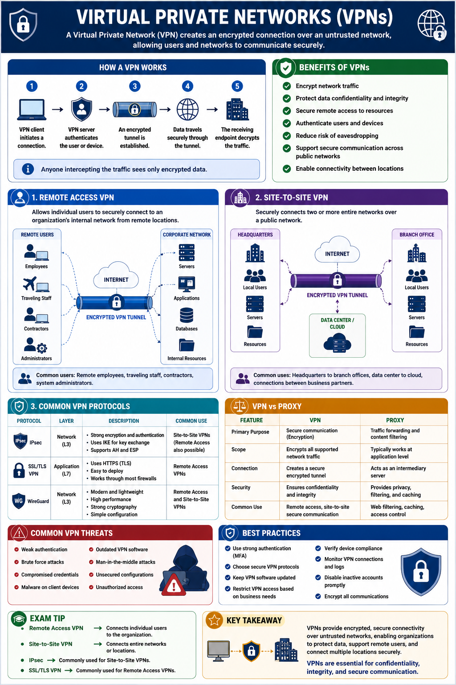
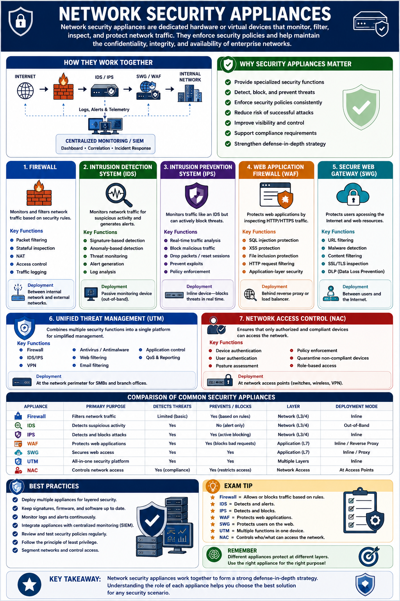
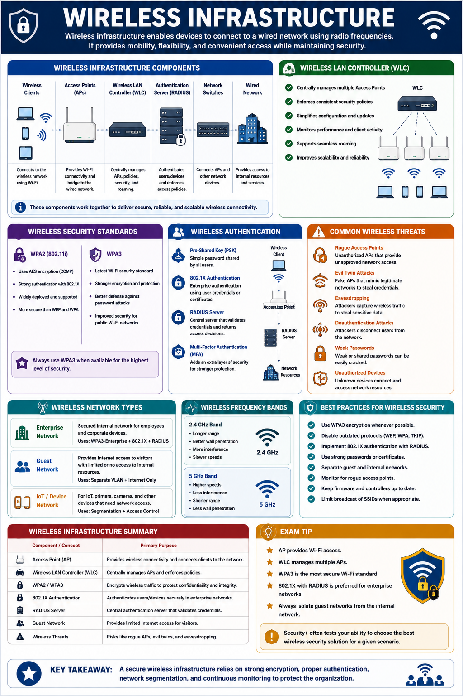
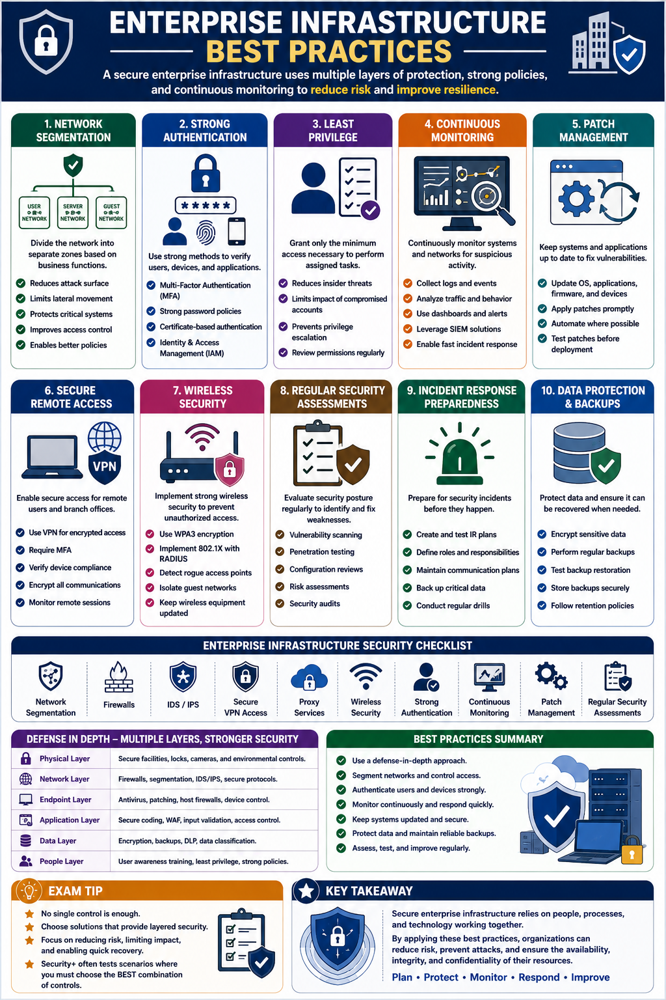

# Enterprise Infrastructure

## 1. Enterprise Infrastructure Fundamentals

Enterprise Infrastructure is the collection of hardware, software, networks, services, and security technologies that support an organization's daily operations.

It provides the foundation for communication, data storage, application delivery, user access, and business continuity across on-premises environments, cloud platforms, and remote locations.

A secure enterprise infrastructure protects organizational assets while ensuring reliable and efficient business operations.

---

### Core Components

Enterprise infrastructure typically consists of several interconnected components.

These include:

- Network infrastructure
- Servers
- Storage systems
- End-user devices
- Cloud services
- Network security appliances
- Identity and access management systems
- Communication services

Each component contributes to the overall security and availability of the enterprise environment.

---

### Why Enterprise Infrastructure Matters

Organizations depend on enterprise infrastructure to:

- Support business operations.
- Enable secure communication.
- Protect organizational data.
- Provide reliable access to applications.
- Support remote work.
- Maintain business continuity.

A failure in any critical infrastructure component can significantly impact business operations.

---

### Security Objectives

A secure enterprise infrastructure should achieve the following objectives:

- Protect sensitive information.
- Prevent unauthorized access.
- Ensure system availability.
- Detect security threats.
- Support secure remote connectivity.
- Minimize operational risk.

These objectives are achieved through layered security controls and continuous monitoring.

---

### Common Infrastructure Services

Enterprise environments commonly provide services such as:

- DNS (Domain Name System)
- DHCP (Dynamic Host Configuration Protocol)
- Directory Services
- File and Print Services
- Email Services
- Authentication Services
- Web Services
- VPN Services

These services enable users and devices to communicate securely across the organization.

---

### Infrastructure Security Challenges

Modern enterprise infrastructures face numerous security challenges, including:

- Cyberattacks
- Insider threats
- Misconfigurations
- Legacy systems
- Remote workforce security
- Cloud integration
- Device management
- Third-party risks

Organizations must continuously assess and improve their infrastructure to address evolving threats.

---

### Building a Secure Enterprise Infrastructure

Organizations improve infrastructure security by:

- Applying the Principle of Least Privilege.
- Segmenting networks.
- Using secure authentication methods.
- Encrypting sensitive communications.
- Monitoring network activity.
- Keeping systems updated.
- Performing regular security assessments.
- Implementing defense in depth.

Combining these practices strengthens the organization's overall security posture.

---

> **Exam Tip**
>
> Enterprise Infrastructure refers to the complete technology environment that supports an organization.
>
> Security+ focuses on understanding how infrastructure components work together to provide:
>
> - Secure communication
> - Identity management
> - Network protection
> - Business continuity
> - Reliable access to organizational resources

---
## 2. Network Zones

A network zone is a logical or physical segment of a network that groups systems with similar security requirements.

By separating resources into different zones, organizations can enforce security policies, limit unauthorized access, and reduce the impact of security incidents.

Network segmentation is a fundamental security practice that improves both security and network performance.

---

### Why Network Zones Matter

Dividing a network into security zones helps organizations:

- Reduce the attack surface.
- Limit lateral movement.
- Protect sensitive systems.
- Apply different security policies.
- Improve traffic monitoring.
- Simplify access control.

Each zone should allow only the communication necessary for business operations.

---

### Internal Network (Intranet)

The Internal Network, also known as the Intranet, is the trusted portion of an organization's network.

It contains internal resources such as:

- Employee workstations
- Internal servers
- Databases
- File servers
- Business applications

Access is typically limited to authorized users and managed devices.

Although considered trusted, internal networks should still be monitored and protected because insider threats and compromised devices remain possible.

---

### Demilitarized Zone (DMZ)

A Demilitarized Zone (DMZ) is an isolated network segment positioned between the internal network and the public Internet.

The DMZ hosts systems that must be accessible from outside the organization while protecting the internal network.

Common DMZ systems include:

- Web servers
- Email servers
- DNS servers
- Reverse proxies

Firewalls control traffic between:

- Internet ↔ DMZ
- DMZ ↔ Internal Network

This layered design prevents attackers from directly reaching internal resources if a public-facing server is compromised.

---

### Extranet

An Extranet is a private network that provides controlled access to selected external users.

Typical users include:

- Business partners
- Vendors
- Suppliers
- Customers

Access is usually protected using:

- VPNs
- Multi-Factor Authentication (MFA)
- Access control policies

An Extranet allows collaboration while limiting access to only the required resources.

---

### Guest Network

A Guest Network is a separate network designed for visitors and non-managed devices.

It provides Internet access without allowing access to internal organizational resources.

Typical users include:

- Visitors
- Contractors
- Personal devices

Guest networks should always be isolated from the organization's production network.

---

### Secure Network Segmentation

Organizations improve security by separating different types of systems into dedicated zones.

Common segmentation examples include:

- User Network
- Server Network
- Management Network
- Database Network
- Voice Network
- Guest Network
- DMZ

Each segment should have its own security controls and access policies.

---

### Comparison of Common Network Zones

| Zone | Primary Purpose |
|------|-----------------|
| **Internal Network (Intranet)** | Hosts internal organizational resources |
| **DMZ** | Hosts public-facing services while protecting the internal network |
| **Extranet** | Provides secure access for trusted external organizations |
| **Guest Network** | Provides Internet access for visitors without exposing internal resources |

---

### Best Practices

Organizations should:

- Segment networks based on business needs.
- Restrict communication between zones.
- Protect the DMZ with firewalls.
- Isolate guest networks.
- Monitor traffic between security zones.
- Apply the Principle of Least Privilege across all network segments.

Proper segmentation significantly reduces the impact of network compromises.

---

> **Exam Tip**
>
> Security+ frequently tests the purpose of each network zone:
>
> - **Internal Network (Intranet)** → Internal organizational resources.
> - **DMZ** → Public-facing servers isolated from the internal network.
> - **Extranet** → Secure access for trusted external users.
> - **Guest Network** → Internet access for visitors with no access to internal systems.
>
> Remember that **network segmentation** is a key defense against lateral movement.

---
## 3. Proxy Servers

A Proxy Server is an intermediary system that sits between clients and destination servers, forwarding requests and responses on behalf of users.

Instead of clients communicating directly with external resources, they first connect to the proxy server, which then communicates with the destination.

Proxy servers improve security, privacy, performance, and access control within enterprise environments.

---

### How a Proxy Server Works

A typical proxy communication process is:

1. A client sends a request to the proxy server.
2. The proxy evaluates the request based on security policies.
3. The proxy forwards approved requests to the destination server.
4. The destination responds to the proxy.
5. The proxy returns the response to the client.

Because all traffic passes through the proxy, organizations gain greater visibility and control over network communications.

---

### Forward Proxy

A Forward Proxy represents internal clients when they access external resources such as websites or cloud services.

It is commonly used to:

- Filter web traffic.
- Block malicious websites.
- Enforce acceptable use policies.
- Hide client IP addresses.
- Cache frequently accessed content.

Forward proxies are typically deployed inside an organization's network.

---

### Reverse Proxy

A Reverse Proxy represents one or more backend servers instead of clients.

External users communicate with the reverse proxy, which forwards requests to the appropriate internal server.

Common uses include:

- Protecting web servers.
- Load balancing.
- SSL/TLS termination.
- Web Application Firewall (WAF) integration.
- Hiding internal server details.

Reverse proxies improve both security and performance for public-facing applications.

---

### Transparent Proxy

A Transparent Proxy intercepts network traffic without requiring client configuration.

Users may not even know the proxy exists.

Common uses include:

- Content filtering
- Web caching
- Monitoring Internet usage
- Enforcing organizational policies

Internet Service Providers (ISPs), schools, and enterprises often deploy transparent proxies.

---

### Benefits of Proxy Servers

Proxy servers provide several security and operational advantages:

- Hide internal network information.
- Filter malicious content.
- Enforce security policies.
- Improve privacy.
- Cache frequently accessed resources.
- Monitor user activity.
- Reduce bandwidth usage.

---

### Proxy vs. Firewall

Although both protect networks, they perform different functions.

| Proxy Server | Firewall |
|--------------|----------|
| Intermediary between clients and servers | Filters network traffic between networks |
| Can inspect application-layer requests | Primarily controls traffic based on security rules |
| Provides caching and content filtering | Blocks or allows network connections |
| Hides client or server identities | Protects network boundaries |

Many enterprise environments deploy both firewalls and proxy servers together.

---

### Best Practices

Organizations should:

- Restrict proxy administration.
- Enable logging and monitoring.
- Keep proxy software updated.
- Use secure communication protocols.
- Apply content filtering policies.
- Integrate proxies with authentication systems.

Proper proxy configuration strengthens security while improving network performance.

---

> **Exam Tip**
>
> Remember the different proxy types:
>
> - **Forward Proxy** → Represents internal clients.
> - **Reverse Proxy** → Represents internal servers.
> - **Transparent Proxy** → Intercepts traffic without client configuration.
>
> Security+ commonly tests the distinction between **Forward Proxy** and **Reverse Proxy**, especially in enterprise web environments.

---
## 4. Virtual Private Networks (VPNs)

A Virtual Private Network (VPN) is a secure communication technology that creates an encrypted connection over an untrusted network, such as the Internet.

VPNs protect data confidentiality and integrity by encrypting network traffic between endpoints, allowing users and systems to communicate securely regardless of their physical location.

VPNs are widely used to support remote work, secure site-to-site communications, and protect sensitive data during transmission.

---

### How a VPN Works

A VPN establishes a secure tunnel between two endpoints.

The communication process typically follows these steps:

1. A VPN client initiates a connection.
2. The VPN server authenticates the user or device.
3. An encrypted tunnel is established.
4. Data travels securely through the tunnel.
5. The receiving endpoint decrypts the traffic.

Anyone intercepting the traffic sees only encrypted data.

---

### Remote Access VPN

A Remote Access VPN allows individual users to securely connect to an organization's internal network from remote locations.

Common users include:

- Remote employees
- Traveling staff
- Contractors
- System administrators

Remote Access VPNs provide secure access to internal resources while protecting data transmitted over the Internet.

---

### Site-to-Site VPN

A Site-to-Site VPN securely connects two or more networks over a public network.

Instead of connecting individual users, the VPN connects entire locations.

Common examples include:

- Headquarters to branch offices
- Data center to cloud environment
- Connections between business partners

Users at each site communicate as if they were on the same local network.

---

### Common VPN Protocols

Several protocols are commonly used to establish VPN connections.

**IPsec**

- Provides strong encryption and authentication.
- Commonly used for Site-to-Site VPNs.
- Operates at the Network Layer.

**SSL/TLS VPN**

- Uses HTTPS to create secure remote connections.
- Frequently used for Remote Access VPNs.
- Supported by most modern web browsers.

**WireGuard**

- Modern VPN protocol.
- High performance.
- Strong cryptography.
- Simple configuration.

---

### Benefits of VPNs

VPNs provide several important security advantages:

- Encrypt network traffic.
- Protect data confidentiality.
- Secure remote access.
- Authenticate users and devices.
- Reduce the risk of eavesdropping.
- Support secure communication across public networks.

---

### VPN vs. Proxy

Although both can hide network traffic, they serve different purposes.

| VPN | Proxy |
|-----|-------|
| Encrypts all supported network traffic | Typically forwards application traffic |
| Creates a secure tunnel | Acts as an intermediary |
| Protects confidentiality and integrity | Primarily provides filtering and privacy |
| Used for secure communications | Used for traffic control and content filtering |

VPNs focus on secure communication, while proxies primarily manage and filter traffic.

---

### Best Practices

Organizations should:

- Use strong authentication, including MFA.
- Select secure VPN protocols.
- Keep VPN software updated.
- Restrict VPN access based on business needs.
- Monitor VPN connections for suspicious activity.
- Disable inactive accounts promptly.

Proper VPN management significantly improves the security of remote access.

---

> **Exam Tip**
>
> Remember:
>
> - **Remote Access VPN** → Connects individual users to an organization's network.
> - **Site-to-Site VPN** → Connects entire networks together.
> - **IPsec** is commonly used for Site-to-Site VPNs.
> - **SSL/TLS VPN** is commonly used for Remote Access VPNs.
>
> Security+ frequently tests the difference between **VPNs** and **Proxy Servers**, as well as the distinction between **Remote Access** and **Site-to-Site** VPNs.

---
## 5. Network Security Appliances

Network Security Appliances are dedicated hardware or virtual devices that monitor, filter, inspect, and protect network traffic.

They enforce security policies, detect malicious activity, and help maintain the confidentiality, integrity, and availability of enterprise networks.

Organizations typically deploy multiple security appliances together as part of a layered defense strategy.

---

### Firewall

A Firewall monitors and filters network traffic based on predefined security rules.

It controls which connections are allowed or denied between networks.

Common functions include:

- Packet filtering
- Stateful inspection
- Network Address Translation (NAT)
- Access control
- Traffic logging

Firewalls are commonly deployed between internal networks and external networks such as the Internet.

---

### Intrusion Detection System (IDS)

An Intrusion Detection System (IDS) monitors network traffic for suspicious or malicious activity.

When an attack is detected, the IDS generates alerts but does not automatically block the traffic.

Common detection methods include:

- Signature-based detection
- Anomaly-based detection

IDS solutions improve visibility into potential security threats.

---

### Intrusion Prevention System (IPS)

An Intrusion Prevention System (IPS) performs the same monitoring functions as an IDS but can also actively block malicious traffic.

An IPS may:

- Drop malicious packets
- Reset connections
- Block attacker IP addresses
- Prevent known exploits

IPS devices are typically deployed inline so they can stop attacks before they reach their targets.

---

### Web Application Firewall (WAF)

A Web Application Firewall (WAF) protects web applications by inspecting HTTP and HTTPS traffic.

Unlike traditional firewalls, a WAF understands web application requests and protects against application-layer attacks.

Common threats blocked by a WAF include:

- SQL Injection
- Cross-Site Scripting (XSS)
- File inclusion attacks
- Malicious HTTP requests

WAFs are commonly deployed behind reverse proxies or load balancers.

---

### Secure Web Gateway (SWG)

A Secure Web Gateway protects users when accessing Internet resources.

Typical functions include:

- URL filtering
- Malware detection
- Content filtering
- SSL/TLS inspection
- Data Loss Prevention (DLP)

SWGs help organizations enforce Internet usage policies while protecting users from web-based threats.

---

### Unified Threat Management (UTM)

Unified Threat Management (UTM) combines multiple security functions into a single platform.

A UTM solution may include:

- Firewall
- IDS/IPS
- VPN
- Antivirus
- Web filtering
- Email filtering

UTM devices simplify security management for small and medium-sized organizations.

---

### Network Access Control (NAC)

Network Access Control (NAC) ensures that only authorized and compliant devices can access the network.

Before granting access, NAC may verify:

- User identity
- Device authentication
- Operating system status
- Security patches
- Antivirus software

Devices that fail compliance checks may be denied access or placed in a restricted network.

---

### Comparison of Common Security Appliances

| Appliance | Primary Function |
|-----------|------------------|
| **Firewall** | Filters network traffic |
| **IDS** | Detects suspicious activity |
| **IPS** | Detects and blocks attacks |
| **WAF** | Protects web applications |
| **SWG** | Secures web browsing |
| **UTM** | Combines multiple security services |
| **NAC** | Controls network access based on identity and compliance |

---

### Best Practices

Organizations should:

- Deploy multiple security appliances as part of a layered defense.
- Keep appliance signatures and software updated.
- Monitor security logs continuously.
- Regularly review security policies.
- Test appliance configurations.
- Integrate appliances with centralized monitoring systems.

Using multiple security appliances together significantly improves an organization's overall security posture.

---

> **Exam Tip**
>
> Remember the primary purpose of each appliance:
>
> - **Firewall** → Filters network traffic.
> - **IDS** → Detects attacks.
> - **IPS** → Detects and blocks attacks.
> - **WAF** → Protects web applications.
> - **SWG** → Secures Internet browsing.
> - **UTM** → Combines multiple security functions.
> - **NAC** → Verifies device compliance before granting network access.
>
> Security+ frequently asks you to identify **which appliance best addresses a specific security scenario**.

---
## 6. Wireless Infrastructure

Wireless Infrastructure enables devices to communicate over radio frequencies instead of physical cables. It provides flexibility, mobility, and convenient network access for users, making it a critical component of modern enterprise environments.

Because wireless networks broadcast signals through the air, they require strong security controls to prevent unauthorized access and protect sensitive data.

---

### Wireless Components

A typical enterprise wireless network includes:

- Wireless Access Points (APs)
- Wireless Clients
- Wireless Controllers
- Authentication Servers
- Network Switches

These components work together to provide secure and reliable wireless connectivity.

---

### Wireless Access Point (AP)

A Wireless Access Point (AP) connects wireless devices to a wired network.

Its primary functions include:

- Providing Wi-Fi connectivity
- Managing wireless communications
- Enforcing wireless security settings
- Extending network coverage

Large organizations often deploy multiple APs to provide seamless coverage across buildings.

---

### Wireless LAN Controller (WLC)

A Wireless LAN Controller (WLC) centrally manages multiple wireless access points.

A WLC simplifies administration by allowing administrators to:

- Configure multiple APs
- Apply consistent security policies
- Monitor wireless performance
- Manage firmware updates
- Support seamless roaming

Centralized management improves both scalability and security.

---

### Wireless Security Standards

Modern wireless networks use different security standards to protect communications.

**WPA2**

- Uses AES encryption.
- Widely deployed.
- More secure than older WEP and WPA standards.

**WPA3**

- Latest Wi-Fi security standard.
- Stronger encryption.
- Better protection against password attacks.
- Improved security for public Wi-Fi networks.

Organizations should deploy WPA3 whenever possible.

---

### Wireless Authentication

Enterprise wireless networks commonly authenticate users through:

- Pre-Shared Key (PSK)
- 802.1X Authentication
- RADIUS Server
- Multi-Factor Authentication (MFA)

Enterprise authentication provides stronger security than shared passwords.

---

### Common Wireless Threats

Wireless networks face several security risks, including:

- Rogue Access Points
- Evil Twin Attacks
- Eavesdropping
- Deauthentication Attacks
- Weak Passwords
- Unauthorized Devices

Proper monitoring and strong authentication help reduce these risks.

---

### Best Practices

Organizations should:

- Use WPA3 whenever available.
- Disable outdated protocols such as WEP.
- Implement 802.1X authentication for enterprise environments.
- Deploy strong passwords or certificates.
- Monitor for rogue access points.
- Separate guest wireless networks from internal networks.
- Keep wireless equipment updated.

Applying these practices significantly improves wireless security.

---

### Wireless Infrastructure Summary

| Component | Primary Purpose |
|-----------|------------------|
| **Access Point (AP)** | Provides wireless network access |
| **Wireless LAN Controller (WLC)** | Centrally manages multiple APs |
| **WPA2/WPA3** | Encrypts wireless communications |
| **802.1X** | Authenticates enterprise users |
| **RADIUS** | Central authentication server |

---

> **Exam Tip**
>
> Remember:
>
> - **AP** provides Wi-Fi connectivity.
> - **WLC** centrally manages multiple access points.
> - **WPA3** is the most secure Wi-Fi standard.
> - **802.1X** with **RADIUS** is the preferred authentication method for enterprise wireless networks.
> - Always isolate **guest Wi-Fi** from the internal enterprise network.

---
## 7. Enterprise Infrastructure Best Practices

Securing enterprise infrastructure requires a defense-in-depth approach that combines technical controls, administrative policies, and continuous monitoring.

Rather than relying on a single security solution, organizations implement multiple layers of protection to reduce risk and improve resilience against cyber threats.

---

### Network Segmentation

Divide the network into separate security zones based on business functions.

Benefits include:

- Reduces the attack surface.
- Limits lateral movement.
- Protects sensitive systems.
- Simplifies access control.
- Improves incident containment.

Segmentation should be enforced using firewalls, VLANs, and access control policies.

---

### Strong Authentication

Access to enterprise resources should require strong authentication mechanisms.

Organizations should implement:

- Multi-Factor Authentication (MFA)
- Strong password policies
- Certificate-based authentication
- Identity and Access Management (IAM)

Strong authentication helps prevent unauthorized access even if passwords are compromised.

---

### Least Privilege

Users, devices, and applications should receive only the permissions necessary to perform their assigned tasks.

Applying the Principle of Least Privilege reduces the potential impact of:

- Insider threats
- Compromised accounts
- Malware infections
- Privilege escalation attacks

Permissions should be reviewed regularly.

---

### Continuous Monitoring

Enterprise networks should be continuously monitored to identify suspicious activity.

Monitoring commonly includes:

- Firewall logs
- IDS/IPS alerts
- Authentication events
- Network traffic analysis
- Security dashboards
- SIEM platforms

Early detection enables faster incident response.

---

### Patch Management

Keeping systems up to date is one of the most effective security practices.

Organizations should regularly update:

- Operating systems
- Network devices
- Applications
- Firmware
- Security appliances

Timely patching reduces exposure to known vulnerabilities.

---

### Secure Remote Access

Remote users should access enterprise resources securely.

Recommended practices include:

- VPN connections
- MFA
- Device compliance verification
- Encrypted communications
- Session monitoring

These controls protect organizational resources outside the corporate network.

---

### Wireless Security

Enterprise wireless networks should be protected by:

- WPA3 encryption
- 802.1X authentication
- RADIUS servers
- Rogue access point detection
- Guest network isolation

Strong wireless security prevents unauthorized access to enterprise resources.

---

### Regular Security Assessments

Organizations should routinely evaluate the security of their infrastructure.

Common assessment activities include:

- Vulnerability scanning
- Penetration testing
- Configuration reviews
- Risk assessments
- Security audits

Regular assessments help identify weaknesses before attackers do.

---

### Enterprise Infrastructure Security Checklist

A secure enterprise infrastructure should include:

- Network segmentation
- Firewalls
- IDS/IPS
- Secure VPN access
- Proxy services where appropriate
- Strong authentication
- Wireless security
- Continuous monitoring
- Regular patch management
- Security assessments

These controls work together to provide layered protection across the enterprise.

---

> **Exam Tip**
>
> Security+ often emphasizes that **no single security control is sufficient**.
>
> Enterprise infrastructure is protected through **Defense in Depth**, where multiple complementary controls work together, including:
>
> - Network segmentation
> - Firewalls
> - VPNs
> - Proxy servers
> - IDS/IPS
> - Strong authentication
> - Continuous monitoring
> - Regular patching
>
> When answering exam questions, choose the solution that provides **layered security** rather than relying on a single technology.

