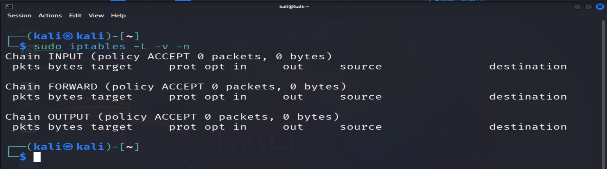
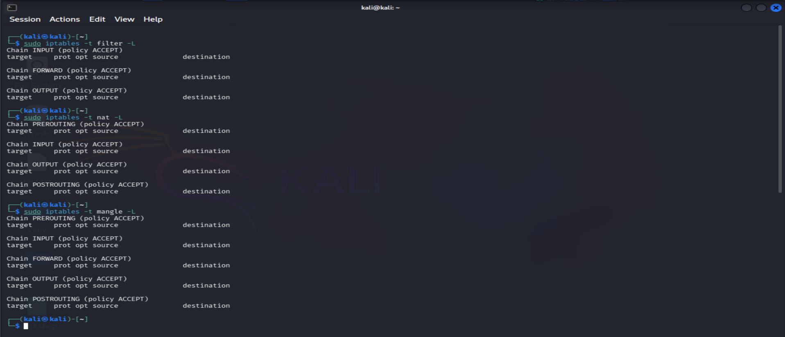
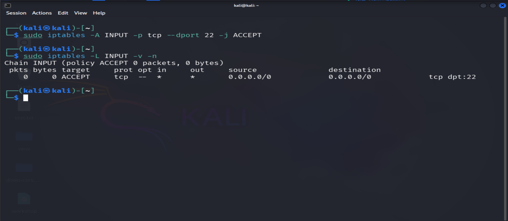
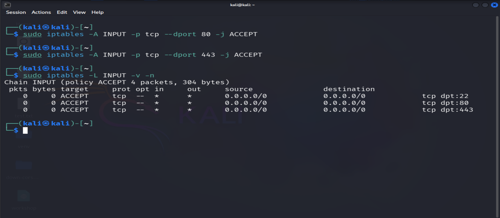
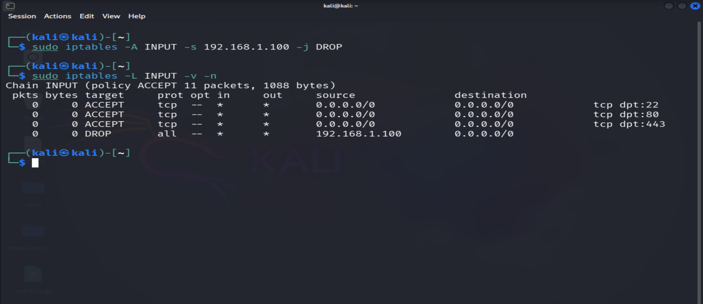
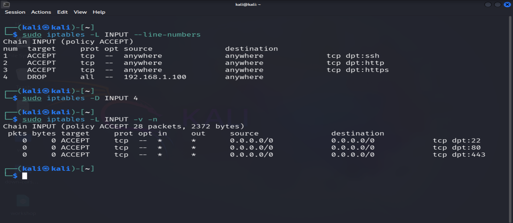
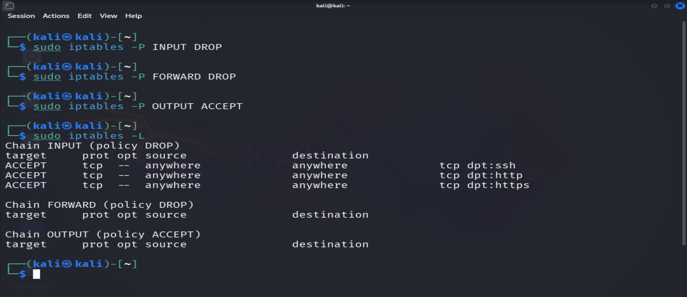
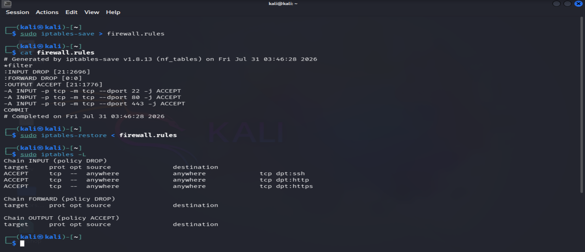

# Linux Firewall Fundamentals Lab

This lab provides hands-on experience with Linux firewall administration using **iptables**. You will learn how to inspect existing firewall rules, create and remove rules, configure default policies, and verify firewall behavior.

The exercises are designed to reinforce the concepts introduced in the accompanying notes while developing practical skills commonly required in Linux system administration and cybersecurity.

---
> **Lab Info**
>
> - Estimated Time: 20–30 minutes
> - Difficulty: Beginner
> - Platform: Linux
> - Tool: iptables
> - Objective: Learn the fundamentals of Linux firewall administration.
---

## Lab Objectives

After completing this lab, you will be able to:

- Inspect existing firewall rules.
- Understand the relationship between tables and chains.
- Create basic firewall rules.
- Allow network services through the firewall.
- Block unwanted traffic.
- Remove firewall rules safely.
- Configure default firewall policies.
- Save and restore firewall configurations.
- Verify firewall rules and troubleshoot common issues.

---

## Prerequisites

Before starting this lab, ensure that you have:

- A Linux system with **iptables** installed.
- Administrative (sudo) privileges.
- Basic knowledge of Linux command-line operations.
- A terminal application.
- Internet connectivity (optional for testing).

> **Note**
>
> Modifying firewall rules may interrupt network connectivity, especially when working over SSH. Whenever possible, perform these exercises on a virtual machine or test environment.

---

## Lab Environment

This lab was designed for a Linux environment using **iptables**.

Example environments include:

- Ubuntu Server
- Debian
- Kali Linux
- CentOS
- Rocky Linux
- AlmaLinux

Depending on the distribution, some commands or services may vary slightly.

---

## Exercise 1 – Inspect Existing Firewall Rules

### Objective

Display the current firewall configuration and identify existing chains, rules, and default policies.

### Step 1 – List Current Rules

Run the following command:

```bash
sudo iptables -L
```

### Explanation

This command displays the rules stored in the default **filter** table.

It lists:

- Available chains
- Existing firewall rules
- Default chain policies

### Step 2 – Display Verbose Information

Run:

```bash
sudo iptables -L -v -n
```

### Explanation

The additional options provide more detailed information:

- **-v** displays packet and byte counters.
- **-n** disables DNS resolution for faster output.

This output is commonly used when troubleshooting firewall configurations.

### Expected Result

You should see one or more built-in chains, such as:

- INPUT
- OUTPUT
- FORWARD

Each chain will display:

- Policy
- Packet counters
- Matching rules (if any)

---



---

## Exercise 2 – Understand Tables and Chains

### Objective

Display firewall rules from different tables and observe how iptables organizes packet filtering.

### Step 1 – View the Filter Table

```bash
sudo iptables -t filter -L
```

### Step 2 – View the NAT Table

```bash
sudo iptables -t nat -L
```

### Step 3 – View the Mangle Table

```bash
sudo iptables -t mangle -L
```

### Explanation

Each table serves a different purpose:

| Table | Purpose |
|--------|---------|
| **filter** | Packet filtering and access control |
| **nat** | Network Address Translation |
| **mangle** | Packet modification |

Notice that each table contains different built-in chains depending on its function.

### Expected Result

The available chains depend on the Linux distribution and iptables backend.

Most systems include:

- filter: INPUT, FORWARD, OUTPUT
- nat: PREROUTING, OUTPUT, POSTROUTING
- mangle: PREROUTING, INPUT, FORWARD, OUTPUT, POSTROUTING

Some distributions may expose additional built-in chains.

---



---

## Exercise 3 – Allow SSH Access

### Objective

Create a firewall rule that allows incoming SSH connections on port **22**.

### Step 1 – Add the Rule

Run the following command:

```bash
sudo iptables -A INPUT -p tcp --dport 22 -j ACCEPT
```

### Explanation

This command appends a new rule to the **INPUT** chain.

The rule:

- Applies to the **TCP** protocol.
- Matches traffic destined for port **22**.
- Allows matching packets using the **ACCEPT** target.

SSH is commonly used for secure remote administration, making it one of the first services administrators explicitly allow through a firewall.

### Step 2 – Verify the Rule

```bash
sudo iptables -L INPUT -v -n
```

### Expected Result

The INPUT chain should now contain a rule similar to:

```text
ACCEPT  tcp  --  0.0.0.0/0   0.0.0.0/0   tcp dpt:22
```

---



---

## Exercise 4 – Allow HTTP and HTTPS Traffic

### Objective

Permit inbound web traffic by allowing HTTP and HTTPS connections.

### Step 1 – Allow HTTP

```bash
sudo iptables -A INPUT -p tcp --dport 80 -j ACCEPT
```

### Step 2 – Allow HTTPS

```bash
sudo iptables -A INPUT -p tcp --dport 443 -j ACCEPT
```

### Explanation

These rules allow users to access web services hosted on the system.

| Port | Service |
|------|---------|
| **80** | HTTP |
| **443** | HTTPS |

Most production web servers require both ports to be accessible.

### Step 3 – Verify the Rules

```bash
sudo iptables -L INPUT -v -n
```

### Expected Result

The INPUT chain should now include rules for:

- Port 22 (SSH)
- Port 80 (HTTP)
- Port 443 (HTTPS)

---



---

## Exercise 5 – Block Traffic from a Specific IP Address

### Objective

Block all traffic originating from a specific IP address.

### Step 1 – Add the Rule

Replace the example IP address with the desired source address.

```bash
sudo iptables -A INPUT -s 192.168.1.100 -j DROP
```

### Explanation

This rule matches every packet coming from the specified IP address and silently discards it using the **DROP** target.

Unlike **REJECT**, the sender receives no notification that the packet has been blocked.

### Step 2 – Verify the Rule

```bash
sudo iptables -L INPUT -v -n
```

### Expected Result

A DROP rule should appear in the INPUT chain for the specified source IP address.

---



---

## Exercise 6 – Remove Firewall Rules

### Objective

Delete an existing firewall rule.

### Method 1 – Delete by Rule Number

First, display the rules with line numbers.

```bash
sudo iptables -L INPUT --line-numbers
```

Example output:

```text
num  target     prot opt source          destination
1    ACCEPT     tcp  --  anywhere        anywhere tcp dpt:ssh
2    ACCEPT     tcp  --  anywhere        anywhere tcp dpt:http
3    DROP       all  --  192.168.1.100   anywhere
```

Delete a rule by its number.

```bash
sudo iptables -D INPUT 3
```

### Method 2 – Delete by Rule Specification

Alternatively, delete the rule by specifying its parameters.

```bash
sudo iptables -D INPUT -s 192.168.1.100 -j DROP
```

### Explanation

Deleting by rule number is usually faster, while deleting by rule specification is useful when the rule position may change.

### Verify

```bash
sudo iptables -L INPUT -v -n
```

### Expected Result

The deleted rule should no longer appear in the INPUT chain.

---



---

## Exercise 7 – Configure Default Policies

### Objective

Configure default policies to define how iptables handles packets that do not match any firewall rule.

### Default Policy Overview

Each built-in chain has a default policy that is applied when no rule matches an incoming packet.

The most common policies are:

| Policy | Behavior |
|---------|----------|
| **ACCEPT** | Allows unmatched packets. |
| **DROP** | Silently discards unmatched packets. |

A **default deny** strategy is generally considered the most secure approach because only explicitly permitted traffic is allowed.

### Step 1 – Set the INPUT Policy

```bash
sudo iptables -P INPUT DROP
```

### Step 2 – Set the FORWARD Policy

```bash
sudo iptables -P FORWARD DROP
```

### Step 3 – Keep OUTPUT Open

```bash
sudo iptables -P OUTPUT ACCEPT
```

### Explanation

These commands configure the firewall to:

- Block unsolicited inbound traffic.
- Block forwarded traffic.
- Allow locally generated outbound traffic.

> **Important**
>
> If you are connected through SSH, ensure an SSH allow rule already exists before changing the INPUT policy. Otherwise, your current session may be terminated.

### Verify

```bash
sudo iptables -L
```

### Expected Result

The chain policies should appear similar to:

```text
Chain INPUT (policy DROP)
Chain FORWARD (policy DROP)
Chain OUTPUT (policy ACCEPT)
```

---



---

## Exercise 8 – Save and Restore Firewall Rules

### Objective

Save the current firewall configuration so it can be restored after a reboot or system restart.

### Save Rules

On Debian-based systems:

```bash
sudo iptables-save > firewall.rules
```

### Restore Rules

```bash
sudo iptables-restore < firewall.rules
```

### Explanation

- `iptables-save` exports the current firewall configuration.
- `iptables-restore` imports a previously saved configuration.

Saving firewall rules is important because iptables rules are not automatically persistent on many Linux distributions.

### Verify

Display the current rules after restoring them.

```bash
sudo iptables -L -v -n
```

### Expected Result

The restored rules should match the previously saved configuration.

---



---

## Exercise 9 – Verify Firewall Configuration

### Objective

Verify that the firewall configuration is correct and functioning as expected.

### Display the Current Configuration

```bash
sudo iptables -L -v -n
```

### What to Verify

Check that:

- Required rules are present.
- Rule order is correct.
- Default policies are configured as intended.
- Packet and byte counters increase when traffic matches a rule.
- No unnecessary or duplicate rules exist.

### Review Rule Order

```bash
sudo iptables -L --line-numbers
```

This command makes it easier to review and troubleshoot firewall rule ordering.

### Expected Result

Your firewall configuration should:

- Allow authorized services.
- Block unauthorized traffic.
- Follow the Principle of Least Privilege.
- Use a clear and organized rule set.

---

## Common Troubleshooting Tips

If a firewall rule does not behave as expected:

- Verify that the rule is placed in the correct chain.
- Check the rule order, as iptables uses a **First Match Wins** approach.
- Confirm that the correct protocol and port are specified.
- Review the default chain policies.
- Inspect packet and byte counters using verbose mode.
- Ensure the rule was added to the correct table.
- Test changes in a non-production environment whenever possible.

---

## Lab Summary

In this lab, you learned how to:

- Inspect existing firewall rules.
- Explore firewall tables and chains.
- Allow SSH, HTTP, and HTTPS traffic.
- Block traffic from a specific IP address.
- Remove firewall rules.
- Configure default firewall policies.
- Save and restore firewall configurations.
- Verify firewall behavior and troubleshoot common issues.

These tasks represent the fundamental operations required to manage a Linux firewall using **iptables**. Mastering these skills provides a strong foundation for securing Linux systems and prepares you for more advanced firewall technologies such as **nftables** and enterprise firewall management solutions.

---

## Cleanup

To remove all rules created during this lab:

```bash
sudo iptables -F
```

Restore the default policies:

```bash
sudo iptables -P INPUT ACCEPT
sudo iptables -P FORWARD ACCEPT
sudo iptables -P OUTPUT ACCEPT
```

> **Note**
>
> Only perform these commands in a test environment. Clearing firewall rules on a production system may expose services to unauthorized access.