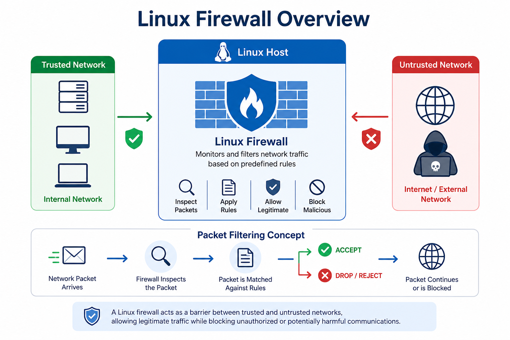
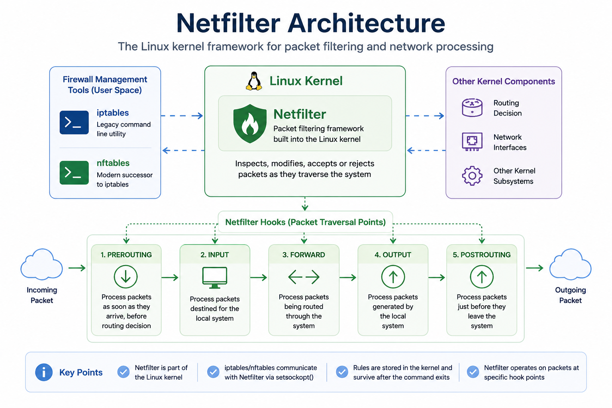
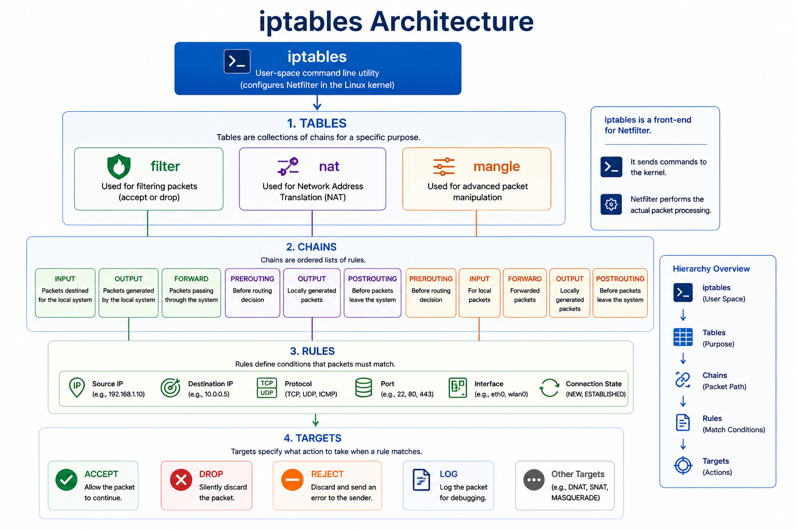
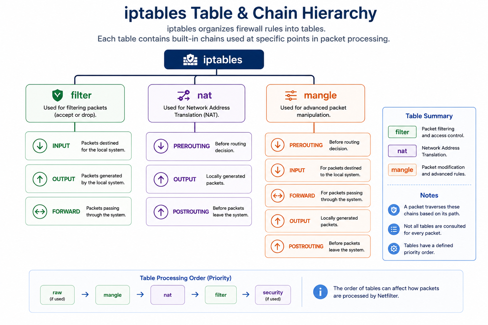
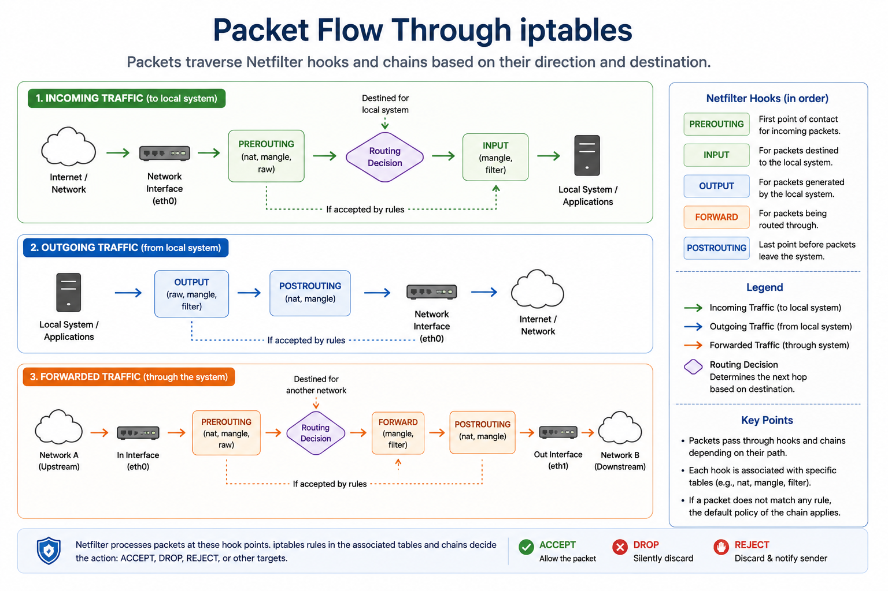
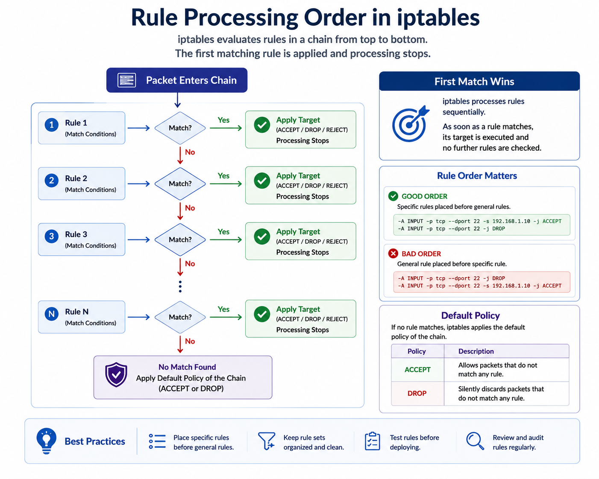
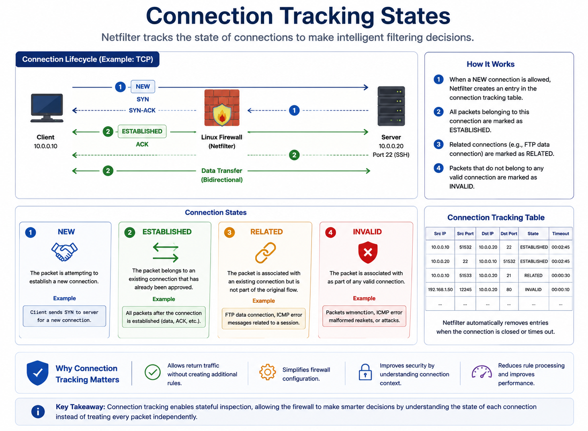
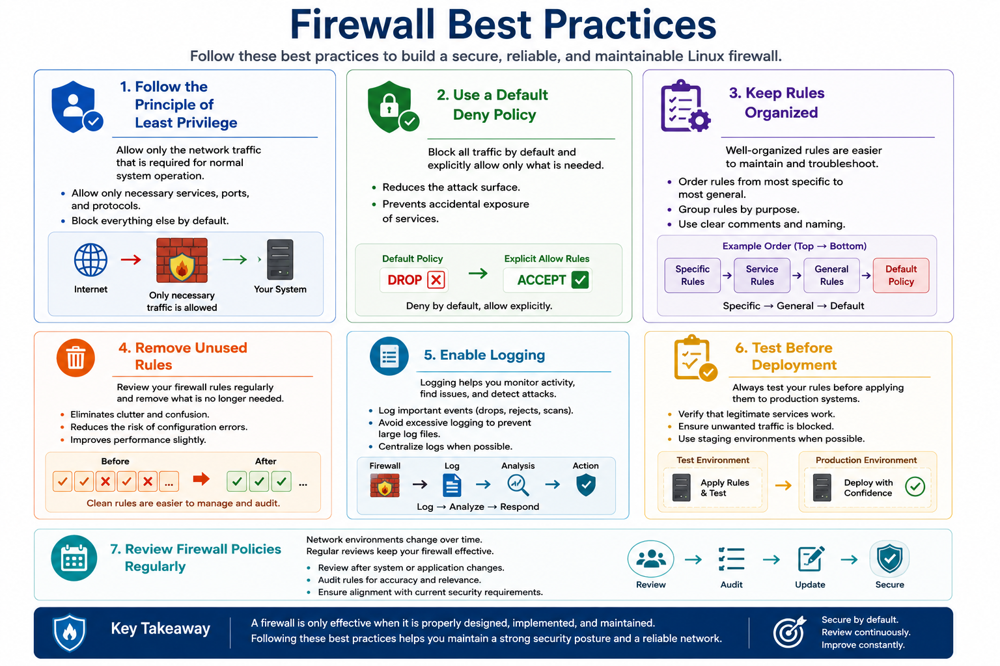

# Linux Firewall Fundamentals

## 1. Linux Firewall Fundamentals

A firewall is a security control that monitors and filters network traffic based on predefined security rules. It serves as a barrier between trusted and untrusted networks, allowing legitimate traffic while blocking unauthorized or potentially malicious communications.

In Linux systems, firewalls help secure servers, workstations, and network services by controlling which packets are allowed to enter, leave, or pass through the system. Proper firewall configuration reduces the attack surface and helps prevent unauthorized access to network resources.

Unlike network firewalls that protect an entire network, a Linux firewall operates directly on the host, providing protection for the operating system and the applications running on it.

### Why Linux Firewalls Matter

Linux firewalls are an essential layer of defense because they:

- Restrict unauthorized access to services.
- Control inbound and outbound network traffic.
- Reduce the system's attack surface.
- Enforce organizational security policies.
- Help mitigate network-based attacks.
- Support defense-in-depth security strategies.

Firewalls should not replace other security controls such as authentication, encryption, or intrusion detection. Instead, they work alongside them to provide multiple layers of protection.

### Packet Filtering

A Linux firewall makes decisions by inspecting network packets and comparing them against a set of predefined rules.

Filtering decisions are typically based on packet attributes such as:

- Source IP address
- Destination IP address
- Protocol (TCP, UDP, ICMP)
- Source or destination port
- Network interface
- Connection state

Each packet is evaluated against the firewall rules, and the first matching rule determines the action that will be taken.

### Stateful vs. Stateless Firewalls

Firewalls generally operate using one of two filtering methods.

| Stateless Firewall | Stateful Firewall |
|--------------------|-------------------|
| Evaluates each packet independently | Tracks active network connections |
| Does not remember previous traffic | Maintains connection state information |
| Faster but less intelligent | More secure and context-aware |
| Limited protection | Better protection for modern networks |

Most modern Linux firewall implementations support **stateful packet inspection**, allowing them to recognize established and related connections instead of treating every packet independently.

### Linux Firewall Solutions

Linux provides several firewall management solutions.

| Solution | Description |
|----------|-------------|
| **iptables** | Traditional firewall management utility built on the Netfilter framework. |
| **nftables** | Modern replacement for iptables with improved performance and simplified rule management. |
| **firewalld** | Dynamic firewall management service commonly used in Red Hat-based distributions. |
| **UFW** | User-friendly frontend for managing firewall rules, popular on Ubuntu systems. |

Although many modern Linux distributions now recommend **nftables**, understanding **iptables** remains important because it is still widely deployed in enterprise environments and frequently referenced in cybersecurity training, certifications, and legacy systems.

---



---

## 2. Netfilter Architecture

Before configuring firewall rules with **iptables**, it is important to understand **Netfilter**, the packet filtering framework built directly into the Linux kernel.

Netfilter is responsible for inspecting, modifying, accepting, or rejecting network packets as they travel through the operating system. It performs the actual packet filtering, while tools such as **iptables** and **nftables** provide a user interface for configuring its behavior.

In other words:

- **Netfilter** is the firewall framework inside the Linux kernel.
- **iptables** is a command-line utility used to create and manage firewall rules.
- **nftables** is the modern successor to iptables that also communicates with the Netfilter framework.

Understanding this distinction helps explain why firewall rules continue to function even after the `iptables` command has finished executing—the rules are stored and enforced by the Linux kernel, not by the command-line utility itself.

### Packet Processing

As packets travel through the Linux networking stack, they pass through several inspection points known as **hooks**. At each hook, Netfilter can examine the packet and determine whether it should continue, be modified, or be blocked.

The simplified packet processing flow is:

1. A packet arrives at the network interface.
2. The Linux kernel receives the packet.
3. Netfilter inspects the packet at the appropriate hook.
4. Firewall rules are evaluated.
5. The packet is accepted, rejected, dropped, or modified.
6. The packet is delivered locally or forwarded to another destination.

This process occurs for incoming, outgoing, and forwarded traffic, allowing Linux to enforce security policies regardless of the packet's direction.

### Netfilter Hooks

Netfilter provides five primary hooks where packet filtering and processing can occur.

| Hook | Purpose |
|------|---------|
| **PREROUTING** | Processes packets immediately after they arrive, before routing decisions are made. |
| **INPUT** | Processes packets destined for the local system. |
| **FORWARD** | Processes packets being routed through the system to another destination. |
| **OUTPUT** | Processes packets generated by the local system. |
| **POSTROUTING** | Processes packets just before they leave the system. |

Each hook serves a specific purpose in the packet's journey through the operating system. Firewall rules are attached to these processing stages, allowing administrators to control traffic at different points within the networking stack.

---



---

## 3. iptables Architecture

**iptables** is a command-line utility used to configure the Linux kernel's Netfilter framework. It allows administrators to define firewall policies by creating rules that determine how network packets should be handled.

Rather than filtering packets itself, `iptables` communicates with Netfilter, which performs the actual packet inspection and enforcement inside the Linux kernel.

The iptables architecture is built around four fundamental components:

- Tables
- Chains
- Rules
- Targets

Understanding how these components work together is essential for creating effective firewall policies.

### Tables

A **table** is a collection of chains designed for a specific packet-processing purpose.

Each table contains predefined chains where firewall rules are stored. Depending on the type of operation being performed—such as filtering traffic or translating network addresses—Netfilter processes packets using the appropriate table.

The most commonly used tables are:

- **filter** – Controls whether traffic is allowed or blocked.
- **nat** – Performs Network Address Translation (NAT).
- **mangle** – Modifies packet headers for advanced networking tasks.

### Chains

A **chain** is an ordered list of firewall rules.

When a packet reaches a chain, Netfilter evaluates each rule from top to bottom until a matching rule is found. If no rule matches, the chain's default policy determines the final action.

Each chain corresponds to a specific stage of packet processing, such as incoming, outgoing, or forwarded traffic.

### Rules

A **rule** defines the conditions that a packet must satisfy before an action is performed.

A rule can match various packet attributes, including:

- Source IP address
- Destination IP address
- Protocol
- Port number
- Network interface
- Connection state

Well-designed rule sets are typically organized from the most specific rules to the most general ones, improving both readability and efficiency.

### Targets

A **target** specifies the action that should be taken when a packet matches a rule.

Common targets include:

| Target | Action |
|--------|--------|
| **ACCEPT** | Allows the packet to continue. |
| **DROP** | Silently discards the packet. |
| **REJECT** | Blocks the packet and returns an error to the sender. |
| **LOG** | Records information about the packet for monitoring or troubleshooting. |

These four components work together to determine how every packet is processed as it travels through the Linux networking stack.

---



---

## 4. Tables and Chains

iptables organizes firewall rules into **tables**, each designed for a specific networking function. Every table contains one or more **chains**, which represent different stages of packet processing.

This organization keeps firewall rules structured and ensures that packets are processed according to their purpose.

### Common Tables

#### filter

The **filter** table is the default and most commonly used table. It is responsible for packet filtering and access control, determining whether traffic should be allowed or blocked.

Built-in chains:

- INPUT
- OUTPUT
- FORWARD

Typical use cases include:

- Allowing SSH access
- Blocking unwanted ports
- Restricting network services
- Controlling inbound and outbound traffic

#### nat

The **nat** (Network Address Translation) table modifies source or destination IP addresses.

It is primarily used when a system routes traffic between networks or performs address translation.

Built-in chains:

- PREROUTING
- OUTPUT
- POSTROUTING

Typical use cases include:

- Port forwarding
- Source NAT (SNAT)
- Destination NAT (DNAT)
- Internet gateway configuration

#### mangle

The **mangle** table is used to modify packet headers before packets continue through the networking stack.

Although less common in everyday firewall administration, it is useful for advanced networking features.

Typical use cases include:

- Packet marking
- Quality of Service (QoS)
- Traffic shaping
- Advanced routing

#### Other Tables

Additional tables exist for specialized networking tasks.

- **raw** – Used to exempt packets from connection tracking.
- **security** – Supports Linux Security Modules (LSMs) such as SELinux.

These tables are used less frequently and are generally encountered in advanced environments.

---

### Built-in Chains

Chains represent the different stages of packet processing. The chain a packet enters depends on whether it is entering the system, leaving it, or passing through it.

#### INPUT

Processes packets whose destination is the local system.

Examples:

- SSH connections to the server
- HTTP requests to a web server
- Remote desktop connections

#### OUTPUT

Processes packets generated by the local system.

Examples:

- DNS requests
- Software updates
- Outgoing HTTPS connections

#### FORWARD

Processes packets that pass through the system without being delivered locally.

Examples:

- Linux routers
- VPN gateways
- Firewall appliances

#### PREROUTING

Processes packets before the Linux kernel determines their destination.

This chain is commonly associated with destination NAT and packet redirection.

#### POSTROUTING

Processes packets immediately before they leave the system.

This chain is commonly used for source NAT and packet masquerading.

---

### Tables and Chains Relationship

Each table contains only the chains that are relevant to its function.

| Table | Built-in Chains |
|-------|-----------------|
| **filter** | INPUT, OUTPUT, FORWARD |
| **nat** | PREROUTING, OUTPUT, POSTROUTING |
| **mangle** | PREROUTING, INPUT, FORWARD, OUTPUT, POSTROUTING |

Understanding which table and chain to use is essential when creating firewall rules. Placing a rule in the wrong chain can prevent it from ever being evaluated.

---



---

## 5. Packet Flow

Understanding packet flow is one of the most important aspects of Linux firewall administration. Knowing **where** a packet travels allows administrators to place firewall rules in the correct chain and avoid unexpected behavior.

The path a packet follows depends on its destination. A packet may be:

- Intended for the local system.
- Generated by the local system.
- Forwarded through the system to another device.

### Incoming Traffic

When a packet arrives from the network and is destined for the local machine, it follows this simplified path:

```text
Network Interface
        │
        ▼
 PREROUTING
        │
        ▼
Routing Decision
        │
        ▼
     INPUT
        │
        ▼
Local Application
```

Examples include:

- A user connecting to an SSH server.
- A web browser accessing a local web server.
- A remote administrator establishing a secure connection.

---

### Outgoing Traffic

Packets generated by applications running on the local system follow a different path.

```text
Local Application
        │
        ▼
     OUTPUT
        │
        ▼
 POSTROUTING
        │
        ▼
Network Interface
```

Examples include:

- Sending DNS queries.
- Downloading software updates.
- Connecting to external web services.

---

### Forwarded Traffic

If the Linux system functions as a router or firewall appliance, packets are forwarded instead of being delivered locally.

```text
Network Interface
        │
        ▼
 PREROUTING
        │
        ▼
Routing Decision
        │
        ▼
    FORWARD
        │
        ▼
 POSTROUTING
        │
        ▼
Network Interface
```

Examples include:

- Home routers.
- Enterprise gateways.
- VPN servers.
- Dedicated firewall appliances.

---

### Why Packet Flow Matters

Understanding packet flow helps administrators:

- Place firewall rules in the correct chain.
- Troubleshoot connectivity issues.
- Predict how packets will be processed.
- Design efficient and secure firewall policies.

A common mistake is creating a rule in the wrong chain. For example, placing an SSH rule in the **OUTPUT** chain instead of the **INPUT** chain will not affect incoming SSH connections because the packet never reaches that chain.

---



---

## 6. Rule Processing

When a packet enters a chain, iptables evaluates firewall rules sequentially from top to bottom.

Each rule contains one or more matching conditions. If the packet satisfies all the specified conditions, the associated target is immediately executed. In most cases, packet processing stops as soon as the first matching rule is found.

This behavior is commonly known as **First Match Wins**.

```text
Packet Enters Chain
        │
        ▼
     Rule 1
   Match?
   ├── Yes → Apply Target → Stop
   └── No
        │
        ▼
     Rule 2
   Match?
   ├── Yes → Apply Target → Stop
   └── No
        │
        ▼
     Rule 3
        │
       ...
```

Because rules are evaluated in order, their placement is critical.

### Rule Order

Firewall rules should be arranged from the most specific to the most general.

For example, a rule allowing SSH access from a trusted administrator should appear before a rule that blocks all incoming traffic. Otherwise, the broader rule would match first, preventing the SSH connection.

A well-organized rule set improves both readability and firewall performance.

### Default Policy

If a packet does not match any rule in a chain, iptables applies the chain's **default policy**.

The most common default policies are:

| Policy | Description |
|--------|-------------|
| **ACCEPT** | Allows packets that do not match any rule. |
| **DROP** | Silently discards unmatched packets. |

Many organizations adopt a **default deny** strategy by setting the default policy to **DROP** and explicitly allowing only authorized traffic.

This approach follows the Principle of Least Privilege and significantly reduces the attack surface.

### Rule Evaluation Best Practices

When creating firewall rules:

- Place specific rules before general rules.
- Keep rule sets organized and easy to read.
- Remove unused or duplicate rules.
- Test new rules before deploying them in production.
- Review firewall policies regularly.

Understanding how iptables processes rules is essential for creating secure and predictable firewall configurations.

---



---

## 7. Connection Tracking

Modern Linux firewalls use **connection tracking** to monitor the state of network connections. Instead of evaluating every packet independently, the firewall can determine whether a packet belongs to a new connection, an existing session, or a related communication.

This mechanism enables **stateful packet inspection**, allowing firewall rules to make more intelligent decisions while simplifying rule management.

### Connection States

Netfilter classifies packets into several connection states.

| State | Description |
|-------|-------------|
| **NEW** | The packet is attempting to establish a new connection. |
| **ESTABLISHED** | The packet belongs to an existing connection that has already been approved. |
| **RELATED** | The packet is associated with an existing connection but is not part of the original communication. |
| **INVALID** | The packet cannot be identified as part of a valid connection. |

### How Connection Tracking Works

When a new connection is permitted, Netfilter records information about that session in its connection tracking table.

Subsequent packets belonging to the same communication are automatically recognized as **ESTABLISHED**, allowing them to pass without requiring separate rules for every packet.

This approach improves both firewall performance and security by reducing unnecessary rule evaluations.

### Why Connection Tracking Matters

Connection tracking provides several important advantages:

- Simplifies firewall rule creation.
- Improves security by recognizing legitimate sessions.
- Reduces the number of required firewall rules.
- Allows return traffic without creating additional rules.
- Supports modern stateful firewall behavior.

Without connection tracking, administrators would need to create separate rules for every direction of network communication, making firewall configurations more complex and difficult to maintain.

---



---

## 8. Firewall Best Practices

A firewall is only effective when it is properly designed, configured, and maintained. Poorly organized rule sets can create security gaps, reduce performance, and make troubleshooting more difficult.

The following best practices help maintain secure and manageable Linux firewall configurations.

### Follow the Principle of Least Privilege

Only allow the network traffic that is required for normal system operation. All unnecessary services, ports, and protocols should remain blocked.

### Use a Default Deny Policy

A secure firewall configuration typically blocks all traffic by default and explicitly allows only authorized communications.

This approach minimizes the attack surface and reduces the risk of accidentally exposing network services.

### Keep Rules Organized

Firewall rules should be:

- Ordered from the most specific to the most general.
- Clearly documented.
- Grouped by purpose whenever possible.

Well-organized rule sets are easier to maintain and troubleshoot.

### Remove Unused Rules

Firewall configurations should be reviewed regularly to identify obsolete or duplicate rules. Removing unnecessary rules improves readability and reduces the chance of configuration errors.

### Enable Logging

Logging allows administrators to monitor firewall activity, investigate suspicious traffic, and troubleshoot connectivity problems.

However, excessive logging may generate large amounts of data, so logging policies should be carefully planned.

### Test Before Deployment

Always verify firewall changes before applying them to production systems.

Testing helps ensure that legitimate services remain accessible while unauthorized traffic is properly blocked.

### Review Firewall Policies Regularly

Network environments evolve over time. As systems, applications, and services change, firewall rules should be reviewed and updated to reflect current security requirements.

Regular audits help maintain an effective security posture.

---

> **Key Takeaway**
>
> Linux firewalls provide an essential layer of host-based security by controlling how network traffic enters, leaves, and passes through a system. Understanding Netfilter, the iptables architecture, packet flow, rule processing, and connection tracking enables administrators to build effective firewall policies that protect systems while allowing legitimate communication. Combining these concepts with well-maintained rule sets and security best practices results in a more secure and resilient Linux environment.

---

