# Malware

## What Is Malware?

Malware, short for **malicious software**, is any software or code intentionally designed to compromise the confidentiality, integrity, or availability of systems, networks, or data. Attackers use malware to gain unauthorized access, steal sensitive information, disrupt operations, extort victims, or establish long-term control over compromised devices.

Unlike legitimate software, malware is created with malicious intent. It can target individuals, businesses, governments, and critical infrastructure through various infection methods, including phishing emails, malicious websites, software vulnerabilities, removable media, and compromised downloads.

Modern malware has evolved significantly beyond simple destructive programs. Many malware families are designed to remain hidden, communicate with remote attackers, evade security controls, and persist on systems for extended periods before executing their primary objectives.

### Common Objectives of Malware

Malware is developed to achieve one or more of the following objectives:

- Steal sensitive information such as credentials, financial data, or intellectual property.
- Encrypt files and demand ransom payments.
- Spy on user activities.
- Provide unauthorized remote access to attackers.
- Disrupt systems or business operations.
- Recruit compromised devices into botnets.
- Destroy or modify data.

Although different malware types use different techniques, they all aim to compromise one or more security objectives.

### Malware vs. Vulnerabilities vs. Exploits

These three terms are closely related but represent different concepts.

A **vulnerability** is a weakness in software, hardware, or system configuration that can potentially be exploited.

An **exploit** is the method, code, or technique used to take advantage of a vulnerability.

**Malware** is the malicious software that may be delivered after an exploit succeeds or distributed through other attack methods such as phishing or infected downloads.

For example, an attacker may exploit an unpatched operating system vulnerability to install ransomware on a victim's computer. In this scenario, the vulnerability provides the entry point, the exploit enables the attack, and the ransomware is the malware that performs the malicious action.

Understanding this distinction is essential because malware does not always rely on software vulnerabilities. Many successful infections occur through social engineering or user interaction rather than technical flaws.

### Key Characteristics of Malware

Although malware exists in many forms, most families share several common characteristics:

- Designed to perform unauthorized or harmful actions.
- Attempts to avoid detection by security solutions.
- May establish persistence to survive system reboots.
- Often communicates with attacker-controlled infrastructure.
- Frequently attempts to spread to additional systems.
- Executes a specific payload after compromising a target.

Recognizing these characteristics helps security professionals identify suspicious behavior even when encountering previously unknown malware.

---

## Malware Lifecycle

Malware infections rarely occur in a single step. Instead, most modern malware follows a sequence of stages that allow attackers to compromise a system, maintain access, and achieve their objectives while minimizing the chance of detection.

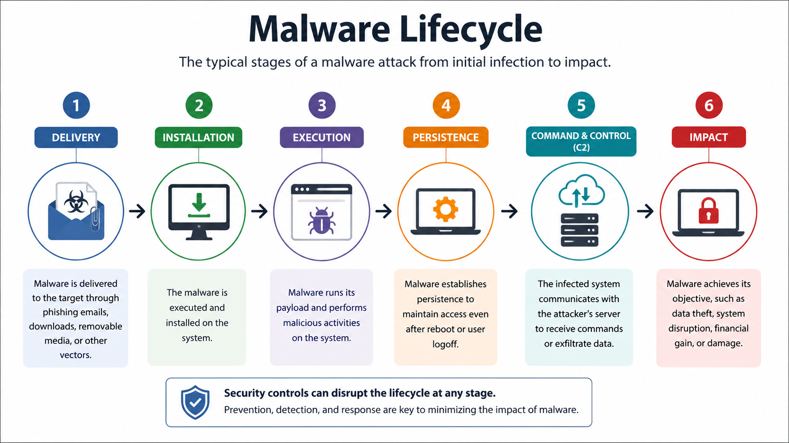

Although the exact lifecycle varies depending on the malware family, most attacks follow a similar pattern.

### 1. Initial Infection

The attack begins when malware reaches the target system. Common infection vectors include:

- Phishing emails containing malicious attachments or links.
- Drive-by downloads from compromised websites.
- Exploitation of unpatched software vulnerabilities.
- Infected USB drives or removable media.
- Malicious software downloads or fake installers.

At this stage, the attack focuses on gaining an initial foothold within the victim's environment.

### 2. Execution

After reaching the target, the malware executes its code. Execution may occur immediately after the victim opens an infected file or automatically through exploitation of a software vulnerability.

Some malware attempts to evade detection during execution by disabling security software, using obfuscation techniques, or injecting code into legitimate processes.

### 3. Persistence

Many malware families attempt to remain active even after the system restarts. This is known as **persistence**.

Common persistence mechanisms include:

- Registry Run keys.
- Startup folders.
- Scheduled tasks.
- Windows Services.
- Boot loaders.
- DLL hijacking.

Persistence enables attackers to maintain long-term access without repeatedly infecting the system.

### 4. Privilege Escalation

If the malware initially executes with limited privileges, it may attempt to obtain higher permissions.

Privilege escalation allows malware to:

- Access protected files.
- Disable security controls.
- Modify system configurations.
- Install kernel-level components.
- Gain full administrative control.

Not every malware family performs privilege escalation, but advanced threats often rely on it.

### 5. Command and Control (C2)

Many modern malware variants establish communication with a remote **Command and Control (C2)** server.

The C2 infrastructure allows attackers to:

- Send new commands.
- Download additional malware.
- Upload stolen information.
- Update malware capabilities.
- Coordinate attacks across multiple infected systems.

Some malware communicates continuously with the C2 server, while others connect only periodically to reduce the likelihood of detection.

### 6. Payload Execution

The payload represents the primary malicious objective of the malware.

Examples include:

- Encrypting files (Ransomware).
- Stealing credentials.
- Capturing keystrokes.
- Launching DDoS attacks.
- Exfiltrating sensitive data.
- Destroying or modifying files.
- Spreading to other systems.

Different malware families may execute multiple payloads depending on the attacker's objectives.

### 7. Propagation or Cleanup

After completing its objective, malware may:

- Spread to additional systems.
- Remain dormant for future attacks.
- Delete traces of its activity.
- Disable logging mechanisms.
- Remove itself after execution.

Advanced malware often attempts to hide evidence to complicate forensic investigations and incident response.

### Why Understanding the Lifecycle Matters

Security professionals can interrupt an attack at multiple stages rather than waiting until the final payload executes.

For example:

- Email filtering can block the initial infection.
- Endpoint Detection and Response (EDR) solutions can detect suspicious execution.
- Least privilege reduces the success of privilege escalation.
- Network monitoring can identify abnormal C2 communications.
- Regular backups minimize the impact of ransomware payloads.

Understanding the malware lifecycle helps defenders identify where security controls should be implemented to prevent, detect, and respond to attacks effectively.

---

## Malware Classification

Malware can be classified in several ways depending on how it operates, how it spreads, and the objectives it is designed to achieve. Understanding these classification methods helps security professionals analyze malware behavior, identify attack patterns, and implement appropriate defensive measures.

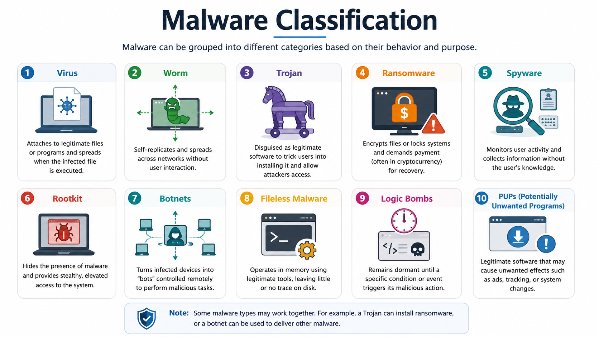

Rather than belonging to a single category, modern malware often combines multiple characteristics. For example, ransomware may spread like a worm, establish persistence like a Trojan, and communicate with a command and control (C2) server to receive encryption keys.

### Classification by Infection Method

One of the most common ways to classify malware is by how it infects a system.

Some malware requires user interaction, such as opening an email attachment or installing malicious software. Others exploit software vulnerabilities and execute automatically without any user involvement.

Common infection methods include:

- Phishing emails
- Malicious downloads
- Drive-by downloads
- Exploitation of software vulnerabilities
- Infected removable media
- Supply chain compromises

Understanding the infection method helps organizations implement preventive controls such as email filtering, application allowlisting, and timely patch management.

### Classification by Propagation Method

Malware also differs in how it spreads from one system to another.

Some malware remains confined to the initially infected device, while others automatically propagate across networks or removable media.

Propagation methods include:

- Self-replication across networks
- File infection
- Email distribution
- USB device infection
- Shared folder exploitation
- Lateral movement within enterprise environments

Rapid propagation increases the potential impact of an attack and makes containment significantly more challenging.

### Classification by Primary Objective

Another useful classification focuses on the attacker's primary goal.

Common objectives include:

- Data theft
- Financial gain
- Espionage
- System disruption
- Remote access
- Credential harvesting
- Botnet recruitment
- Data destruction

Although malware may perform multiple actions, most families are developed with one primary objective in mind.

### Modern Malware Is Often Multi-Purpose

Early malware was typically designed for a single purpose, such as deleting files or displaying unwanted messages. Modern malware is significantly more sophisticated and often combines multiple capabilities within a single attack.

For example, a modern ransomware campaign may:

1. Steal sensitive documents before encryption.
2. Establish persistence to survive reboots.
3. Disable security software.
4. Encrypt critical files.
5. Communicate with a C2 server.
6. Demand payment from the victim.

This evolution makes malware more difficult to detect, analyze, and remove.

### Why Classification Matters

Proper malware classification enables security teams to:

- Assess the severity of an incident.
- Select appropriate detection methods.
- Apply effective containment strategies.
- Prioritize remediation efforts.
- Improve threat intelligence and incident response.

Understanding how malware is classified provides the foundation for studying the individual malware types discussed in the following sections.

---

## Virus

A **virus** is a type of malware that attaches itself to a legitimate file or executable program. Unlike many other malware types, a virus cannot spread on its own. It requires user interaction, such as opening an infected file or running a compromised application, to execute and infect additional files.

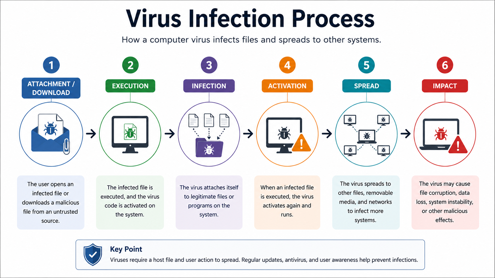

Once executed, a virus typically searches for other files or programs that it can infect. It inserts its malicious code into these files, allowing the infection to spread whenever another user executes the infected program.

### Characteristics

Viruses commonly exhibit the following characteristics:

- Require a host file or application.
- Depend on user interaction for execution.
- Replicate by infecting additional files.
- May remain dormant until triggered.
- Can corrupt, modify, or delete data.

Because viruses rely on users to execute infected files, they spread more slowly than self-propagating malware such as worms.

### Infection Process

A typical virus infection follows these steps:

1. The victim downloads or receives an infected file.
2. The victim opens or executes the file.
3. The virus loads into memory.
4. It searches for other executable files.
5. It inserts its malicious code into those files.
6. The infected files continue spreading the virus whenever they are executed.

Some viruses activate immediately, while others remain dormant until a specific date, event, or condition is met.

### Common Types of Viruses

Several categories of viruses exist, including:

- **File Infector Viruses** – Infect executable files such as `.exe` programs.
- **Macro Viruses** – Target documents containing macros, such as Microsoft Office files.
- **Boot Sector Viruses** – Infect the boot sector or master boot record (MBR) of storage devices.
- **Polymorphic Viruses** – Continuously modify their code to evade signature-based detection.
- **Multipartite Viruses** – Infect multiple parts of a system, such as both boot sectors and executable files.

### Examples

Historically, several viruses have caused widespread damage, including:

- Melissa
- CIH (Chernobyl)
- Michelangelo

Although traditional viruses are less common today, understanding their behavior remains important because many modern malware families evolved from the same infection principles.

### Prevention

Organizations can reduce the risk of virus infections by:

- Keeping operating systems and applications updated.
- Using reputable antivirus and endpoint protection software.
- Scanning downloaded files before opening them.
- Disabling unnecessary macros in documents.
- Educating users about suspicious email attachments and downloads.
- Applying the principle of least privilege.

Early detection and user awareness remain two of the most effective defenses against virus-based attacks.

---

## Worm

A **worm** is a self-replicating type of malware that spreads automatically across networks without requiring user interaction or attaching itself to another program. Unlike a virus, a worm operates as an independent program and typically exploits software vulnerabilities or weak network security to infect additional systems.

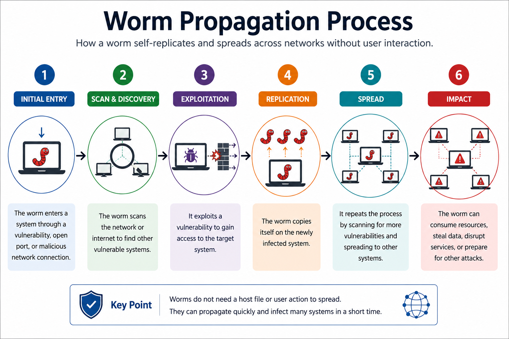

Because worms spread autonomously, they can infect thousands of devices within a short period, making them one of the fastest-spreading forms of malware.

### Characteristics

Worms commonly exhibit the following characteristics:

- Operate as standalone programs.
- Do not require a host file.
- Spread automatically without user interaction.
- Exploit software or network vulnerabilities.
- Consume network bandwidth and system resources.
- May deliver additional malicious payloads.

The ability to self-propagate allows worms to spread much faster than traditional viruses.

### Propagation Process

A typical worm infection follows these steps:

1. The worm infects an initial system.
2. It scans the network for vulnerable devices.
3. It exploits a vulnerability on a target system.
4. The new system becomes infected.
5. The newly infected system begins scanning for additional targets.
6. The process repeats automatically.

As more systems become infected, the worm spreads exponentially across networks.

### Common Capabilities

Although some worms exist solely to spread, many modern worms also perform additional malicious activities, such as:

- Installing ransomware.
- Deploying backdoors.
- Joining infected devices to botnets.
- Stealing sensitive information.
- Launching Distributed Denial-of-Service (DDoS) attacks.

These additional capabilities significantly increase the impact of a worm outbreak.

### Examples

Several worms have caused major global cybersecurity incidents, including:

- Morris Worm
- Code Red
- SQL Slammer
- Conficker
- WannaCry

For example, WannaCry combined worm-like propagation with ransomware encryption, allowing it to spread rapidly through vulnerable Windows systems worldwide.

### Prevention

Organizations can reduce the risk of worm infections by:

- Applying security patches promptly.
- Disabling unnecessary network services.
- Segmenting networks to limit lateral movement.
- Using firewalls to restrict unauthorized traffic.
- Deploying Endpoint Detection and Response (EDR) solutions.
- Monitoring network activity for unusual scanning behavior.

Keeping systems fully patched is one of the most effective defenses against worms because they frequently rely on known software vulnerabilities to spread.

---

## Trojan

A **Trojan**, or **Trojan Horse**, is a type of malware that disguises itself as legitimate or useful software to trick users into installing or executing it. Unlike viruses and worms, a Trojan does not self-replicate. Instead, it relies on deception and social engineering to gain access to a victim's system.

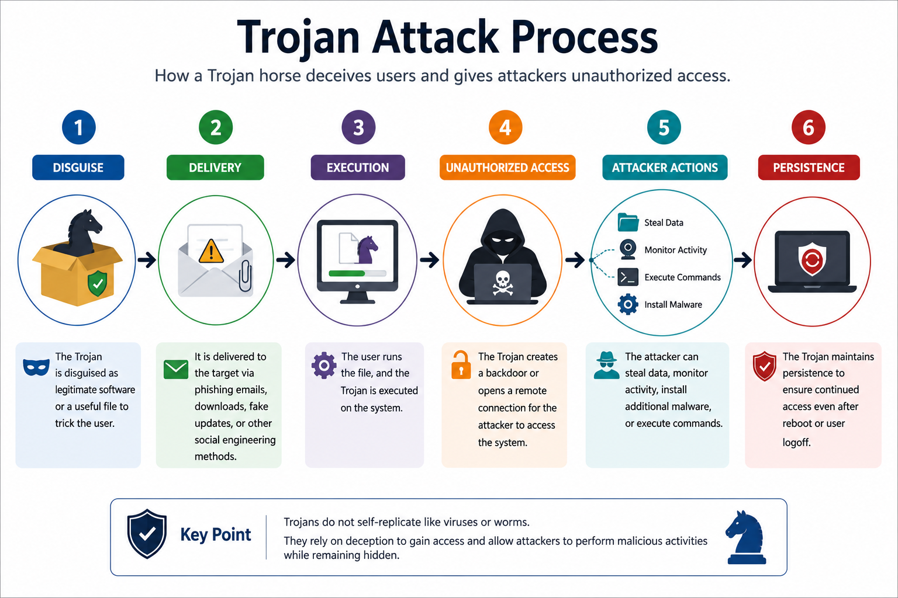

Once installed, a Trojan performs malicious actions in the background while appearing to function as a legitimate application. Depending on its purpose, it may steal sensitive information, install additional malware, provide remote access to attackers, or modify system settings.

### Characteristics

Trojans commonly exhibit the following characteristics:

- Disguise themselves as legitimate software.
- Require user interaction for installation or execution.
- Do not self-replicate.
- Often establish persistence after installation.
- Frequently download or install additional malware.
- Can remain hidden for extended periods.

Because Trojans appear trustworthy, they are commonly delivered through phishing campaigns, fake software downloads, and malicious email attachments.

### Infection Process

A typical Trojan infection follows these steps:

1. The attacker creates or distributes a malicious application disguised as legitimate software.
2. The victim downloads or installs the application.
3. The Trojan executes while appearing to perform its expected function.
4. It installs its malicious components in the background.
5. The attacker gains unauthorized access or deploys additional payloads.

Unlike worms, Trojans rely almost entirely on convincing users to execute the malicious program.

### Common Types of Trojans

Several specialized Trojan variants exist, including:

- **Remote Access Trojans (RATs)** – Provide attackers with remote control over the infected system.
- **Banking Trojans** – Steal online banking credentials and financial information.
- **Downloader Trojans** – Download and install additional malware.
- **Backdoor Trojans** – Create hidden access mechanisms that bypass normal authentication.
- **Fake Antivirus (Scareware)** – Pretend to detect infections and trick victims into purchasing fake security software.

Each variant focuses on a specific objective while using the same deceptive delivery method.

### Examples

Well-known Trojan families include:

- Zeus
- Emotet
- TrickBot
- QakBot

Many of these malware families have been used to steal credentials, distribute ransomware, and establish long-term access within enterprise networks.

### Prevention

Organizations can reduce the risk of Trojan infections by:

- Downloading software only from trusted sources.
- Verifying software authenticity before installation.
- Using application allowlisting where appropriate.
- Keeping endpoint protection software up to date.
- Educating users about phishing and fake software.
- Restricting administrative privileges.
- Monitoring systems for unexpected outbound connections.

Because Trojans depend heavily on user trust, security awareness training is one of the most effective preventive measures.

---

## Ransomware

**Ransomware** is a type of malware that encrypts a victim's files or locks access to an entire system, preventing normal use until a ransom is paid. It is primarily motivated by financial gain and has become one of the most significant cybersecurity threats affecting individuals, businesses, healthcare organizations, and government agencies.

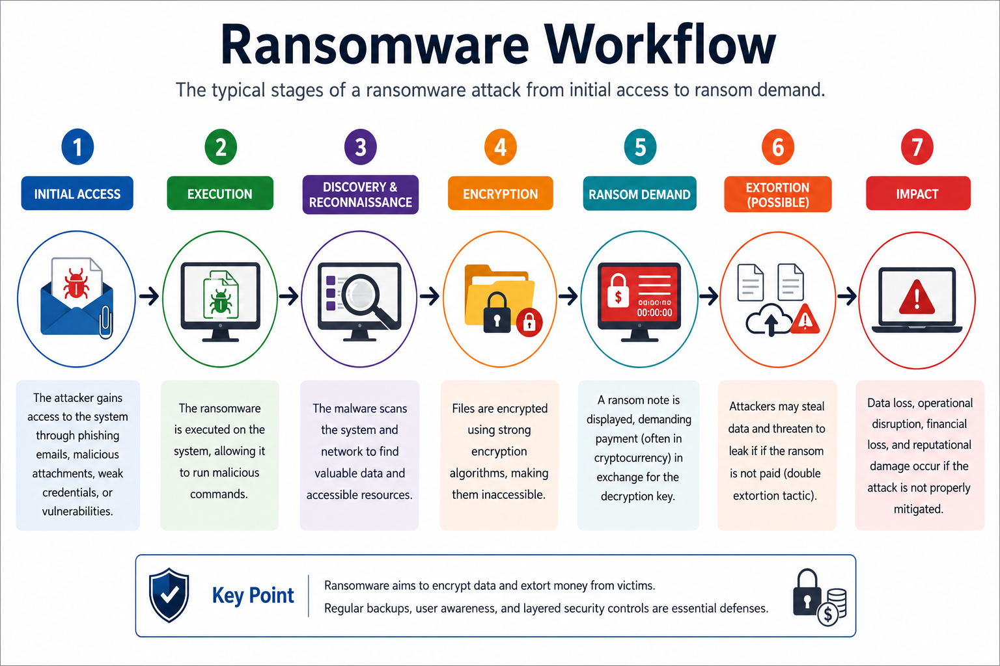

Modern ransomware attacks are no longer limited to file encryption. Many threat groups first infiltrate a network, steal sensitive information, disable security controls, and then encrypt critical systems to maximize pressure on the victim.

### Characteristics

Ransomware commonly exhibits the following characteristics:

- Encrypts files or entire storage volumes.
- Demands payment, usually in cryptocurrency.
- Targets valuable business and personal data.
- May disable backups and security software.
- Frequently communicates with attacker-controlled servers.
- Can spread laterally across enterprise networks.

Because ransomware directly impacts business operations, even organizations with strong security programs remain attractive targets.

### Attack Process

A typical ransomware attack follows these steps:

1. The attacker gains initial access through phishing, compromised credentials, or software vulnerabilities.
2. Malware is executed on the victim's system.
3. The attacker establishes persistence and performs reconnaissance.
4. Sensitive data is often stolen before encryption.
5. Critical files are encrypted using strong cryptographic algorithms.
6. A ransom note is displayed with payment instructions.
7. The attacker threatens permanent data loss or public release of stolen information if payment is not made.

The attack may take only minutes on a single computer or several days within a large enterprise, depending on the attacker's objectives.

### Double Extortion

Many modern ransomware groups use a technique known as **double extortion**.

Instead of relying solely on encryption, attackers first steal confidential information before encrypting the victim's files. They then threaten to publish or sell the stolen data if the ransom is not paid.

This approach increases pressure on victims because recovering files from backups does not prevent sensitive information from being exposed.

### Common Infection Vectors

Ransomware is commonly delivered through:

- Phishing emails with malicious attachments or links.
- Exploitation of unpatched software vulnerabilities.
- Remote Desktop Protocol (RDP) compromise.
- Malicious software downloads.
- Supply chain attacks.
- Stolen or weak credentials.

Many successful ransomware incidents begin with simple human errors, such as clicking a malicious email attachment or reusing weak passwords.

### Examples

Several ransomware families have had a major global impact, including:

- WannaCry
- Ryuk
- LockBit
- REvil (Sodinokibi)
- Conti

These attacks have disrupted hospitals, government agencies, educational institutions, and multinational organizations worldwide.

### Prevention

Organizations can reduce the risk and impact of ransomware by:

- Maintaining regular offline and immutable backups.
- Applying security patches promptly.
- Enforcing multi-factor authentication (MFA).
- Restricting administrative privileges.
- Segmenting networks to limit lateral movement.
- Deploying Endpoint Detection and Response (EDR) solutions.
- Filtering phishing emails and malicious attachments.
- Conducting regular security awareness training.
- Monitoring for unusual encryption activity and abnormal file access.

Although backups are essential for recovery, preventing the initial compromise remains the most effective defense against ransomware attacks.

---

## Spyware

**Spyware** is a type of malware designed to secretly monitor user activity and collect sensitive information without the victim's knowledge or consent. Unlike ransomware, which immediately disrupts operations, spyware is designed to remain hidden while continuously gathering valuable data.

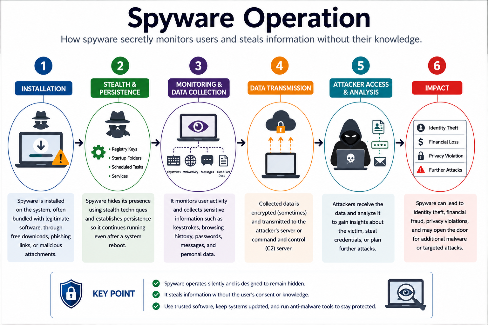

Spyware can capture personal information, login credentials, financial data, browsing habits, and other confidential information. The collected data is typically transmitted to an attacker-controlled server for analysis or misuse.

### Characteristics

Spyware commonly exhibits the following characteristics:

- Operates silently in the background.
- Collects sensitive user or system information.
- Monitors user activities without authorization.
- Transmits collected data to remote servers.
- Attempts to avoid detection for long periods.
- May significantly impact system performance.

Because spyware prioritizes stealth, victims may remain unaware of an infection for weeks or even months.

### Information Collected

Depending on its capabilities, spyware may collect:

- Usernames and passwords.
- Credit card and banking information.
- Email communications.
- Browsing history.
- Screenshots.
- Clipboard contents.
- Documents and files.
- System configuration details.

The information gathered is often used for identity theft, financial fraud, corporate espionage, or credential theft.

### Common Types of Spyware

Several forms of spyware exist, including:

- **Keyloggers** – Record every keystroke entered by the user.
- **Password Stealers** – Extract stored credentials from browsers and applications.
- **Screen Capture Spyware** – Periodically captures screenshots.
- **Browser Hijackers** – Modify browser settings and track browsing activity.
- **Information Stealers (InfoStealers)** – Collect browser cookies, authentication tokens, saved passwords, cryptocurrency wallets, and other sensitive information.

Modern information stealers have become one of the most common threats targeting both individuals and organizations.

### Infection Methods

Spyware commonly reaches victims through:

- Phishing emails.
- Malicious software downloads.
- Fake software updates.
- Bundled freeware.
- Drive-by downloads.
- Exploitation of software vulnerabilities.

Social engineering remains one of the most effective delivery methods because users often install spyware unknowingly.

### Examples

Examples of spyware include:

- Pegasus
- Agent Tesla
- RedLine Stealer
- Lumma Stealer

These malware families have been used to collect credentials, monitor victims, and steal sensitive personal or corporate information.

### Prevention

Organizations can reduce the risk of spyware infections by:

- Installing software only from trusted sources.
- Keeping operating systems and applications updated.
- Using Endpoint Detection and Response (EDR) solutions.
- Blocking malicious websites and downloads.
- Educating users about phishing attacks.
- Enabling multi-factor authentication (MFA).
- Regularly monitoring systems for unusual outbound network traffic.

Because spyware focuses on data collection rather than destruction, continuous monitoring and early detection are critical to minimizing its impact.

---

## Rootkits

A **rootkit** is a type of malware designed to hide its presence and provide attackers with persistent, privileged access to a compromised system. Rather than performing a specific malicious action such as encrypting files or stealing credentials, a rootkit's primary purpose is to conceal malware, processes, files, registry entries, and network activity from users and security software.

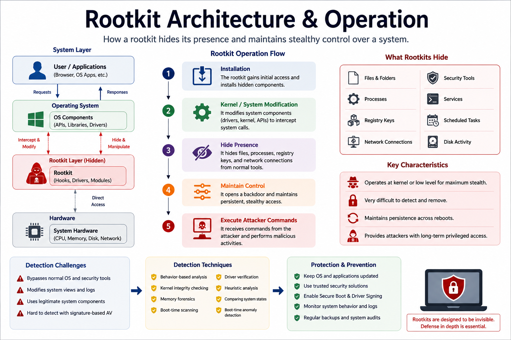

Rootkits often operate at a very low level within the operating system, making them difficult to detect and remove. By manipulating system functions, they can cause infected systems to appear normal even while malicious activities are taking place.

### Characteristics

Rootkits commonly exhibit the following characteristics:

- Hide malware and malicious processes.
- Maintain long-term persistence.
- Operate with elevated privileges.
- Modify operating system behavior.
- Evade antivirus and security tools.
- Enable attackers to maintain covert access.

Because rootkits focus on stealth, they are frequently used alongside other malware rather than acting alone.

### How Rootkits Work

A typical rootkit attack follows these steps:

1. The attacker compromises a system through another malware infection or exploited vulnerability.
2. A rootkit is installed with administrative or kernel-level privileges.
3. The rootkit modifies operating system components or intercepts system calls.
4. Malicious files, processes, services, or network connections are hidden.
5. The attacker maintains persistent remote access while remaining difficult to detect.

By manipulating how the operating system reports information, the rootkit can make malicious activity invisible to users and many security tools.

### Common Types of Rootkits

Rootkits can operate at different levels of a system, including:

- **User Mode Rootkits** – Modify applications or user-space processes.
- **Kernel Mode Rootkits** – Operate within the operating system kernel, providing extensive control.
- **Bootkits** – Infect the boot process before the operating system loads.
- **Firmware Rootkits** – Reside within device firmware such as BIOS or UEFI.
- **Hypervisor Rootkits** – Operate beneath the operating system by compromising virtualization layers.

The deeper a rootkit operates, the more difficult it becomes to detect and remove.

### Examples

Examples of rootkits include:

- ZeroAccess
- Necurs
- Sony BMG Rootkit
- LoJax

Some advanced persistent threat (APT) groups have also developed custom rootkits to maintain long-term access to targeted environments.

### Detection Challenges

Rootkits are particularly difficult to detect because they can:

- Hide running processes.
- Conceal files and directories.
- Mask network connections.
- Modify system logs.
- Intercept operating system functions.
- Disable or evade security software.

In many cases, traditional antivirus software alone is insufficient to identify sophisticated rootkits.

### Prevention

Organizations can reduce the risk of rootkit infections by:

- Keeping operating systems and firmware updated.
- Enabling Secure Boot where supported.
- Applying the principle of least privilege.
- Deploying Endpoint Detection and Response (EDR) solutions.
- Monitoring system integrity for unexpected changes.
- Using trusted boot mechanisms.
- Performing offline or boot-time malware scans when rootkit activity is suspected.

In severe cases, completely reinstalling the operating system from trusted media may be the only reliable method for removing a deeply embedded rootkit.

---

## Botnets

A **botnet** is a network of compromised devices, known as **bots** or **zombies**, that are remotely controlled by an attacker, often referred to as a **Botmaster** or **Command and Control (C2) operator**. These infected devices can include computers, servers, smartphones, and Internet of Things (IoT) devices.

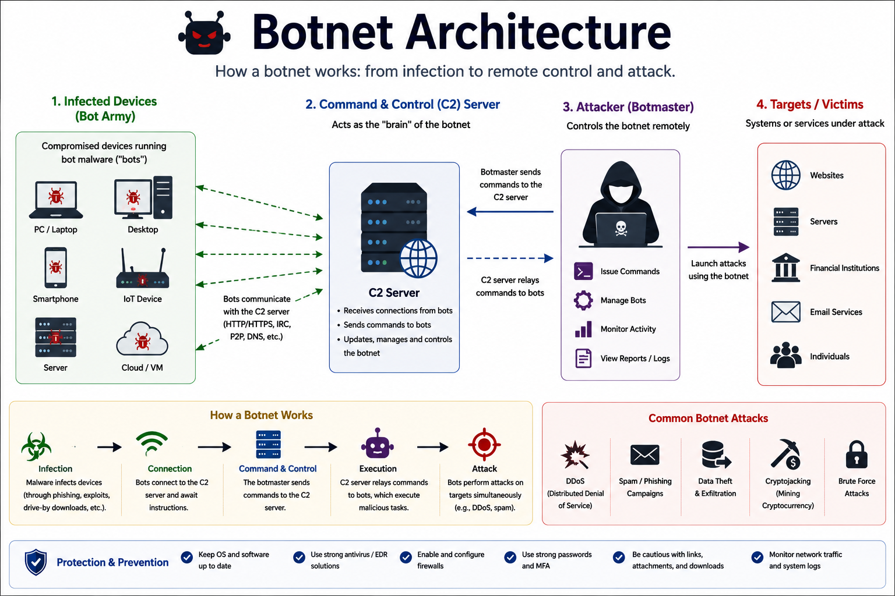

Once a device becomes infected, it silently communicates with a Command and Control (C2) server, allowing attackers to issue commands to thousands or even millions of compromised systems simultaneously.

### Characteristics

Botnets commonly exhibit the following characteristics:

- Consist of numerous compromised devices.
- Operate under centralized or decentralized control.
- Receive commands remotely from attackers.
- Perform coordinated malicious activities.
- Often remain hidden from device owners.
- Can rapidly grow as additional devices become infected.

Because each infected device contributes computing power or network bandwidth, botnets can launch attacks far more powerful than a single compromised machine.

### How Botnets Work

A typical botnet operation follows these steps:

1. A device is infected through malware, phishing, or software vulnerabilities.
2. The malware establishes communication with a Command and Control (C2) infrastructure.
3. The infected device waits for instructions.
4. The attacker sends commands to all connected bots.
5. Every compromised device performs the requested malicious activity simultaneously.

The infected device often continues functioning normally, making the infection difficult for users to notice.

### Common Uses of Botnets

Attackers use botnets for a wide range of malicious purposes, including:

- Distributed Denial-of-Service (DDoS) attacks.
- Spam email campaigns.
- Credential stuffing attacks.
- Cryptocurrency mining.
- Malware distribution.
- Data theft.
- Proxy services that hide attacker activity.

The flexibility of botnets makes them valuable tools for cybercriminal organizations.

### Command and Control (C2)

Botnets rely on **Command and Control (C2)** systems to manage infected devices.

Modern botnets may use:

- Dedicated C2 servers.
- Peer-to-peer (P2P) communication.
- Social media platforms.
- Domain Generation Algorithms (DGAs).
- Encrypted communication channels.

Some advanced botnets continuously change their communication methods to avoid detection and disruption.

### Examples

Well-known botnets include:

- Mirai
- Emotet
- GameOver Zeus
- Necurs
- Cutwail

For example, the Mirai botnet compromised thousands of insecure IoT devices and launched some of the largest Distributed Denial-of-Service (DDoS) attacks ever recorded.

### Prevention

Organizations can reduce the risk of botnet infections by:

- Keeping systems and IoT devices updated.
- Changing default passwords on network-connected devices.
- Deploying firewalls and intrusion detection systems.
- Monitoring outbound network traffic for connections to known C2 servers.
- Segmenting IoT devices from critical business networks.
- Using Endpoint Detection and Response (EDR) solutions.
- Blocking malicious domains and IP addresses associated with botnet activity.

Early detection of Command and Control communication is often the most effective way to stop botnet activity before attackers can fully exploit compromised devices.

---

## Fileless Malware

**Fileless malware** is a type of malware that operates primarily in a system's memory rather than relying on executable files stored on disk. Instead of installing traditional malware files, it abuses legitimate operating system tools and trusted processes to execute malicious code while minimizing its footprint.

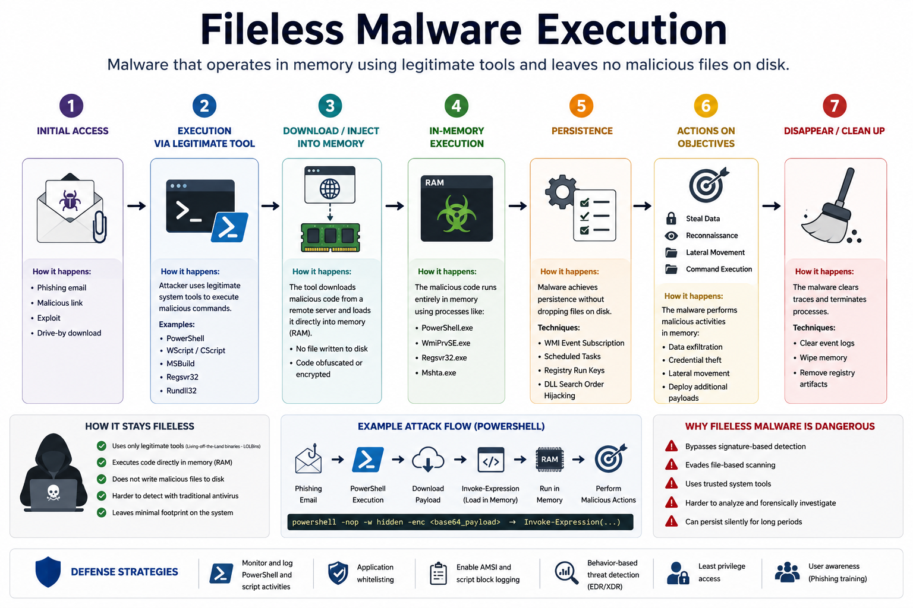

Because little or no malicious code is written to disk, fileless malware is often more difficult for traditional antivirus solutions to detect.

### Characteristics

Fileless malware commonly exhibits the following characteristics:

- Executes primarily in memory (RAM).
- Leaves little or no malware files on disk.
- Uses legitimate system tools to perform malicious actions.
- Evades signature-based antivirus detection.
- Often establishes persistence using system features such as the registry or scheduled tasks.
- Frequently targets enterprise environments.

Rather than introducing new executable files, fileless malware takes advantage of software already trusted by the operating system.

### How Fileless Malware Works

A typical fileless malware attack follows these steps:

1. The attacker gains initial access through phishing, malicious documents, or exploited vulnerabilities.
2. A legitimate system tool is launched.
3. Malicious code is loaded directly into memory.
4. The malware executes using trusted system processes.
5. Sensitive data is stolen, additional malware is deployed, or remote access is established.
6. The malware attempts to maintain persistence while minimizing evidence on disk.

Because trusted system utilities perform much of the work, suspicious activity can blend into normal operating system behavior.

### Common Techniques

Fileless malware commonly abuses legitimate Windows administration tools, including:

- PowerShell
- Windows Management Instrumentation (WMI)
- Command Prompt (cmd.exe)
- Windows Script Host (WSH)
- Registry Run Keys
- Scheduled Tasks

This technique is often referred to as **Living off the Land (LotL)** because attackers use built-in operating system components instead of introducing external malware.

### Examples

Examples of fileless malware campaigns include:

- Kovter
- Poweliks
- Astaroth (Guildma)
- Several advanced persistent threat (APT) toolkits

Many modern ransomware and espionage operations also use fileless techniques during the early stages of an attack to reduce the likelihood of detection.

### Detection Challenges

Fileless malware is difficult to detect because it:

- Leaves few or no malicious files on disk.
- Uses trusted system processes.
- Executes primarily in memory.
- Generates activity that resembles legitimate administration.
- Frequently changes execution techniques.

As a result, behavior-based detection is generally more effective than traditional signature-based scanning.

### Prevention

Organizations can reduce the risk of fileless malware by:

- Restricting unnecessary PowerShell and scripting capabilities.
- Keeping operating systems fully patched.
- Implementing application allowlisting.
- Using Endpoint Detection and Response (EDR) solutions.
- Monitoring PowerShell, WMI, and command-line activity.
- Applying the principle of least privilege.
- Providing security awareness training to reduce phishing attacks.

Because fileless malware abuses legitimate tools rather than relying on malicious files, continuous behavioral monitoring is essential for early detection.

---

## Logic Bombs

A **logic bomb** is a type of malicious code that remains dormant until a specific condition or event triggers its execution. Unlike viruses or worms, a logic bomb does not spread independently. Instead, it waits silently within a system until its predefined trigger is activated.

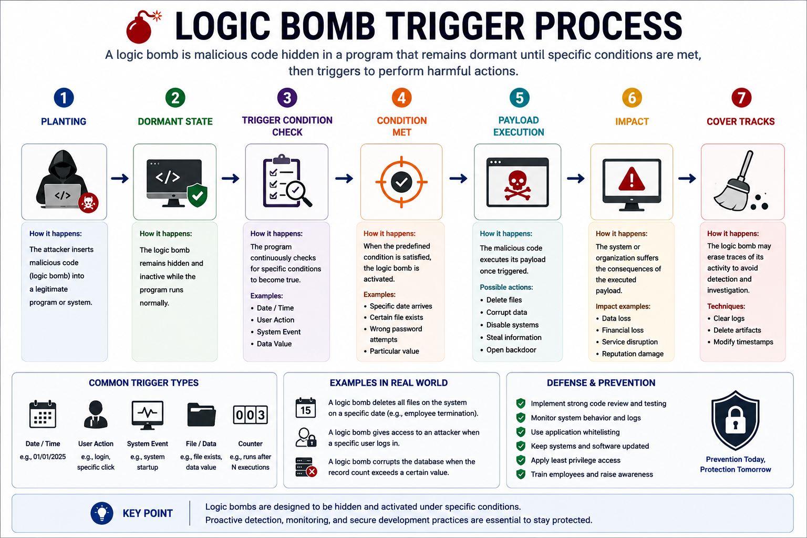

Logic bombs are often embedded within legitimate software or scripts, making them difficult to detect before activation. Once triggered, they can perform a wide range of malicious actions, including deleting files, corrupting data, disabling services, or launching additional malware.

### Characteristics

Logic bombs commonly exhibit the following characteristics:

- Remain inactive until a predefined condition is met.
- Do not self-replicate.
- May be embedded within legitimate software or scripts.
- Can execute a wide variety of malicious payloads.
- Often remain undetected until activation.

Because they stay dormant for extended periods, logic bombs may evade detection during routine security scans.

### Common Triggers

A logic bomb may activate when a specific condition occurs, such as:

- A particular date or time.
- A user logging into the system.
- The deletion or modification of a file.
- A specific application being executed.
- A predefined number of system events.
- An employee account being disabled.

Attackers carefully choose trigger conditions to maximize the impact of the attack.

### Potential Impact

Depending on its payload, a logic bomb may:

- Delete or encrypt files.
- Corrupt databases.
- Disable critical services.
- Shut down systems.
- Modify application data.
- Launch additional malware.

The damage often occurs suddenly because the malicious code has remained hidden until the trigger condition is satisfied.

### Examples

Logic bombs have been involved in several insider threat incidents, where disgruntled employees embedded malicious code within company systems to activate after their departure or termination.

Unlike most malware families, logic bombs are typically defined by their triggering mechanism rather than by a specific malware family or campaign.

### Prevention

Organizations can reduce the risk of logic bomb attacks by:

- Enforcing secure software development practices.
- Conducting regular code reviews.
- Applying the principle of least privilege.
- Monitoring changes to production systems.
- Implementing separation of duties.
- Maintaining comprehensive audit logs.
- Using file integrity monitoring to detect unauthorized code modifications.

Strong change management and continuous monitoring significantly reduce the likelihood of malicious code remaining hidden within production environments.

---

## Potentially Unwanted Programs (PUPs)

**Potentially Unwanted Programs (PUPs)** are applications that users may unknowingly install alongside legitimate software. Although PUPs are not always considered malware, they often perform undesirable actions that negatively affect system performance, privacy, or security.

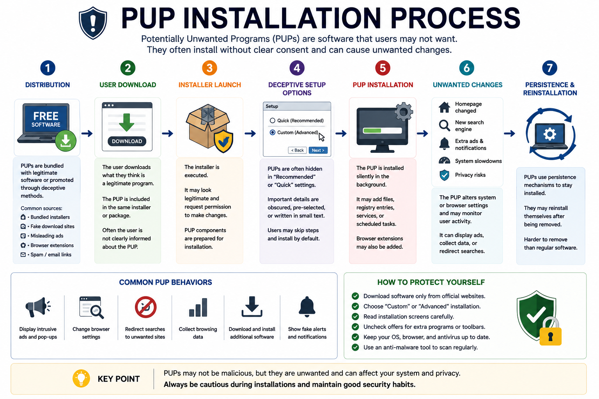

PUPs are commonly distributed through software bundles, misleading advertisements, or deceptive installation wizards that encourage users to install additional applications without fully understanding what they are accepting.

### Characteristics

Potentially Unwanted Programs commonly exhibit the following characteristics:

- Installed alongside legitimate software.
- Often require user consent, although it may be obtained through deceptive methods.
- Display excessive advertisements or pop-ups.
- Modify browser or system settings.
- Collect usage data or browsing information.
- Consume system resources unnecessarily.

While many PUPs are not inherently malicious, they often reduce system performance and may introduce additional security risks.

### Common Types of PUPs

Examples of Potentially Unwanted Programs include:

- Adware.
- Browser toolbars.
- Browser hijackers.
- Trial software with aggressive notifications.
- System optimization utilities with misleading claims.
- Fake software updaters.

Some PUPs also install additional unwanted software, increasing the attack surface of the affected system.

### Installation Methods

PUPs are commonly installed through:

- Bundled software installers.
- Freeware downloads.
- Misleading advertisements.
- Fake download buttons.
- Deceptive software update prompts.
- Untrusted software repositories.

Users often install PUPs because optional components are preselected during the installation process.

### Potential Risks

Although many PUPs are not classified as malware, they may:

- Track browsing activity.
- Display intrusive advertisements.
- Redirect web searches.
- Collect user information.
- Reduce system performance.
- Increase the likelihood of future malware infections.

For this reason, organizations generally discourage the installation of unauthorized software on managed systems.

### Examples

Examples of common PUPs include:

- Browser toolbars bundled with freeware.
- Ad-supported media players.
- Fake PC cleanup utilities.
- Browser extensions that collect browsing data.

Many security products classify these applications as PUPs rather than malware because users technically consented to their installation.

### Prevention

Organizations can reduce the risk of PUP installations by:

- Downloading software only from trusted vendors.
- Carefully reviewing installation options before proceeding.
- Choosing **Custom** or **Advanced** installation when available.
- Removing unnecessary browser extensions.
- Restricting users from installing unauthorized software.
- Using endpoint protection capable of detecting PUPs.
- Providing security awareness training on deceptive software installation practices.

Although PUPs may appear harmless, they can weaken system security, reduce productivity, and increase the likelihood of more serious malware infections.

---

## Indicators of Compromise (IoCs)

**Indicators of Compromise (IoCs)** are pieces of evidence that suggest a system, network, or device may have been compromised by malicious activity. Security teams use IoCs to identify ongoing attacks, investigate security incidents, and respond before additional damage occurs.

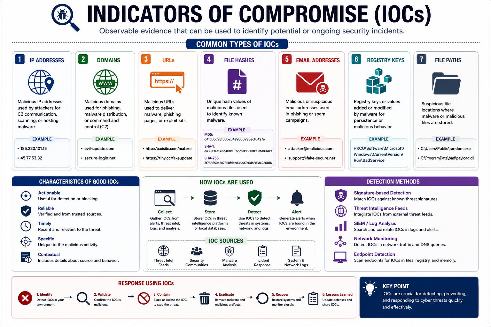

An IoC does not always prove that a system has been compromised. Instead, it serves as a warning sign that should prompt further investigation.

### Common Indicators of Compromise

Security professionals monitor a variety of IoCs, including:

- Unusual outbound network traffic.
- Unexpected account logins.
- Multiple failed authentication attempts.
- Unknown processes or services.
- Unauthorized file modifications.
- Unexpected scheduled tasks.
- Suspicious registry changes.
- Antivirus or security tools being disabled.
- Unexpected privilege escalation.
- Communication with known malicious IP addresses or domains.

The presence of one indicator alone may not confirm an attack, but multiple indicators occurring together often warrant immediate investigation.

### Network-Based Indicators

Network monitoring may reveal signs of compromise such as:

- Connections to Command and Control (C2) servers.
- Large volumes of unexpected outbound traffic.
- DNS requests to suspicious domains.
- Communication over unusual ports or protocols.
- Unexpected lateral movement between systems.

These indicators often suggest that malware is communicating with an attacker or spreading within the network.

### Host-Based Indicators

Indicators observed directly on a device include:

- Unknown running processes.
- Unexpected startup programs.
- Modified system files.
- Unauthorized user accounts.
- Disabled logging or security software.
- High CPU, memory, or disk activity without explanation.
- Files appearing, disappearing, or changing unexpectedly.

Host-based IoCs help investigators determine what occurred on an individual system.

### Behavioral Indicators

Some attacks are identified by abnormal behavior rather than specific files or signatures, including:

- Users accessing resources outside their normal responsibilities.
- Administrative actions occurring at unusual times.
- Rapid encryption of large numbers of files.
- Multiple systems exhibiting identical suspicious behavior.
- Unexpected PowerShell or command-line activity.

Behavioral analysis is particularly important for detecting modern threats such as fileless malware.

### Examples

Examples of IoCs include:

- A workstation repeatedly contacting a known malicious IP address.
- Hundreds of files suddenly receiving a new encrypted extension.
- A user account logging in from multiple countries within minutes.
- Antivirus services unexpectedly stopping.
- PowerShell executing encoded commands.

Each of these events should trigger further investigation by security personnel.

### IoCs vs. Indicators of Attack (IoAs)

Although the terms are sometimes used interchangeably, they describe different concepts:

| Indicator of Compromise (IoC) | Indicator of Attack (IoA) |
| ----------------------------- | ------------------------- |
| Evidence that a compromise has occurred | Evidence that an attack is currently happening |
| Often based on known artifacts | Often based on attacker behavior |
| May identify previous attacks | May detect attacks before damage occurs |
| Examples: malicious IPs, file hashes, registry changes | Examples: unusual privilege escalation, lateral movement, suspicious PowerShell execution |

Modern security solutions increasingly rely on behavioral Indicators of Attack (IoAs) in addition to traditional IoCs.

### Responding to IoCs

When IoCs are detected, organizations should:

- Validate whether the indicator represents malicious activity.
- Isolate affected systems if necessary.
- Collect forensic evidence.
- Identify the scope of the compromise.
- Remove the threat.
- Recover affected systems.
- Document the incident and implement measures to prevent recurrence.

Rapid investigation and response can significantly reduce the impact of a security incident.

---

## Malware Prevention and Mitigation

Preventing malware infections requires a **layered security approach** that combines technology, secure configurations, user awareness, and continuous monitoring. Because no single security control can stop every attack, organizations implement multiple defensive measures to reduce both the likelihood and impact of malware infections.

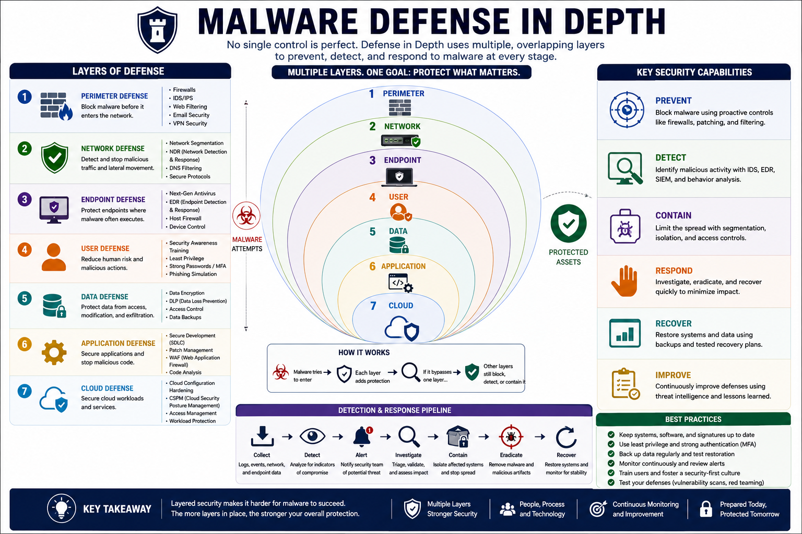

An effective defense strategy focuses on preventing initial compromise, detecting malicious activity quickly, limiting the spread of infections, and recovering systems with minimal disruption.

### Preventive Controls

Organizations should implement preventive measures such as:

- Keeping operating systems and applications fully patched.
- Deploying reputable antivirus and Endpoint Detection and Response (EDR) solutions.
- Enforcing Multi-Factor Authentication (MFA).
- Applying the principle of least privilege.
- Restricting unnecessary administrative privileges.
- Using application allowlisting where appropriate.
- Enabling firewalls on endpoints and network devices.
- Disabling unnecessary services and ports.

These controls reduce the attack surface and make successful malware infections less likely.

### User Awareness

Many malware attacks begin with human error. Organizations should regularly educate users to:

- Recognize phishing emails.
- Avoid opening unexpected attachments.
- Verify download sources before installing software.
- Be cautious of fake software updates.
- Report suspicious activity immediately.

Security awareness training remains one of the most effective defenses against social engineering attacks.

### Detection and Monitoring

Continuous monitoring helps detect malware before it causes significant damage.

Organizations should:

- Monitor endpoint activity.
- Analyze security logs.
- Detect abnormal network traffic.
- Monitor PowerShell and command-line activity.
- Identify communication with known malicious IP addresses or domains.
- Use Security Information and Event Management (SIEM) platforms to correlate security events.

Early detection significantly improves incident response effectiveness.

### Containment and Recovery

If malware is detected, organizations should respond quickly by:

1. Isolating affected systems.
2. Preventing lateral movement.
3. Collecting forensic evidence.
4. Removing malicious software.
5. Restoring systems from trusted backups.
6. Resetting compromised credentials.
7. Monitoring systems for signs of reinfection.

A well-defined Incident Response Plan (IRP) helps organizations recover more efficiently after an attack.

### Defense in Depth

No single security control can prevent every malware infection.

Instead, organizations combine multiple layers of protection, including:

- Security awareness training.
- Email filtering.
- Firewalls.
- Endpoint protection.
- Network segmentation.
- Least privilege.
- Regular patch management.
- Continuous monitoring.
- Secure backups.
- Incident response planning.

If one layer fails, additional layers continue protecting the organization.

### Key Takeaway

Effective malware defense is built on prevention, detection, response, and recovery rather than relying on a single security product. A layered security strategy, combined with continuous monitoring and informed users, provides the strongest protection against modern malware threats.