# Social Engineering

## What Is Social Engineering?

**Social engineering** is the practice of manipulating people into revealing sensitive information or performing actions that compromise security. Instead of exploiting technical vulnerabilities in software or hardware, attackers exploit human psychology by taking advantage of trust, curiosity, fear, urgency, or authority.

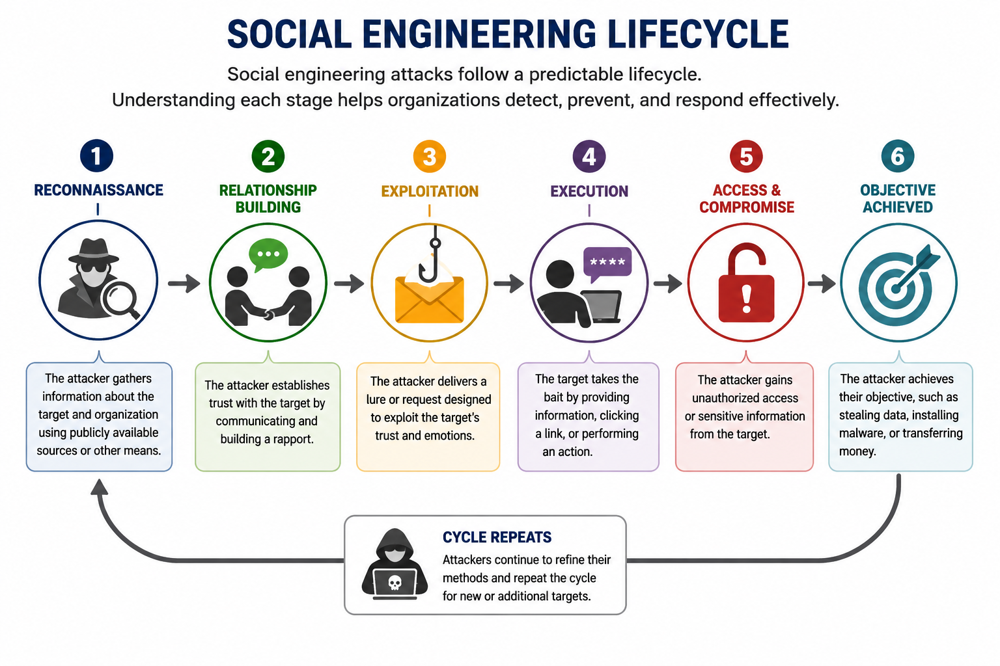

Social engineering attacks are often the first step in a larger cyberattack. By convincing victims to disclose credentials, install malicious software, transfer money, or grant unauthorized access, attackers can bypass technical security controls without directly attacking the underlying systems.

### Why It Is Effective

Social engineering remains one of the most successful attack techniques because it targets the weakest component of most security programs—the human element.

Attackers commonly exploit emotions such as:

- Trust.
- Curiosity.
- Fear.
- Urgency.
- Greed.
- Desire to help others.

When individuals react emotionally rather than critically, they are more likely to make decisions that compromise security.

### Common Objectives

The objectives of a social engineering attack vary depending on the attacker, but commonly include:

- Stealing usernames and passwords.
- Obtaining financial information.
- Installing malware.
- Bypassing security controls.
- Gaining unauthorized access.
- Collecting confidential business information.
- Persuading victims to transfer money.

Many modern cyberattacks begin with social engineering before progressing to malware deployment, privilege escalation, or data theft.

### Human Vulnerabilities

Rather than exploiting software flaws, social engineering targets predictable human behaviors, including:

- Trusting familiar names or brands.
- Responding quickly to urgent requests.
- Following instructions from perceived authority figures.
- Curiosity about unexpected messages or attachments.
- Willingness to help coworkers or customers.

Understanding these psychological triggers is essential for recognizing and preventing social engineering attacks.

### Examples

Examples of social engineering attacks include:

- A phishing email requesting a password reset.
- A phone call from someone pretending to be technical support.
- A text message claiming to be from a bank.
- An attacker pretending to be a company employee to gain physical access.
- A malicious USB drive intentionally left in a public area.

Although the delivery methods differ, each attack relies on manipulating human behavior rather than exploiting technical vulnerabilities.

### Key Concept

Unlike traditional cyberattacks that target systems, social engineering targets people. Even organizations with strong technical security controls remain vulnerable if employees can be manipulated into revealing sensitive information or performing unsafe actions.

---

## Why Social Engineering Works

Social engineering succeeds because it targets human behavior rather than technical weaknesses. Even the most secure systems can be compromised if an attacker persuades a trusted individual to reveal sensitive information or perform an unsafe action.

Unlike software vulnerabilities, human behavior cannot be patched. Attackers study how people think, react, and make decisions under pressure, then craft attacks that exploit predictable psychological tendencies.

### Common Psychological Principles

Social engineers commonly rely on several psychological principles to influence their victims, including:

- Authority.
- Urgency.
- Trust.
- Fear.
- Curiosity.
- Greed.
- Familiarity.
- Reciprocity.

These principles encourage victims to act quickly or emotionally instead of carefully evaluating a situation.

### Authority

People naturally tend to obey individuals they perceive as authority figures.

For example, an attacker may impersonate:

- A company executive.
- An IT administrator.
- A government official.
- A law enforcement officer.

Victims are often less likely to question requests coming from someone they believe has authority.

### Urgency

Creating a sense of urgency reduces a person's willingness to verify information.

Examples include:

- "Your account will be locked in 10 minutes."
- "Immediate action is required."
- "Respond before the deadline expires."

Victims frequently prioritize speed over security when they believe immediate action is necessary.

### Trust and Familiarity

Attackers often impersonate trusted organizations or individuals to make their requests appear legitimate.

Common examples include:

- Banks.
- Cloud service providers.
- Delivery companies.
- Coworkers.
- Friends.
- Technical support staff.

People are significantly more likely to comply with requests from familiar sources.

### Fear and Curiosity

Fear and curiosity are powerful emotional triggers.

Fear-based attacks may warn victims about:

- Security incidents.
- Account suspensions.
- Financial problems.
- Legal consequences.

Curiosity-based attacks may promise:

- Confidential information.
- Salary reports.
- Company announcements.
- Exclusive content.

Both emotions encourage users to click links or open attachments without proper verification.

### Reciprocity

People often feel obligated to return favors.

An attacker may first offer assistance, free software, or useful information before requesting sensitive information or access in return.

This psychological principle is commonly exploited in quid pro quo attacks.

### Human Error

Many successful cyberattacks are not caused by technical failures but by ordinary human mistakes, such as:

- Clicking malicious links.
- Opening unexpected attachments.
- Reusing passwords.
- Sharing confidential information.
- Ignoring security policies.
- Trusting unknown individuals.

Because these actions appear harmless at first, they remain one of the most common causes of security incidents.

### Key Concept

Technical security controls protect systems, but human awareness protects organizations. Understanding the psychological techniques used by attackers is one of the most effective ways to recognize and prevent social engineering attacks before they succeed.

---

## Social Engineering Attack Lifecycle

Most social engineering attacks follow a predictable sequence of steps. Rather than relying on sophisticated technical exploits, attackers carefully plan their approach, gather information about the target, build trust, and manipulate the victim into performing an action that benefits the attacker.

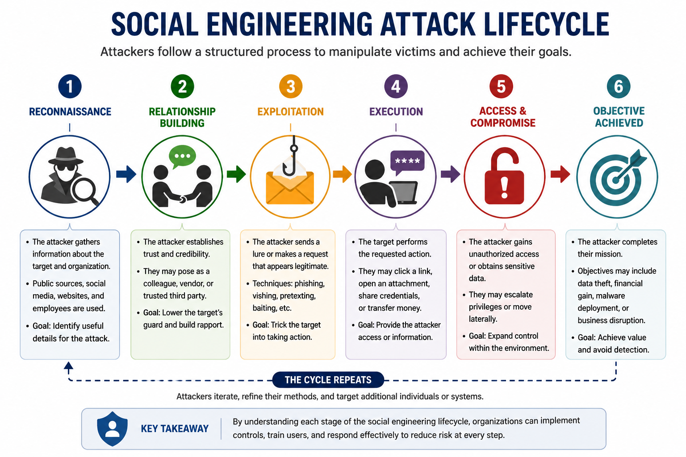

Understanding this lifecycle helps security professionals identify attacks early and implement controls that interrupt the attack before it succeeds.

### Phase 1 — Reconnaissance

The attack begins with information gathering.

Attackers collect publicly available information about their target from sources such as:

- Social media platforms.
- Company websites.
- Professional networking sites.
- Public records.
- Previous data breaches.

The more information attackers collect, the more convincing their attack becomes.

### Phase 2 — Building Trust

After gathering information, attackers establish credibility.

They may impersonate:

- A coworker.
- A manager.
- Technical support.
- A trusted vendor.
- A financial institution.
- A government agency.

Their goal is to appear legitimate and lower the victim's suspicion.

### Phase 3 — Exploitation

Once trust has been established, the attacker attempts to manipulate the victim into performing a desired action.

Common actions include:

- Clicking a malicious link.
- Opening an infected attachment.
- Revealing login credentials.
- Approving a fraudulent payment.
- Installing malicious software.
- Granting physical or remote access.

At this stage, psychological manipulation replaces technical exploitation.

### Phase 4 — Objective Achieved

If the victim complies, the attacker accomplishes one or more objectives, such as:

- Stealing credentials.
- Deploying malware.
- Accessing sensitive systems.
- Exfiltrating confidential data.
- Escalating privileges.
- Establishing persistent access.

Many cyberattacks begin with successful social engineering before transitioning into technical attacks.

### Phase 5 — Covering Tracks

Some attackers attempt to conceal their activity to delay detection.

They may:

- Delete emails or messages.
- Clear logs.
- Remove malicious files.
- Disable security tools.
- Continue operating quietly for long periods.

Remaining undetected allows attackers to maintain access and increase the impact of the compromise.

### Interrupting the Lifecycle

Organizations can stop a social engineering attack at multiple stages by:

- Limiting publicly available information.
- Providing regular security awareness training.
- Verifying unexpected requests.
- Implementing Multi-Factor Authentication (MFA).
- Monitoring suspicious activity.
- Encouraging employees to report suspected attacks immediately.

Breaking any stage of the lifecycle can prevent the attack from reaching its objective.

### Key Concept

Successful social engineering attacks rarely occur by chance. They are carefully planned operations that exploit human psychology through a structured process of reconnaissance, trust building, manipulation, and exploitation.

---

## Phishing

**Phishing** is a social engineering attack in which an attacker attempts to deceive victims into revealing sensitive information or performing harmful actions by pretending to be a trusted individual or organization. These attacks are commonly delivered through email but may also appear on websites, messaging platforms, or collaboration tools.

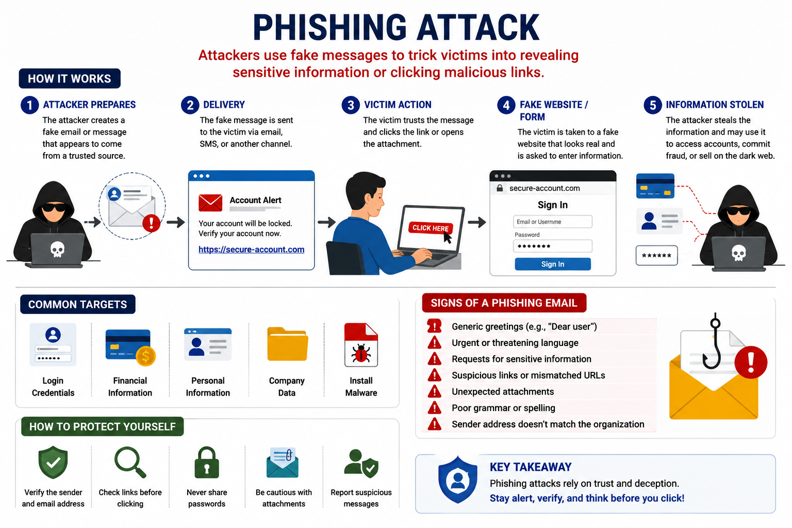

The primary goal of phishing is to manipulate victims into providing credentials, financial information, or other confidential data, or to convince them to install malware or visit malicious websites.

### Characteristics

Phishing attacks commonly exhibit the following characteristics:

- Impersonate trusted organizations or individuals.
- Use convincing branding, logos, and email templates.
- Create a sense of urgency or fear.
- Contain malicious links or attachments.
- Attempt to steal credentials or deliver malware.
- Target large numbers of potential victims.

Because phishing relies on deception rather than technical exploits, even well-secured organizations remain vulnerable if users are not properly trained.

### How Phishing Works

A typical phishing attack follows these steps:

1. The attacker creates a fraudulent message that appears legitimate.
2. The message is sent to one or many potential victims.
3. The victim clicks a malicious link or opens an attachment.
4. The victim is redirected to a fake website or unknowingly installs malware.
5. Sensitive information is stolen, or the attacker's objectives are achieved.

Many phishing attacks imitate legitimate login pages to capture usernames, passwords, and multi-factor authentication codes.

### Common Indicators

Although phishing messages often appear convincing, they frequently contain warning signs such as:

- Unexpected requests for sensitive information.
- Generic greetings instead of personal names.
- Misspelled domain names.
- Poor grammar or unusual wording.
- Suspicious links or attachments.
- Urgent requests demanding immediate action.

Recognizing these indicators significantly reduces the likelihood of a successful phishing attack.

### Examples

Common phishing scenarios include:

- An email claiming that a password has expired and requires immediate verification.
- A fake bank notification requesting account confirmation.
- A package delivery message asking the user to click a tracking link.
- A cloud service email requesting a login to resolve an account issue.

These messages are designed to appear legitimate while directing victims to attacker-controlled websites or malicious content.

### Prevention

Organizations can reduce the risk of phishing attacks by:

- Providing regular security awareness training.
- Verifying unexpected requests through trusted communication channels.
- Inspecting links before clicking them.
- Avoiding unexpected email attachments.
- Deploying email filtering and anti-phishing solutions.
- Enforcing Multi-Factor Authentication (MFA).
- Reporting suspicious emails to the security team.

User awareness remains one of the most effective defenses against phishing because the attack depends on convincing someone to trust a fraudulent message.

---

## Spear Phishing

**Spear phishing** is a targeted form of phishing in which attackers carefully customize their messages for a specific individual, department, or organization. Unlike traditional phishing campaigns that target large numbers of people, spear phishing focuses on a small number of selected victims using personalized information to increase credibility.

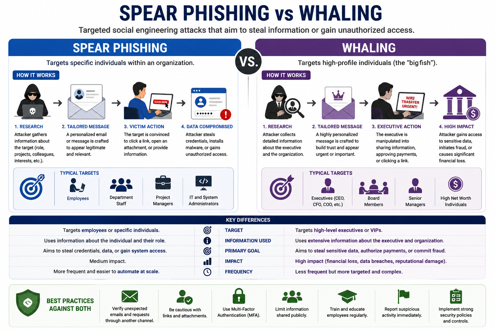

Attackers often conduct reconnaissance before launching a spear phishing attack. Information gathered from social media, company websites, or previous data breaches allows them to create messages that appear authentic and relevant to the target.

### Characteristics

Spear phishing attacks typically:

- Target specific individuals or groups.
- Contain personalized information.
- Reference real coworkers, projects, or organizations.
- Appear highly legitimate.
- Aim to steal credentials, deliver malware, or obtain sensitive information.

Because these attacks are tailored to the victim, they are generally more convincing and have a higher success rate than traditional phishing campaigns.

### How Spear Phishing Works

A typical spear phishing attack follows these steps:

1. The attacker gathers information about the target.
2. A personalized email or message is created.
3. The victim receives what appears to be a legitimate request.
4. The victim clicks a malicious link, opens an attachment, or provides sensitive information.
5. The attacker gains unauthorized access or achieves another objective.

The personalization makes it significantly more difficult for victims to recognize the message as fraudulent.

### Example

An attacker researches an employee on LinkedIn and discovers they work in the finance department.

The attacker then sends an email that appears to come from the employee's manager requesting an urgent review of an attached invoice. Believing the request is legitimate, the employee opens the attachment, which installs malware.

### Prevention

Organizations can reduce the risk of spear phishing by:

- Verifying unexpected requests through a secondary communication channel.
- Providing regular security awareness training.
- Limiting the amount of employee information available publicly.
- Using email authentication technologies such as SPF, DKIM, and DMARC.
- Enforcing Multi-Factor Authentication (MFA).
- Reporting suspicious emails immediately.

Although spear phishing relies on the same principles as traditional phishing, its personalized nature makes it considerably more difficult to detect.

### Key Difference from Phishing

Traditional phishing targets a large audience with the same generic message, while spear phishing targets specific individuals using personalized information to increase the likelihood of success.

---

## Whaling

**Whaling** is a specialized form of spear phishing that targets high-ranking executives and other senior decision-makers within an organization. Because these individuals often have access to sensitive information and financial resources, they are attractive targets for attackers seeking maximum impact.

Unlike general phishing campaigns, whaling attacks are carefully researched and highly personalized. Attackers often spend significant time gathering information about their target to create convincing messages that appear legitimate.

### Characteristics

Whaling attacks typically:

- Target executives such as CEOs, CFOs, CIOs, and other senior leaders.
- Use highly personalized and convincing messages.
- Exploit the authority and responsibilities of the target.
- Attempt to steal confidential information or initiate fraudulent financial transactions.
- Require extensive reconnaissance before the attack.

Because executives receive numerous business communications daily, sophisticated whaling attacks can be difficult to recognize.

### How Whaling Works

A typical whaling attack follows these steps:

1. The attacker gathers information about a senior executive.
2. A highly convincing email or message is crafted.
3. The message appears to originate from a trusted business partner, legal advisor, or another executive.
4. The executive is persuaded to approve a payment, disclose confidential information, or open a malicious attachment.
5. The attacker gains financial or strategic advantage.

The success of the attack depends on careful personalization and the victim's willingness to trust the apparent sender.

### Example

An attacker sends an email to a company's Chief Financial Officer (CFO) that appears to come from the Chief Executive Officer (CEO), requesting an urgent wire transfer to finalize a confidential acquisition.

Believing the request is legitimate and time-sensitive, the CFO authorizes the transfer, resulting in significant financial loss.

### Prevention

Organizations can reduce the risk of whaling attacks by:

- Requiring multi-person approval for financial transactions.
- Verifying unusual requests through trusted communication channels.
- Providing executive-focused security awareness training.
- Enforcing Multi-Factor Authentication (MFA).
- Using email authentication technologies such as SPF, DKIM, and DMARC.
- Establishing clear procedures for handling sensitive requests.

Because executives are frequent targets of advanced social engineering campaigns, organizations should provide them with specialized security training and verification procedures.

### Key Difference from Spear Phishing

Spear phishing targets any specific individual or group, whereas whaling specifically targets senior executives and other high-value individuals whose access or authority can have a significant organizational impact.

---

## Vishing

**Vishing** (Voice Phishing) is a social engineering attack that uses telephone calls or voice communication to deceive victims into revealing sensitive information or performing actions that benefit the attacker. Instead of using email, attackers rely on verbal communication to build trust and create a sense of urgency.

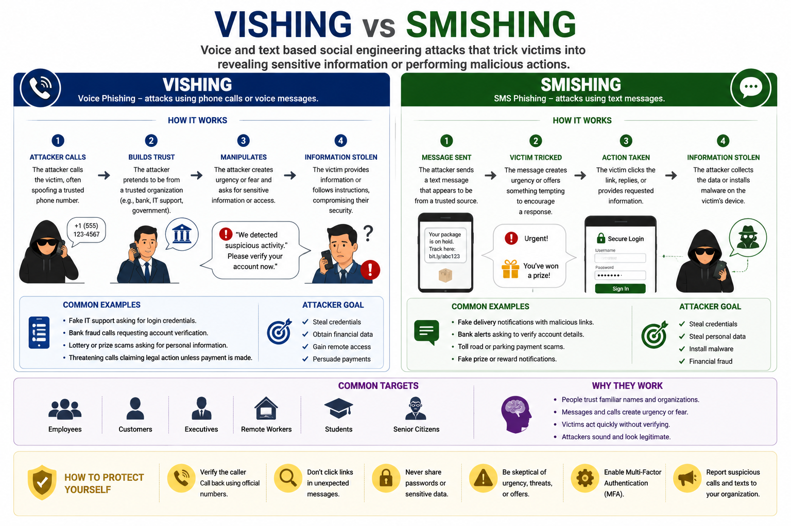

Attackers often impersonate trusted organizations such as banks, government agencies, technical support teams, or law enforcement to convince victims that the call is legitimate.

### Characteristics

Vishing attacks typically:

- Are conducted through phone calls or voice messages.
- Impersonate trusted organizations or authority figures.
- Create urgency or fear to pressure victims.
- Request sensitive information or immediate action.
- Exploit the victim's trust in verbal communication.

Because people often associate phone calls with legitimacy, victims may be less skeptical than they would be when receiving an email.

### How Vishing Works

A typical vishing attack follows these steps:

1. The attacker calls the victim while pretending to represent a trusted organization.
2. The attacker claims there is an urgent issue, such as suspicious account activity or a security incident.
3. The victim is instructed to verify personal information, provide credentials, or authorize a transaction.
4. The attacker uses the obtained information to compromise accounts or commit fraud.

Some attackers use caller ID spoofing to make the incoming number appear legitimate, increasing the credibility of the attack.

### Examples

Common vishing scenarios include:

- A caller claiming to be from a bank requesting account verification.
- Someone pretending to be technical support asking for remote access to a computer.
- A fake government official requesting personal information.
- A caller claiming that unusual activity has been detected on an account and immediate verification is required.

Each scenario relies on convincing the victim that the caller is trustworthy and that immediate action is necessary.

### Prevention

Organizations and individuals can reduce the risk of vishing by:

- Never sharing sensitive information over unsolicited phone calls.
- Independently verifying the caller's identity using official contact information.
- Being cautious of urgent requests that discourage verification.
- Refusing requests for passwords, one-time passcodes, or MFA codes over the phone.
- Reporting suspicious calls to the appropriate security or fraud department.

Verifying a caller's identity before providing any sensitive information is one of the most effective defenses against vishing attacks.

### Key Difference from Phishing

Phishing primarily relies on emails or malicious websites, whereas vishing uses voice communication to manipulate victims into revealing sensitive information or performing unauthorized actions.

---

## Smishing

**Smishing** (SMS Phishing) is a social engineering attack that uses text messages (SMS) or messaging applications to trick victims into revealing sensitive information, clicking malicious links, downloading malware, or performing unauthorized actions.

Attackers frequently impersonate trusted organizations such as banks, delivery services, government agencies, or online service providers. These messages often create a sense of urgency, encouraging victims to act quickly without verifying the sender's identity.

### Characteristics

Smishing attacks typically:

- Are delivered through SMS or messaging applications.
- Contain malicious links or fraudulent phone numbers.
- Impersonate trusted organizations or services.
- Create urgency or fear to encourage immediate action.
- Attempt to steal credentials, financial information, or install malware.

Because mobile devices have smaller screens and users often read messages quickly, it can be more difficult to identify suspicious details.

### How Smishing Works

A typical smishing attack follows these steps:

1. The attacker sends a fraudulent text message to the victim.
2. The message claims that immediate action is required, such as verifying an account or tracking a package.
3. The victim clicks a malicious link or calls a fraudulent phone number.
4. The victim is directed to a fake website, persuaded to disclose sensitive information, or tricked into installing malicious software.
5. The attacker gains access to credentials, financial information, or the victim's device.

Some smishing campaigns use shortened URLs to hide the true destination of the malicious website.

### Examples

Common smishing scenarios include:

- A text message claiming that a package delivery failed and providing a tracking link.
- A fake banking alert requesting immediate account verification.
- A message stating that an account has been suspended unless the user logs in immediately.
- A fraudulent notification claiming the recipient has won a prize and must click a link to claim it.

These messages are designed to appear legitimate while directing victims to attacker-controlled resources.

### Prevention

Organizations and individuals can reduce the risk of smishing by:

- Avoiding links in unsolicited text messages.
- Verifying requests through official websites or trusted contact information.
- Keeping mobile devices and applications up to date.
- Using mobile security solutions when appropriate.
- Reporting suspicious messages instead of responding to them.
- Being cautious of unexpected messages that demand immediate action.

Entering a website by typing its official address manually is generally safer than following links received in unsolicited text messages.

### Key Difference from Vishing

Vishing relies on voice communication through phone calls, whereas smishing uses text messages or messaging applications to deceive victims. Both attacks exploit trust and urgency, but they differ primarily in the communication channel used.

---

## Pretexting

**Pretexting** is a social engineering technique in which an attacker creates a believable fabricated scenario (a pretext) to convince a victim to disclose sensitive information or perform actions that would not normally be permitted.

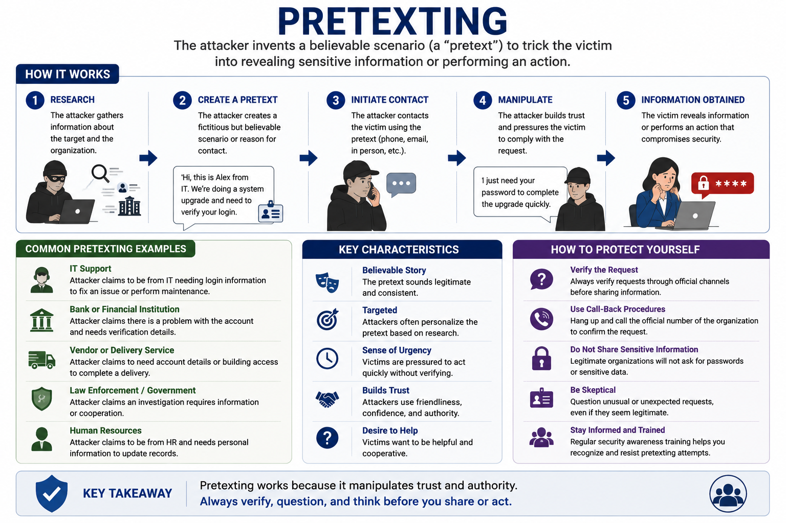

Unlike phishing, which often relies on urgency or fear, pretexting focuses on establishing credibility through a convincing identity and a plausible story. Attackers carefully prepare their scenario to make their requests appear legitimate.

### Characteristics

Pretexting attacks typically:

- Involve a carefully planned fabricated story.
- Rely on impersonating a trusted individual or organization.
- Require research about the victim or organization.
- Build trust before requesting sensitive information.
- Often involve direct communication through phone calls, emails, or face-to-face interactions.

The more believable the scenario, the more likely the victim is to comply.

### How Pretexting Works

A typical pretexting attack follows these steps:

1. The attacker gathers information about the target.
2. A believable identity and scenario are created.
3. The attacker contacts the victim while acting in the assumed role.
4. The victim is persuaded to disclose confidential information or perform a requested action.
5. The attacker uses the obtained information to achieve their objective.

The attack succeeds because the victim believes the request is both legitimate and appropriate.

### Examples

Common pretexting scenarios include:

- An attacker pretending to be an IT administrator requesting a user's password to "resolve a system issue."
- Someone posing as a bank representative asking to verify account information.
- An individual claiming to be an external auditor requesting confidential company records.
- A fake Human Resources representative requesting personal employee information.

Each scenario depends on the attacker presenting a convincing identity and believable justification.

### Prevention

Organizations can reduce the risk of pretexting by:

- Verifying the identity of anyone requesting sensitive information.
- Following established verification procedures before sharing confidential data.
- Training employees to recognize suspicious requests.
- Applying the principle of least privilege.
- Never sharing passwords or authentication codes, regardless of who requests them.
- Encouraging employees to report suspicious interactions.

Employees should understand that legitimate organizations rarely request sensitive information without following established verification procedures.

### Key Difference from Phishing

Phishing generally relies on fraudulent messages sent to many potential victims, whereas pretexting relies on a carefully constructed false identity and believable scenario to manipulate a specific target into revealing information or performing an action.

---

## Impersonation

**Impersonation** is a social engineering technique in which an attacker pretends to be a trusted person or representative of a legitimate organization to deceive a victim into revealing sensitive information or granting unauthorized access.

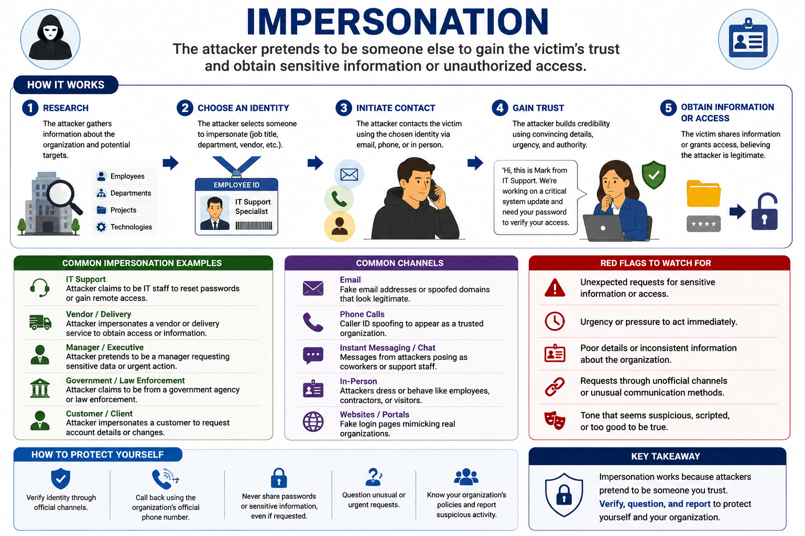

Attackers may impersonate coworkers, executives, technical support personnel, vendors, government officials, or law enforcement officers. Their objective is to exploit the victim's trust in the assumed identity rather than technical vulnerabilities.

### Characteristics

Impersonation attacks typically:

- Involve pretending to be a trusted individual or organization.
- Exploit authority, trust, or familiarity.
- Occur through phone calls, emails, messaging platforms, or face-to-face interactions.
- Aim to obtain sensitive information, physical access, or system access.
- Often support other social engineering techniques such as pretexting or phishing.

A convincing identity is often enough to persuade victims to bypass established security procedures.

### How Impersonation Works

A typical impersonation attack follows these steps:

1. The attacker identifies a trusted person or organization to imitate.
2. Information is gathered to make the impersonation believable.
3. The attacker contacts the victim while claiming the false identity.
4. The victim is persuaded to disclose information or perform an unauthorized action.
5. The attacker uses the acquired information or access to achieve their objective.

Successful impersonation depends on the victim accepting the attacker's identity without proper verification.

### Examples

Common impersonation scenarios include:

- An attacker posing as an IT technician requesting a user's password.
- Someone pretending to be a delivery employee to gain access to a secure building.
- An individual claiming to be a government official requesting confidential records.
- A fake vendor asking an employee to update banking information for future payments.

Each attack succeeds by exploiting the victim's trust in the assumed identity.

### Prevention

Organizations can reduce the risk of impersonation attacks by:

- Verifying identities before sharing sensitive information.
- Requiring official identification for visitors and contractors.
- Confirming unusual requests through independent communication channels.
- Following established security procedures without exceptions.
- Providing regular security awareness training.
- Reporting suspicious interactions immediately.

Employees should remember that legitimate individuals will not object to reasonable identity verification procedures.

### Key Difference from Pretexting

Pretexting focuses on creating a believable fictional scenario to justify a request, whereas impersonation focuses on assuming the identity of a trusted person or organization. In practice, many attacks combine both techniques to increase credibility.

---

## Tailgating and Piggybacking

**Tailgating** and **Piggybacking** are physical social engineering techniques used to gain unauthorized access to restricted areas by exploiting the presence and actions of authorized individuals.

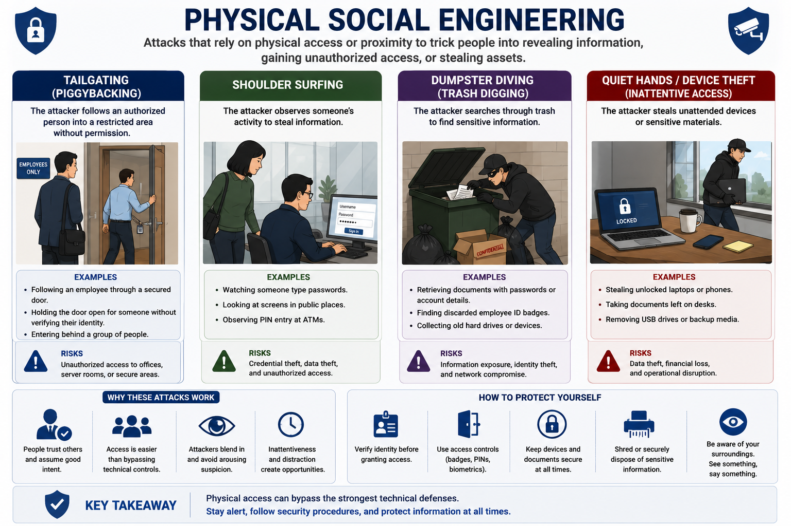

Although the two terms are often used interchangeably, they describe slightly different situations. In both cases, the attacker bypasses physical security controls by relying on human behavior rather than defeating locks, access cards, or other security mechanisms.

### Tailgating

**Tailgating** occurs when an unauthorized person follows an authorized individual into a secure area **without the person's knowledge or permission**.

The attacker may:

- Walk closely behind an employee entering a secure building.
- Carry boxes or equipment to avoid suspicion.
- Enter before a door closes.
- Blend in with a group of employees.

Because the authorized person is unaware of the attacker, no permission is intentionally given.

### Piggybacking

**Piggybacking** occurs when an authorized person **knowingly allows** another individual to enter a restricted area.

This often happens because the authorized person wants to be polite or helpful.

Examples include:

- Holding a secure door open for someone without verifying their identity.
- Allowing a visitor to enter because they claim to have forgotten their access badge.
- Letting a person follow into a restricted office without proper authorization.

Unlike tailgating, piggybacking involves the authorized person's awareness, even if they are unaware of the security risk.

### Characteristics

Tailgating and piggybacking attacks typically:

- Target physical security controls.
- Exploit trust, courtesy, and helpful behavior.
- Require little or no technical expertise.
- May provide access to sensitive information or equipment.
- Can serve as the first step in a larger cyberattack.

Once inside a secure facility, attackers may connect rogue devices, steal equipment, install malware, or collect confidential information.

### Examples

Common scenarios include:

- An employee unlocks a secure door, and an attacker quietly follows behind before it closes.
- A visitor claims to have forgotten their access badge, and an employee allows them to enter.
- An attacker carries heavy packages to encourage employees to hold the door open.
- Someone wearing clothing resembling a company uniform enters a restricted area without verification.

Each example demonstrates how normal acts of courtesy can unintentionally compromise physical security.

### Prevention

Organizations can reduce the risk of tailgating and piggybacking by:

- Requiring every individual to use their own access credentials.
- Verifying visitor identities before granting access.
- Escorting visitors while they are on-site.
- Installing access control systems such as badge readers and turnstiles.
- Training employees not to hold secure doors open for unknown individuals.
- Encouraging employees to challenge or report unfamiliar persons in restricted areas.

Physical security policies are only effective when employees consistently follow them.

### Key Difference

- **Tailgating:** The authorized person is **unaware** that someone is following them into a secure area.
- **Piggybacking:** The authorized person **knowingly allows** another person to enter, often out of courtesy or a desire to help.

---

## Shoulder Surfing

**Shoulder surfing** is a physical social engineering technique in which an attacker observes a victim to obtain sensitive information without their knowledge. Instead of using technical methods, the attacker simply watches the victim enter or access confidential information.

Shoulder surfing commonly occurs in public places where people access sensitive information without considering who may be watching nearby.

### Characteristics

Shoulder surfing attacks typically:

- Require physical proximity to the victim.
- Exploit carelessness rather than technical vulnerabilities.
- Target passwords, PINs, authentication codes, and confidential documents.
- Can occur in public or workplace environments.
- Often leave no digital evidence of the attack.

Because no malware or hacking tools are involved, victims may never realize their information has been compromised.

### How Shoulder Surfing Works

A typical shoulder surfing attack follows these steps:

1. The attacker positions themselves near the victim.
2. The victim enters sensitive information or views confidential data.
3. The attacker observes or records the information.
4. The attacker later uses the collected information to gain unauthorized access or commit fraud.

Attackers may observe directly or use devices such as cameras, smartphones, or binoculars to capture sensitive information from a distance.

### Examples

Common shoulder surfing scenarios include:

- Watching someone enter an ATM PIN.
- Observing an employee type a password in an office.
- Recording a user entering login credentials in a coffee shop.
- Reading confidential documents displayed on an unattended computer screen.
- Viewing authentication codes displayed on a mobile device.

These attacks rely entirely on the victim's lack of awareness of their surroundings.

### Prevention

Organizations and individuals can reduce the risk of shoulder surfing by:

- Being aware of nearby individuals when entering sensitive information.
- Using privacy screen filters on laptops and mobile devices.
- Locking computers when leaving a workstation.
- Positioning monitors away from public view.
- Shielding keyboards when entering passwords or PINs.
- Avoiding the display of confidential information in public places.

Maintaining physical awareness is one of the simplest and most effective ways to prevent shoulder surfing attacks.

### Key Difference from Tailgating

Tailgating and piggybacking aim to gain unauthorized **physical access** to restricted areas, whereas shoulder surfing aims to obtain **sensitive information** by observing the victim without requiring system or building access.

---

## Dumpster Diving

**Dumpster diving** is a physical social engineering technique in which an attacker searches discarded materials to obtain sensitive information that can be used to compromise an individual or organization. Instead of attacking computer systems directly, the attacker exploits improperly disposed documents and devices.

Although many organizations focus on protecting digital assets, confidential information discarded in trash bins or recycling containers can provide attackers with valuable intelligence.

### Characteristics

Dumpster diving attacks typically:

- Target improperly discarded sensitive materials.
- Require little or no technical expertise.
- Exploit poor document disposal practices.
- Gather information that supports future social engineering or cyberattacks.
- Often occur outside office buildings or other business locations.

Information that appears unimportant on its own may become valuable when combined with other publicly available information.

### Valuable Information

Attackers may search for items such as:

- Printed financial records.
- Employee directories.
- Customer information.
- Password notes.
- Internal reports.
- Network diagrams.
- Access badges.
- Storage devices.
- Receipts and invoices.

Even seemingly insignificant documents can reveal useful details about an organization's people, systems, or business processes.

### How Dumpster Diving Works

A typical dumpster diving attack follows these steps:

1. The attacker identifies a target organization.
2. Trash or recycling containers are searched for discarded materials.
3. Sensitive information is collected and analyzed.
4. The information is used to plan additional attacks, such as phishing, impersonation, or unauthorized access.

Dumpster diving is often a reconnaissance activity that supports larger social engineering campaigns.

### Examples

Common dumpster diving scenarios include:

- Recovering printed documents containing employee contact information.
- Finding discarded invoices that reveal supplier relationships.
- Discovering sticky notes containing usernames or passwords.
- Collecting outdated identification badges or access cards.
- Recovering storage media that still contains confidential data.

Each example demonstrates how improper disposal of information can create security risks.

### Prevention

Organizations can reduce the risk of dumpster diving by:

- Shredding confidential documents before disposal.
- Using secure document destruction services.
- Destroying or sanitizing storage media before disposal.
- Locking waste and recycling containers.
- Implementing clear information disposal policies.
- Training employees on proper disposal procedures.

Proper disposal of sensitive information is an essential component of physical security and information security programs.

### Key Difference from Shoulder Surfing

Shoulder surfing obtains sensitive information by observing a victim, whereas dumpster diving obtains sensitive information from discarded materials. Both techniques target people and physical environments rather than exploiting technical vulnerabilities.

---

## Baiting

**Baiting** is a social engineering technique in which an attacker offers something attractive or valuable to entice a victim into performing an action that compromises security. The "bait" may be physical, such as a USB flash drive, or digital, such as free software, media files, or promotional offers.

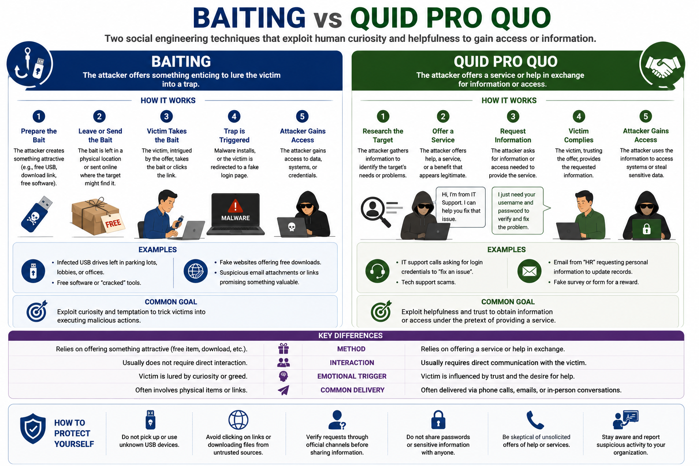

Unlike phishing, which often relies on fear or urgency, baiting primarily exploits curiosity, greed, or the desire to obtain something for free.

### Characteristics

Baiting attacks typically:

- Offer something that appears valuable or beneficial.
- Exploit curiosity or the desire for free items.
- May involve physical or digital media.
- Can lead to malware installation or credential theft.
- Require the victim to voluntarily interact with the bait.

The attack succeeds because the victim believes they are receiving a legitimate benefit.

### How Baiting Works

A typical baiting attack follows these steps:

1. The attacker prepares an attractive bait.
2. The bait is placed where potential victims are likely to find it or delivered electronically.
3. The victim interacts with the bait.
4. Malware is executed, credentials are stolen, or the attacker gains unauthorized access.
5. The attacker achieves their objective.

The victim's decision to interact with the bait is the key factor that enables the attack.

### Examples

Common baiting scenarios include:

- A USB flash drive labeled "Employee Salaries" left in a company parking lot.
- A website offering free software that secretly installs malware.
- A download claiming to provide premium content at no cost.
- A removable storage device intentionally left in a public area to encourage someone to connect it to a computer.

These examples rely on the victim's curiosity or desire to obtain something valuable.

### Prevention

Organizations can reduce the risk of baiting attacks by:

- Training employees not to use unknown removable media.
- Blocking unauthorized USB devices when appropriate.
- Downloading software only from trusted sources.
- Using endpoint protection to detect malicious files.
- Educating users about offers that appear unusually attractive or free.
- Reporting suspicious devices or downloads to the security team.

A simple rule greatly reduces the risk of baiting: if the source is unknown, do not connect, open, or install it.

### Key Difference from Dumpster Diving

Dumpster diving involves attackers searching for discarded information, whereas baiting involves attackers deliberately placing attractive items or content to lure victims into compromising their own security.

---

## Quid Pro Quo

**Quid pro quo** is a social engineering technique in which an attacker offers a service, benefit, or assistance in exchange for information or actions that compromise security. The phrase *quid pro quo* means **"something for something,"** reflecting the exchange-based nature of the attack.

Unlike baiting, which attracts victims with an appealing object or reward, quid pro quo persuades victims by offering help or a valuable service.

### Characteristics

Quid pro quo attacks typically:

- Offer assistance or a service.
- Impersonate technical support or another trusted role.
- Request sensitive information or actions in return.
- Exploit trust, gratitude, or a willingness to cooperate.
- Often involve direct communication through phone calls, emails, or messaging platforms.

Victims often believe they are interacting with someone who is genuinely trying to help.

### How Quid Pro Quo Works

A typical quid pro quo attack follows these steps:

1. The attacker contacts the victim while pretending to provide a legitimate service.
2. The attacker offers assistance, technical support, or another benefit.
3. The victim is asked to perform an action or disclose sensitive information in exchange for the offered help.
4. The attacker uses the obtained information or access to compromise systems or achieve another objective.

The attack succeeds because the victim believes the exchange is legitimate and beneficial.

### Examples

Common quid pro quo scenarios include:

- A caller claiming to be from the IT department offering to resolve a computer issue while requesting the user's password.
- Someone offering free technical support in exchange for remote access to a workstation.
- A fake software vendor offering a free upgrade that requires the user to disable security controls.
- An attacker offering assistance with account recovery while requesting authentication codes.

Each scenario involves an apparent exchange in which the victim believes they will receive something valuable.

### Prevention

Organizations can reduce the risk of quid pro quo attacks by:

- Never sharing passwords or authentication codes with anyone.
- Verifying the identity of technical support personnel before following instructions.
- Using official support channels for technical assistance.
- Providing regular security awareness training.
- Reporting unsolicited offers of assistance to the security team.
- Following established procedures for granting remote access.

Legitimate technical support personnel should never request passwords or ask users to bypass security controls.

### Key Difference from Baiting

Baiting attracts victims with an appealing item or reward, whereas quid pro quo offers a service or assistance in exchange for information or actions. Both techniques rely on manipulating human behavior, but they use different incentives to achieve their objectives.

---

## Watering Hole Attacks

A **watering hole attack** is a targeted cyberattack in which an attacker compromises a legitimate website that is frequently visited by a specific group of users. Instead of contacting victims directly, the attacker waits for them to visit the compromised website, where malicious content is delivered automatically.

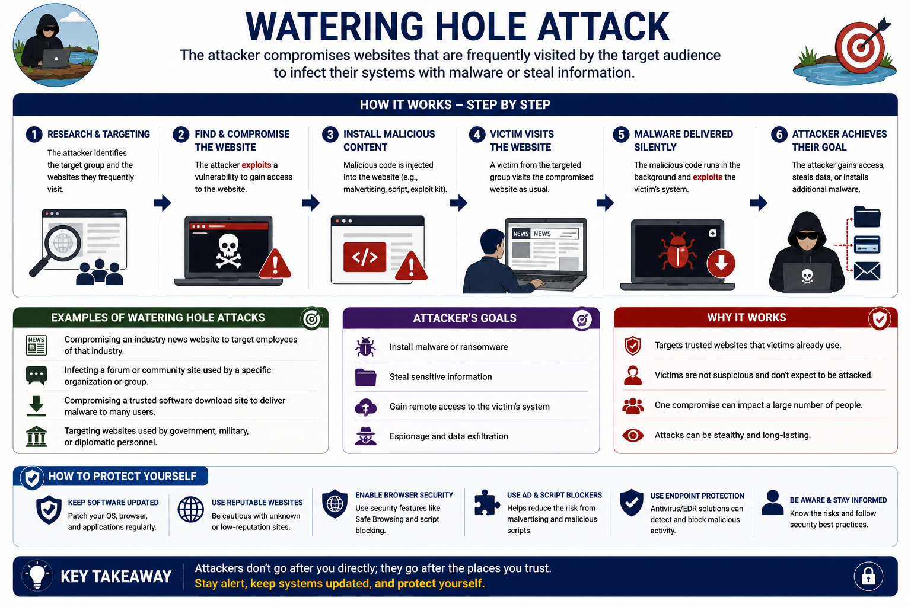

This technique combines elements of social engineering and technical exploitation. The attacker relies on the victim's trust in a familiar website rather than creating a fake one.

### Characteristics

Watering hole attacks typically:

- Target a specific organization or group of individuals.
- Compromise legitimate websites rather than creating fraudulent ones.
- Exploit the trust users place in frequently visited websites.
- Deliver malware or exploit browser vulnerabilities.
- Require significant planning and reconnaissance.

Because victims voluntarily visit trusted websites, these attacks can be difficult to detect.

### How a Watering Hole Attack Works

A typical watering hole attack follows these steps:

1. The attacker identifies the websites commonly visited by the target group.
2. A vulnerable website is compromised.
3. Malicious code is injected into the website.
4. Targeted users visit the legitimate website.
5. The malicious code executes, exploiting browser vulnerabilities or delivering malware.
6. The attacker gains access to the victim's system or network.

Unlike phishing attacks, victims are not required to click a malicious link in an email—the trusted website itself becomes the attack vector.

### Examples

Common watering hole attack scenarios include:

- Compromising an industry association's website frequently visited by employees of a targeted company.
- Injecting malicious code into a supplier's customer portal used by business partners.
- Compromising a professional forum regularly accessed by members of a specific organization.

These attacks are often associated with advanced persistent threats (APTs) targeting governments, large enterprises, or critical infrastructure.

### Prevention

Organizations can reduce the risk of watering hole attacks by:

- Keeping web browsers and operating systems up to date.
- Applying security patches promptly.
- Using endpoint detection and response (EDR) solutions.
- Restricting unnecessary browser plugins.
- Implementing web filtering and DNS security controls.
- Monitoring network traffic for suspicious activity.
- Training users to report unusual website behavior.

Layered security controls help minimize the impact of a compromised trusted website.

### Key Difference from Phishing

Phishing attempts to lure victims to fraudulent websites through deceptive messages, whereas watering hole attacks compromise legitimate websites that victims already trust. In a watering hole attack, the victim visits a real website that has been maliciously modified.

---

## Social Engineering Red Flags

Although social engineering attacks use different techniques, many share common warning signs. Recognizing these indicators can help individuals identify suspicious requests before sensitive information is exposed or security is compromised.

A single warning sign does not always indicate an attack, but multiple red flags appearing together should increase suspicion and prompt verification.

### Common Red Flags

Be cautious if you encounter requests that involve:

- Unusual urgency or pressure to act immediately.
- Requests for passwords, authentication codes, or other sensitive information.
- Unexpected emails, phone calls, or text messages.
- Unfamiliar links or attachments.
- Requests to bypass established security procedures.
- Offers that appear too good to be true.
- Unexpected requests for financial transactions.
- Attempts to discourage independent verification.
- Poor grammar, spelling mistakes, or unusual language.
- Email addresses, phone numbers, or domain names that differ slightly from legitimate ones.
- Unexpected requests for remote access to a device.
- Messages claiming serious consequences if immediate action is not taken.

Attackers frequently combine several of these warning signs to manipulate victims into making quick decisions.

### Verification Best Practices

Before responding to an unexpected request, individuals should:

- Verify the sender's identity using official contact information.
- Confirm unusual requests through a separate communication channel.
- Inspect links before clicking them.
- Avoid opening unexpected attachments.
- Never share passwords or Multi-Factor Authentication (MFA) codes.
- Follow established organizational security procedures.
- Report suspicious communications to the appropriate security team.

Taking a few moments to verify a request can prevent significant security incidents.

### Remember the STOP Principle

Before responding to any unexpected request:

- **Stop** before taking immediate action.
- **Think** about whether the request is reasonable.
- **Observe** for warning signs or inconsistencies.
- **Proceed** only after verifying the request through trusted channels.

Developing this habit helps reduce the likelihood of becoming a victim of social engineering.

### Key Concept

Most social engineering attacks succeed because victims react emotionally or too quickly. Recognizing common red flags and verifying unexpected requests are among the most effective defenses against these attacks.

---

## Prevention and Mitigation

No single security control can completely eliminate the risk of social engineering attacks. Effective defense requires a combination of user awareness, organizational policies, and technical security controls.

Because attackers primarily target people rather than systems, organizations should adopt a layered security approach that reduces the likelihood of successful manipulation.

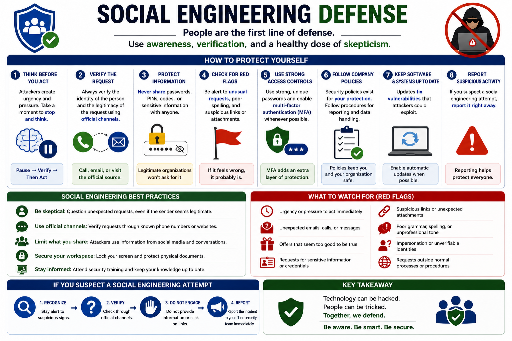

### Security Awareness Training

Regular security awareness training is one of the most effective defenses against social engineering.

Training should teach employees to:

- Recognize common social engineering techniques.
- Identify warning signs of suspicious communications.
- Verify unexpected requests before responding.
- Report suspected attacks immediately.
- Follow established security procedures consistently.

Continuous education helps employees make informed security decisions.

### Identity Verification

Sensitive requests should always be verified before any action is taken.

Organizations should encourage employees to:

- Confirm requests through trusted communication channels.
- Verify the identity of callers, visitors, and email senders.
- Question unusual or unexpected requests.
- Never rely solely on caller ID or email display names.

Verification significantly reduces the effectiveness of impersonation and pretexting attacks.

### Technical Security Controls

Technical controls help reduce the impact of successful social engineering attempts.

Examples include:

- Multi-Factor Authentication (MFA).
- Email filtering and anti-phishing solutions.
- Endpoint Detection and Response (EDR).
- Web filtering and DNS protection.
- Endpoint protection software.
- Access control systems.
- Security monitoring and logging.

Although these controls cannot prevent every attack, they provide additional layers of protection.

### Physical Security Measures

Organizations should also implement physical security controls, including:

- Badge-based access control.
- Visitor registration and escort policies.
- Secure disposal of confidential documents.
- Screen privacy filters where appropriate.
- Secure storage of sensitive materials.
- Restricted access to critical areas.

Strong physical security helps prevent attacks such as tailgating, shoulder surfing, and dumpster diving.

### Organizational Policies

Well-defined security policies reduce uncertainty and encourage consistent behavior.

Organizations should establish procedures for:

- Handling sensitive information.
- Approving financial transactions.
- Granting remote access.
- Reporting security incidents.
- Verifying identity before sharing confidential information.

Employees should understand that following security procedures takes priority over convenience.

### Incident Reporting

Employees should report suspected social engineering attempts immediately, even if they are unsure whether an attack occurred.

Early reporting allows security teams to:

- Investigate suspicious activity.
- Warn other employees.
- Block malicious emails or websites.
- Prevent additional victims.
- Reduce the overall impact of an attack.

Prompt reporting is an essential part of an organization's incident response process.

### Key Concept

The strongest defense against social engineering combines informed users, clear security procedures, and layered technical controls. When people consistently verify unexpected requests and organizations enforce effective security practices, attackers have far fewer opportunities to succeed.

---

## Key Takeaway

Social engineering is one of the most effective attack techniques because it exploits human behavior rather than technical vulnerabilities. By manipulating trust, authority, curiosity, fear, or urgency, attackers can persuade victims to reveal sensitive information, install malware, transfer money, or grant unauthorized access.

Common techniques include phishing, spear phishing, whaling, vishing, smishing, pretexting, impersonation, tailgating, piggybacking, shoulder surfing, dumpster diving, baiting, quid pro quo, and watering hole attacks. Although these attacks differ in their methods, they all rely on influencing human decision-making.

Organizations can significantly reduce the risk of social engineering through continuous security awareness training, identity verification, strong security policies, physical security measures, Multi-Factor Authentication (MFA), and layered technical controls.

Ultimately, technology alone cannot prevent social engineering attacks. The most effective defense is a security-conscious culture in which individuals pause, verify unexpected requests, and follow established security procedures before taking action.