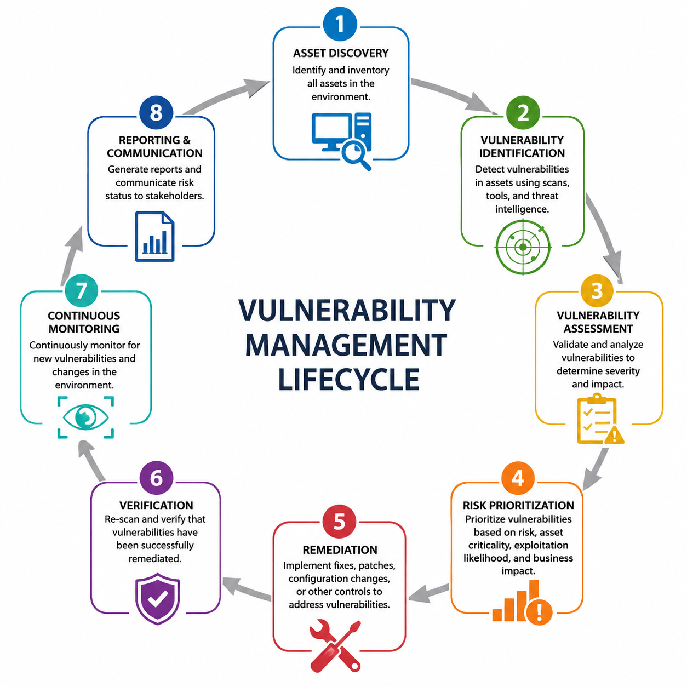
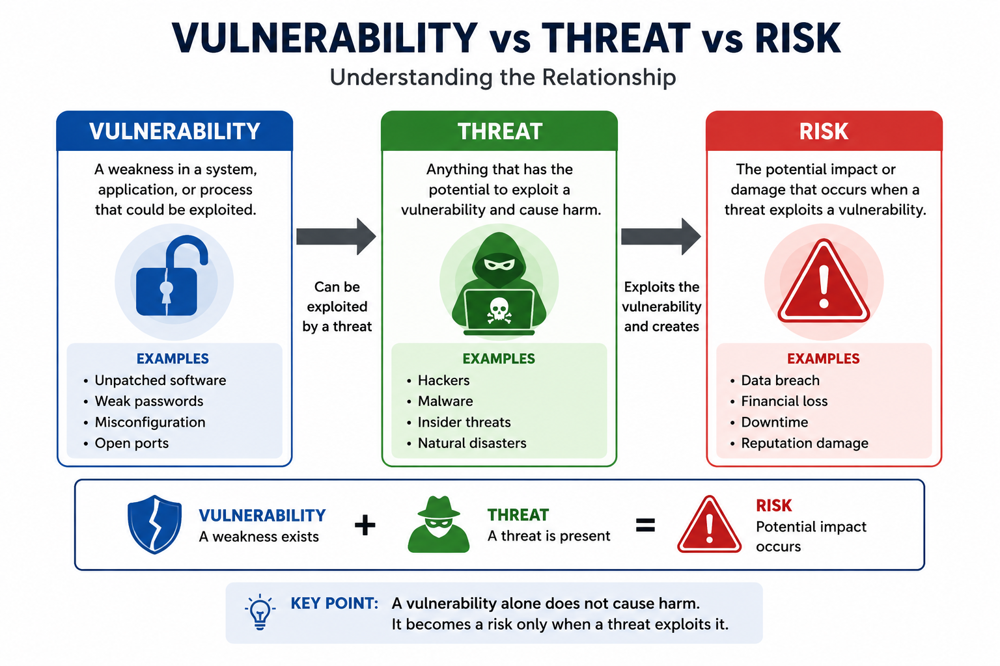
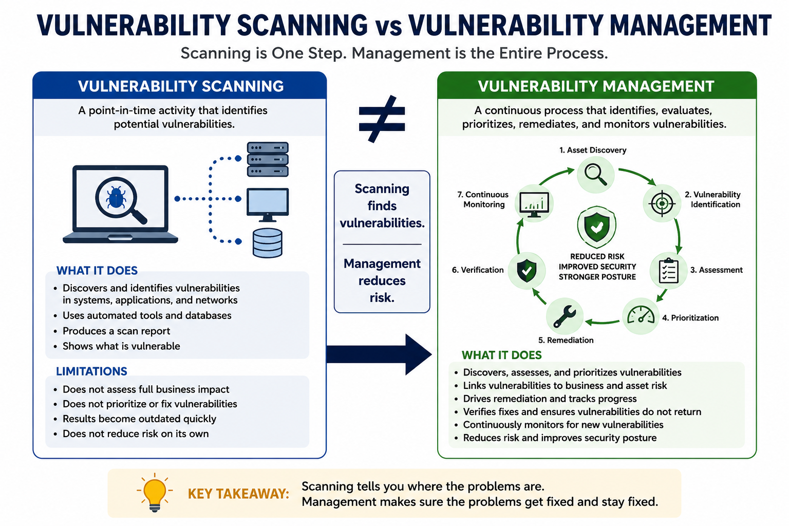

# Vulnerability Management

## What Is Vulnerability Management?

**Vulnerability Management** is the continuous process of identifying, assessing, prioritizing, remediating, verifying, and monitoring security vulnerabilities throughout an organization's environment.

Rather than being a one-time activity, vulnerability management is an ongoing security practice that helps organizations reduce risk by ensuring newly discovered vulnerabilities are addressed before attackers can exploit them.

As operating systems, applications, and network devices are constantly updated, new vulnerabilities are discovered every day. An effective vulnerability management program continuously evaluates the organization's security posture and ensures weaknesses are managed throughout their entire lifecycle.

Unlike reactive security measures that respond after an attack occurs, vulnerability management is a proactive approach focused on reducing the organization's attack surface before a compromise happens.



### Why Vulnerability Management Is Important

Modern organizations operate thousands of devices, applications, cloud services, and network components. Every one of these assets may contain vulnerabilities that attackers can exploit.

Without a structured vulnerability management process, organizations may:

- Leave critical vulnerabilities unpatched.
- Lose visibility into vulnerable assets.
- Prioritize low-risk issues over critical ones.
- Become vulnerable to ransomware and other cyberattacks.
- Fail compliance or regulatory requirements.

A mature vulnerability management program enables organizations to identify security weaknesses early and reduce the likelihood of successful attacks.

### Common Objectives

The primary objectives of vulnerability management include:

- Discovering vulnerable assets.
- Identifying security weaknesses.
- Evaluating the level of risk.
- Prioritizing remediation efforts.
- Reducing the organization's attack surface.
- Continuously monitoring for newly discovered vulnerabilities.
- Improving the overall security posture.

Rather than attempting to eliminate every vulnerability immediately, organizations focus on addressing the vulnerabilities that present the greatest risk.

### Vulnerability Management Is a Continuous Process

One of the most important concepts in Security+ is understanding that vulnerability management is **continuous**.

New vulnerabilities appear regularly because:

- Software vendors release new products and updates.
- Security researchers discover previously unknown vulnerabilities.
- New systems are added to the environment.
- Configuration changes introduce new weaknesses.
- Threat actors continuously develop new exploitation techniques.

For this reason, organizations repeatedly perform vulnerability discovery, assessment, remediation, verification, and monitoring throughout the life of their systems.

### Example

Suppose a company operates 500 employee laptops.

A vulnerability scanner discovers that 120 laptops are running an outdated web browser containing a critical remote code execution vulnerability.

Instead of waiting for an attacker to exploit the flaw, the security team:

1. Identifies the affected systems.
2. Assesses the severity of the vulnerability.
3. Prioritizes remediation based on risk.
4. Deploys the security update.
5. Verifies that the vulnerability has been removed.
6. Continues monitoring for future vulnerabilities.

This entire process represents vulnerability management—not simply vulnerability scanning.

### Key Concept

Vulnerability management is an ongoing risk reduction process that continuously identifies, evaluates, prioritizes, remediates, verifies, and monitors security vulnerabilities before they can be exploited by attackers.

---

---

## Vulnerability vs Threat vs Risk

Although the terms **vulnerability**, **threat**, and **risk** are closely related, they describe different concepts in cybersecurity. Understanding the distinction between them is essential for performing effective risk assessments and making informed security decisions.

### Vulnerability

A **vulnerability** is a weakness that could be exploited to compromise the confidentiality, integrity, or availability of a system.

Vulnerabilities may exist in:

- Operating systems.
- Applications.
- Network devices.
- Cloud services.
- Hardware.
- Security configurations.
- Business processes.
- Human behavior.

A vulnerability does not automatically result in a security incident. It simply creates an opportunity that could be exploited if a threat is present.

#### Examples

- An operating system missing a security patch.
- A weak password policy.
- An exposed database.
- An application vulnerable to SQL injection.
- Default administrator credentials that were never changed.

### Threat

A **threat** is anything capable of exploiting a vulnerability and causing harm to an organization.

Threats may be intentional or unintentional and can originate from many different sources.

Examples include:

- Cybercriminals.
- Nation-state attackers.
- Insider threats.
- Malware.
- Ransomware.
- Natural disasters.
- Human error.
- Hardware failure.

A threat becomes dangerous only when it has an opportunity to exploit a vulnerability.

### Risk

**Risk** is the potential for loss or damage when a threat exploits a vulnerability.

Risk depends on several factors, including:

- The likelihood that the threat will occur.
- The severity of the vulnerability.
- The value of the affected asset.
- The potential business impact.

Organizations generally cannot eliminate all vulnerabilities or threats. Instead, they focus on reducing risk to an acceptable level.

### Relationship Between the Three

The relationship can be summarized as follows:

- A **vulnerability** is a weakness.
- A **threat** is something that can exploit that weakness.
- **Risk** is the potential impact if the exploitation succeeds.

Without a vulnerability, a threat has nothing to exploit.

Without a threat, a vulnerability may never be exploited.

Risk exists only when both a threat and a vulnerability are present.



### Example

Consider a company that operates a public web server.

- The server is running outdated software that contains a known security flaw.
  - **Vulnerability**

- A cybercriminal scans the internet looking for servers affected by this flaw.
  - **Threat**

- If the attacker exploits the vulnerability and gains access to customer data, the organization may suffer financial loss, reputational damage, and regulatory penalties.
  - **Risk**

The organization's goal is to reduce the risk by removing the vulnerability, reducing the likelihood of exploitation, or minimizing the potential impact.

### Key Concept

A vulnerability is a weakness, a threat is anything capable of exploiting that weakness, and risk is the potential damage that results when the threat successfully exploits the vulnerability.

---

---

## Vulnerability Management vs Vulnerability Scanning

The terms **vulnerability management** and **vulnerability scanning** are often used interchangeably, but they do not mean the same thing.

A **vulnerability scan** is a security assessment that identifies known vulnerabilities within systems, applications, or network devices.

**Vulnerability management** is the broader process that includes vulnerability scanning along with assessment, prioritization, remediation, verification, and continuous monitoring.

In other words, vulnerability scanning answers the question:

> **"What vulnerabilities exist?"**

Vulnerability management answers:

> **"What should we do about them?"**

### Vulnerability Scanning

Vulnerability scanning is the process of automatically searching systems for known security weaknesses.

Scanners compare software versions, configurations, and exposed services against databases of known vulnerabilities.

A vulnerability scanner typically identifies:

- Missing security patches.
- Outdated software versions.
- Misconfigurations.
- Weak security settings.
- Default credentials.
- Exposed services.
- Known Common Vulnerabilities and Exposures (CVEs).

Most scanners generate reports describing discovered vulnerabilities and their severity, but they do not automatically fix the problems.

### Vulnerability Management

Vulnerability management begins after vulnerabilities have been discovered.

Security teams analyze the scan results, determine which vulnerabilities pose the greatest risk, plan remediation activities, verify that remediation was successful, and continuously monitor the environment for newly discovered weaknesses.

A typical vulnerability management program includes:

- Asset discovery.
- Vulnerability scanning.
- Risk assessment.
- Prioritization.
- Remediation.
- Verification.
- Reporting.
- Continuous monitoring.

Because new vulnerabilities are discovered regularly, this process repeats continuously throughout the life of the organization's systems.



### Example

A vulnerability scanner identifies 500 vulnerabilities across an organization's network.

Rather than attempting to fix every vulnerability immediately, the security team reviews the results and determines that:

- 15 vulnerabilities are classified as Critical.
- 60 are High.
- 180 are Medium.
- 245 are Low.

The organization first patches the critical vulnerabilities on internet-facing systems, schedules maintenance for medium-risk issues, and accepts the risk associated with several low-impact findings.

This entire decision-making process is vulnerability management.

The scanner only identified the vulnerabilities.

### Key Differences

| Vulnerability Scanning | Vulnerability Management |
|-------------------------|--------------------------|
| Identifies vulnerabilities | Manages the complete lifecycle |
| Usually automated | Combines automated and manual processes |
| Produces scan reports | Produces remediation plans and risk decisions |
| Focuses on discovery | Focuses on reducing organizational risk |
| Point-in-time activity | Continuous process |
| Finds vulnerabilities | Finds, prioritizes, remediates, verifies, and monitors vulnerabilities |

### Key Concept

Vulnerability scanning is a tool for discovering known security weaknesses, while vulnerability management is the continuous process of reducing organizational risk by identifying, assessing, prioritizing, remediating, verifying, and monitoring those vulnerabilities over time.

---

---

## Vulnerability Management Lifecycle

Vulnerability management is not a single task but a continuous lifecycle that helps organizations reduce security risks over time.

Each phase builds upon the previous one, ensuring that vulnerabilities are not only identified but also assessed, remediated, verified, and continuously monitored.

Although organizations may implement the lifecycle differently depending on their size and security requirements, the overall process generally includes the following phases:

1. Asset Discovery
2. Vulnerability Identification
3. Vulnerability Assessment
4. Risk Prioritization
5. Remediation
6. Verification
7. Continuous Monitoring


This lifecycle repeats continuously because new vulnerabilities are discovered every day, systems change, and new assets are constantly added to the environment.

### Why the Lifecycle Matters

Without a structured process, organizations may discover vulnerabilities but never fix them, or they may spend valuable time addressing low-risk issues while critical vulnerabilities remain exposed.

A well-defined lifecycle helps organizations:

- Maintain visibility into their assets.
- Prioritize remediation efforts.
- Reduce the attack surface.
- Improve compliance.
- Strengthen the overall security posture.

Breaking any phase of the lifecycle weakens the entire vulnerability management program.

---

## Phase 1 — Asset Discovery

The first step in vulnerability management is identifying **what needs to be protected**.

Before organizations can search for vulnerabilities, they must know which assets exist within their environment.

An **asset** is any resource that has value to the organization and could be targeted by attackers.

Examples include:

- Desktop computers.
- Laptops.
- Servers.
- Mobile devices.
- Network equipment.
- Cloud resources.
- Virtual machines.
- Applications.
- Databases.
- IoT devices.

Assets that are unknown cannot be scanned, monitored, or protected.

### Why Asset Discovery Is Important

Many successful cyberattacks occur because organizations forget about systems that remain connected to the network.

These forgotten systems may:

- Run outdated software.
- Lack security updates.
- Use default credentials.
- Be misconfigured.
- Operate without security monitoring.

Since they are often overlooked, they become attractive targets for attackers.

### Asset Inventory

Organizations maintain an **asset inventory**, which is a continuously updated record of all known assets.

A typical asset inventory includes information such as:

- Asset name.
- IP address.
- Operating system.
- Installed software.
- Owner.
- Physical or cloud location.
- Business function.
- Criticality.

Maintaining an accurate inventory allows security teams to determine which assets require scanning and prioritization.

### Discovery Methods

Organizations discover assets using several methods, including:

- Network scanning.
- Active Directory inventories.
- Cloud management platforms.
- Endpoint management systems.
- Configuration Management Databases (CMDBs).
- Asset management software.

Large organizations often combine multiple discovery methods to ensure complete visibility.

### Example

A company believes it has 250 servers.

During asset discovery, the security team identifies 18 additional virtual machines that were created for testing and never documented.

Because these systems were unknown, they had never been scanned for vulnerabilities or received security updates.

Asset discovery reveals these forgotten systems, allowing them to be included in the vulnerability management process.

### Key Concept

You cannot secure assets that you do not know exist. Asset discovery provides the visibility required for every other phase of the vulnerability management lifecycle.

---

## Phase 2 — Vulnerability Identification

Once an organization has identified its assets, the next step is to determine whether those assets contain known security weaknesses.

**Vulnerability identification** is the process of discovering vulnerabilities that could potentially be exploited by attackers. This phase provides security teams with visibility into the weaknesses affecting their environment and serves as the foundation for risk assessment and remediation.

Organizations typically identify vulnerabilities using automated tools, threat intelligence, vendor security advisories, and manual security assessments.

### Sources of Vulnerabilities

Vulnerabilities may originate from many different sources, including:

- Missing security patches.
- Outdated operating systems.
- Vulnerable applications.
- Misconfigured systems.
- Weak authentication settings.
- Insecure network services.
- Default credentials.
- Unsupported or end-of-life software.

Identifying vulnerabilities early allows organizations to reduce the likelihood of successful attacks.

### Automated Vulnerability Scanning

Most organizations rely on automated vulnerability scanners to identify known security weaknesses.

A scanner compares information collected from target systems against databases of known vulnerabilities and security best practices.

Typical scan results may include:

- Missing patches.
- Outdated software versions.
- Known CVEs.
- Weak configurations.
- Unnecessary open ports.
- Insecure protocols.
- Default or weak credentials.

Automated scanning allows security teams to assess hundreds or thousands of systems much faster than manual inspection.

### Additional Sources of Vulnerability Information

Automated scanners are not the only source of vulnerability information.

Organizations also use:

- Vendor security advisories.
- Threat intelligence feeds.
- Security bulletins.
- Penetration testing reports.
- Security audits.
- Bug bounty programs.
- Internal security assessments.

Combining multiple sources improves overall visibility and reduces the chance of overlooking important vulnerabilities.

### Limitations

Vulnerability identification has several limitations.

For example:

- Scanners may generate false positives.
- Some vulnerabilities require manual verification.
- Zero-day vulnerabilities may not yet exist in vulnerability databases.
- Misconfigured scans can miss important assets or services.
- Credentialed and non-credentialed scans may produce different results.

For these reasons, vulnerability identification should be viewed as the beginning of the assessment process rather than the final result.

### Example

A weekly vulnerability scan detects that several web servers are running an outdated version of Apache containing a publicly disclosed vulnerability.

The scanner reports the affected systems along with the associated CVE identifiers and severity ratings.

At this stage, the vulnerability has been identified, but the organization has not yet determined which systems should be patched first.

That decision is made during the next phase of the lifecycle.

### Key Concept

Vulnerability identification focuses on discovering known security weaknesses across organizational assets. It answers the question, **"What vulnerabilities exist?"**, providing the information needed for risk assessment and remediation.

---

## Phase 3 — Vulnerability Assessment

After vulnerabilities have been identified, security teams must determine which ones pose the greatest risk to the organization.

**Vulnerability assessment** is the process of analyzing identified vulnerabilities to understand their severity, likelihood of exploitation, and potential impact on business operations.

Because organizations often discover hundreds or even thousands of vulnerabilities during a scan, it is rarely practical to remediate all of them immediately. Vulnerability assessment helps security teams focus their efforts where they will have the greatest impact.

### Assessment Factors

When evaluating a vulnerability, organizations consider several factors, including:

- Severity of the vulnerability.
- Ease of exploitation.
- Availability of public exploits.
- Business criticality of the affected asset.
- Exposure to the internet.
- Existing security controls.
- Potential impact on confidentiality, integrity, and availability (CIA).

These factors help determine the overall risk associated with each vulnerability.

### Severity Ratings

Most vulnerability scanners assign severity ratings to identified vulnerabilities.

A common classification includes:

- Critical
- High
- Medium
- Low
- Informational

Critical vulnerabilities typically require immediate attention because they are highly exploitable and may have severe consequences if left unpatched.

Low-risk vulnerabilities may be scheduled for future maintenance or accepted if the risk is minimal.

### Risk-Based Evaluation

Two vulnerabilities with the same technical severity may not represent the same organizational risk.

For example:

- A critical vulnerability on an isolated test server may present a relatively low business risk.
- A medium-severity vulnerability on an internet-facing payment server may require immediate remediation because of its business importance.

This is why organizations evaluate vulnerabilities within the context of their environment rather than relying solely on scanner severity ratings.

### False Positives

Not every reported vulnerability represents a real security issue.

A **false positive** occurs when a vulnerability scanner incorrectly reports a vulnerability that does not actually exist.

Security teams should validate important findings before beginning remediation efforts.

Common causes of false positives include:

- Incorrect software identification.
- Misconfigured scans.
- Incomplete scan results.
- Outdated vulnerability databases.

Reducing false positives helps organizations focus on genuine security risks.

### Example

A vulnerability scan identifies two Critical vulnerabilities.

The first affects an isolated development server that is accessible only within an internal testing network.

The second affects a public web server that processes customer payments.

Although both vulnerabilities receive the same technical severity rating, the public web server represents a much greater business risk and is prioritized for immediate remediation.

### Key Concept

Vulnerability assessment evaluates the significance of identified vulnerabilities by considering technical severity, exploitability, asset criticality, and business impact. Its goal is to determine which vulnerabilities should receive attention first.

---

## Phase 4 — Risk Prioritization

After vulnerabilities have been assessed, organizations must determine the order in which they should be addressed.

**Risk prioritization** is the process of ranking vulnerabilities based on their overall risk to the organization. Because resources such as time, personnel, and maintenance windows are limited, organizations cannot remediate every vulnerability immediately.

Instead, security teams focus on the vulnerabilities that present the greatest risk.

### Why Prioritization Is Necessary

A vulnerability scan may identify hundreds or thousands of findings.

Attempting to remediate every vulnerability at once is often unrealistic and may disrupt normal business operations.

Prioritization helps organizations:

- Focus on the most critical security issues.
- Reduce the likelihood of successful attacks.
- Use resources efficiently.
- Minimize business disruption.
- Meet security and compliance requirements.

Effective prioritization ensures that the greatest risks are addressed first.

### Factors That Influence Priority

Organizations evaluate multiple factors when determining remediation priorities, including:

- Vulnerability severity.
- Exploitability.
- Availability of public exploits.
- Business criticality of the affected asset.
- Internet exposure.
- Sensitivity of the stored or processed data.
- Existing security controls.
- Regulatory or compliance requirements.

No single factor determines priority. Security teams evaluate the complete context before making remediation decisions.

### Common Prioritization Approaches

Organizations commonly prioritize vulnerabilities using a combination of:

- Severity ratings (Critical, High, Medium, Low).
- CVSS scores.
- Asset criticality.
- Business impact.
- Threat intelligence.
- Known active exploitation.
- Internal security policies.

Modern vulnerability management platforms often combine these factors to calculate an overall risk score.

### Example

A vulnerability scan reports three vulnerabilities:

| Vulnerability | Severity | Asset | Priority |
|--------------|----------|-------|----------|
| Remote Code Execution on Public Web Server | Critical | Internet-facing payment server | Highest |
| Missing Patch on Internal File Server | High | Internal server | Medium |
| Weak Cipher Suite on Test Server | Medium | Isolated development system | Low |

Although all three vulnerabilities should eventually be addressed, the remote code execution vulnerability receives the highest priority because it affects a critical internet-facing asset.

### Risk Acceptance

Not every vulnerability requires immediate remediation.

In some situations, an organization may decide to **accept the risk** when:

- The vulnerability has a very low impact.
- Exploitation is unlikely.
- Remediation would cause unacceptable business disruption.
- The cost of remediation exceeds the potential risk.

Risk acceptance should always be documented and approved according to organizational policies.

### Key Concept

Risk prioritization determines the order in which vulnerabilities should be remediated by considering technical severity, business impact, asset criticality, exploitability, and organizational risk. The goal is to reduce the greatest risks first rather than simply fixing vulnerabilities in the order they were discovered.

---

## Phase 5 — Remediation

Once vulnerabilities have been prioritized, the next step is to reduce or eliminate the associated risk.

**Remediation** is the process of correcting security weaknesses by applying appropriate fixes, security controls, or configuration changes. The primary objective is to prevent attackers from successfully exploiting identified vulnerabilities.

Organizations should always prioritize remediation efforts based on the results of their risk assessment rather than attempting to fix every vulnerability at once.

### Common Remediation Methods

The appropriate remediation method depends on the type of vulnerability and the affected system.

Common remediation methods include:

- Installing security patches.
- Updating vulnerable software.
- Correcting insecure configurations.
- Disabling unnecessary services.
- Removing unsupported software.
- Changing default credentials.
- Strengthening authentication mechanisms.
- Replacing vulnerable hardware or software.

Applying the correct remediation significantly reduces an organization's attack surface.

### Patching

**Patching** is one of the most common and effective remediation methods.

Software vendors regularly release updates that fix known security vulnerabilities.

Examples include:

- Operating system updates.
- Application security patches.
- Firmware updates.
- Driver updates.

Organizations should establish a structured patch management process to ensure security updates are tested, approved, and deployed in a timely manner.

### Configuration Changes

Not every vulnerability requires installing a software update.

Some vulnerabilities can be remediated by modifying insecure configurations.

Examples include:

- Disabling unnecessary network services.
- Closing unused ports.
- Enforcing stronger password policies.
- Enabling Multi-Factor Authentication (MFA).
- Restricting administrative privileges.
- Using secure communication protocols.

Configuration hardening often reduces risk without requiring software changes.

### Compensating Controls

Sometimes immediate remediation is not possible.

In these situations, organizations may implement **compensating controls** to reduce the likelihood or impact of exploitation until a permanent fix becomes available.

Examples include:

- Firewall rules.
- Network segmentation.
- Web Application Firewalls (WAFs).
- Endpoint Detection and Response (EDR).
- Access control restrictions.
- Increased security monitoring.

Compensating controls do not remove the vulnerability, but they reduce the associated risk.

### Risk Acceptance

Some vulnerabilities may not be remediated immediately.

An organization may choose to accept the risk when:

- The vulnerability presents minimal business impact.
- Exploitation is unlikely.
- No practical fix currently exists.
- The cost of remediation exceeds the potential damage.

Risk acceptance should be formally documented and approved according to organizational policies.

### Example

A vulnerability assessment identifies a critical remote code execution vulnerability affecting an internet-facing web server.

The security team responds by:

1. Applying the vendor's security patch.
2. Restarting the affected service.
3. Verifying that the patch installed successfully.
4. Updating vulnerability management records.
5. Continuing to monitor the server for suspicious activity.

If the patch is temporarily unavailable, the organization may deploy a Web Application Firewall (WAF) and restrict network access until a permanent solution can be implemented.

### Key Concept

Remediation is the process of reducing or eliminating vulnerabilities through patches, configuration changes, software updates, or compensating controls. The goal is not simply to fix vulnerabilities, but to reduce organizational risk while maintaining business operations.

---

## Phase 6 — Verification

Applying a security patch or changing a configuration does not guarantee that a vulnerability has been successfully eliminated.

**Verification** is the process of confirming that remediation efforts have been completed successfully and that the identified vulnerability no longer exists.

Without verification, organizations may mistakenly assume that systems are secure while vulnerabilities remain exploitable.

### Why Verification Is Important

Remediation activities may fail for several reasons, including:

- The security patch failed to install.
- The wrong system was updated.
- The vulnerability was only partially remediated.
- A configuration change was applied incorrectly.
- New vulnerabilities were introduced during remediation.

Verification ensures that remediation efforts achieved the intended security outcome.

### Verification Methods

Organizations commonly verify remediation by using:

- Follow-up vulnerability scans.
- Manual security testing.
- Configuration reviews.
- Patch validation.
- Security audits.
- Penetration testing for critical systems.

Many organizations automatically schedule a new vulnerability scan after remediation to confirm that the vulnerability no longer appears in scan results.

### Rescanning

A **rescan** is one of the most common verification techniques.

After remediation, the affected systems are scanned again to determine whether:

- The vulnerability has been eliminated.
- The security patch was successfully applied.
- No new vulnerabilities were introduced.
- The system complies with security policies.

If the vulnerability still appears, additional investigation and remediation may be required.

### Documentation

Verification should also include updating vulnerability management records.

Typical documentation includes:

- Date of remediation.
- Verification date.
- Systems affected.
- Verification method.
- Current vulnerability status.
- Responsible personnel.

Accurate documentation supports future audits, compliance requirements, and security reporting.

### Example

A security team deploys a patch to fix a critical vulnerability affecting several web servers.

After deployment, the team performs a follow-up vulnerability scan.

The scan confirms that:

- The vulnerability is no longer detected.
- The correct software version is installed.
- The servers remain operational.
- No additional security issues were introduced.

The vulnerability is then marked as **Resolved** in the organization's vulnerability management system.

### Key Concept

Verification confirms that remediation efforts successfully eliminated or reduced the identified vulnerability. Organizations should never assume that a remediation was successful without validating the results.

---

## Phase 7 — Continuous Monitoring

Vulnerability management does not end after vulnerabilities have been remediated and verified.

New vulnerabilities are discovered every day, systems are updated, new devices are added to networks, and attackers continuously develop new exploitation techniques.

**Continuous monitoring** is the ongoing process of observing systems, identifying newly introduced vulnerabilities, tracking changes in the environment, and ensuring that security controls remain effective over time.

This final phase returns organizations to the beginning of the vulnerability management lifecycle, making the process continuous rather than one-time.

### Why Continuous Monitoring Is Important

An organization that performed a vulnerability assessment six months ago cannot assume its environment is still secure today.

Security conditions change constantly because of:

- Newly disclosed vulnerabilities.
- Software updates.
- Newly deployed systems.
- Configuration changes.
- Changes in business operations.
- Emerging cyber threats.

Continuous monitoring helps organizations quickly identify these changes before they become security incidents.

### Continuous Monitoring Activities

Organizations commonly perform activities such as:

- Scheduled vulnerability scans.
- Continuous asset discovery.
- Patch compliance monitoring.
- Security log monitoring.
- Configuration monitoring.
- Threat intelligence integration.
- Security dashboard reporting.
- Automated alerting.

These activities provide ongoing visibility into the organization's security posture.

### Automation

Modern vulnerability management platforms automate much of the monitoring process.

Examples include:

- Running vulnerability scans on a regular schedule.
- Detecting newly connected devices.
- Alerting administrators when critical vulnerabilities are discovered.
- Tracking remediation progress.
- Generating compliance and executive reports.

Automation improves consistency while reducing the workload of security teams.

### Continuous Improvement

Continuous monitoring also allows organizations to improve their vulnerability management program over time.

Security teams can analyze trends such as:

- The number of vulnerabilities discovered each month.
- Average remediation time.
- Percentage of critical vulnerabilities resolved.
- Systems with recurring security issues.
- Patch compliance rates.

These metrics help organizations measure the effectiveness of their security program and identify areas for improvement.

### Example

An organization performs vulnerability scans every Sunday night.

During one scan, a newly disclosed critical vulnerability affecting the company's VPN appliance is detected.

Because continuous monitoring is already in place, the security team receives an immediate alert, prioritizes the vulnerability, applies the vendor's patch, verifies the remediation, and resumes monitoring.

Without continuous monitoring, the vulnerability might have remained unnoticed until an attacker exploited it.

### Key Concept

Continuous monitoring ensures that vulnerability management remains an ongoing process. As new vulnerabilities, assets, and threats emerge, organizations continuously discover, assess, prioritize, remediate, verify, and monitor vulnerabilities to maintain a strong security posture.

---

# Types of Vulnerability Scans

Different types of vulnerability scans are designed to assess different parts of an organization's infrastructure. Selecting the appropriate scan type ensures that security teams identify vulnerabilities across all systems, applications, and environments.

Each scan focuses on a specific target and may use different techniques to discover security weaknesses.

---

## Network Scan

A **network vulnerability scan** examines network-connected devices to identify known security vulnerabilities, insecure configurations, and exposed services.

It is one of the most common types of vulnerability assessments and is often the first step in evaluating an organization's security posture.

Network scans help security teams discover weaknesses across the organization's infrastructure before attackers can exploit them.

### What Is Scanned?

A network scan may examine devices such as:

- Servers.
- Desktop computers.
- Laptops.
- Routers.
- Switches.
- Firewalls.
- Network printers.
- IoT devices.
- Network appliances.

Any device connected to the network may be included in the scan.

### Common Findings

A network vulnerability scan may identify:

- Missing security patches.
- Outdated operating systems.
- Vulnerable software versions.
- Open ports.
- Unnecessary network services.
- Weak security configurations.
- Unsupported operating systems.
- Known Common Vulnerabilities and Exposures (CVEs).

These findings help security teams determine which systems require remediation.

### How It Works

A network scanner typically performs several tasks:

1. Discovers active hosts on the network.
2. Identifies open ports and running services.
3. Determines operating systems and software versions.
4. Compares discovered information against vulnerability databases.
5. Generates a report describing identified vulnerabilities and their severity.

Depending on the scanner configuration, scans may be performed with or without authentication.

### Advantages

Network scanning provides several benefits, including:

- Broad visibility across network assets.
- Automated identification of known vulnerabilities.
- Detection of outdated software and missing patches.
- Identification of unnecessary exposed services.
- Support for regulatory compliance and security audits.

Regular network scanning helps organizations maintain an up-to-date view of their security posture.

### Limitations

Although network scans are valuable, they have limitations.

For example:

- They may not detect zero-day vulnerabilities.
- Some findings may be false positives.
- They may miss vulnerabilities that require authenticated access.
- Firewalls and network segmentation may limit scan visibility.
- They cannot identify every application-specific vulnerability.

Because of these limitations, network scans are usually combined with other assessment techniques.

### Example

A company performs a weekly network vulnerability scan.

The scanner discovers several servers exposing Remote Desktop Protocol (RDP) to the internet and identifies multiple systems missing critical security patches.

The security team reviews the scan results, prioritizes the internet-facing systems, applies the necessary updates, and closes unnecessary network services.

### Key Concept

A network vulnerability scan evaluates network-connected devices for known security weaknesses, exposed services, and insecure configurations. It provides broad visibility into an organization's infrastructure and is a fundamental component of vulnerability management.

---

## Host-Based Scan

A **host-based vulnerability scan** examines an individual system from within or with direct access to the host. Unlike a network scan, which primarily observes systems over the network, a host-based scan analyzes the operating system, installed software, local configurations, and security settings in greater detail.

Host-based scans are commonly used to identify vulnerabilities that cannot be detected through external network scanning alone.

### What Is Scanned?

A host-based scan may analyze:

- Operating system configuration.
- Installed applications.
- Security patches.
- Running services.
- Local user accounts.
- File permissions.
- Registry settings (Windows).
- Installed drivers.
- System logs.
- Local security policies.

Because the scanner has direct access to the system, it can collect much more detailed information.

### Common Findings

A host-based scan may identify:

- Missing operating system patches.
- Vulnerable installed software.
- Weak local security policies.
- Insecure file permissions.
- Default or unused user accounts.
- Misconfigured services.
- Unauthorized software.
- Configuration weaknesses.

These issues are often invisible to external network scans.

### How It Works

A host-based scanner typically:

1. Connects directly to the target system.
2. Authenticates using authorized credentials or an installed agent.
3. Collects detailed system information.
4. Compares findings against vulnerability databases and security baselines.
5. Generates a report describing discovered vulnerabilities and recommended remediation actions.

Many enterprise vulnerability management platforms perform host-based scans using authenticated access or lightweight agents.

### Advantages

Host-based scanning offers several benefits:

- Provides deep visibility into the operating system.
- Detects vulnerabilities hidden from network scans.
- Identifies configuration weaknesses.
- Verifies installed patches accurately.
- Reduces false positives through direct system inspection.

For these reasons, host-based scans generally provide more accurate results than unauthenticated network scans.

### Limitations

Host-based scans also have limitations:

- Require access credentials or installed agents.
- Cannot assess devices that are offline or unreachable.
- May consume system resources during scanning.
- Require proper privilege management.
- Larger environments may require additional administration.

Because of these limitations, organizations often combine host-based and network scans for comprehensive coverage.

### Example

An organization performs a host-based scan on its Windows servers.

The scan discovers that one server is missing several critical operating system patches, has weak local password policies, and contains outdated software that is vulnerable to known exploits.

The security team applies the missing patches, strengthens the password policy, removes the vulnerable software, and verifies the remediation.

### Key Concept

A host-based vulnerability scan analyzes an individual system in depth by examining its operating system, installed software, security configurations, and local settings. It provides greater visibility and accuracy than network-only scanning and is an essential part of comprehensive vulnerability management.

---

## Web Application Scan

A **web application vulnerability scan** evaluates web applications for security weaknesses that could allow attackers to compromise the application, access sensitive data, or execute malicious actions.

Unlike network or host-based scans, web application scans focus on the application's functionality, user inputs, authentication mechanisms, session management, and server responses.

Web application scanning is an essential part of securing websites, APIs, and cloud-hosted applications.

### What Is Scanned?

A web application scan may analyze:

- Login and authentication mechanisms.
- User input fields.
- Forms and parameters.
- Session management.
- Cookies.
- HTTP headers.
- File upload functionality.
- API endpoints.
- Web server configuration.

The scanner interacts with the application similarly to how a user—or an attacker—would.

### Common Findings

A web application scan may identify vulnerabilities such as:

- SQL Injection (SQLi).
- Cross-Site Scripting (XSS).
- Cross-Site Request Forgery (CSRF).
- Broken authentication.
- Broken access control.
- Security misconfigurations.
- Sensitive data exposure.
- Insecure file uploads.
- Directory traversal.
- Command injection.

Many of these vulnerabilities are included in the OWASP Top 10.

### How It Works

A web application scanner typically:

1. Crawls the application to discover pages and resources.
2. Maps application functionality.
3. Identifies forms, parameters, and API endpoints.
4. Sends test inputs designed to detect vulnerabilities.
5. Analyzes server responses.
6. Generates a report describing discovered vulnerabilities and their severity.

Modern scanners simulate attacker behavior while minimizing the risk of disrupting the application.

### Advantages

Web application scanning provides several benefits:

- Identifies application-specific vulnerabilities.
- Tests user input validation.
- Detects authentication and authorization weaknesses.
- Supports secure software development.
- Helps organizations meet security compliance requirements.

Regular scanning reduces the likelihood of web application attacks.

### Limitations

Web application scans also have limitations:

- May produce false positives.
- Cannot identify all business logic flaws.
- May require authentication to reach protected areas.
- Dynamic applications may be difficult to crawl completely.
- Manual testing is often required to validate complex findings.

For these reasons, automated web application scans are commonly combined with manual penetration testing.

### Example

An organization scans its online shopping website.

The scanner discovers:

- A SQL Injection vulnerability in the product search feature.
- Reflected Cross-Site Scripting (XSS) in a feedback form.
- Missing security headers.
- Weak session cookie configuration.

The development team fixes the vulnerable code, strengthens session management, adds the required security headers, and verifies that the vulnerabilities have been resolved.

### Key Concept

A web application vulnerability scan evaluates websites and web applications for security weaknesses such as SQL Injection, Cross-Site Scripting, authentication flaws, and security misconfigurations. It focuses on application behavior rather than the underlying operating system or network infrastructure.

---

## Database Scan

A **database vulnerability scan** evaluates database management systems (DBMSs) for security weaknesses, insecure configurations, missing security updates, and excessive privileges that could expose sensitive information.

Databases often store critical business data, including customer records, financial information, authentication credentials, and intellectual property. As a result, they are a high-value target for attackers.

Database scanning helps organizations identify vulnerabilities before they can be exploited.

### What Is Scanned?

A database scan may analyze:

- Database software version.
- Installed security patches.
- Database configuration.
- User accounts and privileges.
- Authentication settings.
- Encryption configuration.
- Default accounts.
- Audit logging settings.
- Database permissions.
- Backup security.

The scanner focuses on both the database software and its security configuration.

### Common Findings

A database vulnerability scan may identify:

- Missing security patches.
- Unsupported database versions.
- Default or weak administrator credentials.
- Excessive user privileges.
- Unencrypted sensitive data.
- Weak authentication settings.
- Insecure database configuration.
- Disabled auditing or logging.
- Publicly accessible databases.

These weaknesses can significantly increase the risk of unauthorized data access.

### How It Works

A database scanner typically:

1. Connects to the database using authorized credentials.
2. Identifies the database platform and version.
3. Reviews security configurations.
4. Checks user accounts and assigned privileges.
5. Compares findings against known vulnerabilities and security best practices.
6. Generates a report describing identified issues and recommended remediation actions.

Authenticated access is typically required to perform a thorough database assessment.

### Advantages

Database scanning provides several benefits:

- Protects sensitive business data.
- Detects insecure database configurations.
- Identifies excessive permissions.
- Verifies encryption and authentication settings.
- Supports regulatory compliance requirements.

Regular database assessments reduce the likelihood of data breaches.

### Limitations

Database scans also have limitations:

- Usually require administrative or privileged credentials.
- May not detect application-level vulnerabilities.
- Cannot identify every business logic issue.
- Some findings require manual review.
- Performance may be affected during large-scale scans.

For comprehensive protection, database scanning should be combined with application security testing and regular security audits.

### Example

A financial organization performs a vulnerability scan on its Microsoft SQL Server environment.

The scan discovers:

- Several missing security patches.
- An enabled default administrator account.
- Multiple users with unnecessary administrative privileges.
- Audit logging disabled on one production database.

The database administrators apply the missing patches, disable the default account, reduce user privileges according to the principle of least privilege, enable auditing, and verify that the vulnerabilities have been resolved.

### Key Concept

A database vulnerability scan evaluates database systems for missing patches, insecure configurations, weak authentication, excessive privileges, and other security weaknesses that could compromise sensitive data.

---

## Wireless Scan

A **wireless vulnerability scan** evaluates wireless networks and devices for security weaknesses that could allow unauthorized access, eavesdropping, or other wireless attacks.

Wireless networks extend beyond the physical boundaries of an organization, making them more accessible to attackers than wired networks. Regular wireless scanning helps identify insecure configurations and unauthorized wireless devices before they become security risks.

### What Is Scanned?

A wireless scan may analyze:

- Wireless Access Points (APs).
- Wireless routers.
- Wireless controllers.
- Client devices.
- SSIDs (network names).
- Encryption protocols.
- Authentication methods.
- Wireless channels.
- Signal coverage.
- Rogue wireless devices.

The scanner focuses on both the wireless infrastructure and its security configuration.

### Common Findings

A wireless vulnerability scan may identify:

- Weak or outdated encryption (WEP, WPA).
- Weak Wi-Fi passwords.
- Rogue Access Points.
- Evil Twin access points.
- Unauthorized wireless devices.
- Open wireless networks.
- Misconfigured authentication settings.
- Poor wireless segmentation.
- Excessive signal leakage outside the organization's premises.

These vulnerabilities may allow attackers to gain unauthorized access to the network.

### How It Works

A wireless scanner typically:

1. Discovers nearby wireless networks.
2. Identifies access points and connected devices.
3. Detects the encryption and authentication methods being used.
4. Identifies unauthorized or rogue wireless devices.
5. Evaluates wireless security settings.
6. Generates a report describing identified vulnerabilities.

Unlike traditional network scans, wireless scans rely on radio frequency (RF) communication rather than wired network connections.

### Advantages

Wireless scanning provides several benefits:

- Detects unauthorized access points.
- Identifies weak wireless encryption.
- Improves Wi-Fi security.
- Helps prevent unauthorized wireless access.
- Supports compliance with wireless security policies.

Regular wireless scanning is essential for organizations that rely on Wi-Fi networks.

### Limitations

Wireless scans also have limitations:

- Devices outside the scanner's radio range cannot be detected.
- Signal interference may affect scan accuracy.
- Some hidden SSIDs may be difficult to identify.
- Temporary wireless devices may not be detected during scheduled scans.
- Additional investigation may be required to verify rogue devices.

Because wireless environments change frequently, organizations often perform wireless scans on a regular schedule.

### Example

A company performs a wireless vulnerability scan across its office buildings.

The scan discovers:

- A rogue wireless access point connected to the internal network.
- Several guest devices connected to the corporate wireless network.
- One access point still configured to use WPA instead of WPA3.
- Wireless coverage extending well beyond the organization's property.

The security team removes the rogue access point, upgrades the encryption, separates guest traffic, and adjusts access point transmission power.

### Key Concept

A wireless vulnerability scan evaluates Wi-Fi networks, access points, and wireless devices for security weaknesses such as weak encryption, rogue access points, unauthorized devices, and insecure wireless configurations.

---

## Cloud Scan

A **cloud vulnerability scan** evaluates cloud environments for security weaknesses, misconfigurations, missing updates, excessive permissions, and compliance issues that could expose cloud resources to unauthorized access.

Unlike traditional vulnerability scans, cloud scans assess not only virtual machines but also cloud-native services, storage, identity configurations, networking, and security policies.

Cloud scanning is an essential component of securing Infrastructure as a Service (IaaS), Platform as a Service (PaaS), and Software as a Service (SaaS) environments.

### What Is Scanned?

A cloud scan may analyze:

- Virtual machines.
- Cloud storage services.
- Identity and Access Management (IAM).
- Security groups and firewall rules.
- Virtual networks.
- Databases.
- Containers.
- Serverless functions.
- Cloud security policies.
- Logging and monitoring configurations.

The scan evaluates both cloud resources and how they are configured.

### Common Findings

A cloud vulnerability scan may identify:

- Publicly accessible storage buckets.
- Overly permissive IAM roles.
- Misconfigured security groups.
- Missing security patches on virtual machines.
- Disabled encryption.
- Weak authentication settings.
- Unused cloud resources.
- Exposed management interfaces.
- Missing logging or monitoring.

Many cloud incidents result from configuration errors rather than software vulnerabilities.

### How It Works

A cloud scanner typically:

1. Connects to the cloud environment using authorized credentials or APIs.
2. Discovers cloud resources.
3. Reviews security configurations and permissions.
4. Identifies vulnerable software and services.
5. Compares findings against security best practices and compliance frameworks.
6. Generates a report describing discovered risks and recommended remediation actions.

Many cloud security platforms perform these assessments continuously.

### Advantages

Cloud scanning provides several benefits:

- Identifies cloud misconfigurations.
- Detects excessive permissions.
- Verifies encryption settings.
- Improves visibility across cloud resources.
- Supports regulatory compliance.
- Helps secure rapidly changing cloud environments.

Continuous cloud scanning is especially valuable because cloud resources can be created or modified at any time.

### Limitations

Cloud scans also have limitations:

- Usually require appropriate cloud permissions.
- May not detect every application-level vulnerability.
- Coverage depends on the supported cloud services.
- Multi-cloud environments may require multiple scanning tools.
- Some findings require manual investigation and validation.

Cloud scanning should be combined with continuous monitoring and strong cloud security practices.

### Example

An organization performs a security assessment of its AWS environment.

The scan discovers:

- A storage bucket configured for public access.
- An IAM role with unnecessary administrative permissions.
- A virtual machine missing critical security patches.
- Logging disabled for several cloud resources.

The security team restricts bucket access, applies the principle of least privilege to IAM roles, installs the missing patches, enables logging, and verifies that the issues have been resolved.

### Key Concept

A cloud vulnerability scan evaluates cloud infrastructure and services for security weaknesses, misconfigurations, excessive permissions, and compliance issues. It helps organizations secure dynamic cloud environments where configuration errors are a major source of security risk.

---

## Authenticated vs. Unauthenticated Scans

Vulnerability scanners can perform assessments with or without valid credentials for the target systems.

The level of access available to the scanner significantly affects the depth, accuracy, and completeness of the scan results.

Organizations often use both scan types because each provides different security insights.

---

## Authenticated Scan

An **authenticated vulnerability scan** is performed using valid credentials that allow the scanner to log in to the target system.

With authenticated access, the scanner can inspect the system from the inside, providing a much deeper assessment than an external scan.

Authenticated scans are commonly used for internal security assessments and vulnerability management programs.

### What Can Be Examined?

An authenticated scan can inspect:

- Installed software.
- Operating system patches.
- Local security policies.
- Running services.
- User accounts.
- File permissions.
- Registry settings (Windows).
- Installed packages (Linux).
- Configuration files.

Because the scanner has legitimate access, it can verify the actual security state of the system.

### Advantages

Authenticated scanning offers several benefits:

- Higher accuracy.
- Fewer false positives.
- Better vulnerability detection.
- Verification of installed patches.
- Detection of local configuration weaknesses.
- More complete system visibility.

For vulnerability management, authenticated scans generally provide the most reliable results.

### Limitations

Authenticated scans also have limitations:

- Require valid credentials.
- Credentials must be securely managed.
- Compromised credentials create additional security risks.
- Some systems may not allow administrative access.
- Incorrect permissions may limit scan results.

Organizations should follow the principle of least privilege when creating scanning accounts.

---

## Unauthenticated Scan

An **unauthenticated vulnerability scan** is performed without logging into the target system.

Instead, the scanner evaluates the system from the perspective of an external user or attacker.

This approach identifies vulnerabilities that are visible from outside the system.

### What Can Be Examined?

An unauthenticated scan may identify:

- Open ports.
- Running services.
- Publicly exposed software versions.
- SSL/TLS configuration.
- Network services.
- Public web applications.
- Internet-facing systems.

Because the scanner cannot access internal system information, its visibility is more limited.

### Advantages

Unauthenticated scanning provides several benefits:

- Simulates an external attacker.
- Does not require credentials.
- Quickly identifies externally exposed systems.
- Useful for perimeter security assessments.
- Safe for scanning public-facing assets.

It is commonly used to evaluate an organization's external attack surface.

### Limitations

Unauthenticated scans have several limitations:

- Limited visibility into the system.
- More false positives.
- Cannot verify installed patches.
- Cannot inspect local configurations.
- May miss vulnerabilities that require authenticated access.

As a result, unauthenticated scans should not be the only type of vulnerability assessment performed.

### Example

An organization performs two scans on the same server.

The unauthenticated scan detects:

- Open HTTPS service.
- Outdated web server software.
- Weak TLS configuration.

The authenticated scan identifies additional issues, including:

- Missing operating system patches.
- Weak password policy.
- Insecure file permissions.
- Unnecessary local administrator accounts.

The authenticated scan provides a much more complete view of the server's security posture.

### Key Concept

Authenticated scans provide deep, accurate assessments by logging into target systems with valid credentials, while unauthenticated scans evaluate systems from an external perspective without credentials. Organizations commonly use both approaches to gain a complete understanding of their security posture.

---

## Agent-Based vs. Agentless Scanning

Vulnerability scanners collect security information using different methods.

Two common approaches are **agent-based scanning** and **agentless scanning**.

The primary difference is whether a software agent is installed on the target system.

Organizations choose the appropriate approach based on their infrastructure, security requirements, and operational needs.

---

## Agent-Based Scanning

An **agent-based vulnerability scan** uses a lightweight software agent installed directly on each managed system.

The agent continuously collects security information and sends it to a centralized vulnerability management platform for analysis.

Because the agent operates locally, it can collect detailed information even when the system is temporarily disconnected from the corporate network.

### How It Works

An agent-based scanner typically:

1. Installs a software agent on the target system.
2. Continuously collects security information.
3. Monitors configuration changes.
4. Detects newly installed software.
5. Sends collected data securely to a management server.
6. Generates vulnerability reports based on the collected data.

Many modern vulnerability management platforms support continuous agent-based monitoring.

### Advantages

Agent-based scanning provides several benefits:

- Continuous monitoring.
- Detailed system visibility.
- Accurate vulnerability detection.
- Can monitor remote or roaming devices.
- Collects data even when devices are offline.
- Lower network traffic during assessments.

These features make agent-based scanning well suited for laptops and remote endpoints.

### Limitations

Agent-based scanning also has limitations:

- Requires agent installation.
- Agents must be maintained and updated.
- Additional software consumes system resources.
- Large environments require agent lifecycle management.
- Some systems may not allow third-party software installation.

Organizations must ensure that deployed agents remain secure and up to date.

---

## Agentless Scanning

An **agentless vulnerability scan** collects security information without installing software on the target system.

Instead, the scanner connects remotely using network protocols, management interfaces, or administrative credentials.

Agentless scanning is widely used because it is easy to deploy and does not require software installation on managed devices.

### How It Works

An agentless scanner typically:

1. Discovers target systems.
2. Connects remotely using supported protocols.
3. Authenticates if credentials are available.
4. Collects security information remotely.
5. Compares findings against vulnerability databases.
6. Generates vulnerability reports.

The scan is performed only when initiated and does not continuously collect data.

### Advantages

Agentless scanning provides several benefits:

- No software installation required.
- Simple deployment.
- Easy maintenance.
- Minimal impact on managed systems.
- Suitable for rapidly changing environments.

Many organizations begin with agentless scanning because of its simplicity.

### Limitations

Agentless scanning also has limitations:

- Requires network connectivity.
- Cannot collect information while systems are offline.
- May have limited visibility compared to agent-based scanning.
- Can generate more network traffic during scans.
- Scan quality depends on network accessibility and permissions.

Organizations often supplement agentless scans with agent-based monitoring for critical systems.

### Example

A company manages hundreds of employee laptops.

Because many employees work remotely and are not always connected to the corporate network, the organization installs vulnerability scanning agents on each laptop.

The agents continuously monitor security posture and upload findings whenever internet connectivity becomes available.

Meanwhile, the company's internal servers are scanned remotely each week using an agentless scanner because they are always connected to the corporate network.

### Key Concept

Agent-based scanning uses software installed on each system to provide continuous, detailed visibility, while agentless scanning remotely collects security information without installing software. Many organizations use both methods to achieve comprehensive vulnerability coverage.

---

# Vulnerability Assessment Techniques

Organizations use multiple techniques to identify security weaknesses across systems, applications, and networks.

No single assessment technique can identify every vulnerability. Instead, organizations combine automated tools, manual analysis, and specialized security testing to achieve comprehensive coverage.

The appropriate technique depends on the environment, the organization's objectives, and the level of assurance required.

The most common vulnerability assessment techniques include:

- Automated Scanning
- Manual Assessment
- Penetration Testing
- Configuration Review
- Code Review

Each technique has different strengths and limitations and is often used alongside the others.

---

## Automated Scanning

**Automated scanning** uses specialized security tools to identify known vulnerabilities, insecure configurations, missing patches, and outdated software with minimal human intervention.

It is the foundation of most vulnerability management programs because it allows organizations to assess large environments quickly and consistently.

Automated scanners compare discovered systems and software against vulnerability databases, security baselines, and configuration standards to identify potential security weaknesses.

### What Can Automated Scanners Detect?

Automated scanners commonly identify:

- Missing security patches.
- Outdated operating systems.
- Vulnerable software versions.
- Open ports and unnecessary services.
- Weak security configurations.
- Unsupported software.
- Missing security controls.
- Known Common Vulnerabilities and Exposures (CVEs).

Most scanners assign severity ratings to each finding to assist with remediation prioritization.

### Advantages

Automated scanning provides several benefits:

- Fast assessment of large environments.
- Consistent scanning methodology.
- Regular scheduled assessments.
- Early detection of known vulnerabilities.
- Integration with vulnerability management platforms.
- Reduced manual effort.

Because of its speed and scalability, automated scanning is often performed on a recurring schedule.

### Limitations

Automated scanning also has limitations:

- Primarily detects known vulnerabilities.
- May generate false positives.
- May generate false negatives.
- Cannot fully evaluate business logic flaws.
- Limited ability to identify complex attack chains.
- Some findings require manual validation.

For these reasons, automated scanning should be combined with additional assessment techniques.

### Example

A security team schedules automated vulnerability scans every Sunday night.

The scanner identifies several servers missing operating system patches, outdated web server software, and multiple insecure configurations.

The findings are reviewed, prioritized, and forwarded to system administrators for remediation.

### Key Concept

Automated scanning quickly identifies known vulnerabilities across large environments using specialized security tools. Although it provides broad coverage and high efficiency, automated scanning should be combined with manual assessment techniques to achieve comprehensive security testing.

---

## Manual Assessment

A **manual vulnerability assessment** is the process of evaluating systems, applications, and configurations through direct human analysis rather than relying solely on automated tools.

Security professionals use their knowledge, experience, and analytical skills to identify vulnerabilities that automated scanners may overlook.

Manual assessments are particularly valuable when evaluating complex environments, custom applications, or business processes.

### What Is Examined?

During a manual assessment, security professionals may review:

- System configurations.
- Network architecture.
- Security policies.
- User permissions.
- Authentication mechanisms.
- Access control implementations.
- Application workflows.
- Security logs.
- Administrative procedures.

Unlike automated tools, human analysts can evaluate context, intent, and business logic.

### Advantages

Manual assessments provide several benefits:

- Identify vulnerabilities missed by automated scanners.
- Detect business logic flaws.
- Validate automated scan results.
- Reduce false positives.
- Evaluate security controls in context.
- Apply human judgment to complex security scenarios.

Because security professionals understand how systems operate, they can recognize risks that automated tools cannot.

### Limitations

Manual assessments also have limitations:

- Time-consuming.
- Labor-intensive.
- Require experienced security professionals.
- More expensive than automated scanning.
- Difficult to perform frequently in large environments.

For this reason, organizations typically combine manual assessments with automated vulnerability scanning.

### Example

A vulnerability scanner reports that an internal web application has no critical findings.

A security analyst manually reviews the application and discovers that regular employees can access administrative functions by modifying a URL parameter.

Because this issue involves broken access control rather than a known software vulnerability, the automated scanner failed to detect it.

The organization corrects the authorization logic and verifies that users can only access resources appropriate to their roles.

### Key Concept

Manual assessments rely on human expertise to identify vulnerabilities, validate automated scan results, and evaluate complex security issues that automated tools may not detect. They complement automated scanning rather than replace it.

---

## Penetration Testing

**Penetration testing** (often called **pentesting**) is an authorized security assessment in which security professionals simulate real-world attacks to determine whether identified vulnerabilities can be successfully exploited.

Unlike vulnerability scanning, which primarily identifies potential weaknesses, penetration testing attempts to safely exploit those weaknesses to evaluate their real-world impact.

The primary objective is to determine how an attacker could compromise systems, access sensitive data, or escalate privileges while providing recommendations for improving security.

### What Is Tested?

A penetration test may evaluate:

- Networks.
- Operating systems.
- Web applications.
- APIs.
- Wireless networks.
- Cloud environments.
- Authentication mechanisms.
- Access controls.
- Security configurations.

The scope of the assessment is defined before testing begins to ensure that all activities are authorized.

### Typical Penetration Testing Process

A penetration test commonly includes the following phases:

1. Planning and defining the scope.
2. Reconnaissance and information gathering.
3. Vulnerability identification.
4. Attempting controlled exploitation.
5. Assessing the impact of successful exploitation.
6. Documenting findings and recommendations.

All testing is performed in a controlled manner to minimize disruption to business operations.

### Advantages

Penetration testing provides several benefits:

- Confirms whether vulnerabilities are actually exploitable.
- Identifies attack paths.
- Validates the effectiveness of security controls.
- Demonstrates the potential business impact of vulnerabilities.
- Supports regulatory and compliance requirements.
- Improves incident preparedness.

Because penetration testing simulates real attacker behavior, it provides valuable insight into an organization's overall security posture.

### Limitations

Penetration testing also has limitations:

- More time-consuming than automated scanning.
- Requires highly skilled security professionals.
- More expensive than routine vulnerability assessments.
- Represents security at a specific point in time.
- May not identify every vulnerability.

Organizations should perform penetration testing periodically in addition to continuous vulnerability management.

### Example

A vulnerability scan identifies an outdated web application framework.

During a penetration test, the security team successfully exploits the vulnerability to gain unauthorized access to the application and demonstrates how an attacker could retrieve sensitive customer information.

The organization patches the vulnerable software, strengthens access controls, and verifies that the vulnerability can no longer be exploited.

### Vulnerability Scanning vs. Penetration Testing

| Vulnerability Scanning | Penetration Testing |
|-------------------------|---------------------|
| Identifies potential vulnerabilities | Attempts to exploit vulnerabilities |
| Mostly automated | Primarily manual |
| Broad coverage | Focused assessment |
| Faster and less expensive | Slower and more resource-intensive |
| Finds possible weaknesses | Demonstrates real-world impact |

Both techniques are complementary and should be included in a mature vulnerability management program.

### Key Concept

Penetration testing is an authorized simulation of real-world attacks used to determine whether vulnerabilities can be exploited and to measure their potential impact. Unlike vulnerability scanning, which identifies possible weaknesses, penetration testing validates actual security risk through controlled exploitation.

---

## Configuration Review

A **configuration review** is the process of examining system, application, network, or cloud configurations to identify insecure settings, deviations from security baselines, and violations of organizational security policies.

Many security incidents occur not because of software vulnerabilities, but because systems are configured incorrectly. Configuration reviews help organizations detect these weaknesses before they can be exploited.

Configuration reviews are often performed using a combination of automated tools and manual inspection.

### What Is Reviewed?

A configuration review may examine:

- Operating system settings.
- Network device configurations.
- Firewall rules.
- Security group policies.
- User permissions.
- Authentication settings.
- Password policies.
- Encryption settings.
- Logging and auditing configurations.
- Cloud security configurations.

The objective is to ensure that systems are configured according to security best practices and organizational standards.

### Common Findings

A configuration review may identify:

- Default passwords.
- Weak password policies.
- Unnecessary enabled services.
- Excessive user privileges.
- Insecure firewall rules.
- Disabled logging.
- Missing encryption.
- Misconfigured access controls.
- Unused administrator accounts.

These issues may not be software vulnerabilities, but they can significantly increase an organization's security risk.

### Advantages

Configuration reviews provide several benefits:

- Identify security misconfigurations.
- Verify compliance with security baselines.
- Improve system hardening.
- Reduce the attack surface.
- Support regulatory compliance.
- Prevent security issues before exploitation.

Regular configuration reviews help maintain a secure and consistent environment.

### Limitations

Configuration reviews also have limitations:

- Require up-to-date security baselines.
- May not detect software vulnerabilities.
- Some findings require manual verification.
- Large environments can be time-consuming to review.
- Secure configurations may vary depending on business requirements.

Because of these limitations, configuration reviews should be combined with vulnerability scanning and penetration testing.

### Example

A security team performs a configuration review of the organization's firewall.

The review identifies:

- An unnecessary rule allowing inbound traffic from any IP address.
- Logging disabled for administrative access.
- Several unused firewall rules that are no longer required.

The team removes the unnecessary rules, enables logging, documents the changes, and verifies that the firewall complies with the organization's security baseline.

### Configuration Review vs. Vulnerability Scanning

| Configuration Review | Vulnerability Scanning |
|----------------------|------------------------|
| Evaluates security settings | Identifies known vulnerabilities |
| Focuses on configuration quality | Focuses on software weaknesses |
| Compares against security baselines | Compares against vulnerability databases |
| Prevents misconfiguration risks | Detects vulnerable systems |

Both techniques are essential because many security incidents are caused by configuration errors rather than software flaws.

### Key Concept

A configuration review evaluates systems and security settings against established security baselines to identify misconfigurations that could increase organizational risk. It complements vulnerability scanning by ensuring systems are securely configured, even when no software vulnerabilities are present.

---

## Code Review

A **code review** is the process of examining an application's source code to identify security vulnerabilities, programming errors, and coding practices that could introduce security risks.

Unlike vulnerability scanners, which evaluate deployed systems, code reviews analyze the application's implementation before vulnerabilities reach production.

Code reviews may be performed manually by experienced developers and security professionals or automatically using Static Application Security Testing (SAST) tools.

### What Is Reviewed?

A code review may examine:

- Input validation.
- Authentication logic.
- Authorization controls.
- Error handling.
- Session management.
- Cryptographic implementations.
- Database queries.
- API calls.
- File operations.
- Secure coding practices.

The objective is to ensure that the application's code follows secure development principles.

### Common Findings

A code review may identify:

- SQL Injection vulnerabilities.
- Cross-Site Scripting (XSS).
- Command Injection.
- Buffer overflows.
- Hardcoded credentials.
- Insecure cryptographic implementations.
- Broken authentication logic.
- Improper input validation.
- Sensitive information exposed in source code.

Many of these issues can be corrected before the application is released.

### Advantages

Code reviews provide several benefits:

- Detect vulnerabilities early in the Software Development Life Cycle (SDLC).
- Reduce the cost of fixing security issues.
- Improve overall code quality.
- Encourage secure coding practices.
- Prevent vulnerabilities before deployment.
- Support compliance with secure development standards.

Finding vulnerabilities before deployment is significantly less expensive than correcting them after production.

### Limitations

Code reviews also have limitations:

- Require access to the source code.
- Can be time-consuming.
- Require experienced reviewers.
- Manual reviews may miss some issues.
- Automated tools may generate false positives.

Organizations often combine manual reviews with automated SAST tools for the best results.

### Example

A development team performs a security code review before releasing a new web application.

During the review, the team discovers that user input is directly concatenated into SQL queries without parameterized statements.

The vulnerability could allow SQL Injection attacks.

The developers replace the vulnerable code with parameterized queries, validate user input, and verify that the application is no longer vulnerable before deployment.

### Code Review vs. Penetration Testing

| Code Review | Penetration Testing |
|-------------|---------------------|
| Reviews source code | Tests the running application |
| Performed during development | Performed after deployment or in a testing environment |
| Identifies programming flaws | Demonstrates exploitability |
| Prevents vulnerabilities early | Validates real-world security |

Both techniques complement each other and improve application security throughout the software development lifecycle.

### Key Concept

A code review examines an application's source code to identify security vulnerabilities and insecure coding practices before deployment. By finding and correcting flaws early in the development process, organizations reduce security risks, improve software quality, and lower remediation costs.

---

# Vulnerability Severity and Prioritization

Identifying vulnerabilities is only the first step in vulnerability management.

Once vulnerabilities have been discovered, organizations must determine which ones pose the greatest risk and should be remediated first.

Several industry standards and frameworks help security teams measure, classify, and prioritize vulnerabilities consistently.

The most commonly used concepts include:

- Common Vulnerabilities and Exposures (CVE)
- Common Vulnerability Scoring System (CVSS)
- Exploit Prediction Scoring System (EPSS)
- Asset Criticality
- Business Impact

These metrics work together to support effective risk-based vulnerability management.

---

## Common Vulnerabilities and Exposures (CVE)

**Common Vulnerabilities and Exposures (CVE)** is a publicly available catalog of known cybersecurity vulnerabilities.

Each vulnerability receives a unique identifier, allowing security professionals, vendors, researchers, and security tools to refer to the same vulnerability using a standardized name.

The CVE program does **not** determine how severe a vulnerability is or how likely it is to be exploited. Its purpose is simply to provide a common identifier.

The CVE program is maintained by **MITRE** with contributions from security researchers and vendors around the world.

### CVE Identifier Format

Each CVE follows a standard naming format:

```
CVE-Year-Number
```

Examples:

- CVE-2024-3094
- CVE-2023-23397
- CVE-2021-44228

The identifier indicates:

- **Year** — The year the CVE identifier was assigned.
- **Number** — A unique identifier for that vulnerability.

The number does **not** indicate severity or priority.

### What Information Does a CVE Provide?

A typical CVE entry includes:

- Unique CVE identifier.
- Brief vulnerability description.
- Affected products or software.
- References to vendor advisories.
- References to security bulletins.

Severity scores are typically provided through **CVSS**, not by the CVE itself.

### Why CVEs Are Important

Using standardized identifiers provides several advantages:

- Enables consistent communication across organizations.
- Simplifies vulnerability tracking.
- Allows security tools to reference the same vulnerability.
- Supports vulnerability management and reporting.
- Facilitates information sharing between vendors and researchers.

Without CVEs, different organizations might use different names for the same vulnerability.

### Example

A vulnerability scanner reports that a web server is affected by **CVE-2021-44228**.

Instead of describing the vulnerability differently, the security team, software vendor, and threat intelligence platforms all reference the same CVE identifier.

The team then reviews the associated CVSS score, determines the business impact, and prioritizes remediation.

### CVE vs. CVSS

| CVE | CVSS |
|-----|------|
| Identifies a vulnerability | Measures the severity of a vulnerability |
| Unique identifier | Numerical severity score |
| Maintained by MITRE | Maintained by FIRST |
| Does not measure risk | Helps prioritize remediation |

These two standards are closely related but serve different purposes.

### Key Concept

A CVE is a standardized identifier for a publicly disclosed cybersecurity vulnerability. It enables consistent communication and tracking across security tools, vendors, and organizations, but it does not indicate how severe or dangerous the vulnerability is.

---

## Common Vulnerability Scoring System (CVSS)

The **Common Vulnerability Scoring System (CVSS)** is an open industry standard used to measure the severity of cybersecurity vulnerabilities.

Unlike a CVE, which simply assigns a unique identifier, CVSS provides a numerical score that helps organizations understand how severe a vulnerability is and prioritize remediation efforts.

CVSS is maintained by the **Forum of Incident Response and Security Teams (FIRST)** and is widely used by vulnerability scanners, security vendors, and vulnerability management platforms.

### CVSS Score Range

CVSS assigns a score between **0.0 and 10.0**.

Higher scores indicate more severe vulnerabilities.

| CVSS Score | Severity |
|------------|----------|
| 0.0 | None |
| 0.1 – 3.9 | Low |
| 4.0 – 6.9 | Medium |
| 7.0 – 8.9 | High |
| 9.0 – 10.0 | Critical |

Organizations often use these severity levels as a starting point for remediation prioritization.

### What Does CVSS Measure?

CVSS evaluates several characteristics of a vulnerability, including:

- How easily the vulnerability can be exploited.
- Whether authentication is required.
- The level of privileges required.
- User interaction requirements.
- The potential impact on:
  - Confidentiality.
  - Integrity.
  - Availability.

These characteristics are combined to calculate the overall severity score.

### CVSS Metric Groups

CVSS consists of three metric groups.

#### Base Metrics

Base metrics describe the inherent characteristics of a vulnerability that remain relatively constant over time.

Examples include:

- Attack Vector (AV)
- Attack Complexity (AC)
- Privileges Required (PR)
- User Interaction (UI)
- Confidentiality Impact (C)
- Integrity Impact (I)
- Availability Impact (A)

The Base Score is the most commonly referenced CVSS value.

#### Temporal Metrics

Temporal metrics reflect factors that may change over time, such as:

- Availability of exploit code.
- Availability of official fixes.
- Confidence in the vulnerability report.

As vulnerabilities evolve, temporal metrics may change.

#### Environmental Metrics

Environmental metrics allow organizations to adjust the score based on their own environment.

Examples include:

- Importance of the affected asset.
- Existing security controls.
- Business requirements.
- Organizational risk tolerance.

Two organizations may assign different environmental scores to the same vulnerability because their environments are different.

### Advantages

CVSS provides several benefits:

- Standardized severity measurement.
- Consistent communication across organizations.
- Supports vulnerability prioritization.
- Integrated into most vulnerability scanners.
- Helps organizations allocate remediation resources effectively.

### Limitations

Although CVSS is extremely useful, it has limitations.

For example:

- It measures severity, not business impact.
- It does not predict whether attackers will actually exploit the vulnerability.
- It does not consider asset criticality.
- It does not account for organization-specific priorities.

For these reasons, organizations should combine CVSS with other factors such as EPSS, asset criticality, and business impact.

### Example

A vulnerability scanner reports two vulnerabilities.

- Vulnerability A has a CVSS score of **9.8 (Critical)**.
- Vulnerability B has a CVSS score of **5.6 (Medium)**.

Based solely on severity, Vulnerability A should receive higher remediation priority.

However, security teams should also consider exploitability, asset criticality, and business impact before making the final remediation decision.

### CVE vs. CVSS

| CVE | CVSS |
|-----|------|
| Identifies the vulnerability | Measures the severity |
| Uses a unique identifier | Uses a score from 0.0 to 10.0 |
| Maintained by MITRE | Maintained by FIRST |
| Answers "What vulnerability is this?" | Answers "How severe is this vulnerability?" |

### Key Concept

CVSS is an industry-standard scoring system used to measure the severity of cybersecurity vulnerabilities. It assigns a score from **0.0 to 10.0** based on exploitability and potential impact, helping organizations prioritize remediation efforts. However, CVSS should be combined with business context and other risk factors when making remediation decisions.

---

## Exploit Prediction Scoring System (EPSS)

The **Exploit Prediction Scoring System (EPSS)** is an industry framework that estimates the likelihood that a known vulnerability will be exploited in the real world.

Unlike CVSS, which measures the technical severity of a vulnerability, EPSS predicts the probability of exploitation based on observed threat activity, historical data, and machine learning models.

EPSS is developed and maintained by the **Forum of Incident Response and Security Teams (FIRST)**.

### EPSS Score Range

EPSS assigns a probability score between **0 and 1**, which is often displayed as a percentage.

Examples:

| EPSS Score | Approximate Probability |
|------------|-------------------------|
| 0.02 | 2% chance of exploitation |
| 0.25 | 25% chance of exploitation |
| 0.78 | 78% chance of exploitation |
| 0.95 | 95% chance of exploitation |

A higher EPSS score indicates a greater likelihood that attackers will exploit the vulnerability in the near future.

### What Does EPSS Measure?

EPSS estimates the probability of exploitation by considering factors such as:

- Historical exploitation data.
- Public exploit availability.
- Threat intelligence.
- Exploit trends.
- Vulnerability characteristics.
- Real-world attacker behavior.

Unlike CVSS, EPSS is designed to answer **"How likely is this vulnerability to be exploited?"** rather than **"How severe is this vulnerability?"**

### Why EPSS Is Important

Many organizations discover thousands of vulnerabilities during routine scans.

Because resources are limited, security teams must prioritize vulnerabilities that are both severe and likely to be exploited.

EPSS helps organizations:

- Prioritize remediation efforts.
- Reduce exposure to active threats.
- Improve vulnerability management decisions.
- Focus on vulnerabilities with the highest exploitation probability.
- Allocate remediation resources more effectively.

### Advantages

EPSS provides several benefits:

- Predicts real-world exploitation likelihood.
- Complements CVSS severity scores.
- Supports risk-based prioritization.
- Uses continuously updated threat data.
- Helps reduce unnecessary remediation efforts.

Organizations often combine EPSS with CVSS to make more informed remediation decisions.

### Limitations

EPSS also has limitations:

- Predicts probability, not certainty.
- Does not measure business impact.
- Does not consider asset criticality.
- Scores may change as new threat intelligence becomes available.
- Should not be used as the only prioritization factor.

Effective vulnerability management considers EPSS alongside other risk factors.

### Example

A vulnerability scan identifies two vulnerabilities.

- Vulnerability A has a **CVSS score of 9.8** but an **EPSS score of 0.03**.
- Vulnerability B has a **CVSS score of 7.5** but an **EPSS score of 0.92**.

Although Vulnerability A is technically more severe, Vulnerability B is currently much more likely to be exploited.

The security team may choose to remediate Vulnerability B first because it presents a more immediate operational risk.

### CVSS vs. EPSS

| CVSS | EPSS |
|------|------|
| Measures severity | Predicts likelihood of exploitation |
| Score: 0.0–10.0 | Score: 0–1 (or percentage) |
| Focuses on technical characteristics | Focuses on real-world attack probability |
| Relatively stable | Updated as threat activity changes |

Both metrics are valuable and should be used together when prioritizing vulnerabilities.

### Key Concept

EPSS estimates the probability that a known vulnerability will be exploited in the real world. While CVSS measures technical severity, EPSS helps organizations prioritize vulnerabilities based on the likelihood of active exploitation.

---

## Asset Criticality

**Asset criticality** refers to the importance of an organization's assets and the impact their compromise would have on business operations.

Not all systems have the same value. A vulnerability affecting a mission-critical production server presents a much greater risk than the same vulnerability affecting a test workstation.

For this reason, organizations consider the criticality of the affected asset when prioritizing vulnerability remediation.

### What Is an Asset?

An asset is anything that has value to an organization and requires protection.

Examples include:

- Servers.
- Workstations.
- Databases.
- Network devices.
- Cloud resources.
- Applications.
- Sensitive data.
- Industrial control systems (ICS).

Every asset should be classified according to its importance to the organization.

### Factors That Determine Asset Criticality

Organizations evaluate several factors when determining asset criticality, including:

- Business function.
- Data sensitivity.
- Availability requirements.
- Internet exposure.
- Number of users affected.
- Regulatory or legal requirements.
- Financial impact.
- Operational dependency.

Assets that support essential business services typically receive the highest criticality rating.

### Common Asset Classifications

Organizations commonly classify assets using categories such as:

| Asset Criticality | Description |
|-------------------|-------------|
| Critical | Essential to business operations; compromise would have severe consequences |
| High | Important systems supporting key business functions |
| Medium | Systems with moderate business impact |
| Low | Non-essential or test systems with limited operational impact |

The classification model may vary between organizations.

### Why Asset Criticality Matters

Technical severity alone does not determine remediation priority.

A vulnerability with a **High CVSS score** on a low-value test system may present less overall risk than a **Medium CVSS vulnerability** on a production database containing sensitive customer information.

Considering asset criticality helps organizations allocate resources where they provide the greatest reduction in overall risk.

### Advantages

Using asset criticality in vulnerability management helps organizations:

- Prioritize remediation effectively.
- Protect business-critical services.
- Improve risk-based decision-making.
- Reduce operational disruption.
- Support business continuity planning.

It ensures that security efforts align with organizational priorities.

### Example

A vulnerability scan identifies the same missing security patch on two systems.

- System A is a development server used by a small engineering team.
- System B is the organization's public-facing payment server.

Although both systems have the same vulnerability and the same CVSS score, the payment server receives higher remediation priority because it is far more critical to business operations.

### Asset Criticality vs. CVSS

| CVSS | Asset Criticality |
|------|-------------------|
| Measures vulnerability severity | Measures the importance of the affected asset |
| Same for every organization | May differ between organizations |
| Technical measurement | Business-focused measurement |
| Helps estimate severity | Helps determine remediation priority |

Both factors should be considered together when prioritizing vulnerabilities.

### Key Concept

Asset criticality measures the importance of the affected system or resource to the organization. Even when two vulnerabilities have the same technical severity, the vulnerability affecting the more critical asset should generally receive higher remediation priority.

---

## Business Impact

**Business impact** refers to the potential consequences that a successful cyberattack or exploited vulnerability could have on an organization's operations, finances, reputation, legal obligations, and customers.

While technical metrics such as CVSS and EPSS help evaluate vulnerabilities, organizations must also consider how an incident would affect the business itself.

Business impact is a key component of risk-based vulnerability management because the same technical vulnerability can have very different consequences depending on the business context.

### Factors That Influence Business Impact

Organizations evaluate several factors when assessing business impact, including:

- Financial loss.
- Operational disruption.
- Loss of sensitive data.
- Reputational damage.
- Regulatory or legal penalties.
- Customer trust.
- Service availability.
- Safety implications.

The greater the potential impact, the higher the remediation priority.

### Common Business Impact Categories

Organizations often classify business impact into levels such as:

| Business Impact | Description |
|-----------------|-------------|
| Critical | Severe operational disruption, major financial loss, or significant legal consequences |
| High | Major impact on business operations or customer services |
| Medium | Noticeable disruption with manageable consequences |
| Low | Minimal effect on business operations |

Each organization defines these categories according to its own risk management policies.

### Why Business Impact Matters

Technical severity alone cannot determine remediation priorities.

For example:

- A vulnerability affecting a payroll system shortly before employee salaries are processed may require immediate remediation.
- The same vulnerability affecting an isolated laboratory system may be much less urgent.

Business context determines how quickly a vulnerability should be addressed.

### Advantages

Considering business impact helps organizations:

- Prioritize vulnerabilities based on organizational needs.
- Protect critical business processes.
- Reduce financial and operational risk.
- Improve communication between technical and business teams.
- Support informed risk management decisions.

Business impact ensures that security resources are focused where they provide the greatest value.

### Example

A vulnerability assessment identifies two systems with similar technical vulnerabilities.

- The first system hosts the company's public e-commerce platform.
- The second system hosts an internal employee training website.

Although both vulnerabilities have similar CVSS scores, the vulnerability affecting the e-commerce platform receives higher priority because an outage would immediately affect revenue and customer confidence.

### Bringing It All Together

Effective vulnerability prioritization combines multiple factors rather than relying on a single metric.

Security teams commonly evaluate:

- CVSS severity.
- EPSS exploitation probability.
- Asset criticality.
- Business impact.
- Threat intelligence.
- Regulatory requirements.

Together, these factors provide a more accurate understanding of organizational risk.

### Business Impact vs. Asset Criticality

| Asset Criticality | Business Impact |
|-------------------|-----------------|
| Measures the importance of the affected asset | Measures the consequences of a successful compromise |
| Focuses on the system or resource | Focuses on organizational outcomes |
| Relatively stable | May change depending on business activities and timing |

Both concepts contribute to effective risk-based decision-making.

### Key Concept

Business impact evaluates how an exploited vulnerability could affect an organization's operations, finances, reputation, legal obligations, and customers. Together with CVSS, EPSS, and asset criticality, it enables organizations to prioritize vulnerabilities based on overall business risk rather than technical severity alone.

---

# Remediation Strategies

After vulnerabilities have been identified and prioritized, organizations must decide how to reduce or eliminate the associated risk.

A **remediation strategy** is the method used to address a vulnerability while balancing security, operational requirements, and business continuity.

The appropriate strategy depends on factors such as:

- Vulnerability severity.
- Exploitability.
- Asset criticality.
- Business impact.
- System availability requirements.
- Organizational risk tolerance.

The most common remediation strategies include:

- Patching
- Configuration Changes
- Network Segmentation
- Compensating Controls
- Risk Acceptance

Organizations often combine multiple strategies to achieve the most effective risk reduction.

---

## Patching

**Patching** is the process of installing software updates that correct security vulnerabilities, fix software defects, or improve system stability.

Software vendors regularly release patches to address newly discovered vulnerabilities before attackers can exploit them.

Applying security patches is one of the most effective methods for reducing an organization's attack surface.

### What Can Be Patched?

Patching applies to many types of systems, including:

- Operating systems.
- Applications.
- Database software.
- Firmware.
- Network devices.
- Hypervisors.
- Virtual machines.
- Containers.
- Cloud-hosted systems.

Nearly every software component requires periodic security updates.

### Types of Patches

Organizations commonly deploy several types of updates, including:

- Security patches.
- Hotfixes.
- Bug fixes.
- Firmware updates.
- Service packs.
- Cumulative updates.

Although not every update addresses security issues, security patches are the highest priority within vulnerability management.

### Patch Management Process

A structured patch management process typically includes:

1. Identify available patches.
2. Evaluate applicability and risk.
3. Test patches in a non-production environment.
4. Approve deployment.
5. Deploy patches to production systems.
6. Verify successful installation.
7. Monitor for unexpected issues.

Following a structured process helps reduce the risk of introducing new operational problems.

### Advantages

Patching provides several benefits:

- Eliminates known vulnerabilities.
- Reduces the attack surface.
- Improves system stability.
- Supports regulatory compliance.
- Helps prevent malware infections.
- Protects against publicly known exploits.

Timely patching is one of the most effective cybersecurity practices.

### Limitations

Patching also has limitations:

- May require system downtime.
- Can introduce compatibility issues.
- Requires testing before deployment.
- Legacy systems may no longer receive vendor updates.
- Zero-day vulnerabilities may exist before a patch becomes available.

Organizations should combine patching with additional security controls when immediate patching is not possible.

### Example

A software vendor releases a security update to fix a critical remote code execution vulnerability.

The organization's security team evaluates the update, tests it in a staging environment, schedules a maintenance window, deploys the patch to production systems, verifies successful installation, and performs a follow-up vulnerability scan.

The vulnerability is no longer detected, and the systems return to normal operation.

### Key Concept

Patching is the process of applying vendor-provided software updates to eliminate known vulnerabilities and improve system security. A structured patch management process helps organizations reduce risk while minimizing operational disruption.

---

## Configuration Changes

**Configuration changes** are modifications made to system, application, network, or cloud settings to reduce or eliminate security risks.

Many vulnerabilities are caused not by software flaws, but by insecure configurations. Correcting these settings can significantly improve security without installing new software.

Configuration changes are often part of system hardening and are widely used when patching is unnecessary or temporarily unavailable.

### Common Configuration Changes

Organizations commonly implement changes such as:

- Disabling unnecessary services.
- Closing unused network ports.
- Removing default accounts.
- Enforcing stronger password policies.
- Enabling Multi-Factor Authentication (MFA).
- Restricting administrative privileges.
- Enabling encryption.
- Configuring secure firewall rules.
- Enabling security logging and auditing.
- Disabling insecure protocols.

These changes reduce the attack surface and improve the overall security posture.

### When Are Configuration Changes Used?

Configuration changes are commonly performed when:

- A vulnerability is caused by an insecure setting.
- A software patch is not yet available.
- Additional hardening is required.
- Security policies have changed.
- Compliance requirements must be met.
- Systems require immediate risk reduction.

In many cases, configuration changes are implemented alongside software patches.

### Advantages

Configuration changes provide several benefits:

- Reduce security risks without modifying software.
- Strengthen system hardening.
- Reduce the attack surface.
- Often require little or no additional software.
- Can usually be implemented quickly.
- Improve compliance with security baselines.

They are one of the simplest and most effective methods for improving security.

### Limitations

Configuration changes also have limitations:

- They may not eliminate software vulnerabilities.
- Incorrect changes may disrupt normal operations.
- Secure configurations require ongoing maintenance.
- Some systems have unique configuration requirements.
- Human error may introduce new security issues.

Configuration changes should be tested and documented before deployment whenever possible.

### Example

A vulnerability assessment identifies that a Linux server allows SSH password authentication.

Although no software vulnerability exists, the organization changes the SSH configuration to:

- Disable password authentication.
- Require public key authentication.
- Disable direct root login.
- Enable detailed authentication logging.

These configuration changes significantly reduce the likelihood of unauthorized access without installing any software updates.

### Patching vs. Configuration Changes

| Patching | Configuration Changes |
|----------|------------------------|
| Installs vendor updates | Modifies existing settings |
| Fixes software vulnerabilities | Corrects insecure configurations |
| Usually provided by vendors | Implemented by administrators |
| May require software installation | Usually changes system settings only |

Both strategies are commonly used together to improve security.

### Key Concept

Configuration changes improve security by modifying system settings, security policies, and operational configurations rather than installing software updates. They are an essential remediation strategy for reducing risk, hardening systems, and correcting security misconfigurations.

---

## Network Segmentation

**Network segmentation** is the practice of dividing a network into smaller, isolated segments to limit communication between systems and reduce the spread of cyberattacks.

Instead of allowing every device to communicate freely, segmentation enforces controlled communication paths based on business and security requirements.

If an attacker compromises one segment, network segmentation helps prevent or limit lateral movement to other parts of the network.

### How Network Segmentation Works

Organizations divide their networks into separate segments based on factors such as:

- Business function.
- Department.
- Security requirements.
- Device type.
- Sensitivity of stored data.
- Trust level.

Communication between segments is controlled through technologies such as:

- Firewalls.
- Routers.
- Access Control Lists (ACLs).
- VLANs.
- Software-Defined Networking (SDN).

Only authorized traffic is permitted between network segments.

### Common Uses

Network segmentation is commonly used to isolate:

- Production servers.
- Development environments.
- Guest wireless networks.
- Payment systems.
- Database servers.
- Internet of Things (IoT) devices.
- Industrial Control Systems (ICS).
- Administrative networks.

Segmentation reduces the risk that a compromise in one area will affect critical systems.

### Advantages

Network segmentation provides several benefits:

- Limits lateral movement.
- Reduces the attack surface.
- Protects critical systems.
- Improves network performance.
- Supports regulatory compliance.
- Simplifies security monitoring.

It is a foundational security control used in modern enterprise networks.

### Limitations

Network segmentation also has limitations:

- Does not remove vulnerabilities.
- Requires careful planning and design.
- Misconfigured rules may interrupt legitimate communication.
- Increases network management complexity.
- Requires ongoing maintenance as the environment changes.

Organizations should regularly review segmentation policies to ensure they continue to meet business and security requirements.

### Example

An organization separates its network into four segments:

- User workstations.
- Production servers.
- Payment systems.
- Guest Wi-Fi.

An attacker compromises a workstation through a phishing attack.

Because the workstation is isolated from the payment network by firewalls and ACLs, the attacker cannot directly access the payment systems.

Although the initial compromise occurred, segmentation prevents the attack from spreading to the organization's most critical assets.

### Network Segmentation vs. Patching

| Network Segmentation | Patching |
|----------------------|----------|
| Limits the impact of an attack | Eliminates known vulnerabilities |
| Protects communication between systems | Fixes vulnerable software |
| Prevents lateral movement | Removes software weaknesses |
| Network-level control | Software-level remediation |

Both strategies reduce organizational risk but address different aspects of security.

### Key Concept

Network segmentation reduces organizational risk by isolating systems into separate security zones and controlling communication between them. Although it does not eliminate vulnerabilities, it limits an attacker's ability to move laterally after a successful compromise.

---

## Compensating Controls

**Compensating controls** are alternative security measures implemented to reduce risk when the preferred remediation method cannot be applied immediately or is not feasible.

In some situations, organizations cannot deploy a security patch or modify a vulnerable system due to operational, technical, or business constraints. Instead, they implement other security controls to reduce the likelihood or impact of exploitation.

Compensating controls do not eliminate the underlying vulnerability, but they help lower the overall risk until a permanent solution becomes available.

### When Are Compensating Controls Used?

Organizations commonly implement compensating controls when:

- No security patch is available.
- A legacy system no longer receives vendor support.
- Applying a patch would disrupt critical business operations.
- A system cannot be taken offline.
- A permanent fix requires additional planning or testing.
- Business requirements prevent immediate remediation.

Compensating controls provide temporary or alternative protection while maintaining business continuity.

### Common Examples

Examples of compensating controls include:

- Restricting network access using firewalls.
- Implementing Access Control Lists (ACLs).
- Enabling Multi-Factor Authentication (MFA).
- Disabling vulnerable services or features.
- Increasing security monitoring and logging.
- Deploying Intrusion Detection or Prevention Systems (IDS/IPS).
- Applying Web Application Firewall (WAF) rules.
- Restricting administrative privileges.
- Isolating vulnerable systems through network segmentation.

Organizations often combine multiple controls to achieve stronger protection.

### Advantages

Compensating controls provide several benefits:

- Reduce risk when immediate remediation is impossible.
- Maintain business operations.
- Provide temporary protection.
- Support compliance requirements.
- Increase defense in depth.
- Allow time for proper testing and deployment of permanent fixes.

They help organizations balance security and operational requirements.

### Limitations

Compensating controls also have limitations:

- They do not remove the underlying vulnerability.
- They may provide only partial protection.
- They often require continuous monitoring.
- They may increase administrative complexity.
- They should not replace permanent remediation whenever possible.

Organizations should remove temporary controls once the vulnerability has been permanently addressed.

### Example

A hospital uses a legacy medical imaging system that contains a known software vulnerability.

The vendor no longer provides security patches, and replacing the system would require significant investment.

To reduce risk, the organization:

- Places the system on an isolated network.
- Allows access only from authorized workstations.
- Monitors all network traffic.
- Restricts Internet connectivity.
- Enables detailed security logging.

Although the vulnerability remains, these compensating controls significantly reduce the likelihood of successful exploitation.

### Compensating Controls vs. Patching

| Compensating Controls | Patching |
|-----------------------|----------|
| Reduce the risk of exploitation | Eliminate the vulnerability |
| Usually temporary or alternative | Permanent remediation |
| Often implemented by administrators | Provided by software vendors |
| Do not fix vulnerable code | Correct the software itself |

Compensating controls help manage risk until permanent remediation becomes possible.

### Key Concept

Compensating controls are alternative security measures used to reduce risk when vulnerabilities cannot be immediately remediated. Although they do not eliminate the underlying vulnerability, they provide additional protection while supporting business continuity.

---

## Risk Acceptance

**Risk acceptance** is the formal decision to acknowledge a security risk without implementing additional remediation because the risk is considered acceptable to the organization.

Not every vulnerability requires immediate remediation. In some cases, the cost, complexity, or operational impact of fixing a vulnerability may outweigh the potential consequences of exploitation.

Risk acceptance is a legitimate risk management strategy when supported by proper analysis, documentation, and management approval.

### When Is Risk Acceptance Appropriate?

Organizations may choose to accept a risk when:

- The likelihood of exploitation is very low.
- The potential business impact is minimal.
- The cost of remediation exceeds the potential loss.
- No practical remediation is available.
- The affected system will soon be retired or replaced.
- Existing security controls already reduce the risk to an acceptable level.

Risk acceptance should always follow a formal risk assessment process.

### Risk Acceptance Process

A typical risk acceptance process includes:

1. Identify the vulnerability.
2. Assess the associated risk.
3. Evaluate remediation options.
4. Determine whether the remaining risk is acceptable.
5. Obtain management approval.
6. Document the decision.
7. Continue monitoring the accepted risk.

Accepted risks should be reviewed periodically to ensure they remain acceptable.

### Advantages

Risk acceptance offers several benefits:

- Allows organizations to focus resources on higher-priority risks.
- Supports cost-effective security management.
- Avoids unnecessary operational disruption.
- Aligns security decisions with business objectives.
- Enables informed risk management.

Risk acceptance recognizes that eliminating every risk is neither practical nor economically feasible.

### Limitations

Risk acceptance also has limitations:

- The vulnerability remains uncorrected.
- Threat conditions may change over time.
- Regulatory requirements may prohibit accepting certain risks.
- Poor documentation can create accountability issues.
- Accepted risks require ongoing review and monitoring.

Organizations should reassess accepted risks whenever the environment or threat landscape changes.

### Example

An organization operates an internal application that contains a low-severity vulnerability.

The application is accessible only through the corporate network, protected by MFA, monitored continuously, and scheduled for replacement within three months.

After performing a formal risk assessment, management determines that the likelihood and impact of exploitation are sufficiently low.

The organization documents the decision, accepts the risk, and continues monitoring the system until it is replaced.

### Risk Acceptance vs. Compensating Controls

| Risk Acceptance | Compensating Controls |
|-----------------|-----------------------|
| Accepts the remaining risk | Reduces the remaining risk |
| May require no technical changes | Implements additional security measures |
| Requires management approval | Usually implemented by security or IT teams |
| Relies on documented business decisions | Relies on technical or administrative controls |

Organizations may use compensating controls before deciding whether the remaining risk is acceptable.

### Key Concept

Risk acceptance is the formal decision to tolerate a known security risk after evaluating its likelihood, impact, and business implications. It should be documented, approved by management, and reviewed regularly as organizational or threat conditions change.

---

# Validation and Reporting

After remediation activities have been completed, organizations must verify that vulnerabilities have been successfully addressed and communicate the results to relevant stakeholders.

**Validation** confirms that remediation efforts were effective, while **reporting** documents the vulnerability management process and provides visibility into the organization's security posture.

Together, validation and reporting ensure that remediation activities achieve their intended objectives and support continuous security improvement.

---

## Validation

**Validation** is the process of confirming that a vulnerability has been successfully remediated and that the implemented solution works as intended.

Simply deploying a patch or changing a configuration does not guarantee that the vulnerability has been eliminated. Organizations should always verify remediation before considering an issue resolved.

### Common Validation Methods

Organizations commonly validate remediation by:

- Performing follow-up vulnerability scans.
- Conducting manual verification.
- Reviewing system configurations.
- Confirming software version updates.
- Testing affected functionality.
- Reviewing security logs.
- Performing penetration testing for critical systems.

Multiple validation methods may be combined for higher assurance.

### Why Validation Matters

Validation helps organizations:

- Confirm vulnerabilities have been eliminated.
- Detect failed or incomplete remediation.
- Identify configuration errors.
- Ensure systems continue operating correctly.
- Verify compliance with security requirements.

Without validation, organizations may incorrectly assume systems are secure.

### Advantages

Validation provides several benefits:

- Confirms remediation success.
- Reduces false assumptions.
- Improves confidence in security controls.
- Supports compliance audits.
- Helps maintain an accurate vulnerability inventory.

It is a critical quality assurance step in vulnerability management.

### Example

A security team deploys a patch to address a critical remote code execution vulnerability.

After deployment, they:

- Run a vulnerability scan.
- Confirm the vulnerability is no longer detected.
- Verify the correct software version is installed.
- Review application functionality.
- Update the vulnerability management system.

The remediation is then marked as successfully validated.

### Key Concept

Validation confirms that remediation activities successfully eliminated or reduced the identified vulnerability and that systems continue to operate securely after the changes have been implemented.

---

## Reporting

**Reporting** is the process of documenting and communicating vulnerability management activities, remediation status, and overall security posture to technical teams, management, auditors, and other stakeholders.

Effective reporting helps organizations understand their current security risks, measure remediation progress, demonstrate compliance, and support informed decision-making.

Reports should be accurate, timely, and tailored to the intended audience.

### Information Included in Vulnerability Reports

A vulnerability management report may include:

- Number of identified vulnerabilities.
- Severity distribution (Critical, High, Medium, Low).
- Affected systems and assets.
- Remediation status.
- Outstanding vulnerabilities.
- Validation results.
- Risk trends over time.
- Compliance status.
- Recommended remediation actions.

The level of technical detail depends on the report's audience.

### Types of Reports

Organizations commonly produce several types of reports, including:

| Report Type | Purpose |
|-------------|---------|
| Executive Report | Provides a high-level overview for senior management |
| Technical Report | Includes detailed findings for security and IT teams |
| Compliance Report | Demonstrates adherence to regulatory or organizational requirements |
| Remediation Status Report | Tracks remediation progress and outstanding issues |
| Trend Report | Shows changes in vulnerability metrics over time |

Different stakeholders require different levels of detail.

### Key Performance Indicators (KPIs)

Organizations often measure the effectiveness of their vulnerability management program using KPIs such as:

- Number of critical vulnerabilities.
- Percentage of vulnerabilities remediated.
- Mean Time to Remediate (MTTR).
- Mean Time to Detect (MTTD).
- Number of overdue vulnerabilities.
- Percentage of assets scanned.
- Vulnerability recurrence rate.
- Compliance rate.

These metrics help evaluate program performance and identify areas for improvement.

### Why Reporting Matters

Effective reporting helps organizations:

- Measure security performance.
- Demonstrate compliance.
- Support risk-based decision-making.
- Track remediation progress.
- Improve accountability.
- Communicate security posture to stakeholders.

Reporting transforms technical findings into actionable business information.

### Example

At the end of each month, the security team prepares two reports.

The executive report summarizes:

- Total vulnerabilities identified.
- Number of critical findings.
- Overall remediation progress.
- Current organizational risk level.

The technical report provides:

- Detailed vulnerability information.
- Affected systems.
- Validation results.
- Outstanding remediation tasks.

Each audience receives information appropriate to its responsibilities.

### Validation vs. Reporting

| Validation | Reporting |
|------------|-----------|
| Confirms remediation was successful | Communicates remediation results |
| Technical verification activity | Documentation and communication activity |
| Determines whether vulnerabilities remain | Summarizes overall security posture |
| Performed by security or IT teams | Shared with technical and business stakeholders |

Validation verifies the work, while reporting communicates the outcome.

### Key Concept

Reporting documents vulnerability management activities, remediation progress, security metrics, and organizational risk. Effective reports help technical teams, management, and auditors understand the organization's security posture and support informed decision-making.