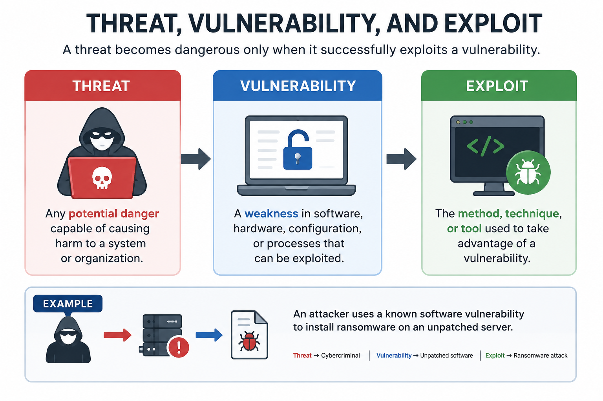
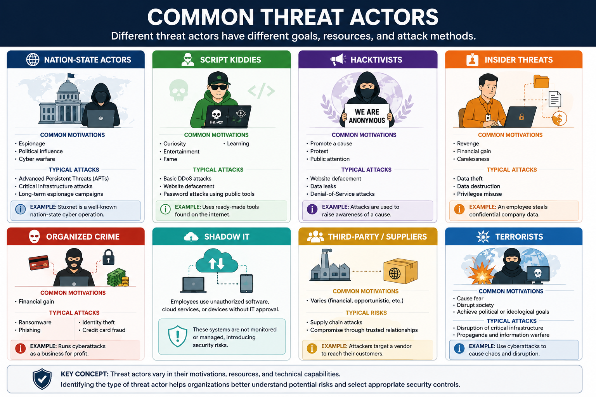
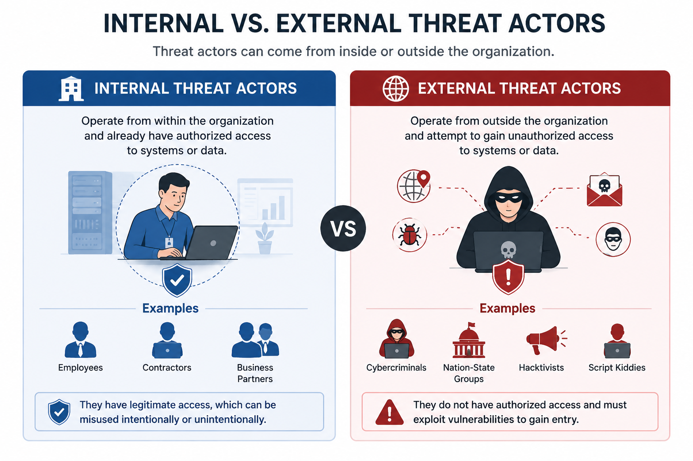
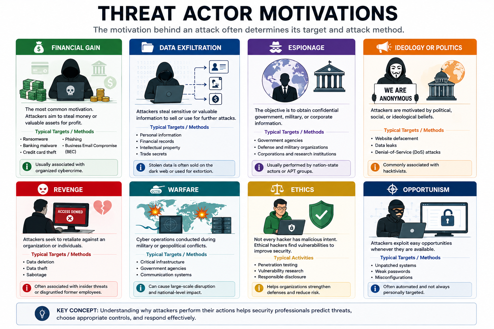
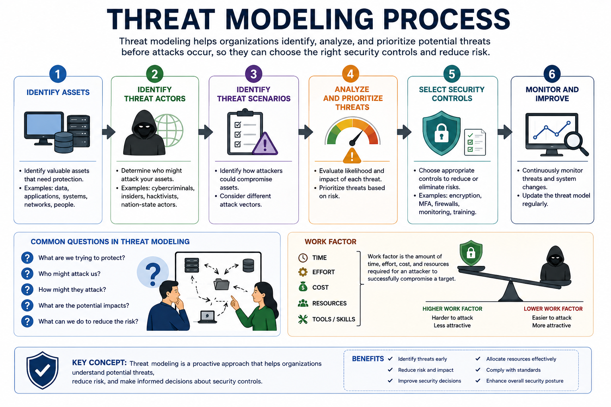

# Threat Actors and Motivations

Understanding who performs cyberattacks is just as important as understanding how attacks work. Different threat actors have different objectives, resources, skill levels, and attack methods.

Knowing the characteristics and motivations of threat actors helps security professionals assess risks, prioritize defenses, and respond more effectively to security incidents.

---

## Threat, Vulnerability, and Exploit

Before studying threat actors, it is important to distinguish three closely related concepts.

- **Threat:** Any potential danger capable of causing harm to a system or organization.
- **Vulnerability:** A weakness in software, hardware, configuration, or processes that can be exploited.
- **Exploit:** The method, technique, or tool used to take advantage of a vulnerability.

A threat becomes dangerous only when it successfully exploits a vulnerability.

### Example

An attacker uses a known software vulnerability to install ransomware on an unpatched server.

- Threat → Cybercriminal
- Vulnerability → Unpatched software
- Exploit → Ransomware attack

---

## What Is a Threat Actor?

A **threat actor** is any individual, group, or organization responsible for carrying out malicious cyber activities.

Threat actors differ in:

- Motivation
- Skill level
- Available resources
- Funding
- Objectives
- Attack techniques

Understanding these characteristics helps security teams anticipate attacks and choose appropriate defensive strategies.

---

# Common Threat Actors

## Nation-State Actors

Government-sponsored groups or military cyber units.

**Common motivations**

- Espionage
- Political influence
- Cyber warfare

**Typical attacks**

- Advanced Persistent Threats (APTs)
- Critical infrastructure attacks
- Long-term espionage campaigns

**Example**

Stuxnet is one of the best-known examples of a nation-state cyber operation.

---

## Script Kiddies

Individuals with limited technical knowledge who rely on publicly available hacking tools.

**Common motivations**

- Curiosity
- Entertainment
- Fame
- Learning

**Typical attacks**

- Basic DDoS attacks
- Website defacement
- Password attacks using public tools

---

## Hacktivists

Individuals or groups motivated by political, social, or ideological beliefs.

**Common motivations**

- Promote a cause
- Protest
- Public attention

**Typical attacks**

- Website defacement
- Data leaks
- Denial-of-Service attacks

---

## Insider Threats

Current or former employees, contractors, or business partners with legitimate access to organizational resources.

Insider threats may be:

- Malicious
- Negligent
- Accidental

**Common motivations**

- Revenge
- Financial gain
- Carelessness

**Typical attacks**

- Data theft
- Data destruction
- Privilege misuse

---

## Organized Crime

Professional cybercriminal groups operating for financial profit.

**Common motivations**

- Financial gain

**Typical attacks**

- Ransomware
- Phishing
- Identity theft
- Credit card fraud

---

## Shadow IT

Employees who use unauthorized software, cloud services, or devices without IT approval.

Although not intentionally malicious, Shadow IT introduces security risks because these systems are not monitored or managed by the organization's security team.

---

## Key Concept

Threat actors vary in their motivations, resources, and technical capabilities. Identifying the type of threat actor helps organizations better understand potential risks and select appropriate security controls.
---

# Threat Actor Attributes

Threat actors can be classified based on several important attributes that help organizations evaluate the level of risk they pose.

## Internal vs. External

**Internal threat actors** operate from within the organization and already have authorized access to systems or data.

Examples include:

- Employees
- Contractors
- Business partners

**External threat actors** operate outside the organization and attempt to gain unauthorized access.

Examples include:

- Cybercriminals
- Nation-state groups
- Hacktivists
- Script kiddies

---

## Resources and Funding

Threat actors vary greatly in the resources available to them.

**High-resource actors**

- Nation-state groups
- Advanced Persistent Threats (APTs)
- Organized crime

These groups often have dedicated teams, advanced tools, and significant funding.

**Low-resource actors**

- Script kiddies
- Individual hacktivists

They usually rely on publicly available tools and have limited technical capabilities.

---

## Level of Sophistication

Threat actors also differ in their technical skills.

**Highly sophisticated**

- Custom malware
- Zero-day exploits
- Long-term stealth operations

**Less sophisticated**

- Basic phishing
- Password attacks
- Public hacking tools

Understanding an attacker's sophistication helps determine the likelihood and potential impact of an attack.

---

# Threat Actor Motivations

The motivation behind an attack often determines its target and attack method.

## Financial Gain

The most common motivation.

Examples include:

- Ransomware
- Banking malware
- Credit card theft
- Business Email Compromise (BEC)

Usually associated with organized cybercrime.

---

## Data Exfiltration

Attackers steal valuable information such as:

- Personal information
- Financial records
- Intellectual property
- Trade secrets

Stolen data is often sold or used for further attacks.

---

## Espionage

The objective is to obtain confidential government, military, or corporate information.

Usually performed by:

- Nation-state actors
- Advanced Persistent Threat (APT) groups

---

## Ideology or Politics

Some attackers are motivated by political or social beliefs.

Typical objectives include:

- Public awareness
- Protest
- Embarrassing governments or organizations

Commonly associated with hacktivists.

---

## Revenge

Former employees or insiders may attack an organization to retaliate for perceived unfair treatment.

Common actions include:

- Data deletion
- Data theft
- Sabotage

---

## Warfare

Cyber operations conducted during military or geopolitical conflicts.

Typical targets include:

- Critical infrastructure
- Government agencies
- Communication systems

---

## Ethics

Not every hacker has malicious intent.

Ethical hackers identify vulnerabilities to improve security and help organizations strengthen their defenses.

---

# Non-Adversarial Threats

Not all threats originate from malicious attackers.

Organizations must also prepare for threats that occur without malicious intent.

Examples include:

### Natural Threats

- Earthquakes
- Floods
- Storms
- Pandemics

### Operational Threats

- Power outages
- Hardware failures
- Network failures
- HVAC failures

### Human Threats

- Accidents
- Human error
- Labor strikes
- Civil unrest

Although these threats are not intentional, they can significantly disrupt business operations.

---

# Threat Modeling

Threat modeling is the process of identifying, analyzing, and prioritizing potential threats before attacks occur.

It helps organizations:

- Identify valuable assets.
- Understand potential attackers.
- Analyze attack paths.
- Select appropriate security controls.
- Reduce organizational risk.

One important concept in threat modeling is the **work factor**.

**Work factor** refers to the amount of time, effort, cost, and resources required for an attacker to successfully compromise a target.

A higher work factor generally makes attacks more difficult and less attractive.

---

# Threat Intelligence

Threat intelligence is evidence-based information about current and emerging threats that helps organizations make informed security decisions.

Effective threat intelligence should be:

- Aggregated
- Analyzed
- Assessed
- Actionable

Common sources include:

- Cybersecurity vendors
- Government agencies (NIST, NVD, MITRE)
- Open-Source Intelligence (OSINT)
- Threat intelligence platforms

Threat intelligence enables organizations to detect threats earlier, improve defenses, and respond more effectively to attacks.

---

## Key Concept

Different threat actors have different motivations, resources, and capabilities. Understanding who attackers are, why they attack, and how they operate enables organizations to better assess risk, strengthen defenses, and make informed security decisions.