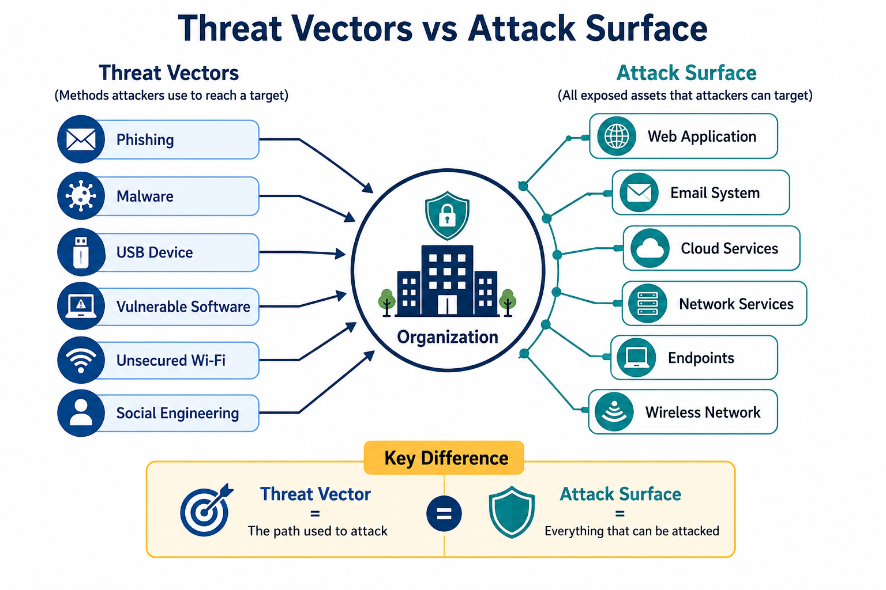
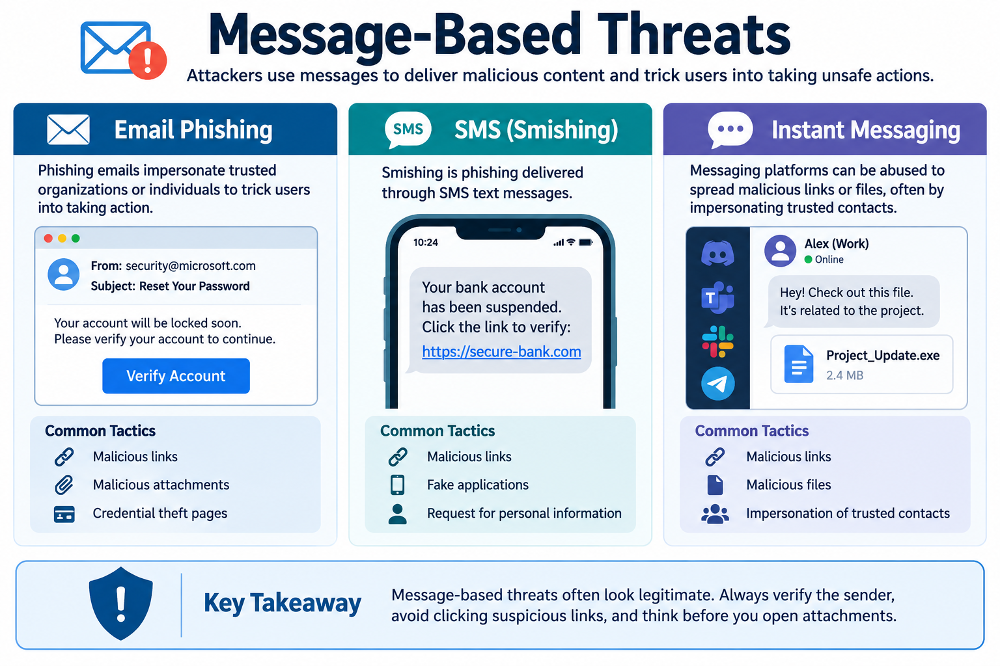
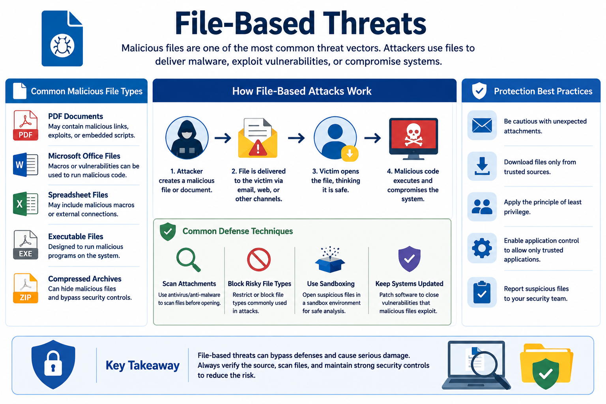
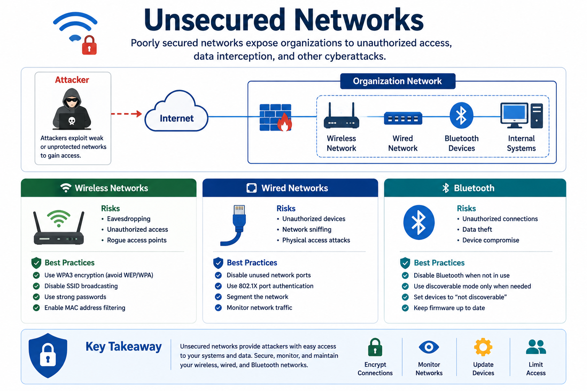
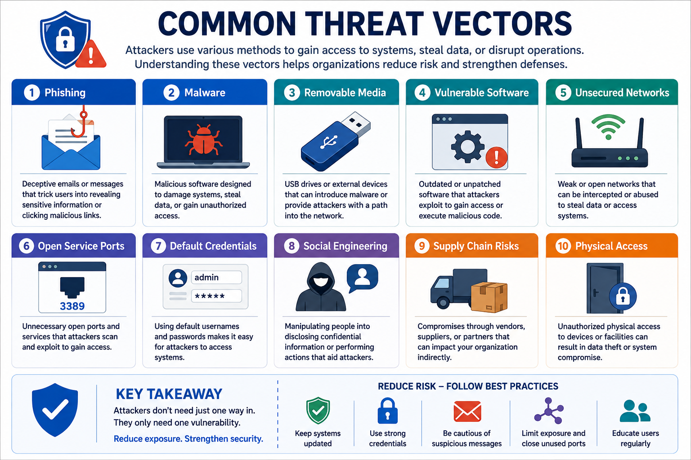

# Threat Vectors and Attack Surfaces

Understanding how attackers gain access to systems is essential for defending modern IT environments. Cyberattacks rarely happen by chance—they rely on specific paths known as **threat vectors** and target exposed components known as the **attack surface**.

By identifying these entry points, organizations can reduce risk and strengthen their overall security posture.

---

## What Is a Threat Vector?

A **threat vector** is the path or method an attacker uses to gain unauthorized access to a system or deliver a malicious payload.

Threat vectors include techniques such as phishing emails, malicious files, vulnerable software, removable media, and unsecured networks.

The more threat vectors an organization exposes, the greater the opportunity for attackers.

---

## What Is an Attack Surface?

An **attack surface** is the collection of all exposed hardware, software, services, users, and communication channels that attackers can target.

Examples include:

- Public web applications
- Email systems
- Network services
- Wireless networks
- User endpoints
- Cloud resources

Reducing the attack surface decreases the number of opportunities available to attackers.

---

# Message-Based Threats

Attackers frequently use messages to deliver malicious content. These messages often appear legitimate but are designed to trick users into performing unsafe actions.

## Email Phishing

Phishing emails impersonate trusted organizations or individuals.

They commonly contain:

- Malicious links
- Malicious attachments
- Credential theft pages

**Example**

A fake password reset email asking the recipient to verify their account.

---

## SMS (Smishing)

Smishing is phishing delivered through SMS messages.

Attackers encourage victims to:

- Click malicious links
- Install fake applications
- Reveal personal information

---

## Instant Messaging

Messaging platforms may also be abused to spread malicious links or files.

Attackers often impersonate trusted contacts or participate in public groups to distribute malware.

---

# Image-Based Threats

Images may contain hidden malicious content through techniques such as steganography or by exploiting vulnerabilities in image-processing software.

Although an image appears harmless, opening it with vulnerable software may compromise the system.

---

# File-Based Threats

Malicious files remain one of the most common attack vectors.

Examples include:

- PDF documents
- Microsoft Office files
- Executable files

Organizations commonly defend against file-based threats by:

- Scanning attachments
- Blocking risky file types
- Using sandbox environments

---

# Voice Calls and Vishing

**Vishing** (Voice Phishing) uses phone calls to convince victims to reveal sensitive information.

Attackers may pretend to be:

- Bank employees
- IT support
- Government officials

A common technique is **Caller ID Spoofing**, where the attacker's phone number appears to belong to a trusted organization.

---

# Removable Media

USB drives and external storage devices can introduce malware into an organization.

One common attack involves leaving infected USB drives in public areas, hoping someone connects them to a company computer.

**Best practices**

- Disable AutoRun.
- Scan removable media before use.
- Use endpoint protection.

---

# Vulnerable Software

Outdated or unpatched software is one of the most common attack vectors.

Attackers regularly exploit known vulnerabilities in applications that have not been updated.

Organizations commonly identify vulnerable software using:

- Agent-Based Scanning
- Agentless Scanning

Regular patch management significantly reduces this risk.

---

# Unsupported or Legacy Systems

Legacy operating systems and unsupported software no longer receive security updates.

Because known vulnerabilities remain unpatched, these systems become attractive targets for attackers.

Organizations should replace or isolate unsupported systems whenever possible.

---

# Unsecured Networks

Poorly secured networks expose organizations to unauthorized access.

## Wireless Networks

Open or weakly protected Wi-Fi networks allow attackers to intercept communications.

Security recommendations include:

- WPA3 encryption
- Disable SSID broadcasting
- MAC filtering

---

## Wired Networks

Physical network connections must also be secured.

Unused network ports should be disabled to prevent unauthorized devices from connecting.

---

## Bluetooth

Bluetooth should be disabled when not needed.

Weak pairing settings may allow nearby attackers to connect to devices without authorization.

---

# Open Service Ports

Every unnecessary open port increases the attack surface.

Attackers commonly scan systems for open ports before attempting exploitation.

Organizations should:

- Identify unnecessary services.
- Close unused ports.
- Regularly perform network scans.

---

# Default Credentials

Many devices are shipped with default usernames and passwords.

If administrators fail to change them, attackers can easily gain access.

Changing default credentials should be part of every deployment process.

---

# Supply Chain Vulnerabilities

Organizations depend on vendors, suppliers, and service providers.

A compromise affecting one of these partners can also impact the organization.

Examples include:

- Vendors
- Managed Service Providers (MSPs)
- Hardware and software suppliers

Organizations should evaluate third-party security before granting access.

---

# Social Engineering Threats

Attackers frequently exploit people instead of technology.

Common techniques include:

- Phishing
- Spear Phishing
- Smishing
- Vishing
- Impersonation
- Pretexting
- Business Email Compromise (BEC)

Other common techniques include:

- Watering Hole Attacks
- Typosquatting
- Brand Impersonation

---

## Key Concept

Threat vectors are the methods attackers use to reach a target, while the attack surface represents everything an attacker can potentially exploit. Understanding both concepts helps organizations reduce exposure, strengthen defenses, and minimize opportunities for successful cyberattacks.