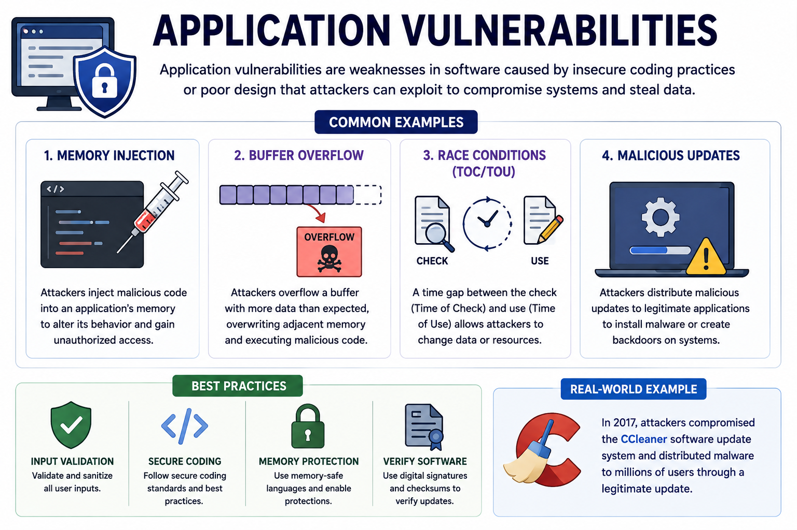
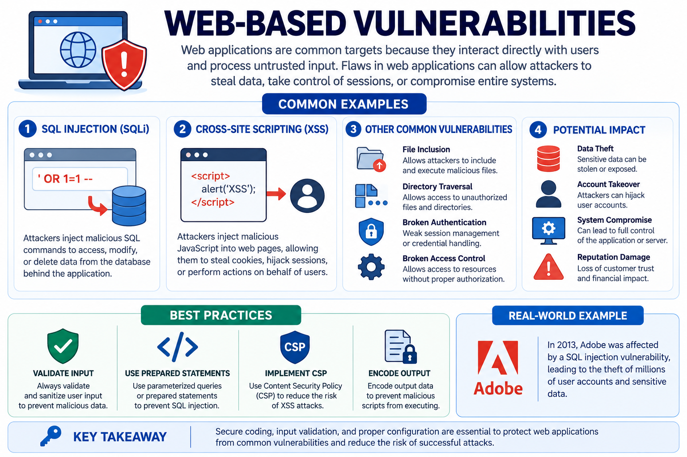
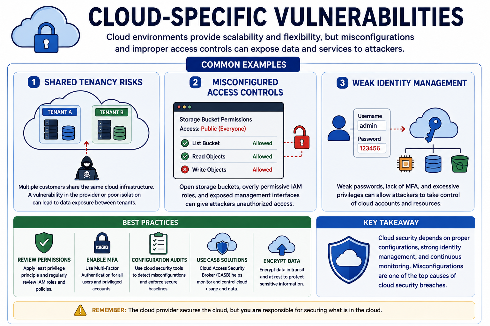
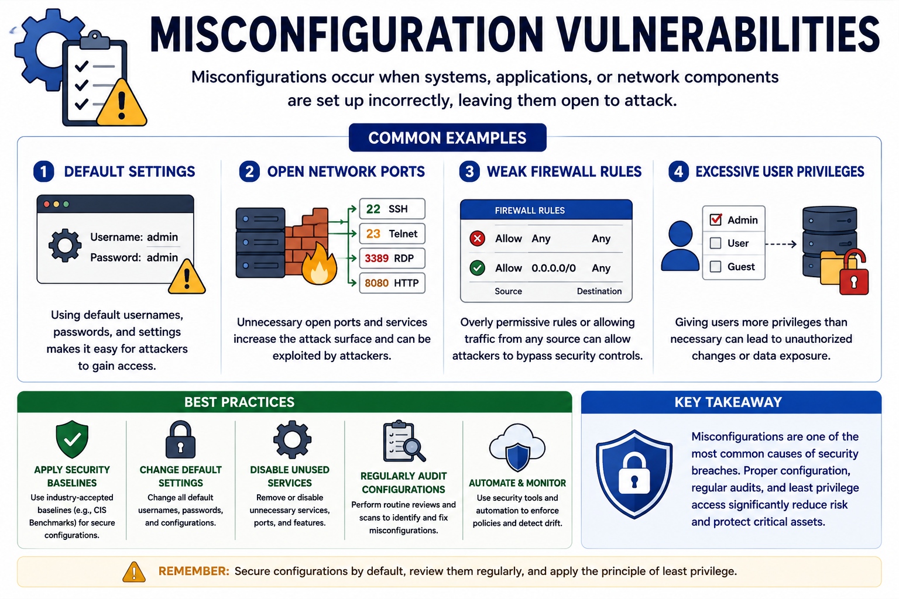
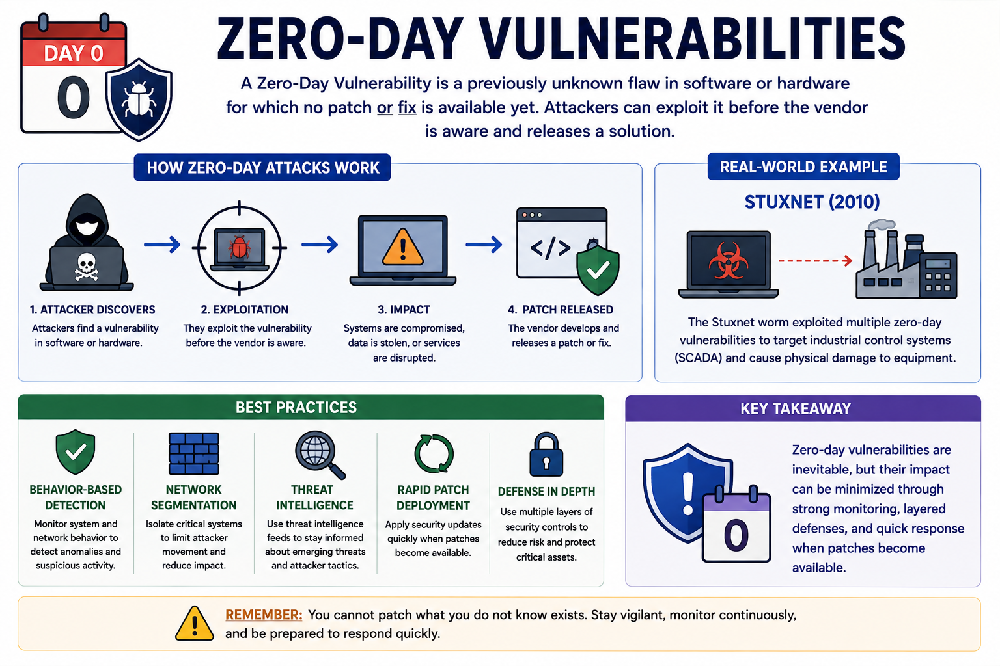

# Common Vulnerabilities

Vulnerabilities are weaknesses or flaws in systems that attackers can exploit to gain unauthorized access, disrupt services, or compromise sensitive data.

These weaknesses may exist in software, hardware, operating systems, cloud environments, supply chains, configurations, and mobile devices. Understanding common vulnerabilities helps organizations identify risks, prioritize remediation efforts, and improve their overall security posture.

---

## What Is a Vulnerability?

A **vulnerability** is a weakness in a system, application, device, or process that can be exploited by a threat actor.

Common causes include:

- Software bugs
- Poor system design
- Misconfigurations
- Weak security controls
- Outdated software
- Human error

---

# Application Vulnerabilities

Application vulnerabilities result from insecure coding practices or poor software design.

### Common Examples

- Memory Injection
- Buffer Overflow
- Race Conditions (TOC/TOU)
- Malicious Software Updates

**Example**

The 2017 CCleaner attack distributed malware through a legitimate software update.

### Best Practices

- Input validation
- Secure coding
- Memory protection
- Verify software using digital signatures

---

# Operating System Vulnerabilities

Operating systems can contain weaknesses that allow attackers to bypass authentication, escalate privileges, or execute malicious code.

**Example**

The **BlueKeep** vulnerability enabled remote code execution on unpatched Windows systems.

### Best Practices

- Install security patches regularly
- Disable unnecessary services
- Apply the principle of least privilege
- Audit system configurations

---

# Web-Based Vulnerabilities

Web applications are common attack targets because they interact directly with users.

### Common Examples

**SQL Injection (SQLi)**

Attackers inject malicious SQL commands to access or modify database contents.

**Cross-Site Scripting (XSS)**

Attackers inject malicious JavaScript into web pages, allowing them to steal cookies, sessions, or user credentials.

### Best Practices

- Validate user input
- Encode output
- Use prepared statements
- Implement Content Security Policy (CSP)

---

# Hardware Vulnerabilities

Hardware vulnerabilities exist in firmware and physical devices.

### Common Examples

- Firmware flaws
- End-of-Life (EOL) systems
- Legacy hardware

Older systems that no longer receive security updates become attractive targets for attackers.

### Best Practices

- Update firmware
- Maintain an asset inventory
- Replace unsupported hardware when possible

---

# Virtualization Vulnerabilities

Virtual environments introduce unique security risks.

### Common Examples

- VM Escape
- Resource Reuse
- VM Sprawl

### Best Practices

- Patch hypervisors
- Isolate virtual machines
- Manage VMs centrally

---

# Cloud-Specific Vulnerabilities

Cloud environments follow a shared responsibility model, making proper configuration essential.

### Common Examples

- Shared tenancy risks
- Misconfigured access controls
- Weak identity management

### Best Practices

- Review cloud permissions
- Enable Multi-Factor Authentication (MFA)
- Use CASB solutions
- Perform regular configuration audits

---

# Supply Chain Vulnerabilities

Organizations depend on third-party vendors for hardware, software, and services.

A compromise affecting one supplier can impact the entire organization.

### Common Examples

- Malicious software libraries
- Counterfeit hardware
- Poor vendor security practices

### Best Practices

- Vendor security assessments
- Software Bill of Materials (SBOM)
- Vendor audits

---

# Cryptographic Vulnerabilities

Weak cryptographic implementations can compromise confidentiality and integrity.

### Common Examples

- Certificate Authority compromise
- Cryptographic key compromise
- Weak or outdated encryption algorithms
- SSL Stripping / TLS Downgrade

### Best Practices

- Use modern encryption standards
- Protect cryptographic keys
- Revoke compromised certificates
- Replace deprecated algorithms

---

# Misconfiguration Vulnerabilities

Incorrect system configurations are one of the most common causes of security incidents.

### Common Examples

- Default settings
- Open network ports
- Weak firewall rules
- Excessive user privileges

### Best Practices

- Apply security baselines
- Harden systems
- Perform regular configuration audits

---

# Mobile Device Vulnerabilities

Mobile devices are frequently exposed to security risks because they are portable and often used outside corporate networks.

### Common Examples

- Jailbreaking
- Rooting
- Sideloaded applications
- Counterfeit mobile apps

### Best Practices

- Use Mobile Device Management (MDM)
- Restrict unauthorized applications
- Enable remote wipe
- Keep devices updated

---

# Zero-Day Vulnerabilities

A **Zero-Day Vulnerability** is a previously unknown vulnerability for which no security patch exists.

Because vendors have not yet released a fix, attackers often exploit zero-day vulnerabilities in targeted attacks.

**Example**

The **Stuxnet** worm used multiple zero-day vulnerabilities to compromise industrial control systems.

### Best Practices

- Behavior-based detection
- Network segmentation
- Threat intelligence
- Rapid patch deployment when updates become available

---

## Key Concept

Common vulnerabilities can exist in applications, operating systems, hardware, virtualization platforms, cloud environments, cryptographic implementations, supply chains, mobile devices, and system configurations. Identifying these weaknesses and applying appropriate security controls helps reduce organizational risk and strengthens overall cybersecurity.