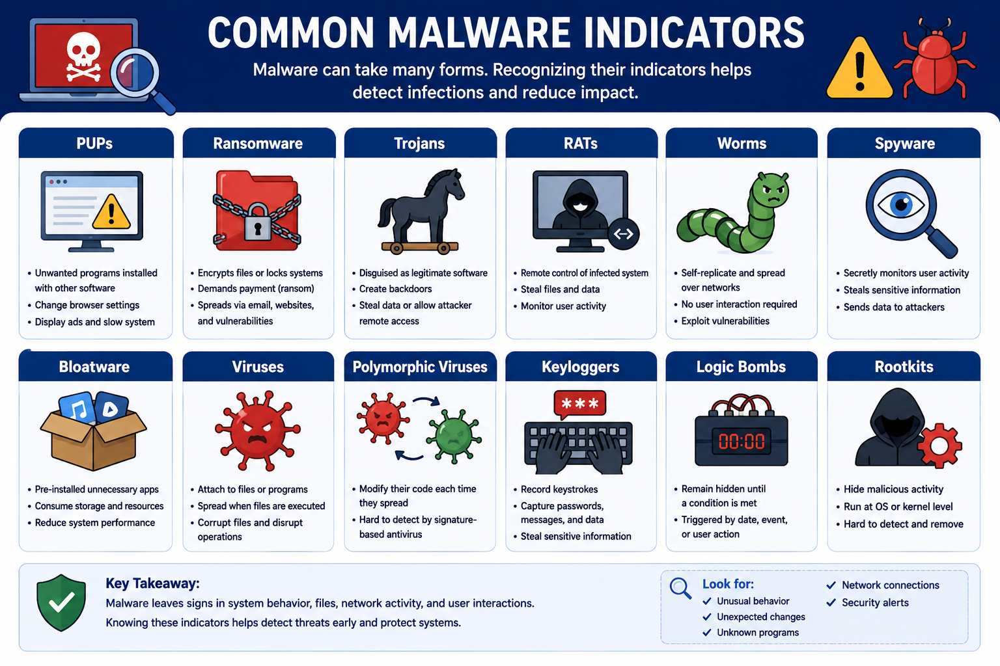
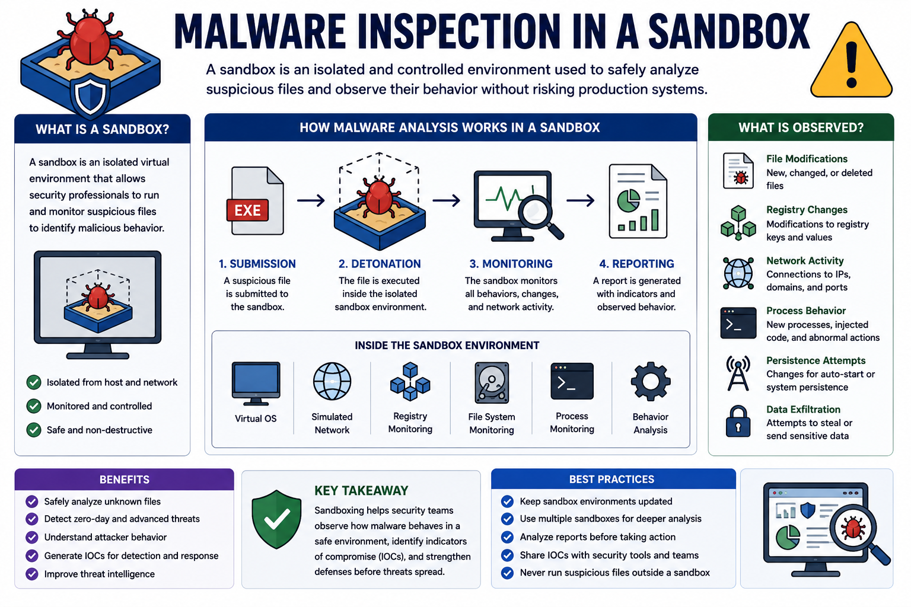
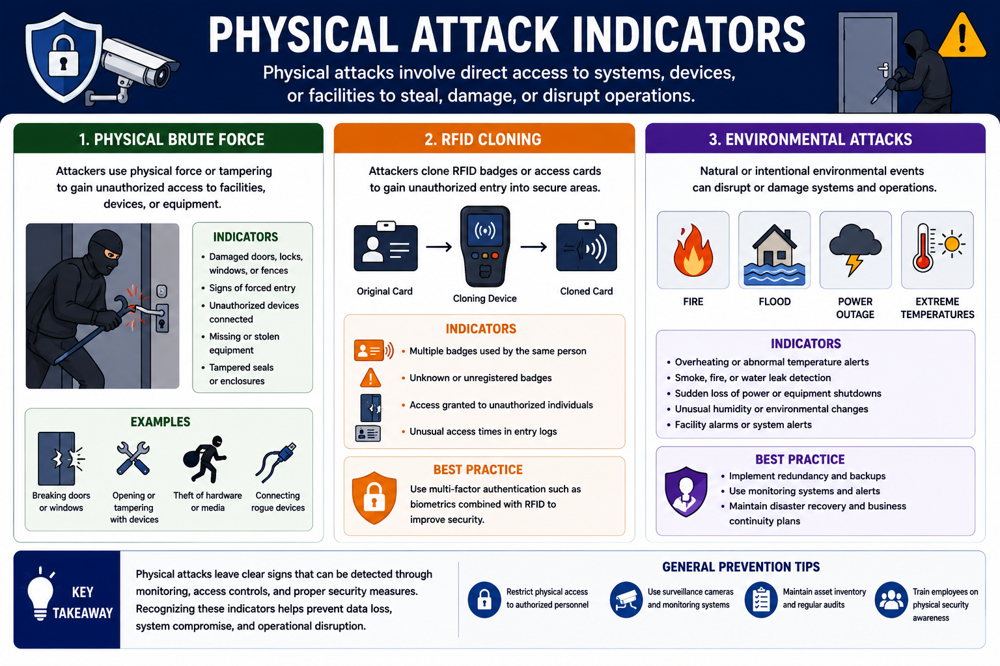
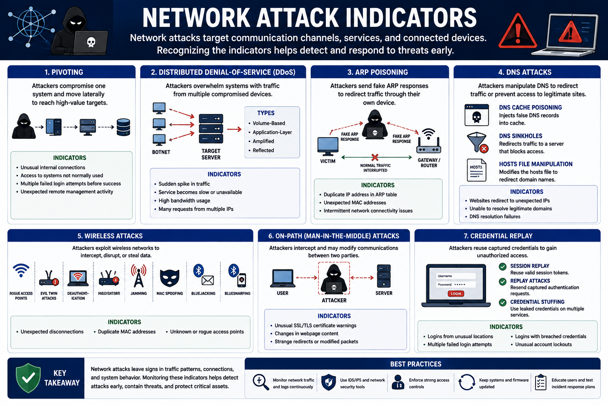
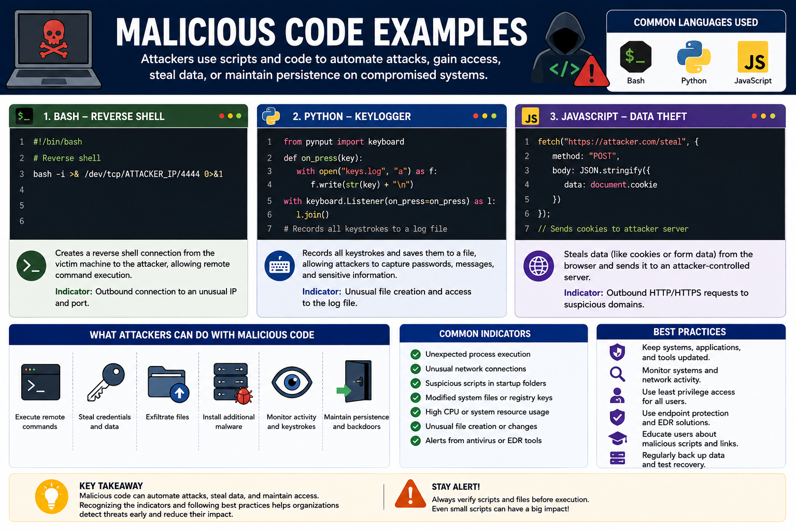

# Indicators of Malicious Activity

Recognizing indicators of malicious activity is essential for detecting attacks early and reducing their impact. Malware, physical attacks, network attacks, and application attacks often leave observable signs that security professionals can investigate before significant damage occurs.

This lesson covers the most common indicators of malicious activity and explains how organizations can identify and respond to them.

---

# Malware Attacks

Malware is malicious software designed to damage systems, steal information, or provide attackers with unauthorized access.

---

## Potentially Unwanted Programs (PUPs)

PUPs are applications that are usually installed alongside legitimate software. Although they are not always malicious, they often consume system resources, display unwanted advertisements, or change browser settings.

**Example**

A free PDF converter installs an unwanted toolbar and redirects browser searches.

---

## Ransomware

Ransomware encrypts files or locks systems until a ransom is paid.

It commonly spreads through:

- Malicious email attachments
- Compromised websites

---

## Trojans

Trojans disguise themselves as legitimate software to trick users into installing them.

Once executed, they may:

- Install backdoors
- Steal sensitive information
- Give attackers remote access

---

## Remote Access Trojans (RATs)

A RAT is a Trojan that provides attackers with remote control of an infected system.

Attackers can:

- Capture files
- Install additional malware
- Monitor user activity

---

## Worms

Unlike viruses, worms spread automatically without user interaction by exploiting network vulnerabilities.

**Example**

The **NIMDA** worm spread rapidly through Microsoft IIS servers using email and network shares.

---

## Spyware

Spyware secretly collects user information and sends it to attackers.

Common targets include:

- Browsing activity
- Passwords
- Credit card information

---

## Bloatware

Bloatware consists of unnecessary pre-installed software that consumes storage, memory, and system resources.

**Best Practice**

Remove or disable unnecessary applications on new devices.

---

## Viruses

Viruses attach themselves to legitimate files or programs and execute when users interact with them.

They may:

- Corrupt files
- Steal information
- Disrupt system operations

---

## Polymorphic Viruses

Polymorphic viruses modify their code every time they spread, making them difficult to detect using traditional signature-based antivirus software.

---

## Keyloggers

Keyloggers record everything typed on a keyboard.

Captured information may include:

- Passwords
- Emails
- Credit card numbers

---

## Logic Bombs

Logic bombs remain inactive until a specific condition is met.

Triggers may include:

- A specific date
- User login
- Opening a file

---

## Rootkits

Rootkits hide malicious activity by operating at the operating system or kernel level.

Because they conceal their presence, they are difficult to detect using traditional security tools.

---

## Malware Inspection

Security professionals analyze suspicious files inside an isolated **sandbox** to safely observe malware behavior without affecting production systems.

Common uses include:

- Malware analysis
- Testing suspicious files
- Verifying patch stability

---

# Physical Attacks

Physical attacks involve direct access to systems or facilities.

---

## Physical Brute Force

Attackers physically break into facilities or tamper with equipment to steal or damage assets.

---

## RFID Cloning

Attackers duplicate RFID badges or access cards to gain unauthorized entry into secure areas.

Using biometrics together with RFID improves security.

---

## Environmental Attacks

Natural or intentional environmental events can disrupt operations.

Examples include:

- Fires
- Floods
- Power outages

Organizations should prepare through:

- Redundancy
- Geographic diversity
- Disaster recovery planning

---

# Network Attacks

Network attacks target communication channels, services, and connected devices.

---

## Pivoting

Attackers compromise one system before moving laterally to higher-value systems.

---

## Distributed Denial-of-Service (DDoS)

DDoS attacks overwhelm systems using traffic from multiple compromised devices.

Common types include:

- Volume-Based
- Application-Layer
- Amplified
- Reflected

---

## ARP Poisoning

Attackers send fake ARP responses to redirect network traffic through their own devices.

---

## DNS Attacks

Common DNS attacks include:

- DNS Cache Poisoning
- DNS Sinkholes
- HOSTS File Manipulation

---

## Wireless Attacks

Common wireless attacks include:

- Rogue Access Points
- Evil Twin Attacks
- Deauthentication
- Jamming
- MAC Spoofing
- Bluejacking
- Bluesnarfing

Indicators may include:

- Unexpected disconnections
- Duplicate MAC addresses
- Fake wireless networks

---

## On-Path (Man-in-the-Middle) Attacks

Attackers intercept communications between two parties to monitor or modify transmitted information.

Examples include:

- Session Replay
- Replay Attacks

---

## Credential Replay

Attackers reuse captured credentials to gain unauthorized access.

Credential stuffing uses leaked usernames and passwords across multiple services.

**Best Practices**

- Use unique passwords.
- Enable password managers.
- Prefer SSH over Telnet.

---

## Malicious Code

Attackers may use scripts written in:

- Bash
- Python
- JavaScript

These scripts can perform actions such as:

- Reverse shells
- Keylogging
- Data theft
- Session hijacking

---

## Key Concept

Indicators of malicious activity can appear in malware behavior, physical attacks, network communications, or malicious code. Recognizing these indicators enables security teams to detect attacks earlier, investigate incidents more effectively, and reduce organizational risk.