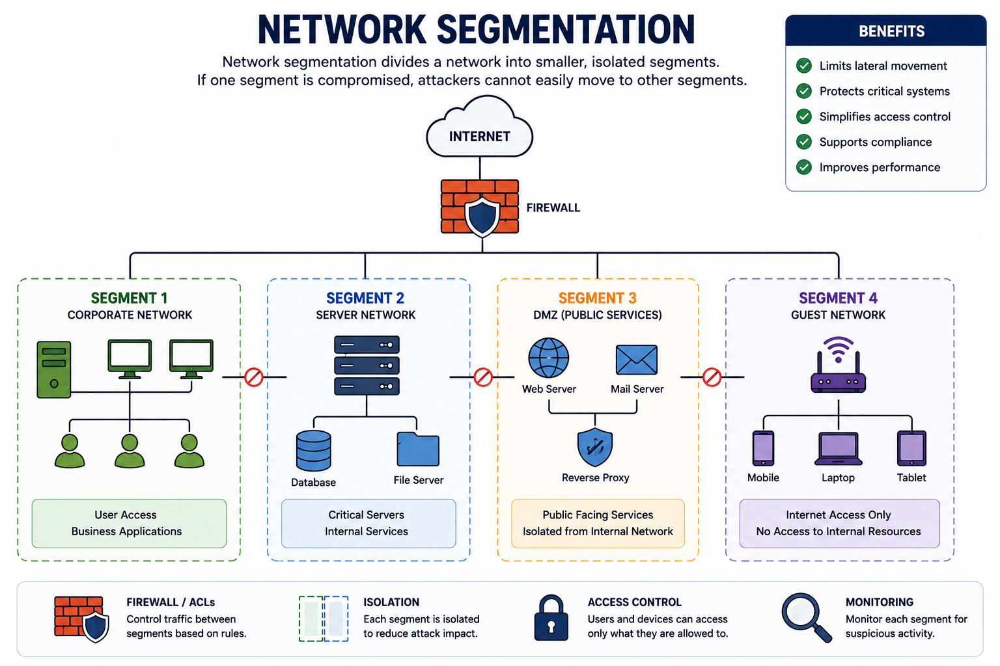
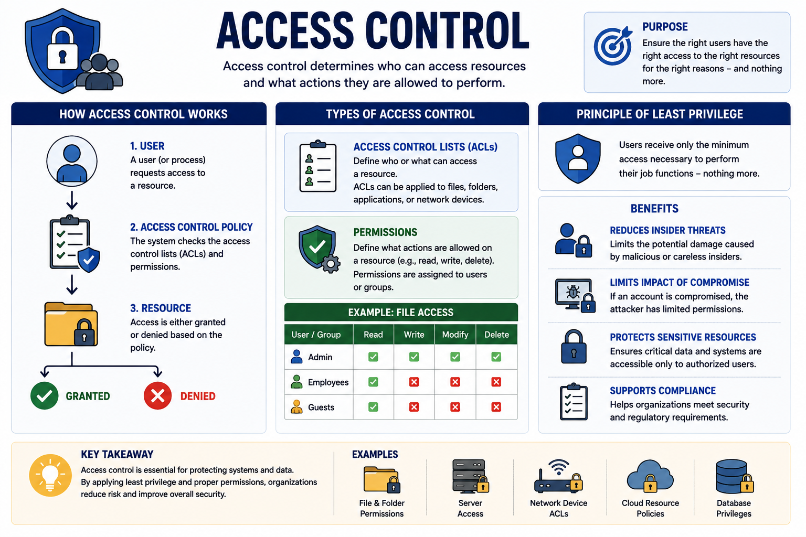
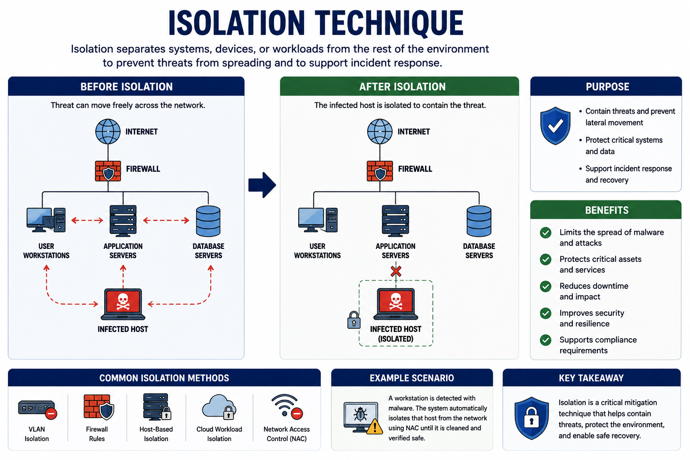
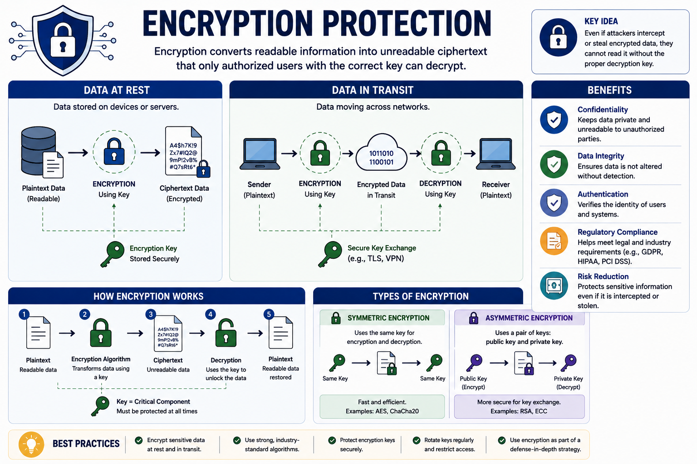
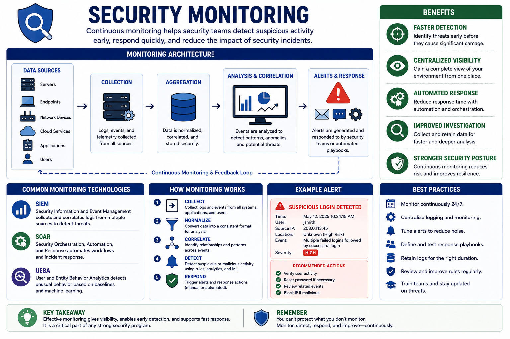
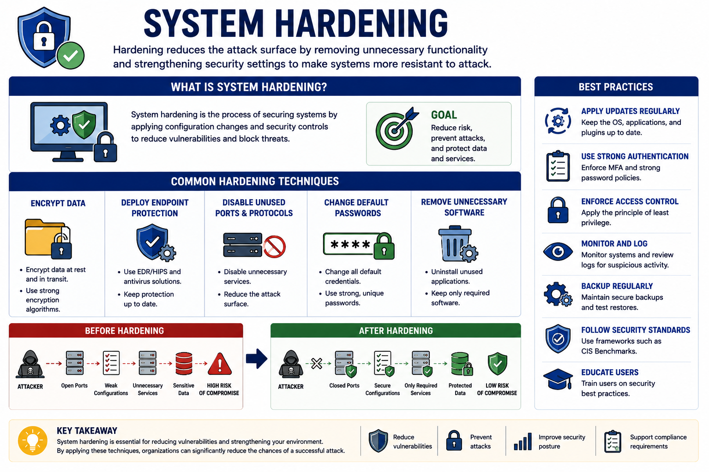

# Mitigation Techniques

Mitigation techniques are security measures that reduce vulnerabilities, limit the impact of cyberattacks, and strengthen an organization's overall security posture.

Rather than eliminating every threat, these techniques make attacks more difficult, reduce their success rate, and help organizations recover more quickly from security incidents.

---

# Network Segmentation

Segmentation divides a network into smaller, controlled sections. If one segment is compromised, attackers cannot easily move throughout the rest of the network.

Common segmentation methods include:

- Physical Segmentation
- VLANs (Virtual LANs)
- Subnetting
- Micro-Segmentation

### Benefits

- Limits lateral movement
- Protects critical systems
- Simplifies access control
- Supports regulatory compliance
- Improves network performance

---

# Access Control

Access control determines who can access resources and what actions they are allowed to perform.

It consists of:

- **Access Control Lists (ACLs)** – Define who can access a resource.
- **Permissions** – Define allowed actions such as read, write, or delete.

Access control follows the **Principle of Least Privilege**, ensuring users receive only the permissions necessary for their job.

### Benefits

- Reduces insider threats
- Limits damage from compromised accounts
- Protects sensitive resources

---

# Application Allow and Block Lists

Organizations control which applications users are allowed to execute.

### Allow List (Whitelist)

Only approved applications can run.

This greatly reduces malware infections because unknown software is automatically blocked.

### Block List (Deny List)

Specific applications known to be malicious or unnecessary are prevented from executing.

**Example**

Microsoft AppLocker can enforce application allow and block lists.

---

# Isolation

Isolation separates systems, devices, or workloads from the rest of the environment.

It is commonly used to:

- Protect critical systems
- Contain malware outbreaks
- Support incident response

For example, an infected workstation may be isolated from the corporate network until it has been cleaned.

---

# Patching

Patching is the process of installing software updates that fix known vulnerabilities.

Unpatched systems are among the most common targets for attackers.

### Benefits

- Fixes security flaws
- Prevents exploitation
- Improves system stability
- Maintains vendor support

Regular patch management is one of the most effective security practices.

---

# Encryption

Encryption converts readable information into unreadable ciphertext that only authorized users can decrypt.

Encryption protects:

- Data at Rest
- Data in Transit

Even if attackers intercept encrypted information, they cannot easily read it without the proper cryptographic key.

---

# Monitoring

Continuous monitoring helps security teams detect suspicious activity before it becomes a major incident.

Common monitoring technologies include:

### SIEM

Security Information and Event Management systems collect and correlate logs from multiple devices.

### SOAR

Security Orchestration, Automation, and Response platforms automate detection and incident response.

### Benefits

- Faster detection
- Centralized visibility
- Automated response
- Improved incident investigation

---

# Least Privilege

The Principle of Least Privilege ensures users, applications, and systems receive only the minimum permissions required.

Applying least privilege helps:

- Reduce accidental damage
- Limit insider threats
- Prevent privilege abuse
- Reduce lateral movement after compromise

---

# Configuration Enforcement

Configuration enforcement ensures systems maintain secure and consistent settings.

Common practices include:

- Security standardization
- Automated configuration management
- Compliance verification

Organizations often use security benchmarks such as those published by the **Center for Internet Security (CIS)**.

Configuration enforcement helps prevent security incidents caused by misconfigurations.

---

# Decommissioning

When hardware or software reaches the end of its lifecycle, it must be retired securely.

Typical decommissioning activities include:

- Updating the asset inventory
- Secure data sanitization
- Media destruction
- Compliance verification

Examples of secure media disposal include:

- Shredding
- Wiping
- Degaussing

Proper decommissioning prevents sensitive information from being recovered after devices are discarded.

---

# Hardening Techniques

Hardening reduces the attack surface by removing unnecessary functionality and strengthening security settings.

Common hardening techniques include:

- Encrypt data
- Deploy endpoint protection (EDR/HIPS)
- Disable unused ports and protocols
- Change default passwords
- Remove unnecessary software

These measures make systems significantly more resistant to attack.

---

## Key Concept

Mitigation techniques reduce organizational risk by limiting attack opportunities and strengthening defenses. Network segmentation, access control, isolation, patching, encryption, monitoring, least privilege, configuration enforcement, secure decommissioning, and system hardening work together to protect enterprise environments against modern cyber threats.