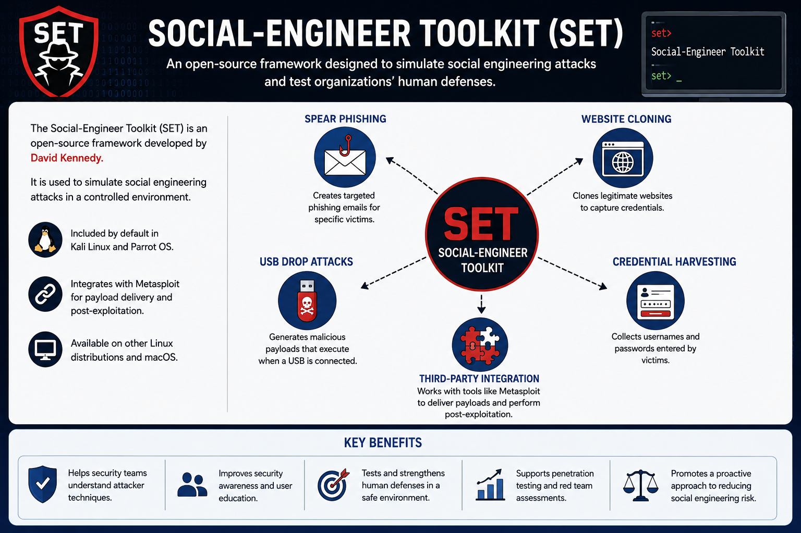
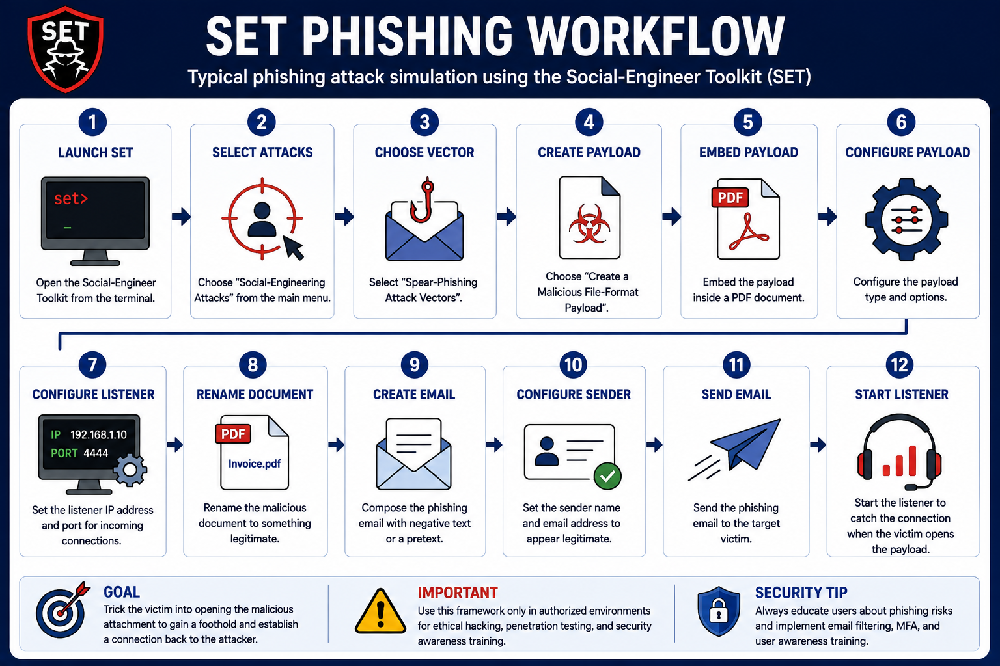
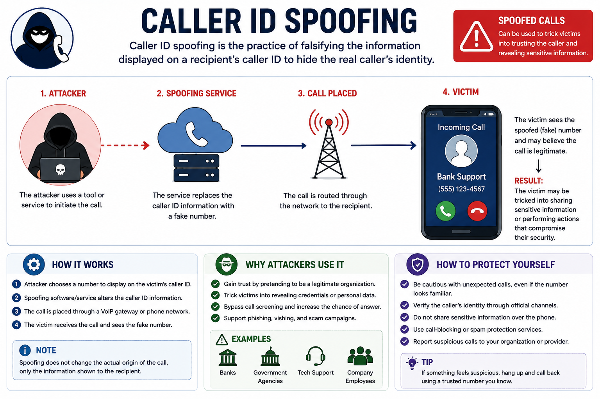
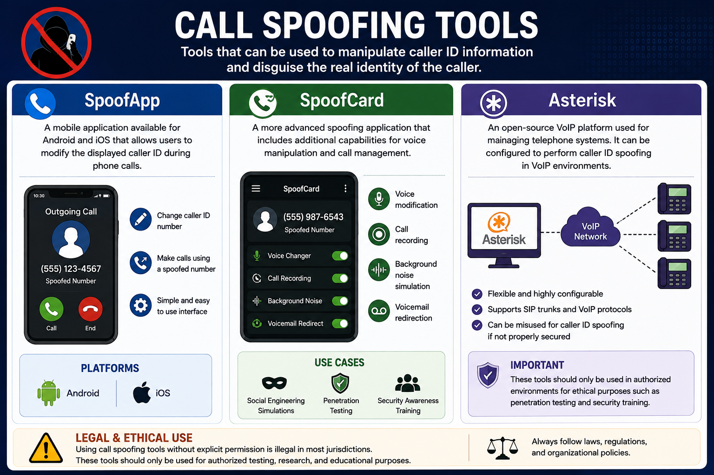

# Social Engineering Tools

Social engineering tools are designed to simulate or perform attacks that manipulate human behavior instead of exploiting technical vulnerabilities. Security professionals use these tools in controlled environments to understand attacker techniques, improve security awareness, and strengthen organizational defenses.

This lesson introduces the Social-Engineer Toolkit (SET) and common caller ID spoofing tools used during social engineering assessments.

---

# Social-Engineer Toolkit (SET)

The **Social-Engineer Toolkit (SET)** is an open-source framework designed to simulate social engineering attacks.

Developed by **David Kennedy**, SET is widely used during penetration testing and security awareness exercises.

It supports multiple attack vectors, including:

- Spear phishing
- Credential harvesting
- Website cloning
- USB drop attacks

SET integrates with **Metasploit** and is included by default in penetration testing distributions such as:

- Kali Linux
- Parrot OS

It can also be installed on other Linux distributions and macOS.

---

## Key Features

The Social-Engineer Toolkit provides several capabilities for simulating real-world social engineering attacks.

### Spear Phishing

Creates highly targeted phishing emails designed for specific individuals or organizations.

### Website Cloning

Builds fake login pages that imitate legitimate websites to capture usernames and passwords.

### Credential Harvesting

Collects authentication credentials entered by victims into cloned websites.

### USB Drop Attacks

Generates malicious payloads that execute when an attacker-controlled USB device is connected.

### Third-Party Integration

SET works with external tools such as **Metasploit** to deliver payloads and perform post-exploitation activities.

---

# Typical SET Workflow

A typical phishing simulation using SET follows these steps:

1. Launch SET.
2. Select **Social-Engineering Attacks**.
3. Choose **Spear-Phishing Attack Vectors**.
4. Create a malicious file-format payload.
5. Embed the payload inside a PDF document.
6. Configure the payload type.
7. Configure the listener IP address and port.
8. Rename the malicious document.
9. Create the phishing email.
10. Configure sender information.
11. Send the phishing message.
12. Optionally start a listener for incoming connections.

This workflow demonstrates how attackers can combine phishing with malicious attachments to compromise victims.

---

# Post-Exploitation Capabilities

After successful exploitation, SET can work with Metasploit to perform post-exploitation tasks.

Examples include:

- Reverse TCP Shell
- Meterpreter Session
- Reverse HTTPS Connection
- Remote Command Shell

These capabilities are intended for authorized penetration testing and security assessments.

---

# Caller ID Spoofing

Caller ID spoofing changes the phone number displayed to the recipient during a phone call.

Attackers use this technique to appear as trusted organizations such as:

- Banks
- Government agencies
- Technical support
- Company employees

Victims are more likely to answer calls or disclose sensitive information when they believe the caller is legitimate.

---

# Common Call Spoofing Tools

## SpoofApp

A mobile application available for Android and iOS that allows users to modify the displayed caller ID during phone calls.

---

## SpoofCard

A more advanced spoofing application that includes additional capabilities such as:

- Voice modification
- Call recording
- Background noise simulation
- Voicemail redirection

---

## Asterisk

Asterisk is an open-source VoIP platform used for managing telephone systems.

Although designed for legitimate telephony services, it can also be configured to perform caller ID spoofing in VoIP environments.

---

# Ethical and Legal Considerations

The tools discussed in this lesson have legitimate uses in:

- Security awareness training
- Penetration testing
- Red team exercises
- Cybersecurity education

Using these tools without proper authorization is illegal and unethical.

They should only be used in controlled environments with explicit permission.

---

## Key Concept

Social engineering tools simulate attacks that target human behavior rather than technical weaknesses. The Social-Engineer Toolkit (SET) provides phishing, credential harvesting, website cloning, and payload delivery capabilities, while caller ID spoofing tools demonstrate how attackers manipulate trust during voice-based attacks. Understanding these tools helps organizations improve user awareness and strengthen defenses against social engineering.