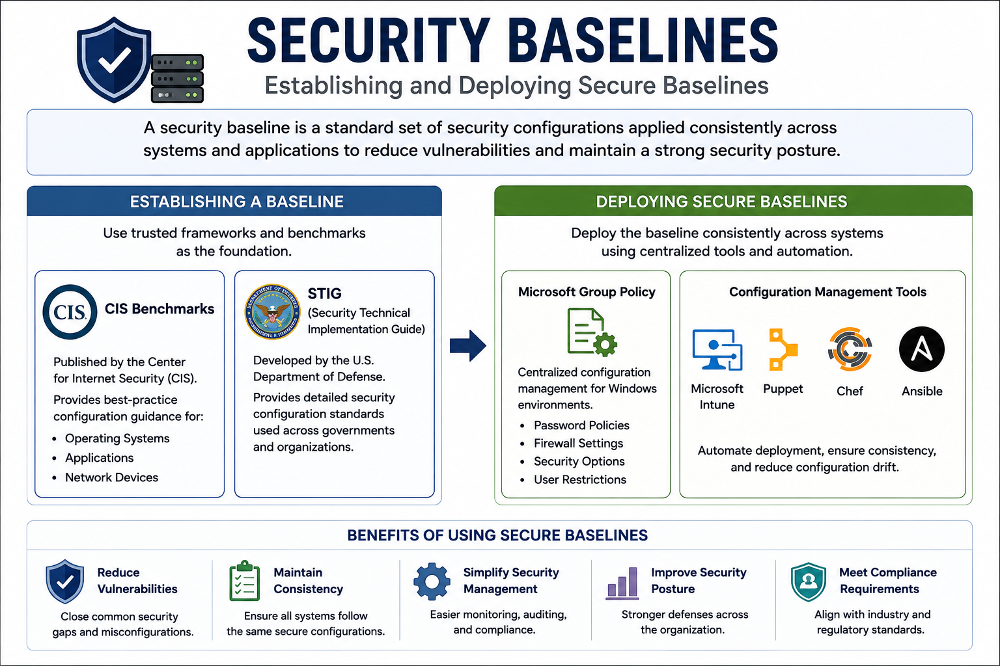
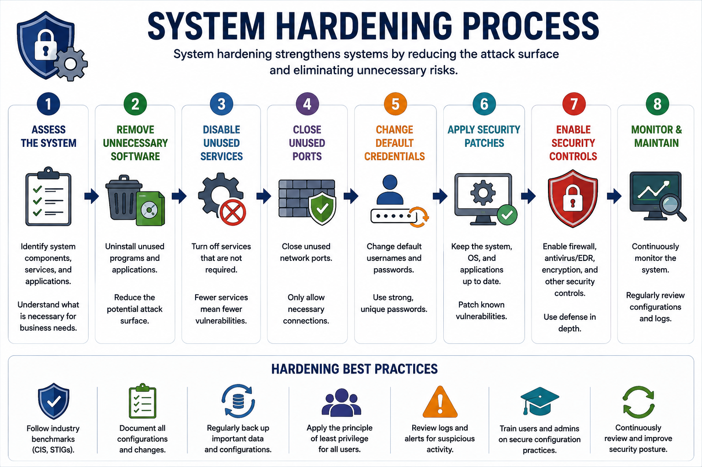
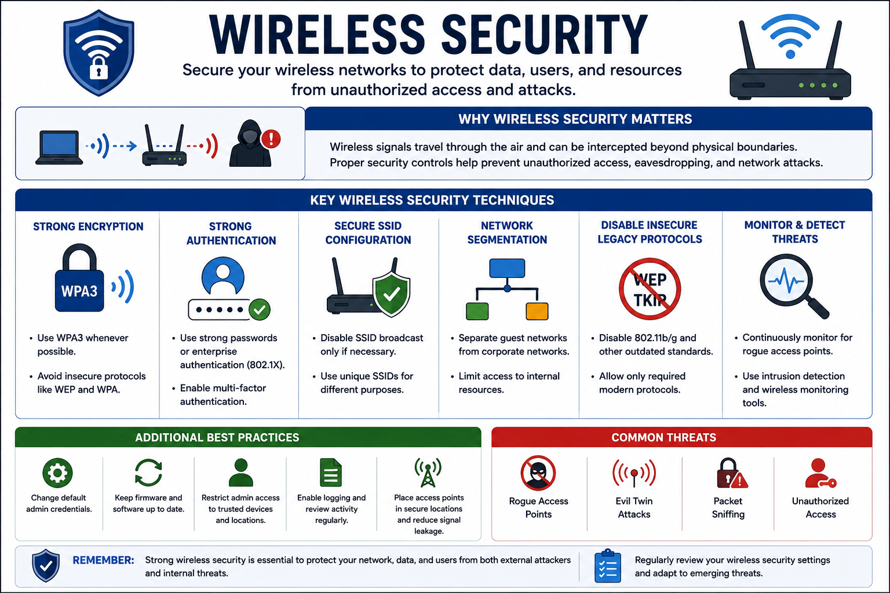
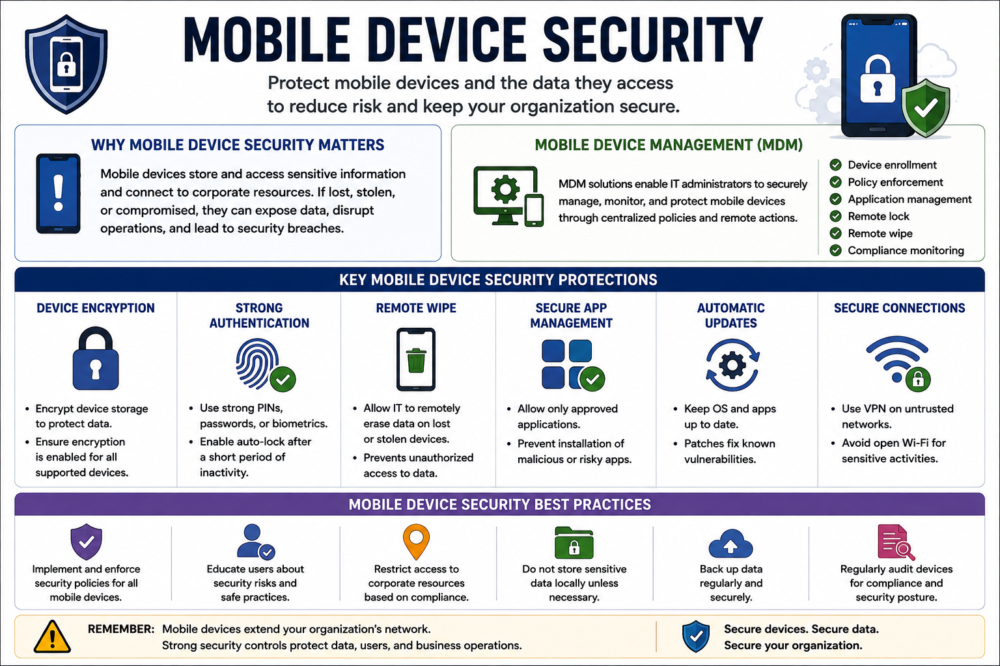
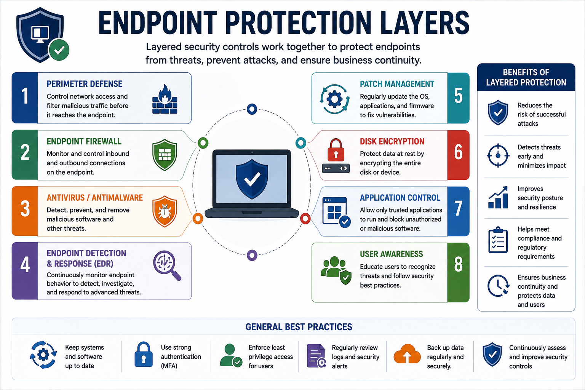

# Apply Common Security Techniques to Computing Resources

Applying common security techniques helps organizations protect endpoints, operating systems, wireless networks, and mobile devices against cyber threats. These techniques establish secure configurations, reduce attack surfaces, and improve the overall security posture of enterprise environments.

This lesson covers secure baselines, system hardening, wireless security, and mobile device security.

---

# Secure Baselines

A **security baseline** is a standard set of security configurations applied consistently across systems and applications.

Using secure baselines helps organizations:

- Reduce vulnerabilities
- Maintain consistent configurations
- Simplify security management
- Follow industry best practices

---

## Establishing a Baseline

Organizations commonly use trusted security frameworks to build secure baselines.

### CIS Benchmarks

Published by the **Center for Internet Security (CIS)**, these benchmarks provide best-practice configuration guidance for:

- Operating systems
- Applications
- Network devices

### STIG (Security Technical Implementation Guide)

Developed by the **U.S. Department of Defense**, STIGs provide detailed security configuration standards that are widely adopted beyond military environments.

---

## Deploying Secure Baselines

After defining a baseline, organizations deploy it consistently across systems.

Common deployment tools include:

### Microsoft Group Policy

Used in Windows environments to centrally configure:

- Password policies
- Firewall settings
- Security options
- User restrictions

### Configuration Management Tools

Examples include:

- Microsoft Intune
- Puppet
- Chef
- Ansible

These tools automate secure configuration deployment and reduce configuration drift.

---

# System Hardening

System hardening strengthens computing resources by removing unnecessary functionality and reducing the attack surface.

Common hardening activities include:

- Removing unnecessary software
- Disabling unused services
- Closing unused ports
- Changing default passwords
- Applying security patches
- Enabling endpoint protection

---

# Wireless Security

Wireless networks require additional protections because radio signals can be accessed without physical connections.

Common wireless security techniques include:

- WPA3 encryption
- Strong authentication
- Secure SSIDs
- Guest network separation
- Disabling insecure legacy protocols

Administrators should continuously monitor wireless networks for unauthorized access points.

---

# Mobile Device Security

Mobile devices often access sensitive organizational resources and must be properly secured.

Common protections include:

- Device encryption
- Screen lock authentication
- Remote wipe
- Mobile Device Management (MDM)
- Automatic updates

Organizations should enforce security policies for both corporate-owned and personally owned devices.

---

# Mobile Device Management (MDM)

MDM solutions allow administrators to centrally manage smartphones, tablets, and laptops.

Typical capabilities include:

- Device enrollment
- Policy enforcement
- Application management
- Remote lock
- Remote wipe
- Compliance monitoring

MDM helps ensure all managed devices comply with organizational security requirements.

---

# Endpoint Protection

Endpoints should be protected using multiple security controls.

Examples include:

- Antivirus
- Endpoint Detection and Response (EDR)
- Host-based firewalls
- Disk encryption
- Automatic patch management

Layered endpoint protection reduces the likelihood of successful attacks.

---

# Key Concept

Applying common security techniques protects computing resources through secure baselines, system hardening, wireless security, mobile device management, and endpoint protection. Consistent implementation of these controls reduces vulnerabilities, strengthens enterprise security, and improves resilience against cyber threats.