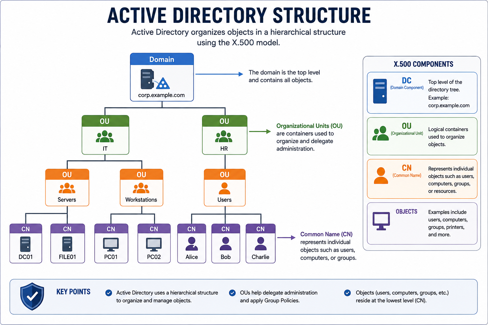
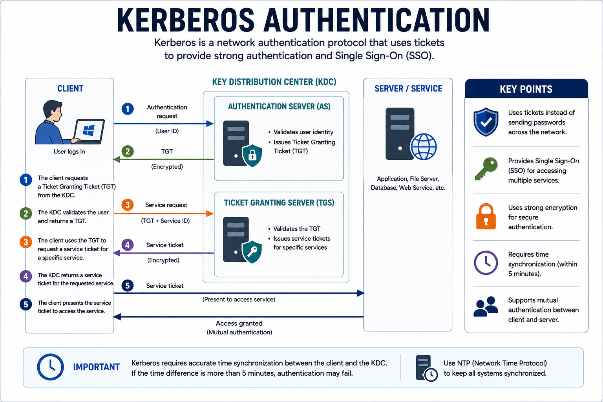
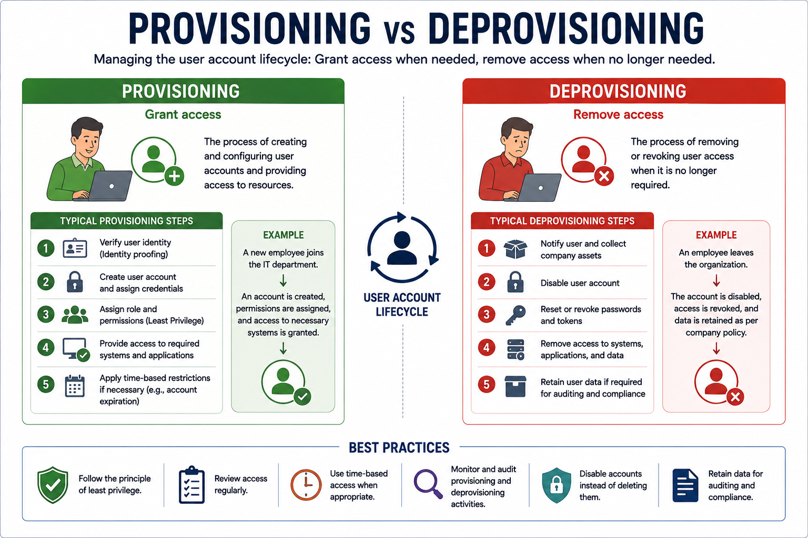
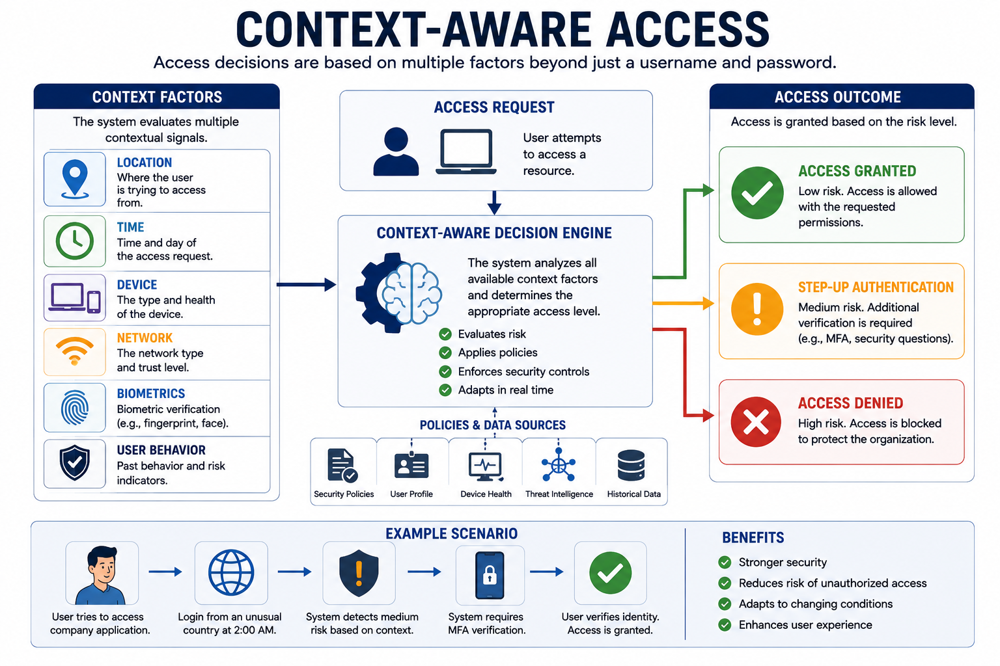
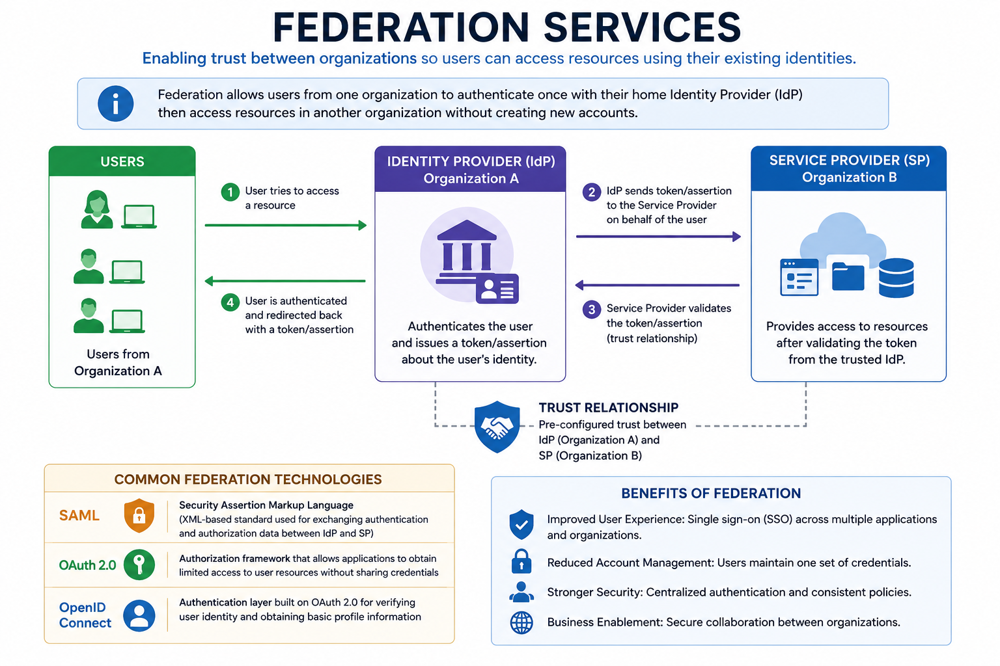
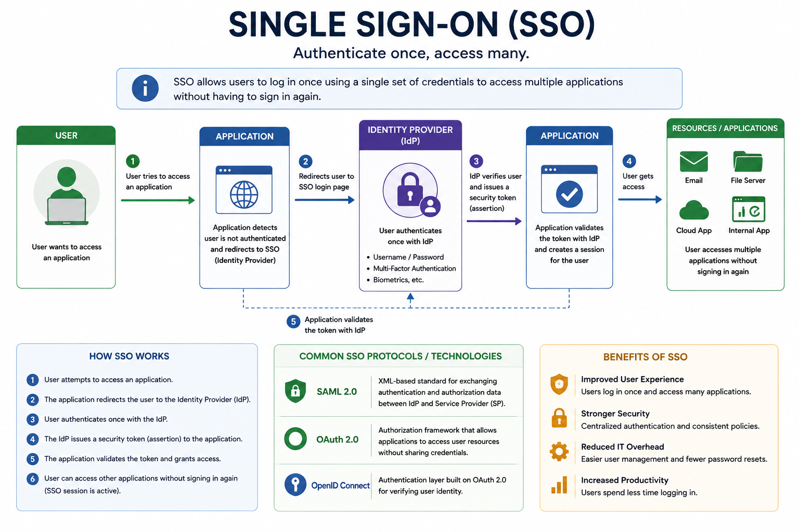

# Identity and Access Management (IAM)

Identity and Access Management (IAM) ensures that the right users receive the appropriate level of access to organizational resources based on their roles and responsibilities.

IAM covers the entire identity lifecycle, from creating user accounts to authenticating users, assigning permissions, and securely removing access when it is no longer needed.

---

# User Account Provisioning

Provisioning is the process of creating and configuring user accounts for systems, applications, and enterprise resources.

Typical provisioning includes:

- Identity verification
- Credential assignment
- Access level definition
- Time-based restrictions (if required)

Provisioning ensures users receive only the permissions necessary for their job.

---

# Directory Services

Enterprise environments use directory services to centrally manage users, computers, groups, and security policies.

## Active Directory (AD)

Microsoft Active Directory is one of the most common directory services.

Active Directory uses:

- LDAP (Lightweight Directory Access Protocol)
- Kerberos Authentication
- Security Identifiers (SIDs)

Objects are organized using the X.500 structure:

- DC (Domain Component)
- OU (Organizational Unit)
- CN (Common Name)



---

# Creating User Accounts

A typical account creation process includes:

1. Verify the user's identity.
2. Assign authentication credentials.
3. Define permissions based on the user's role.
4. Apply time-based restrictions when appropriate.

Temporary employees may receive accounts with automatic expiration dates.

---

# Kerberos Authentication

Kerberos is the primary authentication protocol used in Active Directory environments.

Authentication process:

1. User logs in using credentials.
2. The Domain Controller issues a **Ticket Granting Ticket (TGT)**.
3. The TGT is used to request service tickets.
4. Users access multiple services without logging in again (Single Sign-On).
5. Client and server perform mutual authentication.

Kerberos requires accurate time synchronization.

If client and server clocks differ by more than **five minutes**, authentication may fail.

Organizations commonly deploy **NTP servers** to maintain synchronized time.



---

# Legacy Authentication: NTLM

**NTLM (NT LAN Manager)** is an older Microsoft authentication protocol.

Characteristics:

- Uses MD4 password hashes.
- Vulnerable to Pass-the-Hash attacks.
- Largely replaced by Kerberos in modern environments.

Whenever possible, organizations should use Kerberos instead of NTLM.

---

# Linux User Account Management

Linux systems manage user accounts using command-line tools.

Common commands:

```bash
sudo useradd johndoe
sudo passwd johndoe
```

Important files include:

- `/etc/passwd` — User account information
- `/etc/shadow` — Password hashes

Linux administrators apply identity management principles similar to Active Directory.

---

# User Account Deprovisioning

When employees leave an organization, their accounts should be **disabled rather than deleted**.

Typical offboarding activities include:

- Collect company devices
- Disable user accounts
- Reset passwords
- Retain account data for auditing

Proper deprovisioning protects organizational resources while preserving business records.



---

# Permission Assignment

Permissions define what resources users can access and what actions they may perform.

Organizations commonly simplify administration through:

## Group-Based Access

Users inherit permissions by joining groups such as:

- IT
- HR
- Sales

Managing permissions through groups is more efficient than assigning permissions individually.

---

## Context-Aware Access

Access decisions may depend on additional factors, including:

- Location
- Time
- Device
- Network
- Biometrics

**Example**

A login attempt from an unfamiliar country may trigger additional authentication.



---

# Identity Proofing

Before creating an account, organizations verify a user's identity.

Common verification documents include:

- Passport
- Driver's License
- National ID

Identity proofing helps prevent fraudulent account creation.

---

# Federation Services

Federation enables different organizations to trust each other's authentication systems.

Common use cases include:

- Cloud services
- Business partnerships
- Joint ventures

Instead of maintaining duplicate accounts, organizations exchange identity information securely.

**SAML (Security Assertion Markup Language)** is commonly used to support federation.



---

# Single Sign-On (SSO)

Single Sign-On allows users to authenticate once and access multiple applications.

Common SSO technologies include:

- Kerberos
- OAuth
- SAML

### Benefits

- Improved user experience
- Fewer passwords
- Reduced help-desk requests

### Limitation

A compromised account may provide access to multiple connected services.



---

# Interoperability

Enterprise IAM systems often interact across different platforms.

Common interoperability technologies include:

- LDAP
- HTTPS
- OAuth
- SAML

Interoperability allows secure identity verification between cloud and enterprise services.

---

# Attestation

Attestation verifies the legitimacy of users or systems before access is granted.

Common methods include:

- Digital Certificates
- OAuth Tokens
- Federation
- Active Directory

These technologies establish trust and support secure authentication.

---

# Access Control Models

IAM implements several access control models to determine how permissions are assigned.

## Mandatory Access Control (MAC)

Access is based on security classifications and user clearance levels.

Common classifications include:

- Top Secret
- Secret
- Confidential
- Restricted

MAC is commonly used in government and military environments where strict control is required.

---

## Key Concept

Identity and Access Management (IAM) manages the complete lifecycle of user identities, including provisioning, authentication, authorization, permission management, federation, and deprovisioning. Technologies such as Active Directory, LDAP, Kerberos, OAuth, SAML, and Single Sign-On help organizations securely manage access while enforcing the principle of least privilege.