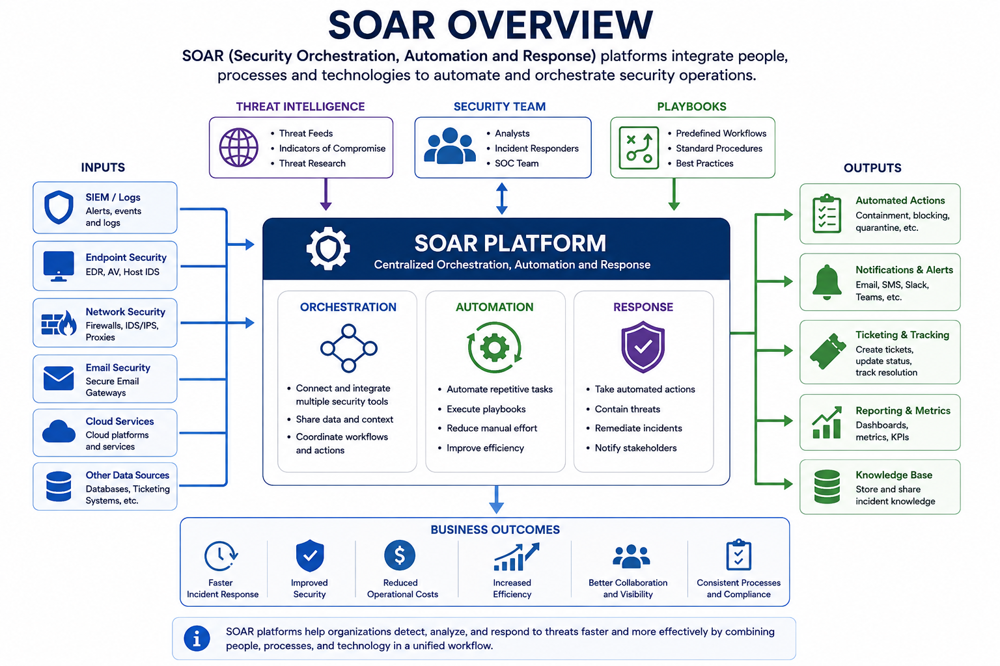
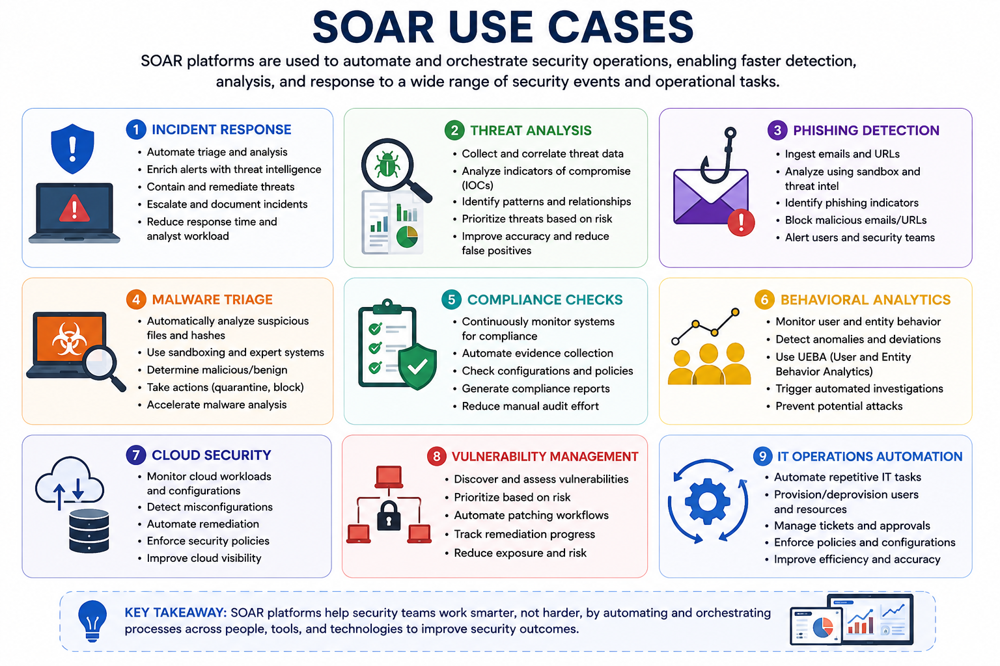
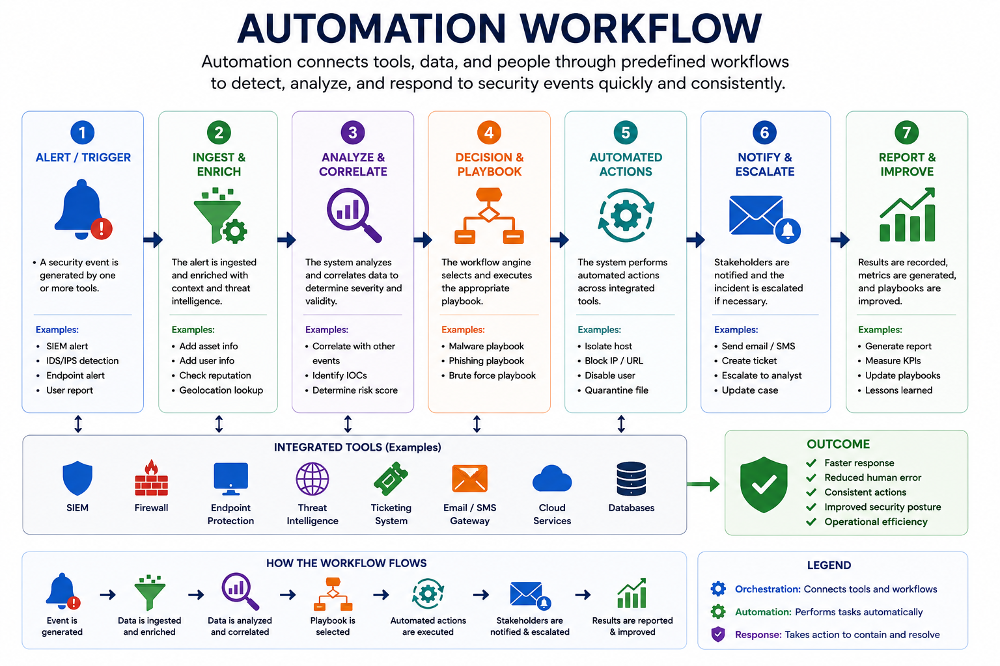
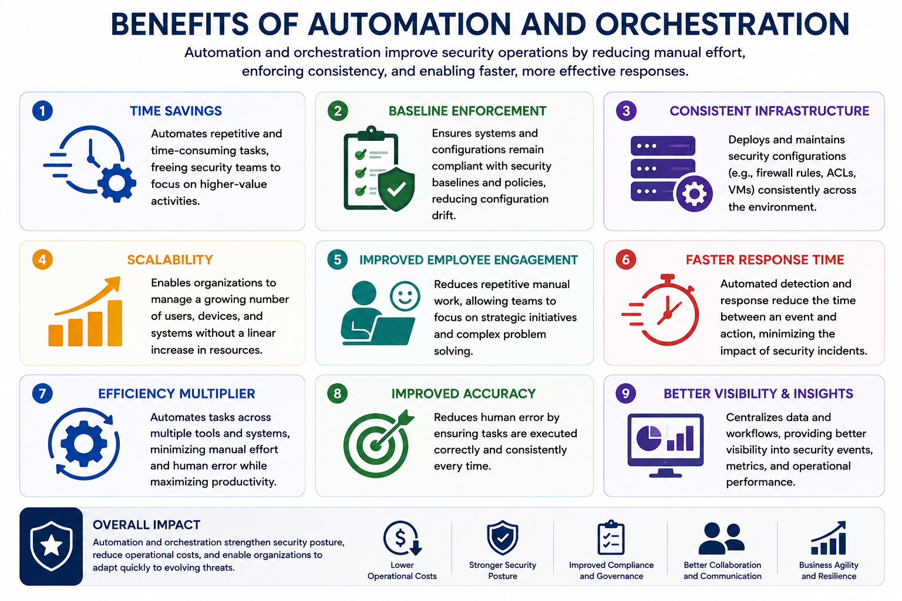

# Automation and Orchestration

Automation and orchestration improve security operations by reducing manual effort, accelerating incident response, and ensuring consistent enforcement of security policies across enterprise environments.

As infrastructures become larger and cyber threats more sophisticated, organizations rely on automation to improve efficiency, reduce human error, and respond to security events more quickly.

---

# Security Orchestration, Automation, and Response (SOAR)

**SOAR (Security Orchestration, Automation, and Response)** is a platform that combines multiple security tools, workflows, and processes into a unified system.

SOAR uses:

- Predefined workflows
- Threat intelligence
- Artificial Intelligence (AI)

to automate common security operations and improve incident response.

---

## Orchestration

Orchestration connects different security tools, systems, and data sources into a coordinated workflow.

**Example**

A SOAR platform may integrate:

- Firewall
- SIEM
- Endpoint Protection

When a security alert is generated, these tools work together automatically to perform predefined actions.

---

## Automation

Automation performs repetitive or time-consuming security tasks without human intervention.

Common automated tasks include:

- Log analysis
- Security scans
- Routine administrative tasks

Automation allows security analysts to focus on more complex investigations.

---

## Response

Response automatically executes predefined actions after detecting a threat.

Examples include:

- Isolating a compromised host
- Disabling a user account
- Notifying the security team

---

# Common SOAR Use Cases

SOAR platforms are commonly used for:

- Incident Response
- Threat Analysis
- Phishing Detection
- Malware Triage
- Compliance Checks
- Behavioral Analytics

---

# Automation and Scripting Use Cases

Automation and scripting eliminate repetitive work, reduce errors, and improve operational efficiency.

---

## User Provisioning

Automatically:

- Create user accounts
- Assign roles
- Apply permissions

This reduces onboarding delays and configuration errors.

---

## Resource Provisioning

Automation can provision and release:

- Virtual Machines
- Storage
- Network Resources

based on organizational demand.

---

## Guard Rails

Guard rails automatically enforce security policies and approved configurations.

They help prevent:

- Misconfigurations
- Unauthorized changes
- Security policy violations

---

## Security Groups

Automation manages security groups by assigning users to appropriate access groups.

This ensures only authorized users can access sensitive resources.

---

## Ticket Creation

Automation can automatically:

- Create tickets
- Assign priorities
- Notify responsible teams
- Track incident resolution

This improves incident management efficiency.

---

## Escalation

High-priority incidents can automatically trigger escalation rules, ensuring they are handled by the appropriate personnel as quickly as possible.

---

## Enable / Disable Services and Access

Automation can automatically:

- Enable services
- Disable services
- Grant access
- Revoke access

based on predefined triggers or security policies.

---

## Continuous Integration & Testing

In development environments, automation supports secure software development by performing:

- Automated testing
- Vulnerability scanning
- Security validation

during continuous integration.

---

## APIs and Integrations

Application Programming Interfaces (APIs) allow different security platforms to communicate.

Examples include:

- Sending SIEM alerts to a ticketing system
- Updating firewall rules after threat detection
- Synchronizing security tools

---

# Benefits of Automation and Orchestration

Automation provides several operational advantages.

## Time Savings

Repetitive tasks are completed automatically, allowing security teams to focus on higher-value activities.

---

## Baseline Enforcement

Automation ensures systems remain configured according to approved security baselines, reducing configuration drift.

---

## Consistent Infrastructure

Security configurations such as:

- Firewall rules
- ACLs
- Virtual environments

can be deployed consistently across the organization.

---

## Scalability

Automation enables organizations to securely manage growing numbers of:

- Users
- Devices
- Systems

without significantly increasing administrative workload.

---

## Improved Employee Engagement

Reducing repetitive work allows employees to spend more time on strategic and investigative tasks.

---

## Faster Response Time

Automated detection and response reduce the impact of security incidents and improve service continuity.

---

## Efficiency Multiplier

Automation minimizes manual effort while reducing human error, allowing security teams to prioritize more critical initiatives.

---

# Additional Considerations

Although automation provides significant advantages, organizations should also consider several challenges.

## Complexity

Large automation workflows can become difficult to understand, modify, and maintain without proper documentation.

---

## Cost

Deploying automation platforms, integrating tools, and training personnel may require significant initial investment.

---

## Single Point of Failure

Depending on a single automation platform for critical operations may introduce operational risk.

Organizations should implement redundancy and failover mechanisms.

---

## Technical Debt

Poorly designed automation can create long-term maintenance challenges and introduce security weaknesses.

---

## Support and Maintenance

Automation systems require continuous updates, monitoring, and maintenance.

Outdated scripts or workflows may become security risks over time.

---

## Key Concept

Automation and orchestration improve enterprise security by integrating security tools, automating repetitive tasks, and accelerating incident response. SOAR platforms combine orchestration, automation, and response capabilities to improve operational efficiency, enforce security policies, reduce human error, and strengthen overall security operations.s