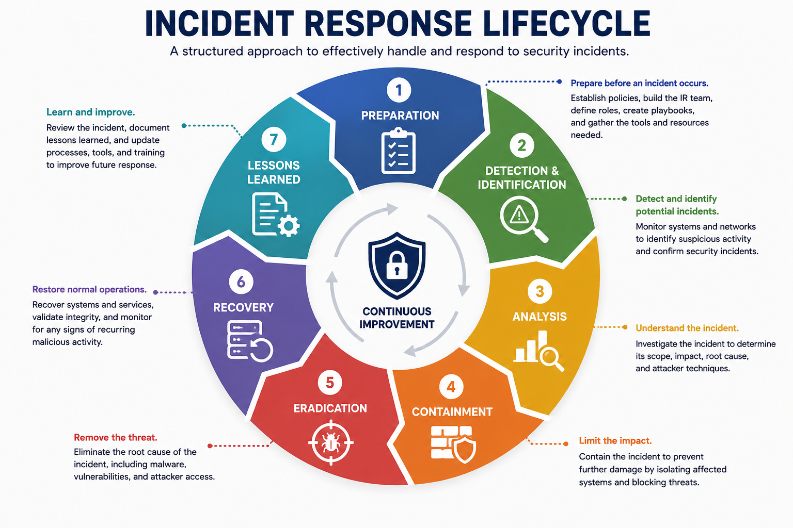
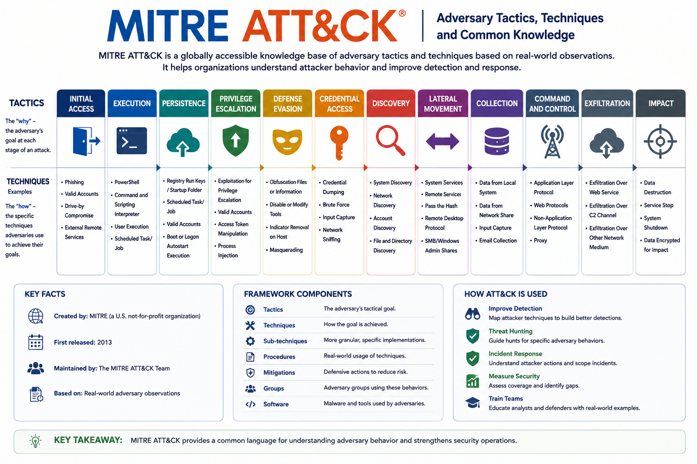
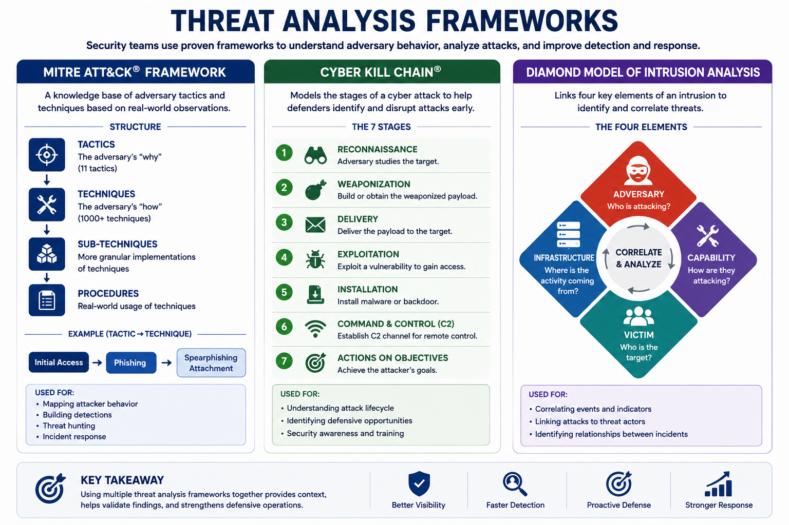
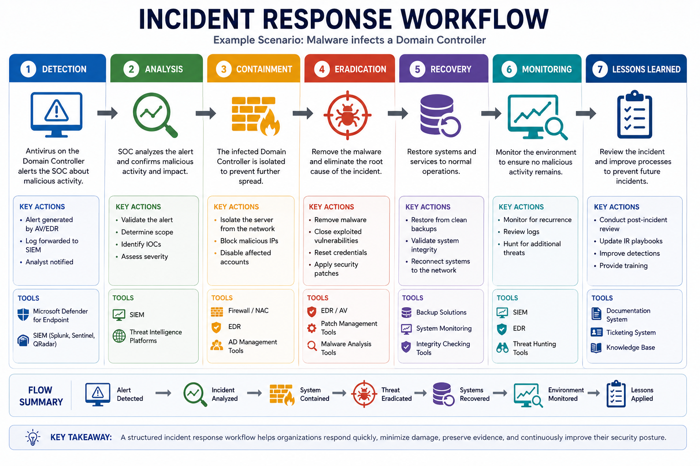
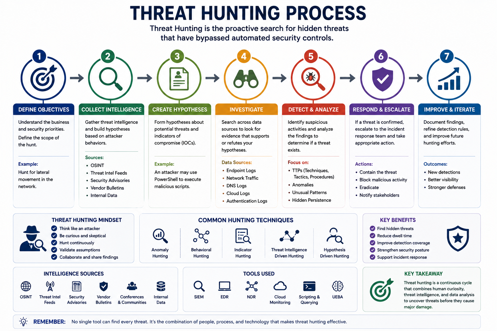
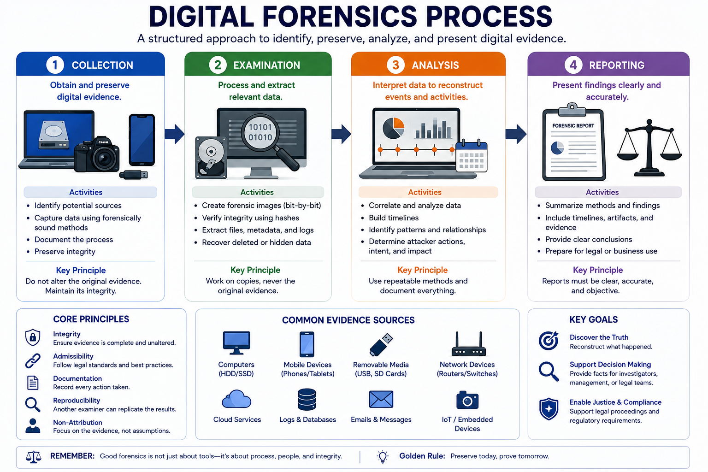
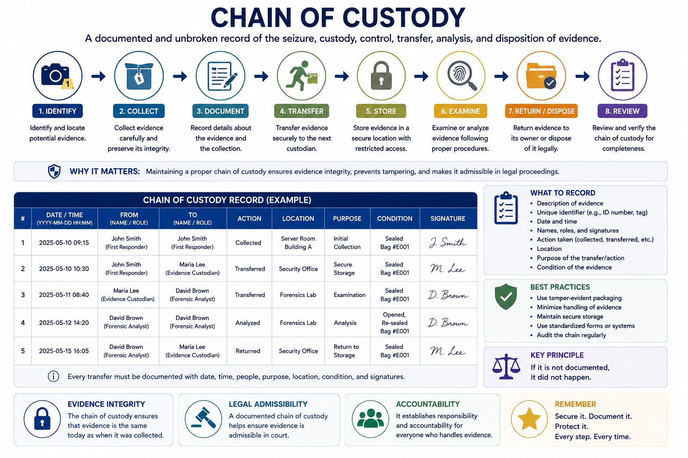

# Incident Response

Incident Response (IR) is a structured process used to identify, manage, contain, and recover from cybersecurity incidents while minimizing damage to business operations.

A well-defined incident response process enables organizations to respond quickly, preserve evidence, restore normal operations, and continuously improve their security posture.

---

# Incident Response Lifecycle

The incident response lifecycle consists of seven major phases.

---

## 1. Preparation

Preparation occurs before any security incident happens.

Activities include:

- Creating an Incident Response Plan
- Building the Incident Response Team (IRT)
- Establishing secure communication channels
- Maintaining asset inventories
- Updating network diagrams
- Preparing forensic tools
- Defining escalation procedures

Proper preparation significantly reduces response time during real incidents.

---

## 2. Detection and Identification

The goal is to detect suspicious activity as early as possible.

Common detection sources include:

- EDR (Endpoint Detection and Response)
- IDS (Intrusion Detection System)
- SIEM
- Log Collectors
- Antivirus Alerts
- User Reports

These systems generate alerts based on signatures, rules, or behavioral analysis.

---

## 3. Analysis

Once an alert is generated, analysts determine:

- What happened?
- Which systems are affected?
- How severe is the incident?
- What attack techniques were used?
- What should happen next?

Several threat analysis frameworks assist this process.

---

# Threat Analysis Frameworks

---

## MITRE ATT&CK Framework

MITRE ATT&CK is a public knowledge base describing attacker behavior.

It organizes attacks into:

- Tactics
- Techniques
- Procedures
- Adversary Profiles

Security teams use ATT&CK to understand attacker behavior and improve detection.

---

## Cyber Kill Chain

Developed by Lockheed Martin, this framework divides an attack into seven stages:

1. Reconnaissance
2. Weaponization
3. Delivery
4. Exploitation
5. Installation
6. Command and Control (C2)
7. Actions on Objectives

Each phase offers defenders an opportunity to detect or stop the attack.

---

## Diamond Model of Intrusion Analysis

The Diamond Model links four key elements:

- Adversary
- Capability
- Infrastructure
- Victim

This helps investigators correlate attacks and identify threat actors.

---

# 4. Containment

Containment limits the spread of an attack.

Examples include:

- Isolating infected devices
- Blocking malicious IP addresses
- Disabling compromised accounts
- Disconnecting systems from the network

During containment, volatile evidence should be collected before systems are powered off.

---

# 5. Eradication

The objective is to eliminate the root cause.

Activities include:

- Removing malware
- Closing exploited vulnerabilities
- Applying patches
- Reimaging compromised systems
- Removing malicious accounts

---

# 6. Recovery

Systems are safely restored to production.

Recovery includes:

- Restoring backups
- Validating system integrity
- Monitoring for recurring attacks
- Returning services to users

Important recovery metrics:

- **RPO (Recovery Point Objective)** – Maximum acceptable data loss.
- **RTO (Recovery Time Objective)** – Maximum acceptable downtime.

---

# 7. Lessons Learned

After recovery, the organization reviews the incident.

Questions include:

- What happened?
- Why did it happen?
- What worked well?
- What failed?
- How can future incidents be prevented?

The Incident Response Plan should be updated accordingly.

---

# Example Incident Response Workflow

Example:

Malware infects a Domain Controller.

- Detection → Antivirus alerts SOC.
- Analysis → SIEM confirms malicious activity.
- Containment → Server is isolated.
- Eradication → Malware is removed and vulnerabilities patched.
- Recovery → System is restored and monitored.
- Lessons Learned → Policies are updated to prevent recurrence.

---

# Incident Response Training

Organizations should regularly train their security teams.

Recommended training includes:

- Security Awareness
- Policy and Procedure Training
- Incident Handling Training
- Communication Training
- Compliance Training

---

## Tabletop Exercises

Discussion-based exercises where participants walk through a hypothetical security incident.

---

## Simulations

Realistic exercises that emulate cyberattacks.

Examples include:

- Red Team vs Blue Team
- Attack Emulation
- Live Incident Response Drills

---

# Root Cause Analysis (RCA)

Root Cause Analysis identifies why an incident occurred rather than only fixing its symptoms.

Benefits include:

- Eliminating recurring problems
- Improving defenses
- Strengthening security policies

---

# Threat Hunting

Threat Hunting is the proactive search for hidden threats that have bypassed automated security controls.

Common intelligence sources include:

- OSINT
- Threat Intelligence Feeds
- Security Advisories
- Vendor Bulletins
- Conferences
- Intelligence Fusion

Threat hunters think like attackers to discover indicators of compromise before major damage occurs.

---

# Digital Forensics

Digital Forensics investigates security incidents using digital evidence.

The forensic process consists of four phases.

---

## 1. Collection

Evidence is collected while preserving its integrity.

Examples:

- Disk Images
- Memory Dumps
- Log Files
- USB Devices
- Mobile Devices

---

## 2. Examination

Raw evidence is processed using forensic tools.

---

## 3. Analysis

Investigators reconstruct the timeline and determine attacker actions.

---

## 4. Reporting

Findings are documented clearly for technical teams, management, or legal proceedings.

---

# Legal Hold

A Legal Hold preserves important electronic data during investigations.

Examples include:

- Emails
- Documents
- Chat Messages

Users cannot delete protected information while the legal hold is active.

---

# Chain of Custody

The Chain of Custody documents every person who handled evidence.

It records:

- Date
- Time
- Person Responsible
- Transfer Details

Maintaining the chain of custody ensures evidence remains legally admissible.

---

# Evidence Acquisition

Evidence collection should include:

- Computers
- Servers
- Mobile Devices
- USB Drives
- Network Logs

Time normalization should convert timestamps into a common time zone (typically UTC) to simplify investigation timelines.

---

# Preservation Techniques

Evidence integrity is maintained through:

- Hashing
- Encryption
- Secure Storage

---

## Order of Volatility

Collect the most volatile evidence first.

Priority:

1. CPU Cache
2. RAM
3. Swap File
4. Hard Disk

---

# E-Discovery

Electronic Discovery (E-Discovery) is the process of collecting digital evidence for legal investigations.

Examples include:

- Emails
- Databases
- Documents
- Chat Records

---

# Right-to-Audit Clause

A Right-to-Audit Clause allows customers or third-party auditors to inspect a service provider's security controls and compliance practices.

This is commonly used when assessing third-party security risks.

---

# Key Concept

Incident Response is a structured process that enables organizations to prepare for, detect, analyze, contain, eradicate, recover from, and learn from cybersecurity incidents. Combined with threat intelligence, forensic investigations, and continuous training, effective incident response minimizes business impact while improving future resilience.