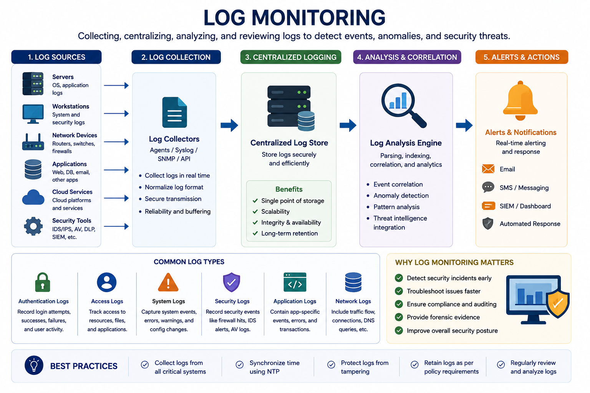
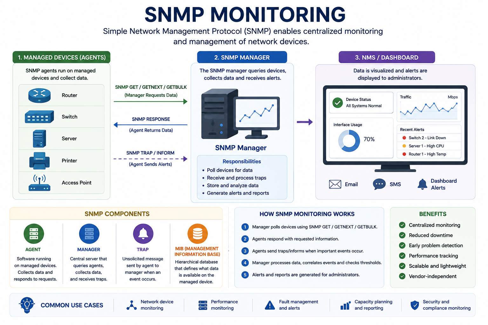
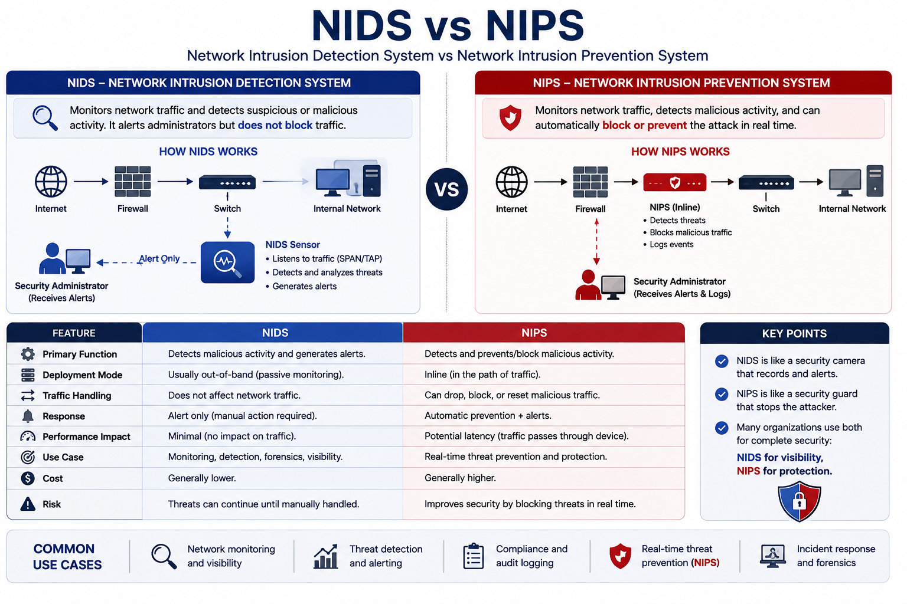
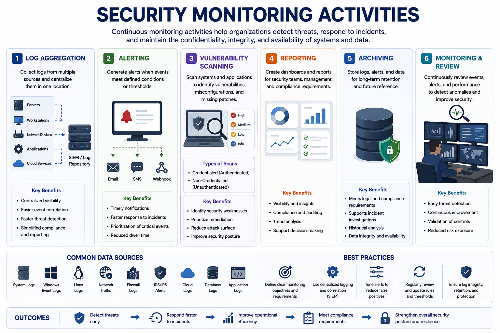
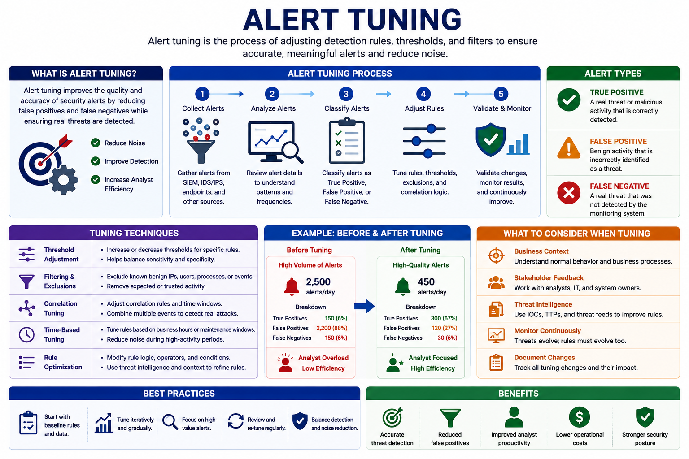
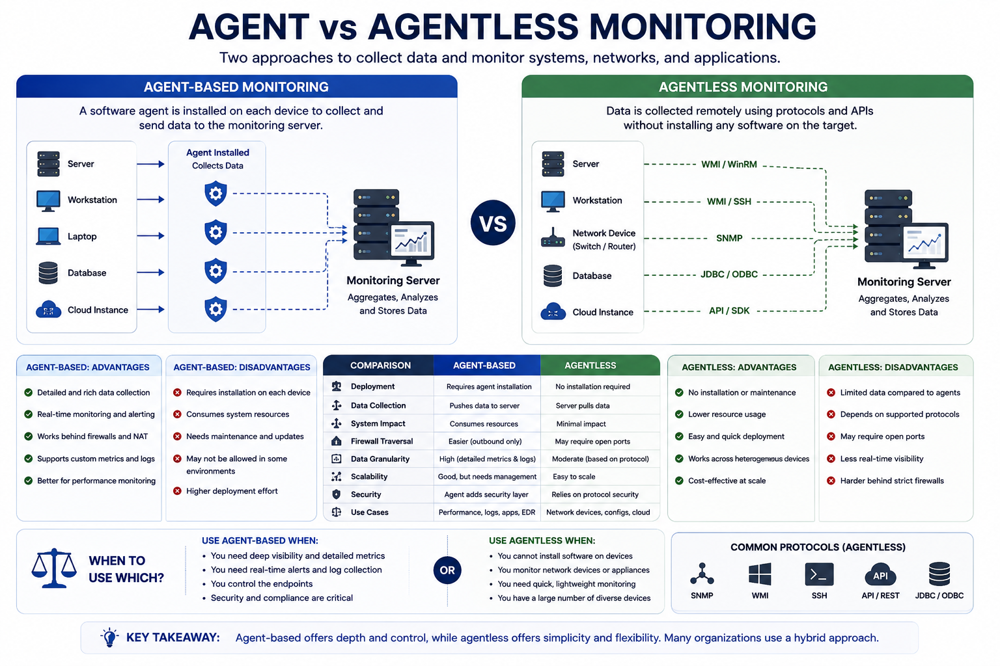
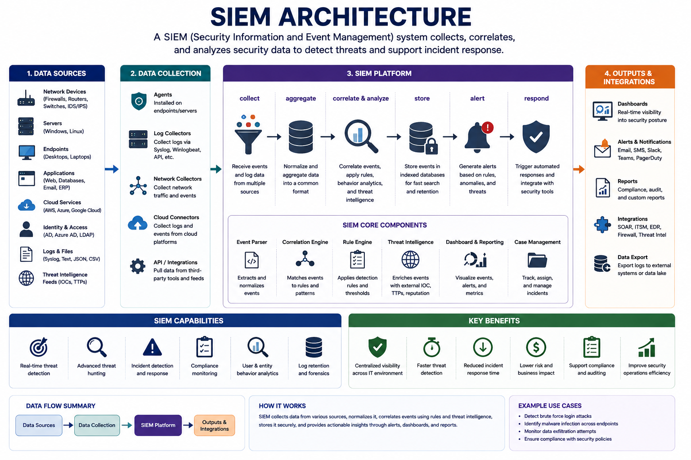
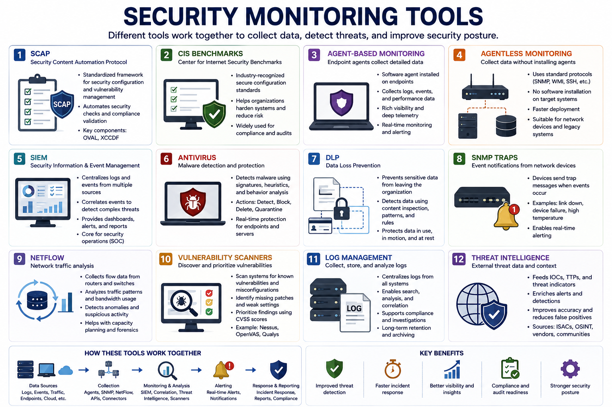

# Security Alerting and Monitoring

Security alerting and monitoring is the continuous surveillance and assessment of computing environments to detect threats, identify anomalies, and respond to security incidents in real time.

Effective monitoring provides visibility into systems, networks, applications, and infrastructure, allowing organizations to detect attacks early and minimize business impact.

---

# Monitoring Computing Resources

Monitoring involves the regular inspection and analysis of multiple components across the enterprise.

---

## Log Files

Log files are text-based records automatically generated by operating systems, applications, and devices.

They record events such as:

- Software installations
- File modifications
- Login attempts
- System errors
- Access violations

Logs serve as audit trails for:

- Incident detection
- Troubleshooting
- Digital forensics

---

## Security Logs

Security logs specifically record access to protected resources.

They provide:

- Audit trails
- Unauthorized access detection
- Authentication records
- Authorization events

Regular review of security logs helps identify suspicious activity before it becomes a major incident.

---

## System Monitoring

System monitoring focuses on servers, endpoints, and workstations.

Common metrics include:

- CPU utilization
- Memory usage
- Disk activity
- Uptime

Establishing performance baselines allows security teams to detect abnormal behavior.

---

## Application Monitoring

Application monitoring tracks the health and behavior of software applications.

Monitoring includes:

- Performance
- Error messages
- Unexpected crashes
- Unauthorized access
- Usage spikes

Alerts can be generated whenever abnormal behavior is detected.

---

## Infrastructure Monitoring

Infrastructure monitoring covers:

- Network devices
- Databases
- Cloud resources
- Storage systems

Monitoring ensures infrastructure remains secure and operational.

---

## SNMP Monitoring

Simple Network Management Protocol (SNMP) enables centralized monitoring of network devices.

Main components:

- **Agents** – Software running on monitored devices.
- **Managers** – Central systems collecting device information.
- **Traps** – Event-driven notifications sent automatically.
- **NMS (Network Management System)** – Dashboard displaying device health.

---

## NIDS vs NIPS

### NIDS (Network Intrusion Detection System)

- Passive monitoring
- Detects malicious traffic
- Generates alerts
- Does not block attacks

### NIPS (Network Intrusion Prevention System)

- Inline deployment
- Detects attacks
- Automatically blocks malicious traffic
- Enforces security policies

---

# Security Monitoring Activities

Organizations continuously perform several monitoring activities.

---

## Log Aggregation

Logs from multiple systems are centralized into one platform, typically a SIEM.

Benefits include:

- Event correlation
- Behavior analysis
- Threat detection
- Centralized visibility

---

## Alerting

Monitoring tools generate alerts when predefined conditions are met.

Examples:

- Multiple failed logins
- Traffic spikes
- Policy violations
- Malware detection

Alerts help analysts investigate incidents quickly.

---

## Vulnerability Scanning

Scanning identifies:

- Missing patches
- Weak configurations
- Vulnerabilities

Two common scan types:

### Credentialed Scans

- Authenticated
- Deep visibility
- More accurate

### Non-Credentialed Scans

- External perspective
- Simulates attacker visibility

---

## Reporting

Monitoring platforms generate reports for different audiences.

Examples:

- Custom Dashboards
- Compliance Reports
- Executive Summaries

These reports support operational and business decision-making.

---

## Archiving

Monitoring systems retain historical data for:

- Compliance
- Investigations
- Legal requirements
- Historical analysis

Log rotation and secure backups help manage long-term storage.

---

# Alert Response and Validation

Generating alerts is only the beginning.

Organizations must validate alerts and respond appropriately.

---

## Quarantine

Compromised systems can be isolated from the network.

Quarantine methods include:

- Automatic quarantine
- Manual quarantine

Isolation duration depends on the severity of the incident.

---

## Alert Tuning

Alert tuning adjusts detection rules and thresholds to improve monitoring accuracy.

Proper tuning reduces alert fatigue and improves analyst productivity.

### Alert Types

| Type | Description |
|------|-------------|
| True Positive | Real threat correctly detected |
| False Positive | Benign activity incorrectly reported as malicious |
| False Negative | Real threat that was missed |

---

# Security Monitoring Tools

---

## SCAP (Security Content Automation Protocol)

SCAP is a standardized framework used by vulnerability scanners to verify system configuration compliance.

Important components:

- OVAL
- XCCDF

SCAP helps validate systems against approved security baselines.

---

## CIS Benchmarks

CIS Benchmarks provide industry-recognized secure configuration standards.

Organizations use them to:

- Improve security
- Verify compliance
- Harden systems

---

## Agent-Based Monitoring

Software agents installed on endpoints collect detailed information.

Advantages:

- Rich telemetry
- Local log collection
- Detailed performance metrics

---

## Agentless Monitoring

Collects information without installing software by using protocols such as:

- SNMP
- WMI

Suitable for environments where agent installation is impractical.

---

## SIEM (Security Information and Event Management)

SIEM centralizes monitoring across the enterprise.

Core functions:

- Data Collection
- Data Aggregation
- Event Correlation
- Alerting
- Reporting

SIEM enables analysts to identify complex attacks by correlating events from multiple sources.

---

## Antivirus

Antivirus solutions detect malware using signatures, heuristics, and behavioral analysis.

Common actions:

- Detect
- Block
- Delete
- Quarantine

---

## DLP (Data Loss Prevention)

DLP prevents sensitive information from leaving the organization.

Examples:

- Credit card numbers
- Personally Identifiable Information (PII)
- Confidential documents

DLP uses techniques such as pattern matching and regular expressions.

---

## SNMP Traps

SNMP Traps automatically notify administrators when important events occur.

Examples:

- Device failures
- Temperature alerts
- Interface outages

---

## NetFlow

NetFlow monitors IP traffic flows across routers and switches.

It helps identify:

- Bandwidth usage
- Traffic patterns
- Suspicious communication
- Network anomalies

---

## Vulnerability Scanners

Vulnerability scanners identify:

- Known vulnerabilities
- Missing patches
- Misconfigurations

Many scanners prioritize findings using **CVSS scores**.

Example:

- Nessus

---

# Key Concept

Security alerting and monitoring provide continuous visibility into enterprise environments by collecting logs, monitoring systems, generating alerts, and correlating security events. Combined with SIEM platforms, vulnerability scanners, DLP, SNMP, NetFlow, and other monitoring tools, organizations can rapidly detect threats, investigate incidents, and improve their overall security posture.