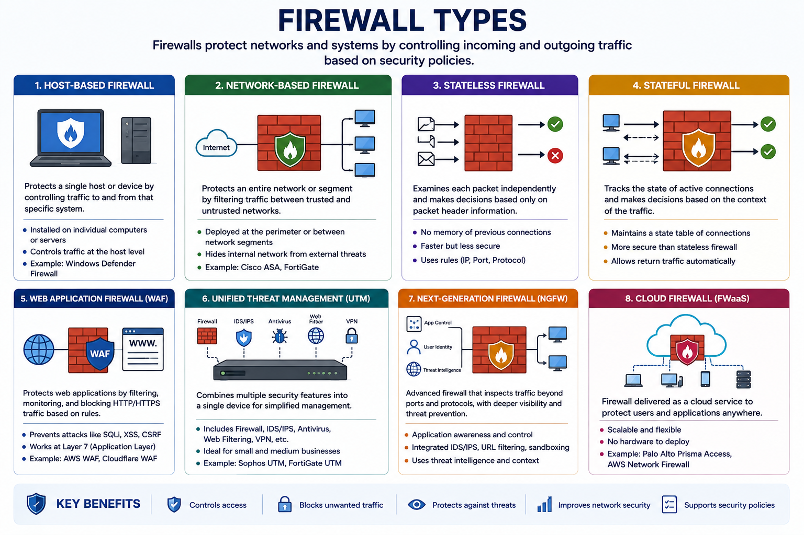
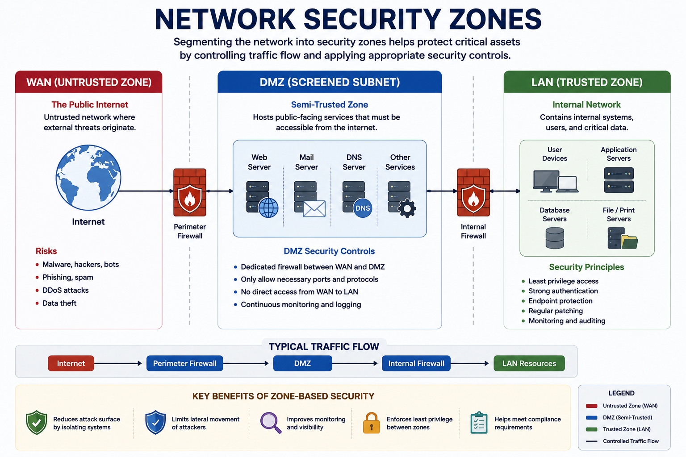
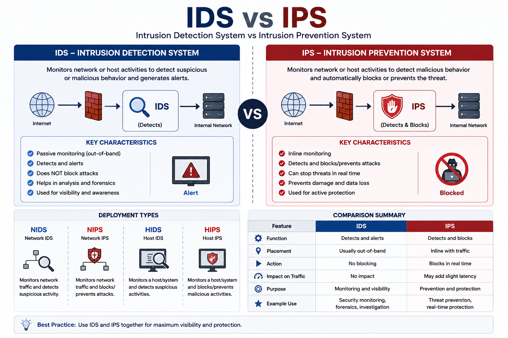
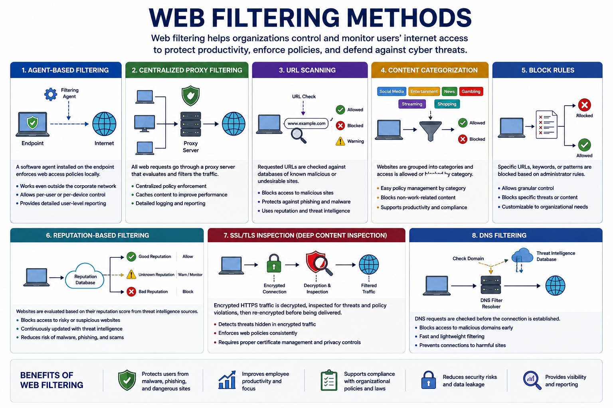
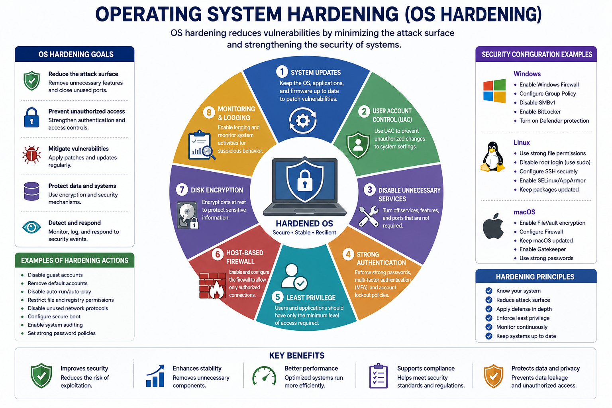
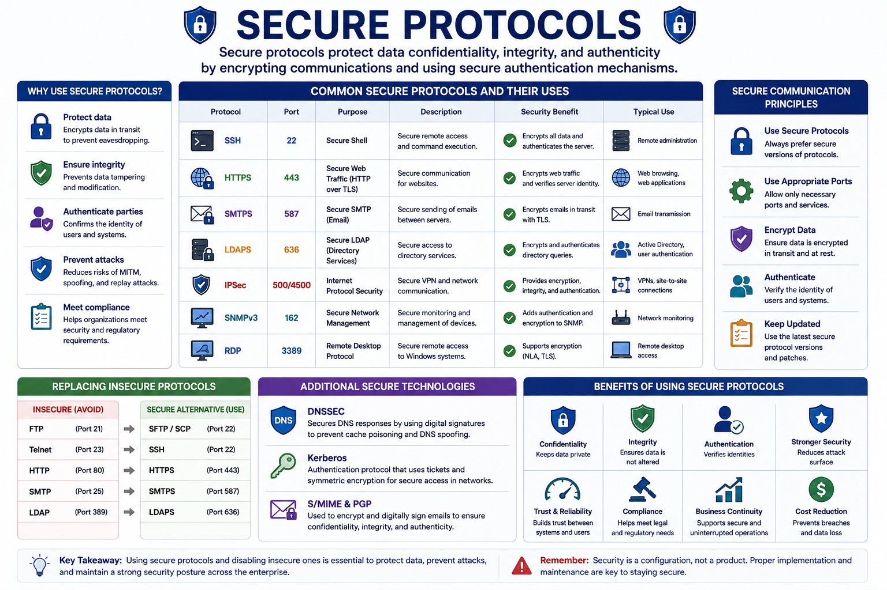
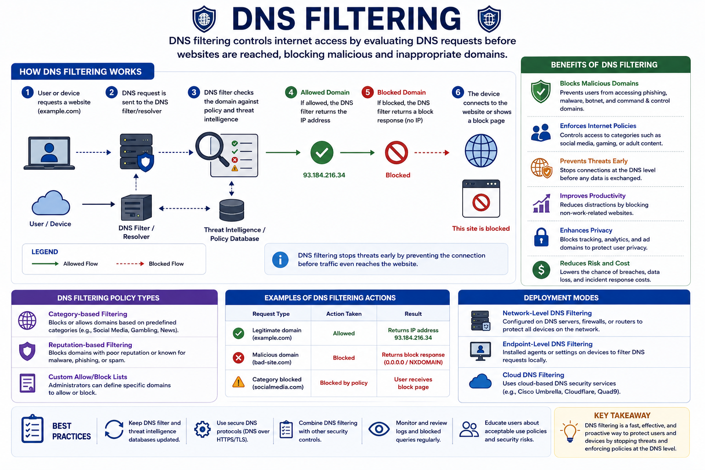
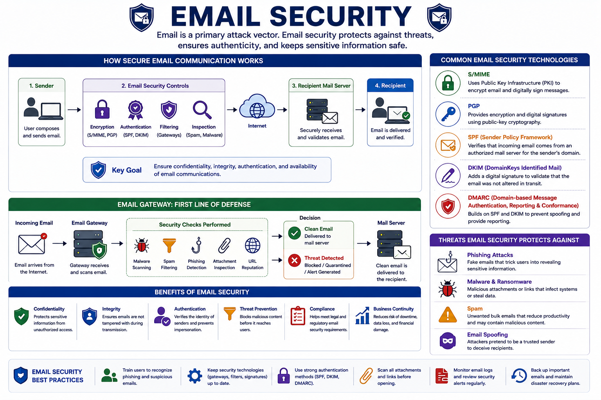

# Enterprise Security Capabilities Enhancement

This lesson explains how organizations strengthen enterprise security by improving defensive technologies, enforcing security policies, hardening operating systems, and deploying secure communication protocols. These enhancements reduce the attack surface, improve threat detection, and help organizations respond effectively to evolving cyber threats.

---

# Firewalls

Firewalls are one of the most important security controls in an enterprise. They act as the boundary between trusted and untrusted networks by allowing or blocking traffic based on predefined security policies.

Firewall rules are built using:

- Source and destination IP addresses
- Ports
- Protocols
- Access Control Lists (ACLs)

Their objective is to ensure that only authorized traffic is allowed into or out of the network.

---

## Types of Firewalls

| Type | Purpose | Typical Use |
|------|---------|-------------|
| Host-Based Firewall | Protects a single device | Endpoints and servers |
| Network-Based Firewall | Protects network segments | Enterprise perimeter |
| Stateless Firewall | Filters packets using predefined rules | Basic filtering |
| Stateful Firewall | Tracks active sessions before allowing traffic | Enterprise environments |
| Web Application Firewall (WAF) | Protects web applications | HTTP/HTTPS services |
| Unified Threat Management (UTM) | Combines multiple security features | Small and medium businesses |
| Next-Generation Firewall (NGFW) | Application-aware filtering with threat intelligence | Modern enterprise security |

---

## Firewall Rules

Firewall rules determine whether traffic is allowed or denied.

Common rule components include:

- Inbound rules
- Outbound rules
- Allow rules
- Deny rules
- Port filtering
- Protocol filtering
- IP filtering

Most enterprise firewalls follow an **implicit deny** model, where traffic is blocked unless explicitly permitted.

---

## Access Control Lists (ACLs)

ACLs define which traffic is permitted or denied based on:

- Source IP
- Destination IP
- Protocol
- Port

ACLs are commonly configured on routers and firewalls to enforce network access policies.

---

## Ports and Protocols

Firewalls inspect traffic using ports and transport protocols.

### TCP

- Reliable
- Connection-oriented
- Uses the three-way handshake

### UDP

- Faster
- Connectionless
- Commonly used for streaming and real-time communication

Port ranges include:

- Well-known ports (0–1023)
- Registered ports (1024–49151)
- Dynamic/Private ports (49152–65535)

---

# Network Security Zones

Enterprise networks are divided into multiple trust zones.

---

## WAN (Untrusted Zone)

The public internet.

This zone is considered untrusted because it is the primary source of external threats.

---

## DMZ (Screened Subnet)

A semi-trusted network that hosts public-facing services such as:

- Web servers
- Email servers
- DNS servers

A DMZ separates external users from the internal network.

---

## LAN (Trusted Zone)

The internal enterprise network containing:

- Employees
- Critical servers
- Sensitive business resources

It is protected by multiple security controls.

---

# IDS and IPS

Intrusion Detection and Prevention Systems monitor network or host activity for malicious behavior.

---

## IDS (Intrusion Detection System)

Characteristics:

- Passive monitoring
- Detects suspicious activity
- Generates alerts
- Does not block attacks

---

## IPS (Intrusion Prevention System)

Characteristics:

- Inline deployment
- Detects attacks
- Automatically blocks malicious traffic
- Enforces security policies

---

## Deployment Types

| Type | Scope | Function |
|------|-------|----------|
| NIDS | Network | Detects attacks |
| NIPS | Network | Detects and blocks attacks |
| HIDS | Host | Monitors endpoints |
| HIPS | Host | Monitors and actively protects endpoints |

---

## Trend Analysis

Trend analysis helps organizations identify long-term attack patterns.

Examples include:

- Repeated failed logins
- Malware trends
- Brute-force attempts

It also supports:

- Threat intelligence
- IDS/IPS tuning
- Incident response planning

---

## IDS/IPS Detection Methods

Detection may rely on:

- Signature-based detection
- Heuristic or anomaly-based detection
- Custom enterprise signatures
- Real-time signature updates

Regular updates improve protection against newly discovered threats.

---

# Web Filtering

Web filtering controls user access to websites and online content according to organizational policies.

---

## Common Web Filtering Techniques

### Agent-Based Filtering

Software installed on endpoints enforces browsing policies locally.

---

### Centralized Proxy Filtering

A proxy server evaluates all web requests before granting access.

---

### URL Scanning

Checks requested URLs against databases of malicious websites.

---

### Content Categorization

Groups websites into categories such as:

- Social Media
- Gambling
- News
- Entertainment

Administrators can allow or block entire categories.

---

### Block Rules

Specific URLs or keywords are denied according to organizational policies.

---

### Reputation-Based Filtering

Blocks websites with poor reputations, including phishing or malware-hosting sites.

---

# Operating System Security (OS Hardening)

OS hardening reduces vulnerabilities by minimizing unnecessary functionality and strengthening system security.

---

## Hardening Techniques

- Regular system updates
- User Account Control (UAC)
- Disable unnecessary services
- Strong authentication
- Least privilege
- Host-based firewalls
- Disk encryption
- Monitoring and logging
- Patch management
- User awareness training
- Backup and disaster recovery

---

# Group Policy

In Windows environments, Group Policy provides centralized management of security settings.

Common uses include:

- Password policies
- Account lockout policies
- Software deployment
- Security configuration
- AppLocker rules

Group Policy enables administrators to apply security settings across an entire domain or specific Organizational Units (OUs).

---

# SELinux

Security-Enhanced Linux (SELinux) strengthens Linux security by enforcing **Mandatory Access Control (MAC)**.

Benefits include:

- Kernel-level protection
- Least privilege enforcement
- Restricting process access
- Limiting lateral movement

SELinux is widely used on Linux servers and embedded systems.

---

# Secure Protocols

Using secure protocols protects data confidentiality and integrity during transmission.

---

## Secure Communication Principles

Organizations should select:

- Secure protocols
- Appropriate transport methods
- Necessary ports only

Example:

| Protocol | Port | Purpose |
|----------|------|---------|
| SSH | 22 | Secure remote administration |
| HTTPS | 443 | Secure web traffic |
| SMTPS | 587 | Secure email |
| LDAPS | 636 | Secure directory services |
| IPSec | 500 | Secure VPNs |
| SNMPv3 | 162 | Secure network management |
| RDP | 3389 | Remote desktop |

---

## Replacing Insecure Protocols

Examples:

| Insecure | Secure Alternative |
|-----------|-------------------|
| FTP | SFTP / SCP |
| Telnet | SSH |
| HTTP | HTTPS |
| SMTP | SMTPS |
| LDAP | LDAPS |

---

## Additional Secure Technologies

The course also highlights:

- **DNSSEC** – Protects DNS records from tampering.
- **Kerberos** – Secure ticket-based authentication.
- **S/MIME / PGP** – Encrypt and digitally sign emails.

---

# DNS Filtering

DNS filtering controls internet access by evaluating DNS requests before websites are reached.

Benefits include:

- Blocking malicious domains
- Enforcing browsing policies
- Preventing phishing
- Reducing malware infections
- Improving privacy

---

# Email Security

Email remains one of the primary attack vectors in enterprise environments.

Organizations secure email using encryption, authentication, and filtering technologies.

---

## Common Email Security Technologies

### S/MIME

Uses Public Key Infrastructure (PKI) to:

- Encrypt email
- Digitally sign messages

---

### PGP

Provides encryption and digital signatures using public-key cryptography.

---

### SPF (Sender Policy Framework)

Helps prevent email spoofing by verifying authorized sending servers.

---

### DKIM (DomainKeys Identified Mail)

Adds digital signatures to verify that emails have not been modified during transmission.

---

### Email Gateways

Email gateways inspect messages for:

- Spam
- Malware
- Phishing
- Malicious attachments
- Dangerous URLs

---

# Key Concept

Enterprise security capabilities are enhanced by combining multiple defensive technologies, including firewalls, IDS/IPS, web filtering, operating system hardening, secure communication protocols, DNS filtering, and email security. Together, these controls reduce the attack surface, enforce security policies, and improve an organization's ability to detect, prevent, and respond to cyber threats.