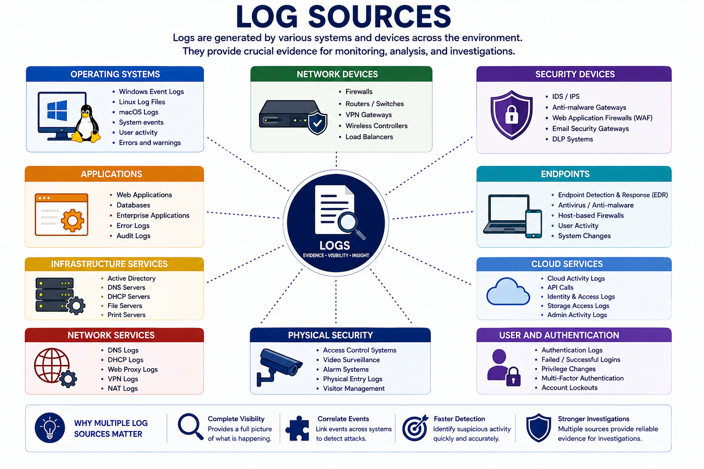
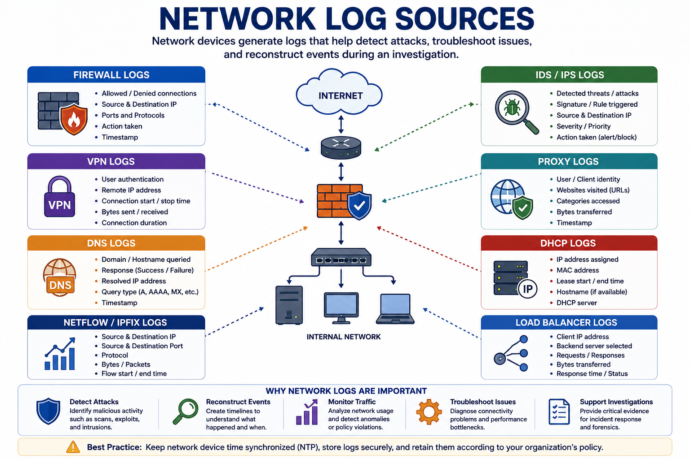
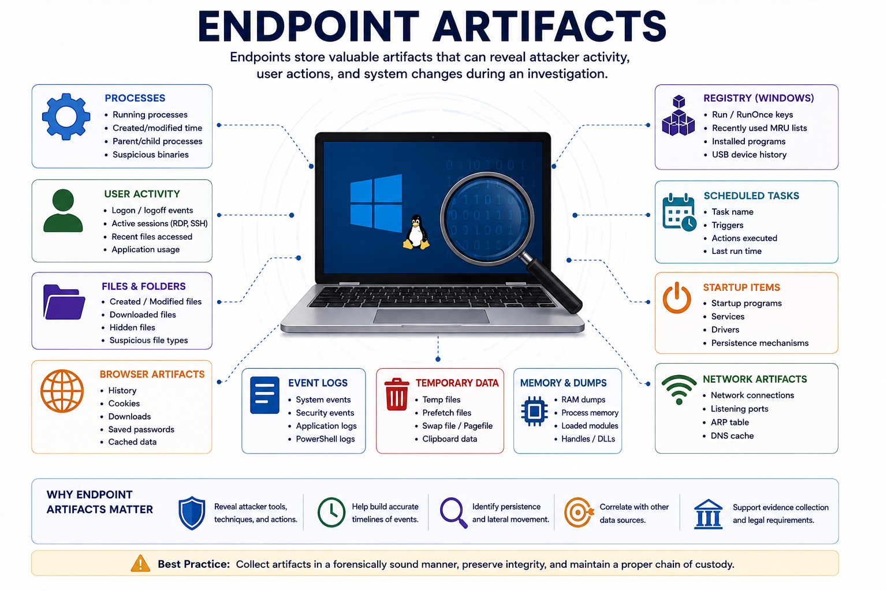
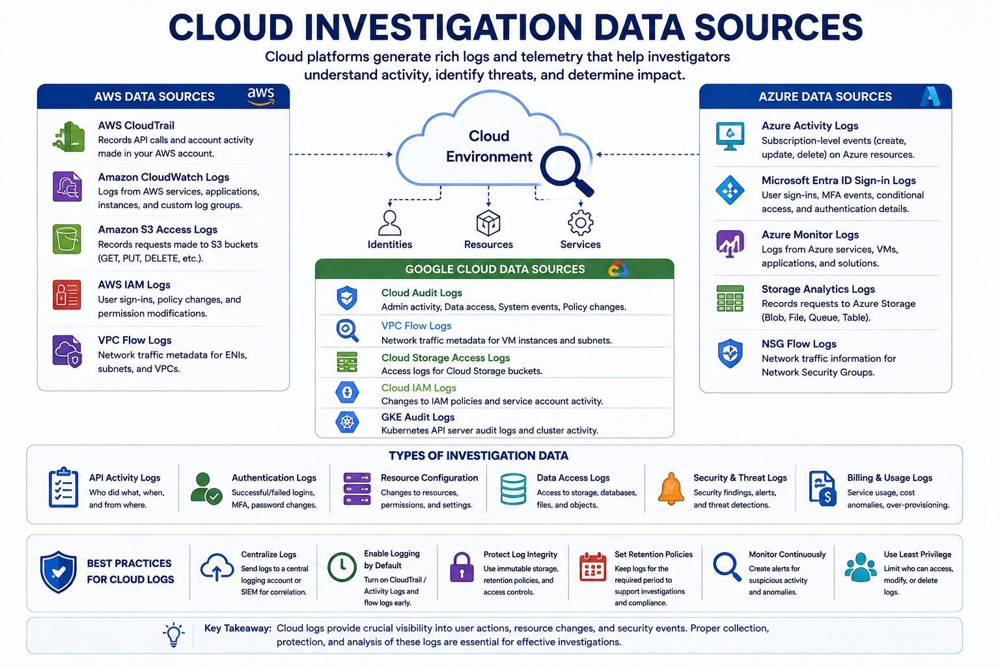
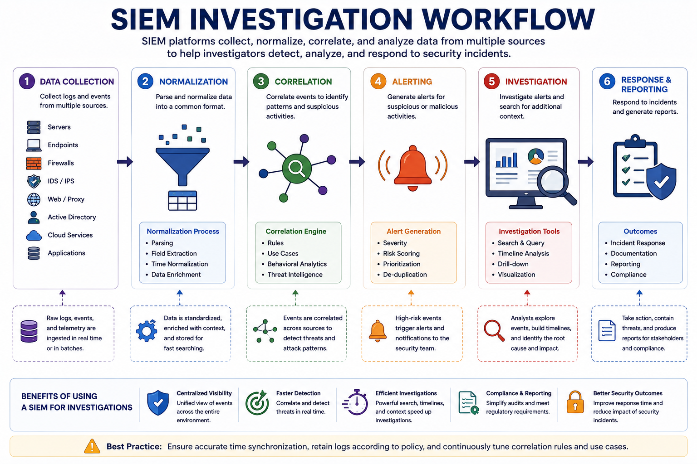
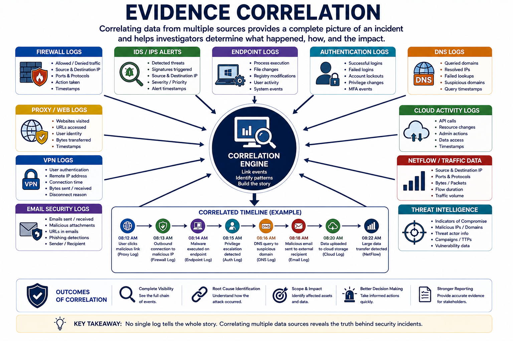

# Use Data Sources to Support an Investigation

During a security incident, investigators rely on multiple data sources to reconstruct events, identify attacker actions, determine the scope of compromise, and preserve digital evidence.

No single log or artifact tells the entire story. Effective investigations correlate information from multiple sources to build a complete timeline.

---

# Log Sources

Logs are one of the most valuable sources of digital evidence.

They record:

- User activity
- Authentication attempts
- Network connections
- System events
- Security alerts

Logs help answer:

- What happened?
- When did it happen?
- Who performed the action?
- Which system was affected?



---

# Operating System Logs

Operating systems continuously record system activity.

---

## Windows Event Logs

Windows stores logs in several categories.

Common log types include:

| Log | Purpose |
|------|---------|
| Security | Authentication, authorization, auditing |
| System | Operating system events |
| Application | Application events |
| Setup | Installation events |
| Forwarded Events | Events collected from remote systems |

Investigators often examine:

- Failed logins
- Privilege escalation
- Service creation
- Process execution
- Account creation

---

## Linux Log Files

Linux stores logs primarily under:

```text
/var/log/
```

Common files include:

| File | Purpose |
|------|---------|
| auth.log | Authentication events |
| secure | Login activity |
| syslog | General system events |
| messages | Kernel and service events |
| boot.log | Boot process |
| dmesg | Kernel messages |

---

# Network Logs

Network devices continuously generate valuable forensic data.



---

## Firewall Logs

Firewall logs record:

- Allowed connections
- Blocked connections
- Source IP
- Destination IP
- Ports
- Protocols

These logs help identify scanning attempts, brute-force attacks, and unauthorized communications.

---

## IDS/IPS Logs

IDS and IPS logs record:

- Detected attacks
- Signatures triggered
- Malicious traffic
- Blocked connections
- Alert severity

---

## VPN Logs

VPN logs provide:

- User authentication
- Remote IP addresses
- Connection duration
- Login timestamps

These logs help investigate unauthorized remote access.

---

## Proxy Logs

Proxy servers record:

- Websites visited
- Downloaded files
- User identities
- Request timestamps

Useful during insider threat investigations.

---

## DNS Logs

DNS logs record hostname resolution.

Examples:

- Domain requests
- Failed lookups
- Suspicious domains
- Command-and-Control domains

DNS logs often reveal malware communication.

---

## DHCP Logs

DHCP logs associate IP addresses with devices.

They allow investigators to determine:

- Which device used an IP
- Lease times
- MAC addresses

---

# Endpoint Artifacts

Endpoints contain valuable evidence after an attack.

Common artifacts include:

- Browser history
- Registry entries
- Running processes
- Installed applications
- Scheduled tasks
- Startup programs
- Temporary files
- Memory dumps



---

# Packet Capture (PCAP)

Packet captures contain complete network traffic.

Investigators use PCAP files to analyze:

- Protocols
- Conversations
- Malware communication
- Data exfiltration
- Command-and-Control traffic

Common analysis tools:

- Wireshark
- tcpdump

---

# NetFlow

NetFlow summarizes network traffic without storing packet contents.

It records:

- Source IP
- Destination IP
- Ports
- Protocols
- Number of bytes
- Connection duration

NetFlow is useful for:

- Traffic analysis
- Bandwidth monitoring
- Threat detection

---

# Web Server Logs

Web servers generate detailed request logs.

Typical information includes:

- Client IP
- Requested URL
- HTTP method
- Status code
- User-Agent
- Timestamp

Examples:

- Apache access.log
- IIS logs
- Nginx access.log

---

# Cloud Logs

Cloud providers generate logs for cloud resources.

Examples include:

- Authentication logs
- API activity
- Storage access
- Virtual machine activity
- Administrative actions

Examples:

- AWS CloudTrail
- Azure Activity Logs
- Google Cloud Audit Logs



---

# Authentication Logs

Authentication logs record identity-related events.

Examples include:

- Successful logins
- Failed logins
- Password changes
- MFA events
- Account lockouts
- Privilege changes

These logs are critical for detecting compromised accounts.

---

# SIEM Data

SIEM platforms centralize security data from multiple sources.

SIEM capabilities include:

- Event collection
- Log aggregation
- Correlation
- Alert generation
- Timeline reconstruction

SIEM provides a unified investigation platform.



---

# Threat Intelligence

Threat intelligence enriches investigations using external knowledge.

Common sources include:

- Indicators of Compromise (IOCs)
- Indicators of Attack (IOAs)
- Threat feeds
- Vendor advisories
- OSINT
- Security research

Threat intelligence helps analysts determine whether observed activity is associated with known attackers.

---

# Timeline Analysis

Timeline analysis reconstructs events chronologically.

Example:

1. Phishing email received
2. User opened attachment
3. Malware executed
4. C2 communication established
5. Lateral movement detected
6. Data exfiltration occurred

Timeline analysis improves incident understanding.

---

# Evidence Correlation

No individual log provides the complete picture.

Investigators correlate evidence from:

- Firewalls
- Endpoints
- SIEM
- DNS
- VPN
- Authentication logs
- Threat intelligence
- Cloud services

Correlating multiple sources greatly improves investigation accuracy.



---

# Chain of Custody

Collected evidence must remain legally admissible.

Investigators document:

- Evidence owner
- Collection time
- Storage location
- Every transfer
- Integrity verification

Hash values verify that evidence has not changed.

---

# Best Practices

Successful investigations should:

- Synchronize timestamps
- Preserve original evidence
- Avoid modifying systems unnecessarily
- Collect volatile evidence first
- Verify evidence integrity
- Document every action
- Correlate multiple data sources
- Maintain chain of custody

---

# Key Concept

Security investigations rely on multiple sources of digital evidence, including operating system logs, network devices, endpoints, cloud platforms, SIEM systems, packet captures, and threat intelligence. Correlating these data sources enables investigators to reconstruct attack timelines, identify attacker activity, preserve evidence, and support effective incident response.
