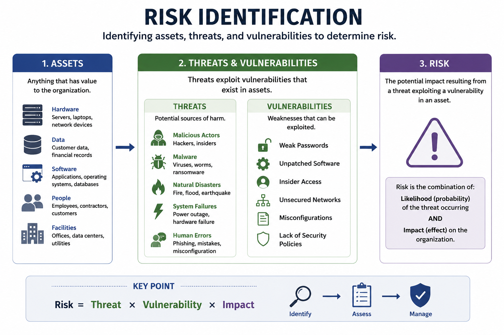
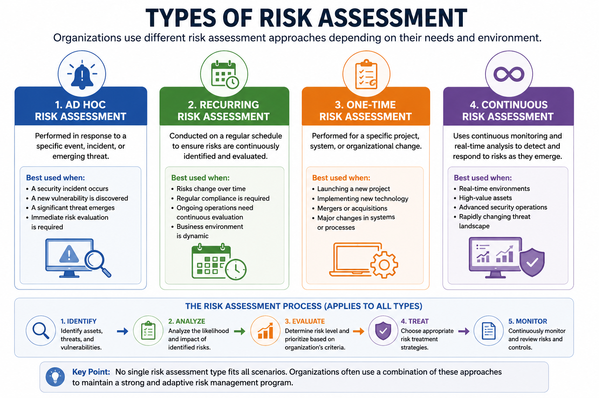
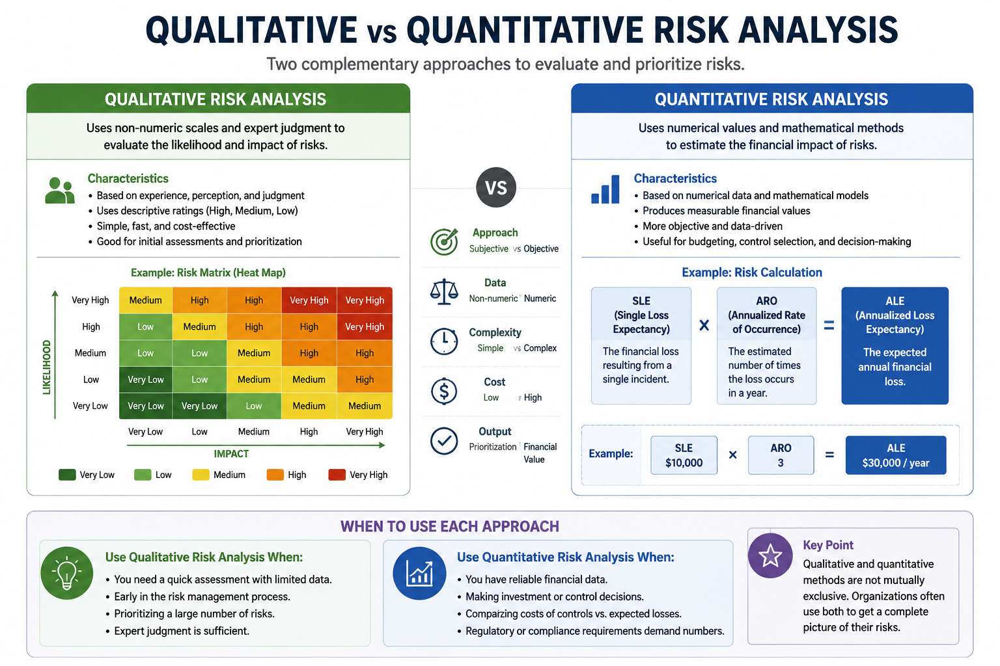
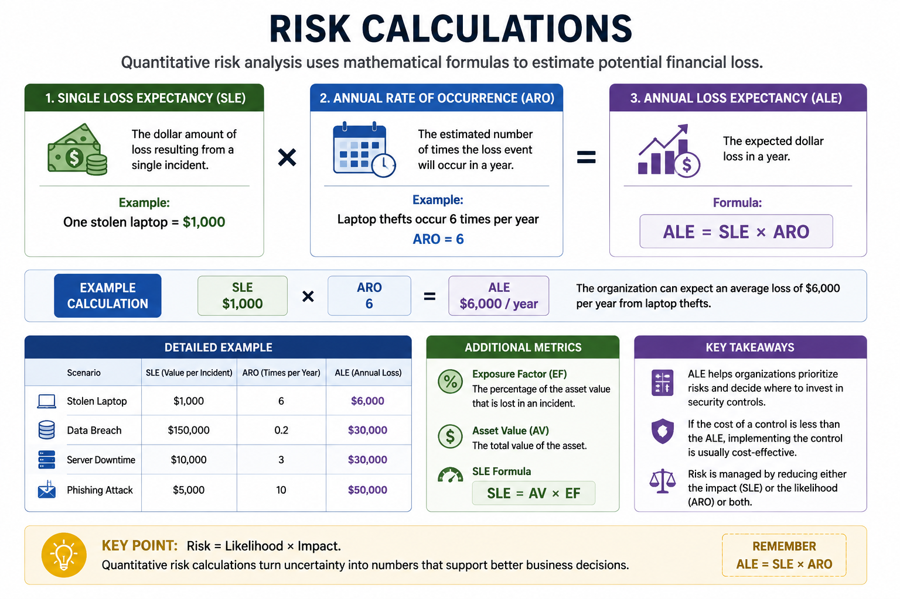
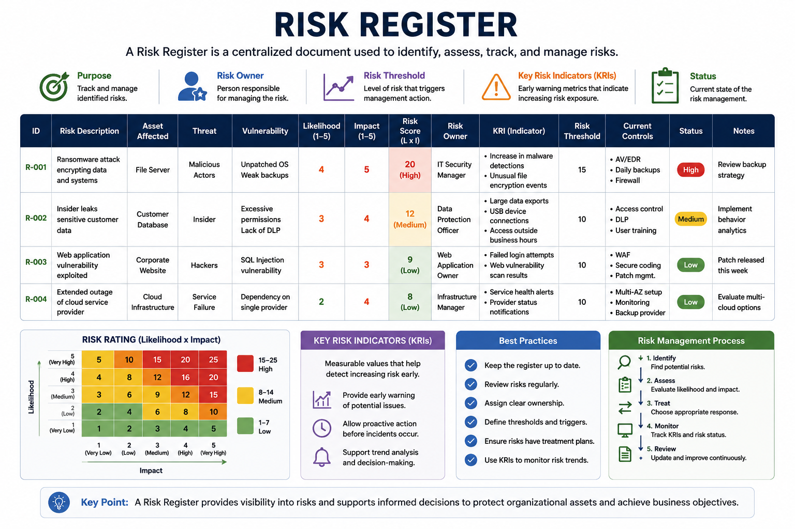
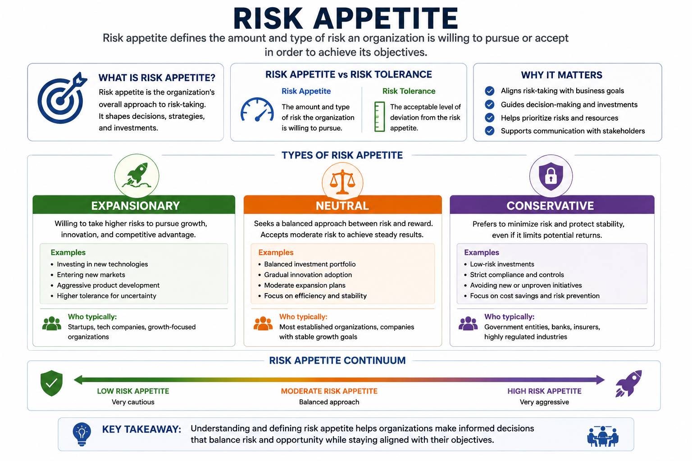
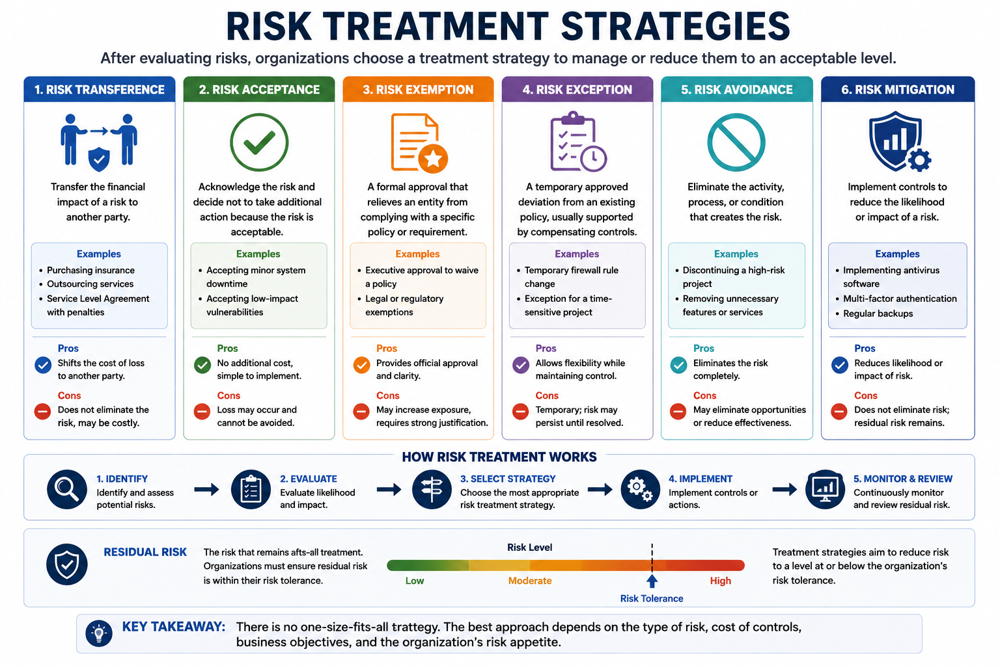
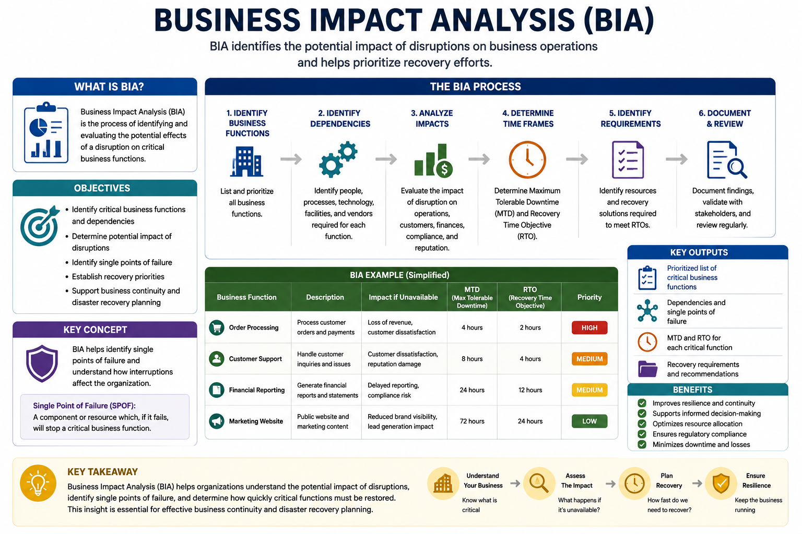

# Risk Management

Risk management is the process of identifying, analyzing, evaluating, and responding to risks that could affect an organization's assets, operations, or business objectives.

It helps organizations make informed security decisions by understanding potential threats, measuring their impact, and selecting appropriate risk treatment strategies.

---

# Risk Identification

The first step in risk management is identifying and classifying organizational assets.

Assets should be protected according to their value and sensitivity.

For example:

- A classified document requires stronger protection than public information.
- A critical server requires more protection than a test machine.

Three key concepts form the foundation of risk management:

- **Risk** – The potential for loss or harm resulting from a threat exploiting a vulnerability, considering likelihood and impact.
- **Threat** – A source or event with the potential to cause harm by exploiting a vulnerability.
- **Vulnerability** – A weakness that can be exploited by a threat.

---

# Risk Assessment

Risk assessment evaluates identified risks to help organizations make informed security decisions.

Common approaches include:

## Ad Hoc Risk Assessment

Performed in response to a specific event or emerging threat.

## Recurring Risk Assessment

Conducted on a regular schedule to continuously evaluate the organization's security posture.

## One-Time Risk Assessment

Performed for a specific project, system deployment, or organizational change.

## Continuous Risk Assessment

Uses continuous monitoring and real-time analysis to detect and respond to risks as they emerge.

---

# Risk Analysis

Risk analysis evaluates both the likelihood of a risk occurring and its potential impact.

## Qualitative Risk Analysis

Uses subjective ratings such as:

- High
- Medium
- Low

A common visualization is a **Risk Matrix (Heat Map)** that combines likelihood and impact.

---

## Quantitative Risk Analysis

Assigns numerical values to risks to estimate potential financial loss.

This approach supports data-driven security decisions.

---

# Risk Calculations

Several metrics are commonly used during quantitative risk analysis.

## Single Loss Expectancy (SLE)

The financial loss resulting from a single incident.

Example:

One stolen laptop = **$1,000**

---

## Annualized Rate of Occurrence (ARO)

The estimated number of times a loss is expected to occur each year.

Example:

Six laptop thefts per year = **ARO = 6**

---

## Annualized Loss Expectancy (ALE)

The expected annual financial loss.

**Formula**

> ALE = SLE × ARO

Example:

- SLE = $850
- ARO = 300

ALE = **$255,000/year**

Organizations compare this value against the cost of implementing security controls or insurance.

---

# Additional Risk Metrics

Other metrics commonly used include:

- **Probability** – Chance that an event occurs.
- **Likelihood** – Qualitative estimate of occurrence.
- **Exposure Factor (EF)** – Percentage of asset value affected.
- **Impact** – Financial or operational consequence.

These metrics help prioritize mitigation efforts.

---

# Risk Register

A **Risk Register** is a centralized document used to track and manage identified risks.

It commonly includes:

## Key Risk Indicators (KRIs)

Metrics that provide early warning signs of increasing risk.

Example:

A high number of failed financial transactions may indicate a developing system issue.

---

## Risk Owner

The individual or team responsible for managing a specific risk.

---

## Risk Threshold

The level of risk an organization is willing to tolerate before additional action is required.

---

# Risk Tolerance

Risk tolerance defines how much uncertainty an organization is willing to accept.

Examples:

- A venture capitalist typically accepts higher risk for greater returns.
- A retiree generally prefers low-risk investments.

---

# Risk Appetite

Risk appetite defines the organization's overall approach to taking risks.

## Expansionary

Accepts higher risk to encourage growth and innovation.

## Conservative

Prioritizes security and avoids unnecessary risk.

## Neutral

Balances growth opportunities with acceptable levels of risk.

---

# Risk Management Strategies

After assessing risks, organizations choose an appropriate treatment strategy.

## Risk Transference

Transfers financial risk to another party.

Examples:

- Cyber insurance
- Outsourcing services

---

## Risk Acceptance

Acknowledges the risk without implementing additional controls because the risk is considered acceptable.

---

## Risk Exemption

A formal approval that relieves an entity from complying with a specific policy or requirement.

---

## Risk Exception

A temporary approved deviation from an existing policy, usually supported by compensating controls.

---

## Risk Avoidance

Eliminates the activity responsible for the risk.

Example:

Choosing not to perform a high-risk activity.

---

## Risk Mitigation

Implements controls that reduce the likelihood or impact of a risk.

Example:

Installing antivirus software to reduce malware risk.

Even after mitigation, some **Residual Risk** always remains.

---

# Risk Reporting

Risk reporting is the process of collecting, analyzing, and communicating risk information to decision-makers.

Benefits include:

- Better decision-making
- Increased stakeholder confidence
- Regulatory compliance

---

# Business Impact Analysis (BIA)

Business Impact Analysis (BIA) identifies the potential impact of disruptions on business operations.

The objective is to identify **single points of failure** and determine how operational interruptions affect the organization.

BIA supports business continuity planning by identifying critical systems and prioritizing recovery efforts.

---

## Key Concept

Risk management enables organizations to identify, assess, analyze, and respond to security risks. Techniques such as qualitative and quantitative analysis, risk registers, SLE, ARO, ALE calculations, risk treatment strategies, and Business Impact Analysis (BIA) help organizations reduce risk while supporting informed business decisions.