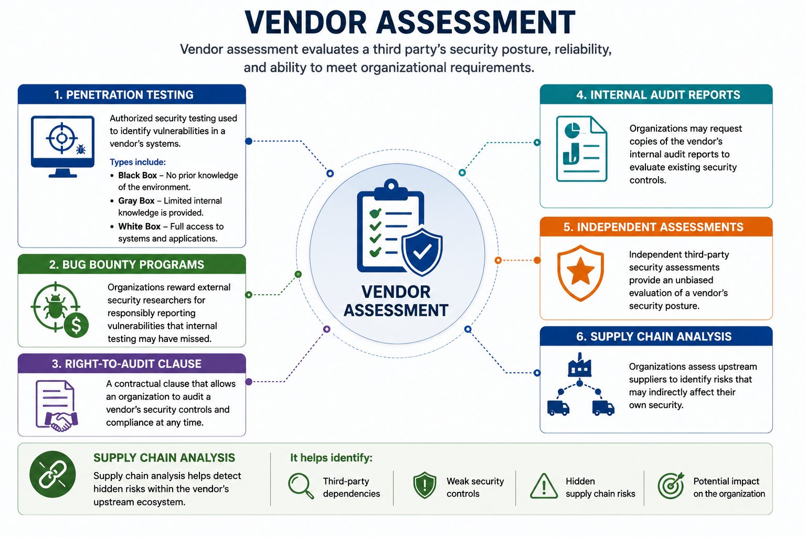
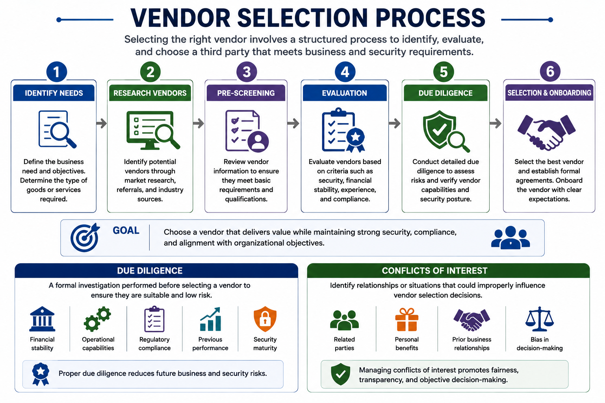
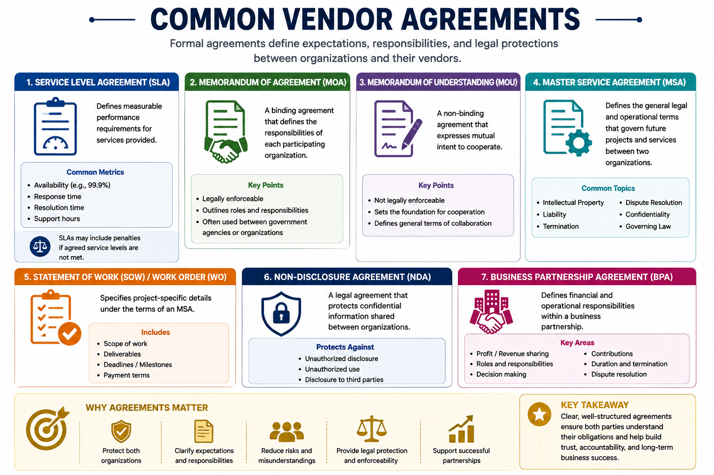
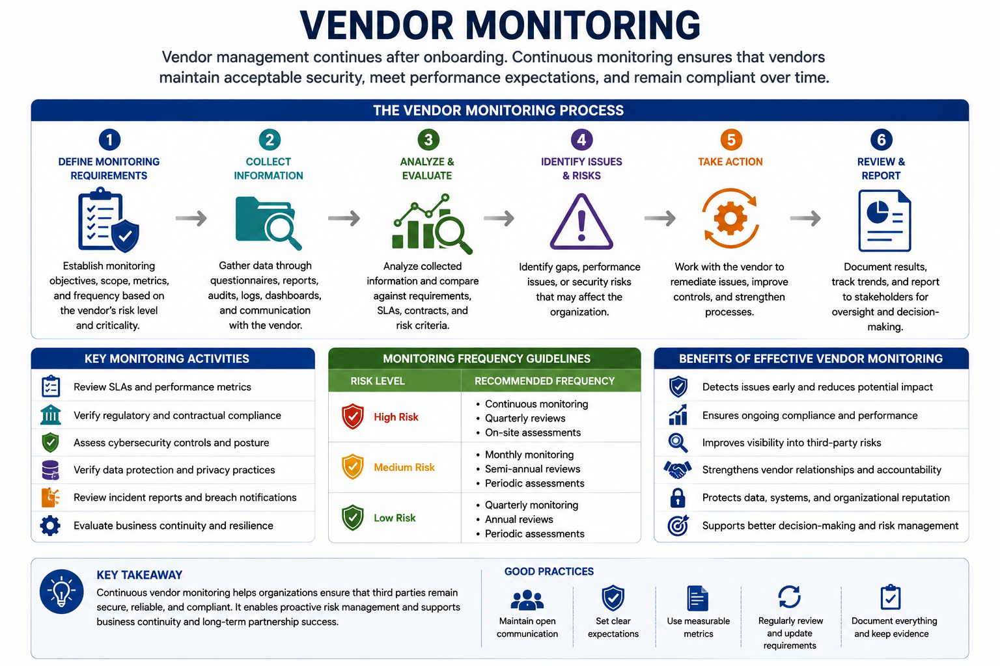
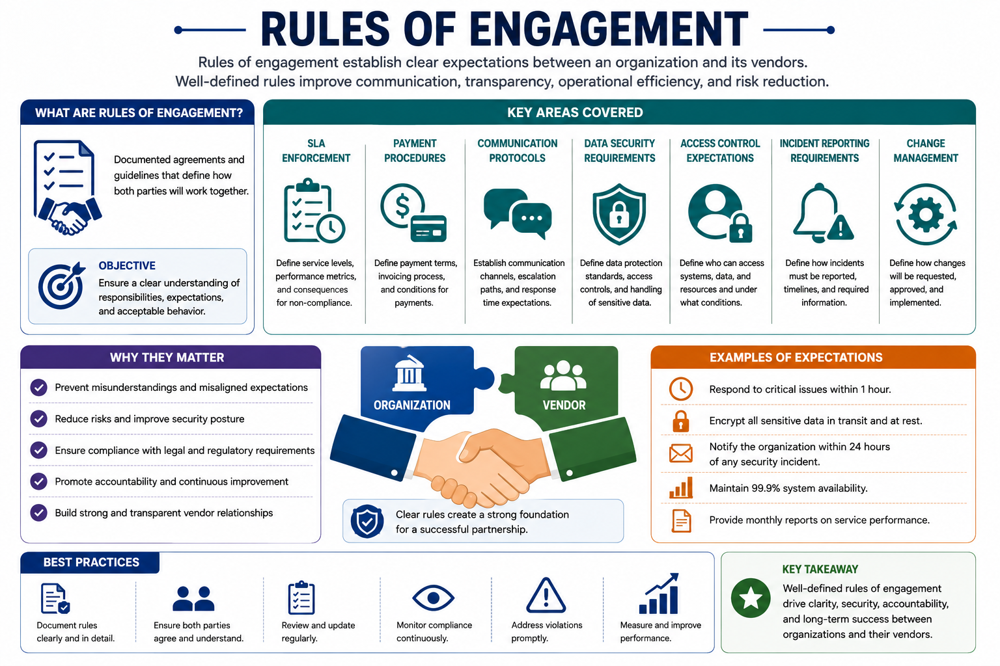

# Third-Party Risk Management

Third-Party Risk Management (TPRM) is the process of identifying, assessing, monitoring, and reducing risks introduced by vendors, suppliers, contractors, cloud providers, and other external organizations.

As businesses increasingly rely on third parties, organizations must ensure that external partners maintain appropriate security controls and comply with contractual and regulatory requirements.

---

# Vendor Assessment

Vendor assessment evaluates a third party's security posture, reliability, and ability to meet organizational requirements.

Common assessment methods include:

## Penetration Testing

Authorized security testing used to identify vulnerabilities in a vendor's systems.

Types include:

- **Black Box** – No prior knowledge of the environment.
- **Gray Box** – Limited internal knowledge is provided.
- **White Box** – Full access to systems and applications.

---

## Bug Bounty Programs

Organizations reward external security researchers for responsibly reporting vulnerabilities that internal testing may have missed.

---

## Right-to-Audit Clause

A contractual clause that allows an organization to audit a vendor's security controls and compliance at any time.

---

## Internal Audit Reports

Organizations may request copies of the vendor's internal audit reports to evaluate existing security controls.

---

## Independent Assessments

Independent third-party security assessments provide an unbiased evaluation of a vendor's security posture.

---

## Supply Chain Analysis

Organizations assess upstream suppliers to identify risks that may indirectly affect their own security.

Supply chain analysis helps detect:

- Third-party dependencies
- Weak security controls
- Hidden supply chain risks

---

# Vendor Selection

Selecting a vendor involves more than choosing the lowest cost.

Organizations evaluate vendors based on security, reliability, compliance, and business capabilities.

---

## Due Diligence

Due diligence is the formal investigation performed before selecting a vendor.

Typical evaluation areas include:

- Financial stability
- Operational capabilities
- Regulatory compliance
- Previous performance
- Security maturity

Proper due diligence reduces future business and security risks.

---

## Conflicts of Interest

Organizations must identify relationships that could influence vendor selection.

Managing conflicts of interest promotes:

- Fairness
- Transparency
- Objective decision-making

---

# Types of Agreements

Formal agreements clearly define expectations, responsibilities, and legal protections between organizations and vendors.

---

## Service-Level Agreement (SLA)

Defines measurable performance requirements such as:

- Availability
- Response time
- Resolution time

SLAs may include penalties if agreed service levels are not met.

---

## Memorandum of Agreement (MOA)

A **binding** agreement that defines the responsibilities of each participating organization.

---

## Memorandum of Understanding (MOU)

A **non-binding** agreement expressing mutual intent to cooperate.

---

## Master Service Agreement (MSA)

Defines the general legal and operational terms that govern future projects between two organizations.

Common topics include:

- Intellectual property
- Liability
- Dispute resolution

---

## Statement of Work (SOW) / Work Order (WO)

Specifies project-specific details, including:

- Scope
- Deliverables
- Deadlines
- Payment terms

---

## Non-Disclosure Agreement (NDA)

Protects confidential information shared between organizations.

---

## Business Partnership Agreement (BPA)

Defines financial and operational responsibilities within a business partnership.

---

# Vendor Monitoring

Vendor management continues after onboarding.

Organizations continuously monitor vendors to ensure ongoing compliance and acceptable security performance.

Monitoring commonly includes:

- SLA reviews
- Regulatory compliance verification
- Cybersecurity control reviews
- Data protection verification

Continuous monitoring enables organizations to detect issues before they become major security incidents.

---

# Vendor Questionnaires

Organizations use vendor questionnaires to collect security information during onboarding and periodic reviews.

Typical questionnaire topics include:

- Data protection
- Compliance history
- Incident response capabilities
- Business resilience

Questionnaires help determine whether vendors satisfy the organization's security requirements.

---

# Rules of Engagement

Rules of engagement establish expectations between organizations and vendors.

Well-defined rules improve:

- Communication
- Transparency
- Operational efficiency
- Risk reduction

Examples include:

- SLA enforcement
- Payment procedures
- Communication protocols
- Data security requirements
- Access control expectations

---

## Key Concept

Third-Party Risk Management (TPRM) helps organizations identify, assess, and continuously monitor risks introduced by external vendors and suppliers. Through vendor assessments, due diligence, contractual agreements, continuous monitoring, questionnaires, and clearly defined rules of engagement, organizations can reduce supply chain risks and strengthen overall cybersecurity.