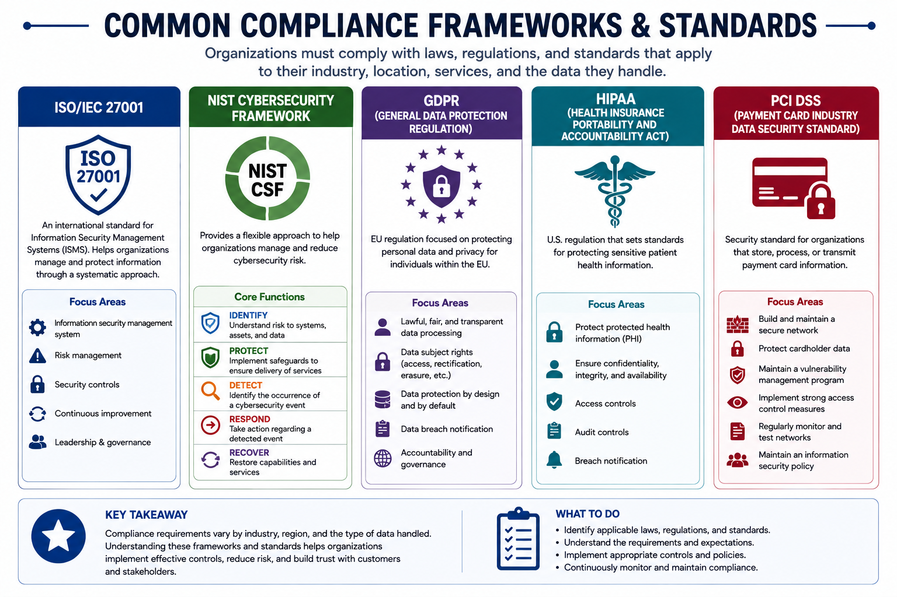
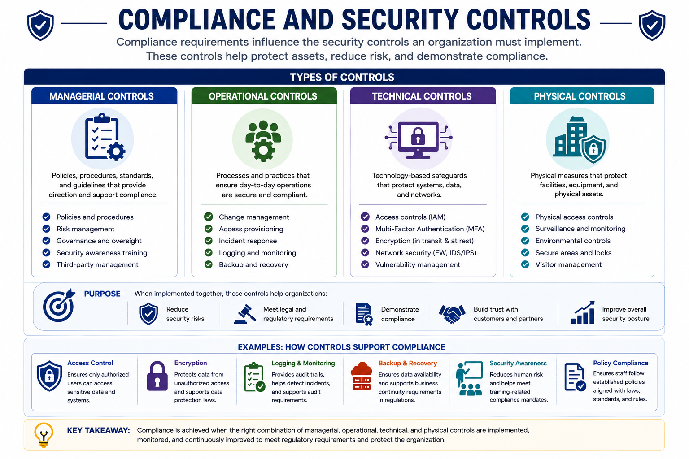
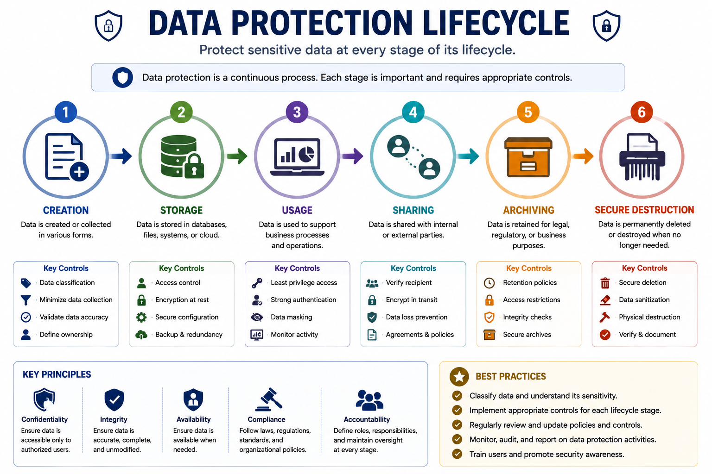
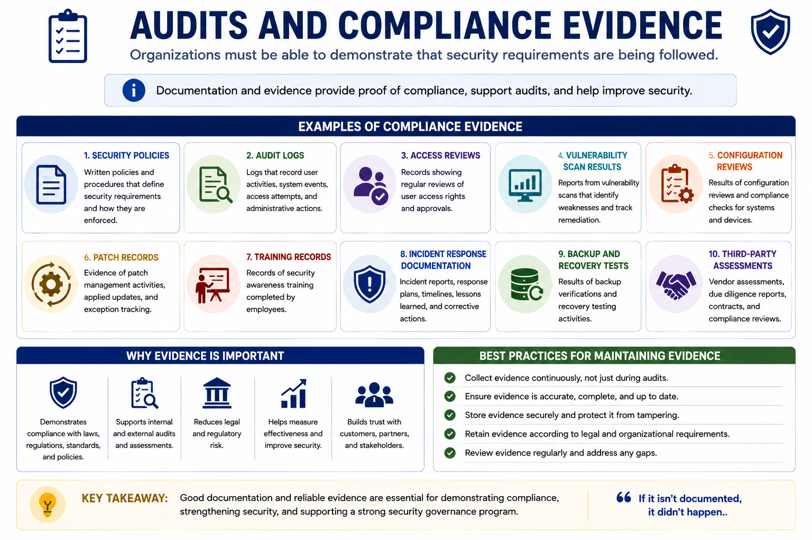
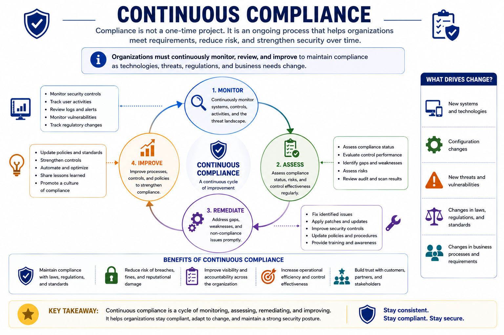

# Security Compliance

## 1. What Is Security Compliance?

Security compliance is the process of ensuring that an organization's security practices, policies, controls, and procedures follow applicable:

- Laws and regulations
- Industry standards
- Organizational policies
- Contractual requirements
- Security best practices

Compliance is closely connected to security governance. It helps organizations reduce legal and regulatory risk while strengthening the overall security program.

A secure organization must not only protect its systems and data, but also be able to demonstrate that appropriate requirements are being followed.

---

## 2. Why Security Compliance Matters

Maintaining compliance helps organizations:

- Reduce legal and regulatory risk.
- Protect sensitive information.
- Strengthen security governance.
- Establish consistent security practices.
- Demonstrate accountability.
- Support audits and assessments.
- Maintain customer and stakeholder trust.

Compliance should not be treated as a one-time activity. Organizations must continuously review their environment and maintain compliance as systems, threats, regulations, and business requirements change.

---

## 3. Laws, Regulations, Standards, and Policies

These concepts are related but are not identical.

### Laws and Regulations

Laws and regulations are requirements established by governments or regulatory authorities.

Organizations must identify which laws and regulations apply to their:

- Location
- Industry
- Services
- Customers
- Data

### Standards

Standards provide structured requirements or best practices that organizations can follow to improve security.

Examples include:

- ISO/IEC 27001
- NIST Cybersecurity Framework
- PCI DSS

### Organizational Policies

Policies are internal rules established by an organization.

Examples include:

- Password policies
- Access control policies
- Data protection policies
- Acceptable use policies
- Incident response policies
- Security awareness policies

---

## 4. Common Compliance and Standards Examples

Security programs may need to align with frameworks, standards, or regulations such as:

- **ISO/IEC 27001** — Information security management systems
- **NIST Cybersecurity Framework** — Identify, Protect, Detect, Respond, Recover
- **GDPR** — Data protection and privacy
- **HIPAA** — Health information protection
- **PCI DSS** — Payment card data security



---

## 5. Compliance and Security Controls

Security controls are safeguards and countermeasures used to reduce security risk.

Controls can be:

- Managerial
- Operational
- Technical
- Physical

Compliance requirements can influence which controls an organization needs to implement.

Examples include:

- Access controls
- Multi-Factor Authentication (MFA)
- Encryption
- Logging and monitoring
- Backup procedures
- Security awareness training
- Vulnerability management
- Configuration reviews
- Incident response procedures

Security controls therefore support both security objectives and compliance requirements.



---

## 6. Protecting Data for Compliance

Organizations should protect sensitive information throughout its entire lifecycle.

The data lifecycle includes:

1. Creation
2. Storage
3. Usage
4. Sharing
5. Archiving
6. Secure destruction

Protecting data at only one stage is not sufficient.



### Data Classification

Sensitive information should be classified according to its business value and sensitivity.

Classification allows organizations to apply security controls appropriate to the information.

### Access Control

Access to sensitive data should be restricted according to business requirements.

The Principle of Least Privilege should be applied whenever appropriate.

### Encryption

Encryption helps ensure that sensitive data remains unreadable to unauthorized parties if it is intercepted or stolen.

### Backups

Organizations should maintain appropriate backups to protect against:

- Accidental deletion
- Hardware failures
- Ransomware
- Natural disasters

Backups should be tested regularly to ensure that data can actually be restored.

### Monitoring and Auditing

Organizations should monitor access to sensitive information.

Activities may include:

- Logging user activity
- Detecting suspicious behavior
- Reviewing access permissions
- Generating security alerts
- Performing security audits

Continuous monitoring helps detect security incidents early.

---

## 7. Security Awareness and Compliance

Human behavior is an important part of security.

Security awareness training helps users:

- Recognize phishing attacks.
- Handle sensitive information correctly.
- Follow organizational security policies.
- Report suspicious activities.

Well-trained users provide an additional layer of defense against security incidents.

---

## 8. Audits and Compliance Evidence

Organizations need to be able to demonstrate that security requirements are being followed.

Documentation and evidence can support:

- Internal audits
- External audits
- Compliance assessments
- Security reporting
- Regulatory requirements

Examples of useful evidence include:

- Security policies
- Audit logs
- Access reviews
- Vulnerability scan results
- Configuration reviews
- Patch records
- Training records
- Incident response documentation
- Backup and recovery test results

Documentation should accurately reflect what the organization is actually doing.



---

## 9. Continuous Compliance

Compliance is not a one-time project.

Organizations must continuously:

- Monitor security controls.
- Review policies.
- Assess risks.
- Perform audits.
- Review configurations.
- Monitor vulnerabilities.
- Apply security updates.
- Track compliance requirements.
- Document changes.
- Improve security processes.

Changes in the environment can affect compliance, including:

- New systems
- New software
- Configuration changes
- New business processes
- New vulnerabilities
- Changes in regulations
- Changes in organizational requirements

Continuous monitoring helps organizations maintain an accurate view of their security posture.



---

## 10. Continuous Improvement Cycle

Security and compliance should follow a continuous improvement process.

### 1. Assess

Evaluate:

- Risks
- Assets
- Existing security controls
- Current compliance status

### 2. Improve

Implement new controls and strengthen existing security measures.

### 3. Monitor

Continuously monitor the environment and collect security metrics.

### 4. Adapt

Use the results to improve security practices and respond to changes.

The cycle then starts again.

```text
        ┌─────────────┐
        │   ASSESS    │
        └──────┬──────┘
               ↓
        ┌─────────────┐
        │   IMPROVE   │
        └──────┬──────┘
               ↓
        ┌─────────────┐
        │   MONITOR   │
        └──────┬──────┘
               ↓
        ┌─────────────┐
        │    ADAPT    │
        └──────┬──────┘
               │
               └──────────→ ASSESS