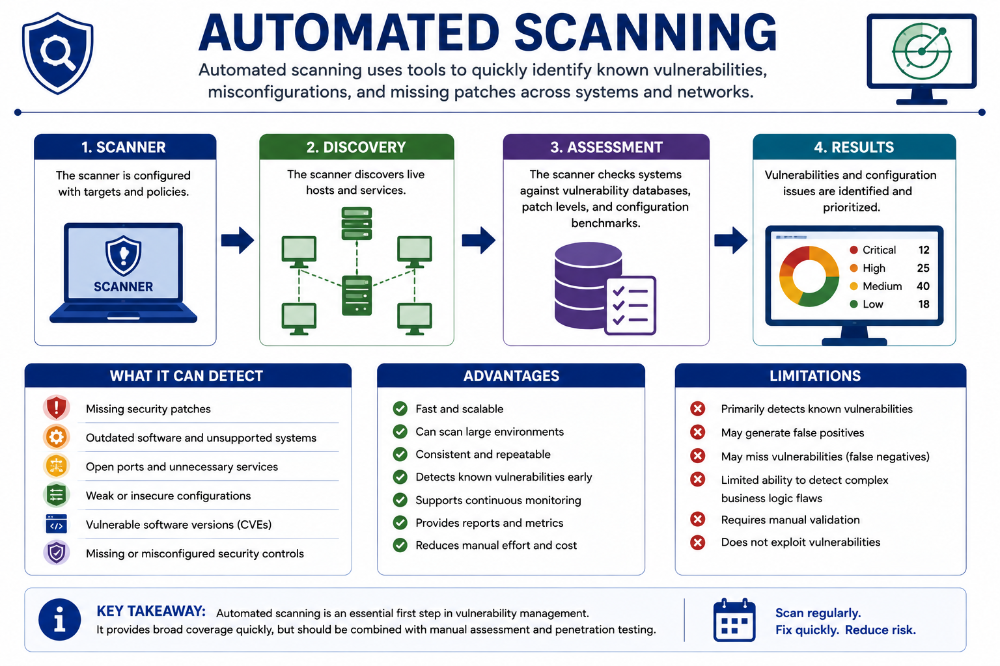
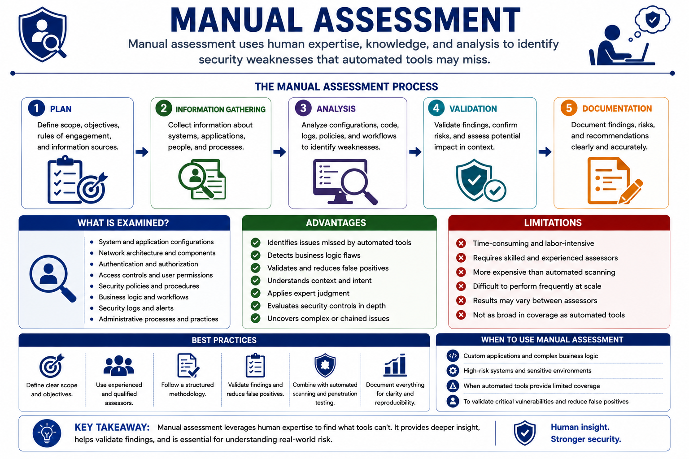
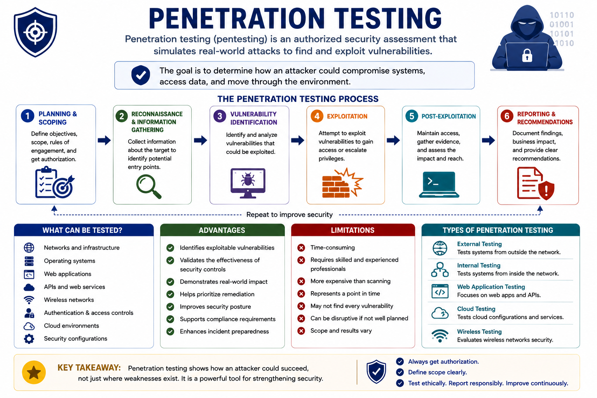
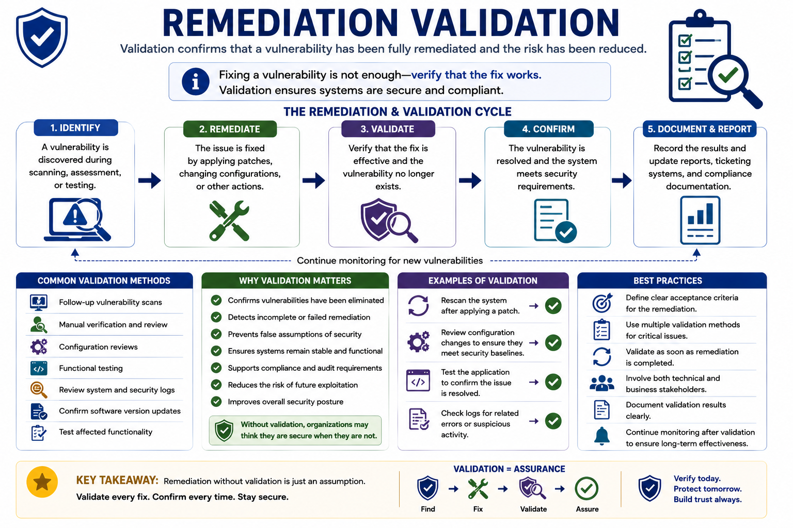
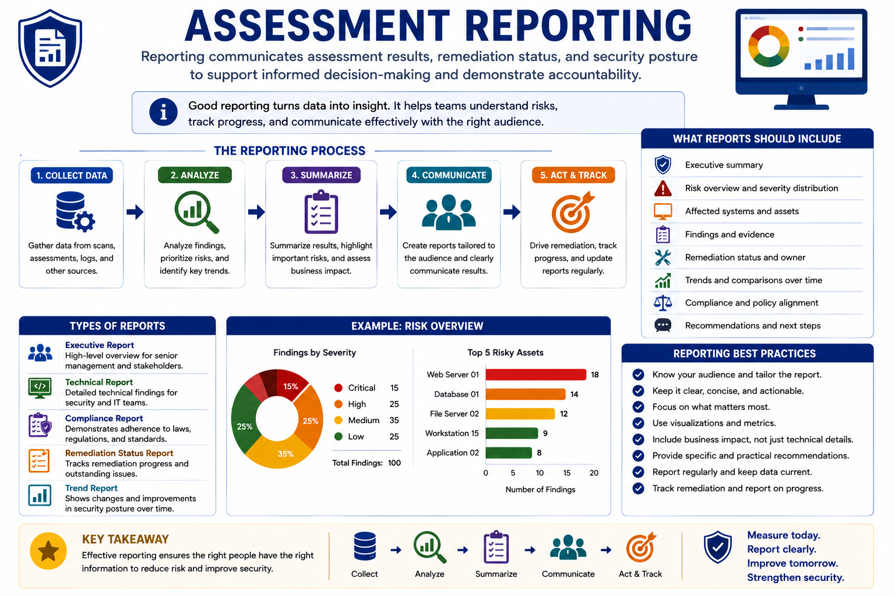

# Audits and Assessments

Security audits and assessments help organizations evaluate their security posture, identify weaknesses, verify security controls, and support compliance and risk management.

No single assessment technique can identify every security weakness. Organizations therefore combine automated tools, manual analysis, and specialized security testing to achieve broader coverage.

---

# 1. Vulnerability Assessment Techniques

Organizations use multiple techniques to identify security weaknesses across:

- Systems
- Applications
- Networks
- Configurations
- Security controls

The appropriate technique depends on:

- The environment
- The organization's objectives
- The level of assurance required

Common vulnerability assessment techniques include:

- Automated Scanning
- Manual Assessment
- Penetration Testing
- Configuration Review
- Code Review

Each technique has different strengths and limitations and is often used alongside the others.

---

# 2. Automated Scanning

**Automated scanning** uses specialized security tools to identify known vulnerabilities, insecure configurations, missing patches, and outdated software with minimal human intervention.

It is widely used because it allows organizations to assess large environments quickly and consistently.

Automated scanners compare discovered systems and software against:

- Vulnerability databases
- Security baselines
- Configuration standards



## What Can Automated Scanners Detect?

Automated scanners commonly identify:

- Missing security patches
- Outdated operating systems
- Vulnerable software versions
- Open ports and unnecessary services
- Weak security configurations
- Unsupported software
- Missing security controls
- Known Common Vulnerabilities and Exposures (CVEs)

Most scanners assign severity ratings to findings to help prioritize remediation.

## Advantages

Automated scanning provides:

- Fast assessment of large environments
- Consistent scanning methodology
- Regular scheduled assessments
- Early detection of known vulnerabilities
- Integration with vulnerability management platforms
- Reduced manual effort

Because of its speed and scalability, automated scanning is often performed on a recurring schedule.

## Limitations

Automated scanning:

- Primarily detects known vulnerabilities
- May generate false positives
- May generate false negatives
- Cannot fully evaluate business logic flaws
- Has limited ability to identify complex attack chains
- May require manual validation of findings

Therefore, automated scanning should be combined with additional assessment techniques.

---

# 3. Agent-Based vs. Agentless Scanning

Organizations can perform vulnerability scanning using agents or without agents.

## Agent-Based Scanning

An agent is installed directly on the system being assessed.

The agent can continuously monitor the system and upload findings when network connectivity becomes available.

This approach is particularly useful for:

- Remote laptops
- Mobile or distributed systems
- Systems that are not always connected to the corporate network

## Agentless Scanning

Agentless scanning collects security information remotely without installing software on the target system.

It is useful for systems that are consistently reachable from the scanning infrastructure.

### Key Concept

Agent-based scanning provides continuous and detailed visibility, while agentless scanning remotely collects security information without installing software.

Organizations may use both approaches to achieve comprehensive vulnerability coverage.

---

# 4. Manual Assessment

A **manual vulnerability assessment** evaluates systems, applications, and configurations through direct human analysis rather than relying solely on automated tools.

Security professionals use their:

- Knowledge
- Experience
- Analytical skills
- Understanding of business context

to identify weaknesses that automated scanners may overlook.



## What Is Examined?

Security professionals may review:

- System configurations
- Network architecture
- Security policies
- User permissions
- Authentication mechanisms
- Access control implementations
- Application workflows
- Security logs
- Administrative procedures

Unlike automated tools, human analysts can evaluate:

- Context
- Intent
- Business logic

## Advantages

Manual assessments can:

- Identify vulnerabilities missed by automated scanners
- Detect business logic flaws
- Validate automated scan results
- Reduce false positives
- Evaluate security controls in context
- Apply human judgment to complex security scenarios

## Limitations

Manual assessments can be:

- Time-consuming
- Labor-intensive
- Dependent on experienced professionals
- More expensive than automated scanning
- Difficult to perform frequently in large environments

Therefore, organizations typically combine manual assessments with automated vulnerability scanning.

---

# 5. Penetration Testing

**Penetration testing**, or **pentesting**, is an authorized security assessment in which security professionals simulate real-world attacks to determine whether identified vulnerabilities can actually be exploited.

Unlike vulnerability scanning, which primarily identifies potential weaknesses, penetration testing attempts to safely exploit those weaknesses to evaluate their real-world impact.

The objective is to determine how an attacker could:

- Compromise systems
- Access sensitive data
- Escalate privileges
- Move through an environment

while providing recommendations for improving security.



## What Can Be Tested?

A penetration test may evaluate:

- Networks
- Operating systems
- Web applications
- APIs
- Wireless networks
- Cloud environments
- Authentication mechanisms
- Access controls
- Security configurations

The scope must be defined before testing begins so that all activities are authorized.

---

# 6. Typical Penetration Testing Process

A penetration test commonly includes:

1. **Planning and defining the scope**
2. **Reconnaissance and information gathering**
3. **Vulnerability identification**
4. **Controlled exploitation**
5. **Impact assessment**
6. **Documentation of findings and recommendations**

Testing should be performed in a controlled manner to minimize disruption to business operations.

---

# 7. Penetration Testing Advantages

Penetration testing can:

- Confirm whether vulnerabilities are actually exploitable
- Identify attack paths
- Validate the effectiveness of security controls
- Demonstrate potential business impact
- Support regulatory and compliance requirements
- Improve incident preparedness

Because penetration testing simulates real attacker behavior, it provides valuable insight into an organization's security posture.

---

# 8. Penetration Testing Limitations

Penetration testing:

- Is more time-consuming than automated scanning
- Requires highly skilled security professionals
- Is more expensive than routine vulnerability assessments
- Represents security at a specific point in time
- May not identify every vulnerability

Organizations should therefore perform penetration testing periodically in addition to continuous vulnerability management.

---

# 9. Vulnerability Scanning vs. Penetration Testing

| Vulnerability Scanning | Penetration Testing |
|---|---|
| Identifies potential vulnerabilities | Attempts to exploit vulnerabilities |
| Mostly automated | Primarily manual |
| Broad coverage | Focused assessment |
| Faster | Slower |
| Less expensive | More resource-intensive |
| Finds possible weaknesses | Demonstrates real-world impact |

### Key Principle

**Vulnerability scanning finds potential weaknesses; penetration testing demonstrates whether weaknesses can actually be exploited.**

---

# 10. Configuration Review

Configuration review examines systems and devices to determine whether their settings follow security requirements and established baselines.

Reviews may identify:

- Insecure configurations
- Unnecessary services
- Weak authentication settings
- Excessive privileges
- Missing security controls
- Incorrect access permissions

Configuration reviews complement automated vulnerability scanning because not every configuration issue represents a known vulnerability.

---

# 11. Code Review

Code review examines source code to identify security weaknesses that may not be visible from external testing.

Security professionals may look for issues involving:

- Authentication
- Authorization
- Input validation
- Error handling
- Sensitive data handling
- Insecure coding practices

Code review is particularly useful for custom applications because automated vulnerability scanners may not understand the application's internal business logic.

---

# 12. Findings and Remediation

Assessment activities produce findings that must be reviewed and prioritized.

A finding may contain:

- Identified weakness
- Affected asset
- Severity
- Potential impact
- Recommended remediation
- Current remediation status

Higher-risk findings should generally receive higher remediation priority.

---

# 13. Validation

After remediation, organizations should verify that the identified vulnerability has actually been resolved.

Common validation methods include:

- Follow-up vulnerability scans
- Manual verification
- Configuration reviews
- Confirming software version updates
- Testing affected functionality
- Reviewing security logs
- Penetration testing for critical systems

Multiple validation methods may be combined when higher assurance is required.



## Why Validation Matters

Validation helps organizations:

- Confirm vulnerabilities have been eliminated
- Detect failed or incomplete remediation
- Identify configuration errors
- Ensure systems continue operating correctly
- Verify compliance with security requirements

Without validation, an organization may incorrectly assume that a vulnerability has been fixed.

---

# 14. Reporting

**Reporting** documents and communicates vulnerability management activities, remediation status, and the organization's security posture.

Effective reporting helps:

- Understand current security risks
- Measure remediation progress
- Demonstrate compliance
- Support informed decision-making
- Improve accountability

Reports should be:

- Accurate
- Timely
- Appropriate for their intended audience



## Information Included in Reports

Reports may include:

- Number of identified vulnerabilities
- Severity distribution
- Affected systems and assets
- Remediation status
- Outstanding vulnerabilities
- Validation results
- Risk trends over time
- Compliance status
- Recommended remediation actions

---

# 15. Types of Reports

| Report Type | Purpose |
|---|---|
| Executive Report | High-level overview for senior management |
| Technical Report | Detailed findings for security and IT teams |
| Compliance Report | Demonstrates adherence to requirements |
| Remediation Status Report | Tracks remediation progress |
| Trend Report | Shows changes in vulnerability metrics over time |

Different stakeholders require different levels of technical detail.

---

# 16. Security Assessment Cycle

Security assessment should be treated as an ongoing process rather than a one-time activity.

```text
        ┌─────────────────────┐
        │  IDENTIFY WEAKNESS  │
        └──────────┬──────────┘
                   ↓
        ┌─────────────────────┐
        │      ASSESS         │
        │ Severity + Impact   │
        └──────────┬──────────┘
                   ↓
        ┌─────────────────────┐
        │     REMEDIATE       │
        │   Fix the finding   │
        └──────────┬──────────┘
                   ↓
        ┌─────────────────────┐
        │      VALIDATE       │
        │ Verify the fix      │
        └──────────┬──────────┘
                   ↓
        ┌─────────────────────┐
        │       REPORT        │
        │ Communicate results │
        └──────────┬──────────┘
                   │
                   └──────────────→ IDENTIFY