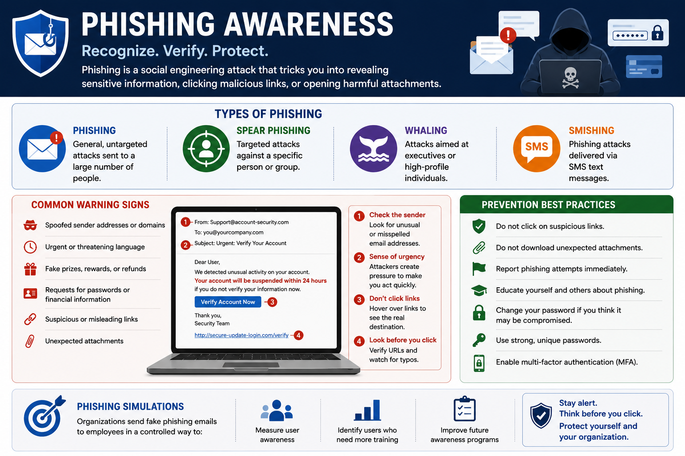
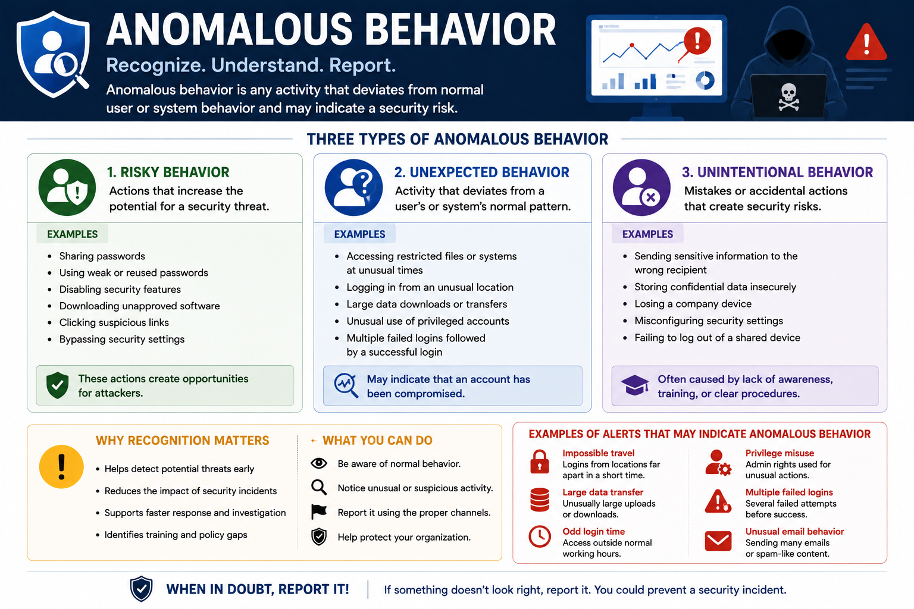
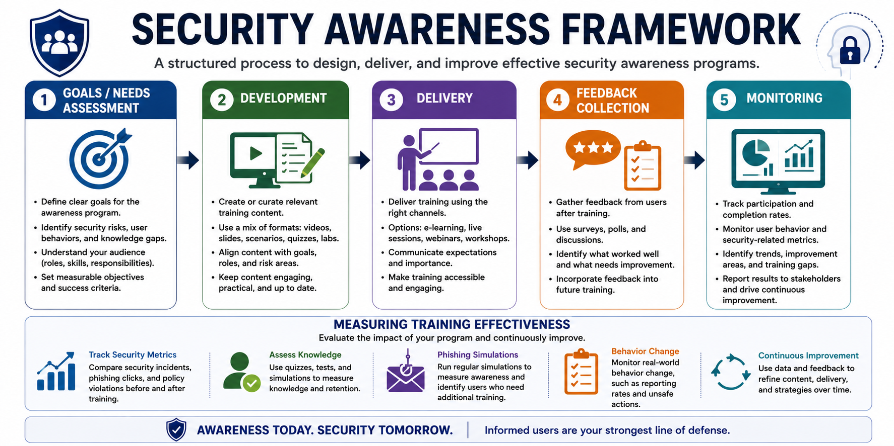

# Security Awareness — Notes

## 1. Phishing Awareness and Prevention

Phishing is a social engineering technique used to trick users into:

- Revealing confidential information
- Installing malware
- Clicking malicious links
- Opening malicious attachments

### Types of Phishing

| Type | Description |
|---|---|
| **Phishing** | General, untargeted phishing |
| **Spear Phishing** | Targeted phishing against a specific person or group |
| **Whaling** | Phishing targeting senior executives or high-profile personnel |
| **Smishing** | Phishing through SMS messages |

### Common Warning Signs

Look for:

- Spoofed sender addresses or domains
- Urgent or threatening language
- Fake prizes or refunds
- Requests for passwords or financial information
- Suspicious or misleading links

### Prevention

- Do not click suspicious links.
- Do not download unexpected attachments.
- Report phishing attempts immediately.
- Educate users about phishing.
- Change passwords if credentials may have been compromised.
- Use strong, unique passwords.

### Phishing Simulations

Organizations can send controlled fake phishing emails to employees.

The goal is to:

- Measure user awareness.
- Identify users who need additional training.
- Improve future awareness programs.

---

## 2. Anomalous Behavior Recognition

**Anomalous behavior** means activity that deviates from normal user or system behavior.

There are three main categories:

### Risky Behavior

Actions that increase exposure to threats.

Examples:

- Sharing passwords
- Bypassing security settings

### Unexpected Behavior

Activity that does not match the user's normal behavior.

Example:

- Accessing restricted files unexpectedly

### Unintentional Behavior

Mistakes or accidents that create security risks.

These often result from insufficient training or awareness.

### Key Point

Recognizing abnormal behavior early can help prevent security incidents and identify areas where additional user training is required.

---

## 3. User Awareness Training

Security training should be:

- Structured
- Targeted
- Relevant
- Practical
- Regularly updated

### Core Training Areas

#### Policies and Handbooks

Users should understand expected behavior and security procedures.

#### Situational Awareness

Users should learn how to recognize and respond to real-world threats.

#### Insider Threat Awareness

Users should know how to identify and report suspicious behavior from internal actors.

#### Password Practices

Training should promote:

- Strong passwords
- Unique passwords
- Multi-Factor Authentication (MFA)

#### Removable Media Risks

Users should understand the risks of:

- Unknown USB drives
- Unknown cables
- Untrusted removable media

#### Social Engineering Defense

Training should cover attacks such as:

- Phishing
- Vishing
- Smishing

#### Operational Security

Users should understand safe:

- Communication
- Data handling
- Incident reporting

#### Remote / Hybrid Work

Training should address:

- VPN usage
- Home network security
- Secure use of work devices

---

## 4. Security Awareness Framework

A security awareness program should follow a structured process.

### 1. Goals / Needs Assessment

Define what the training should achieve.

Examples:

- Improve phishing detection
- Reduce password reuse
- Improve incident reporting

### 2. Development

Create appropriate training materials such as:

- Presentations
- Labs
- Scenarios
- Simulations

### 3. Delivery

Choose an appropriate delivery method:

- Classroom training
- Virtual training
- Interactive platforms

### 4. Feedback Collection

Use:

- Surveys
- Discussions
- User feedback

to identify improvements.

### 5. Monitoring

Track:

- Participation
- Completion rates
- Training gaps
- Security-related results

---

## 5. Measuring Training Effectiveness

Training effectiveness should be measured continuously.

### Initial Assessment

Compare security-related incidents before and after training.

Examples:

- Phishing clicks
- Credential misuse
- Other user-related incidents

### Recurring Evaluation

Reassess users periodically.

If incident rates increase again:

→ Refresh the training  
→ Address the identified weakness  
→ Re-evaluate users

### Key Principle

Training is not a one-time activity.

It should continuously improve based on measurable results.

---

## 6. Training Development Considerations

### Define Clear Objectives

Know exactly which behavior or skill the training should improve.

### Adapt to the Audience

Use:

- Relatable examples
- Real-world stories
- Role-specific scenarios

### Keep It Relevant and Practical

Focus on situations employees may actually encounter.

### Update Regularly

Cybersecurity threats evolve, so training must evolve as well.

---

## 7. Delivering an Effective Awareness Program

### Customize the Method

Choose online, live, or hybrid training according to user needs.

### Create Interest and Buy-In

Explain why the training matters and involve leadership.

### Use a Phased Approach

Start with basic concepts and gradually introduce more advanced topics.

### Interactive and Scenario-Based Learning

Use:

- Workshops
- Simulations
- Real-world scenarios

to allow users to practice their responses.

### Gamification

Use elements such as:

- Quizzes
- Badges
- Scoreboards

to increase engagement and motivation.

---

# Exam Focus

Remember the four major areas:

### Phishing Awareness
Recognize phishing types, warning signs, simulations, and prevention techniques.

### Anomalous Behavior
Know the difference between:

- **Risky** → increases exposure
- **Unexpected** → unusual activity
- **Unintentional** → accidental mistake

### User Awareness Training
Training should cover:

- Policies
- Situational awareness
- Insider threats
- Passwords and MFA
- Removable media
- Social engineering
- Operational security
- Remote/hybrid work

### Training Effectiveness

**Goals → Development → Delivery → Feedback → Monitoring**

Then continuously evaluate and improve the program.

---

# Diagram Files

- `phishing-awareness.png`
- `anomalous-behavior.png`
- `security-awareness-framework.png`