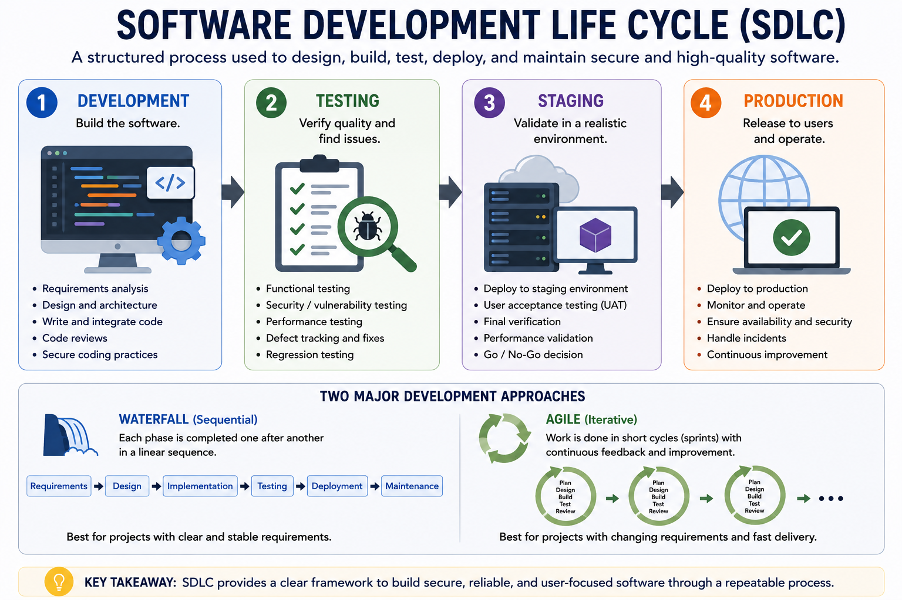
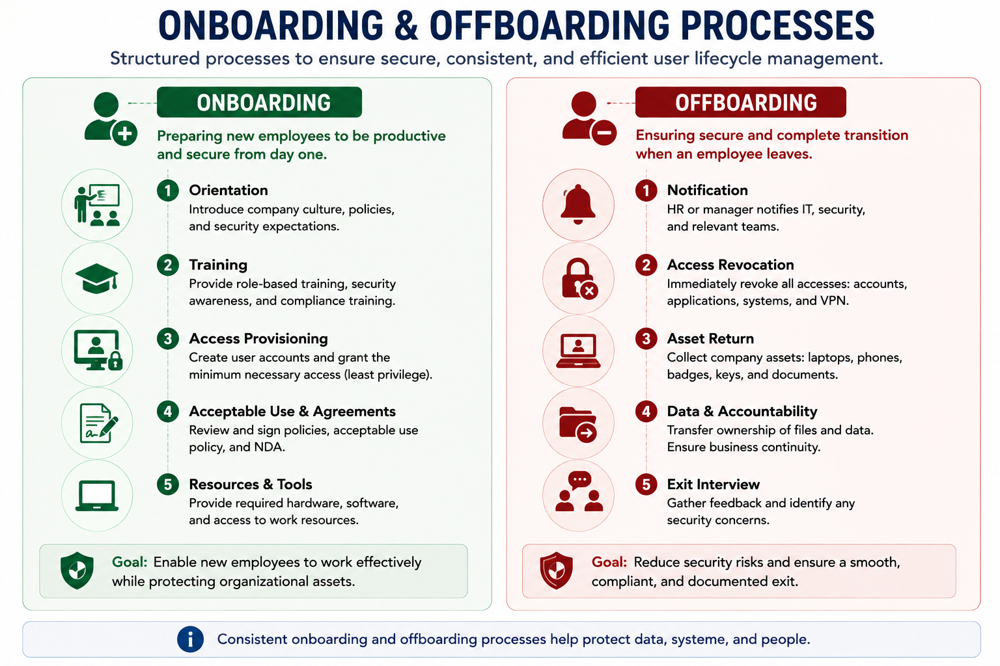
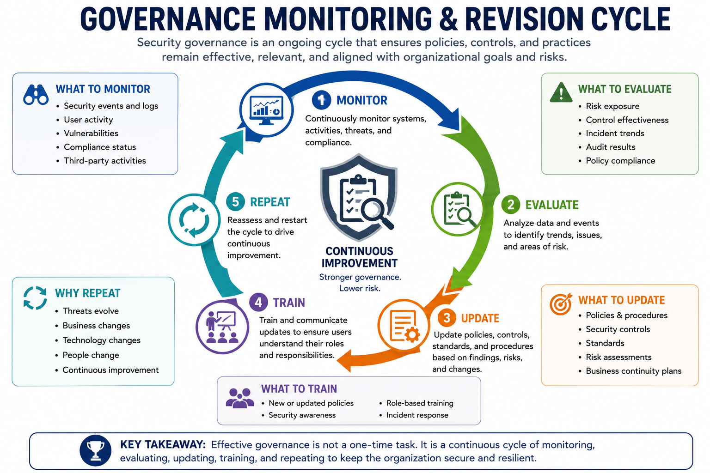
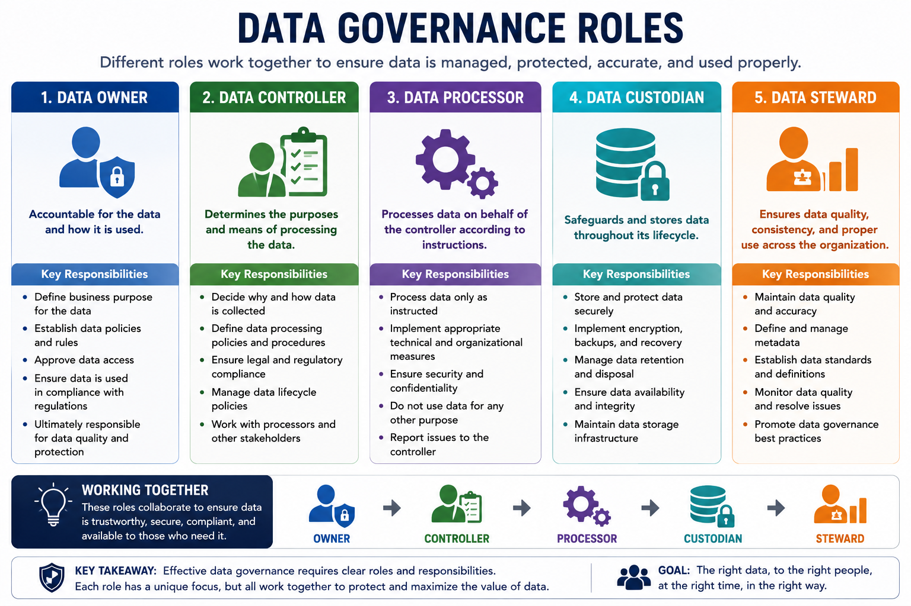

# Security Governance — Notes

Security governance defines how an organization directs, manages, and oversees security through policies, standards, procedures, responsibilities, and continuous review.

---

## 1. Guidelines vs. Policies

### Guidelines

Flexible recommendations that help users make consistent decisions.

- Not mandatory
- Based on best practices
- Provide recommendations

### Policies

Formal and enforceable rules that define what must be done.

Examples:

- Acceptable Use Policy (AUP)
- Information Security Policy
- Business Continuity Policy (BCP)
- Disaster Recovery Policy
- Incident Response Policy
- Change Management Policy
- SDLC Policy

**Remember:**

> Guideline = recommendation  
> Policy = mandatory rule

---

## 2. Software Development Life Cycle (SDLC)

Secure governance also applies to software development.

### Four phases

1. **Development** → Write and integrate code
2. **Testing** → Test functionality and vulnerabilities
3. **Staging** → Validate in a realistic environment
4. **Production** → Deploy for users

Two major development approaches:

- **Waterfall** → Sequential
- **Agile** → Iterative

---

## 3. Standards and Frameworks

Standards provide consistent security practices and help organizations align with industry and regulatory requirements.

### ISO

| Standard | Purpose |
|---|---|
| **ISO 27001** | Information Security Management System (ISMS) |
| **ISO 27002** | Security controls and best practices |
| **ISO 27701** | Privacy management |
| **ISO 27017** | Cloud security |
| **ISO 27018** | Protection of personal data in cloud environments |

### NIST / U.S. Standards

- **NIST SP 800-53** → Security controls
- **FIPS** → U.S. federal IT and cybersecurity standards

### Other

- **PCI-DSS** → Payment card data security

---

## 4. Security Standards

### Password Standards

Important elements include:

- Hashing → Secure password storage
- Salting → Random data added before hashing
- Encryption → Protects passwords/data in transit
- Password reset procedures → Verify identity before reset
- Password managers → Secure storage of complex passwords

### Access Control Standards

Important concepts:

- Authentication protocols: Kerberos, OAuth, SAML
- Least privilege
- MAC
- DAC
- RBAC
- Rule-based access control
- MFA
- PAM
- Audit trails
- Conditional Access

**Key principle:**

> Give users only the access required for their role.

### Encryption Governance

Focuses on:

- Approved algorithms
- Key length
- Key lifespan
- Key management

Examples:

- AES → Symmetric
- RSA → Asymmetric
- ECC → Efficient asymmetric cryptography
- Ephemeral keys → One-time use

---

## 5. Physical Security

Physical security must be part of the overall security strategy.

Common controls:

| Control | Purpose |
|---|---|
| **Mantrap** | Limits entry to one person at a time |
| **Turnstile** | Controlled individual entry |
| **Access Vestibule** | Credential verification area |
| **Guards** | Monitoring and response |
| **Visitor Logs** | Track visitors |
| **Proximity Cards** | Building access |
| **CCTV** | Surveillance |

---

## 6. Procedures

Procedures are documented steps that standardize how tasks are performed.

### Important Procedures

**Change Management**
- Submit changes
- Review and approve
- Track changes

**Onboarding**
- Orientation
- Training
- Access provisioning
- NDA signing

**Offboarding**
- Revoke access
- Return equipment
- Exit interview

**Playbooks**
- Predefined response steps for incidents or system failures

---

## 7. External Considerations

Security governance must consider factors outside the organization.

### Regulatory
Laws and regulations that apply to the organization.

### Legal
Contracts, intellectual property, liability, and litigation.

### Industry
Industry-specific requirements and changes.

### Local / Regional
Local regulations and conditions.

### National
National laws, policies, and geopolitical factors.

### Global
International requirements and cross-border compliance.

Examples from the course:

- **CCPA** → California privacy regulation
- **HIPAA** → U.S. healthcare data
- **PCI-DSS** → Payment card data

---

## 8. Monitoring and Revision

Security governance is continuous.

Organizations should:

- Conduct regular audits
- Update policies as threats evolve
- Train employees regularly
- Monitor changes in laws and risks
- Review security frameworks
- Continuously improve security practices

### Governance Cycle

**Monitor → Evaluate → Update → Train → Repeat**

---

## 9. Governance Structures

Governance structures define how security decisions and oversight are organized.

### Boards of Directors

Provide:

- Strategic direction
- Oversight

### Committees

May focus on:

- Audit
- Compliance
- Cybersecurity

### Government Entities

- Create public policy
- Enforce regulations

### Centralized vs. Decentralized

**Centralized**
→ Decisions are concentrated in a central authority.

**Decentralized**
→ Decision-making is distributed across the organization.

---

## 10. Roles and Responsibilities for Data

| Role | Main Responsibility |
|---|---|
| **Data Owner** | Responsible for safeguarding data and enforcing usage policies |
| **Data Controller** | Determines policies for data collection and processing |
| **Data Processor** | Processes data according to the controller's instructions |
| **Data Custodian** | Securely stores, protects, encrypts, and backs up data |
| **Data Steward** | Maintains data quality, metadata, classification, and consistency |

### Easy Way to Remember

**Owner** → Responsible for the data  
**Controller** → Determines how data is processed  
**Processor** → Processes the data  
**Custodian** → Protects and stores the data  
**Steward** → Maintains data quality

---

# Security+ Exam Focus

### Guidelines vs Policies

- Guideline = flexible recommendation
- Policy = mandatory and enforceable

### SDLC

**Development → Testing → Staging → Production**

### Important Standards

- ISO 27001 → ISMS
- ISO 27002 → Controls
- ISO 27701 → Privacy
- ISO 27017 → Cloud security
- ISO 27018 → Cloud personal-data privacy
- NIST SP 800-53 → Security controls
- FIPS → U.S. federal standards
- PCI-DSS → Payment card security

### Data Roles

Know the difference between:

**Owner → Controller → Processor → Custodian → Steward**

### Governance

Security governance requires:

**Policies + Standards + Procedures + Roles + Oversight + Continuous Improvement**

---

# Diagram Files

- `sdlc.png`
- `onboarding-offboarding.png`
- `governance-monitoring-cycle.png`
- `data-governance-roles.png`